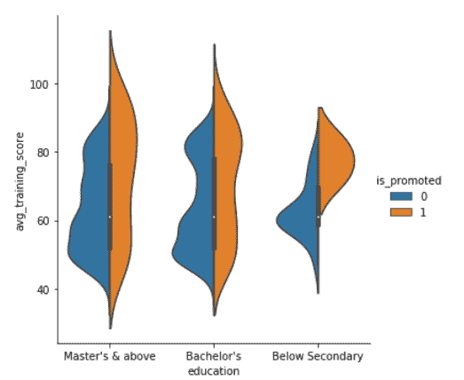
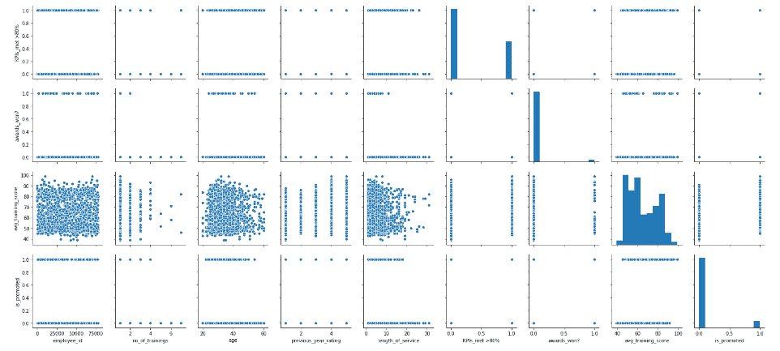

# 通过这份关于 Python 中 Seaborn 的全面指南，成为数据可视化高手

> 原文：<https://medium.com/analytics-vidhya/become-a-data-visualization-whiz-with-this-comprehensive-guide-to-seaborn-in-python-3841f40e3a3b?source=collection_archive---------10----------------------->

# 概观

*   Seaborn 是一个流行的 Python 数据可视化库
*   Seaborn 结合了美学吸引力和技术洞察力，这是数据科学项目中的两个关键因素
*   了解它是如何工作的，以及使用 seaborn 可以生成不同的图

# 介绍

一个设计良好的可视化就是有一些非凡之处。颜色突出，各层融合得很好，轮廓贯穿始终，整体包装不仅具有良好的美学品质，而且还为我们提供了有意义的见解。

这在数据科学中非常重要，因为我们经常处理大量杂乱的数据。对数据科学家来说，具备可视化能力至关重要。我们的利益相关者或客户通常会依赖视觉线索，而不是复杂的机器学习模型。

有很多优秀的 Python 可视化库可用，包括内置的 *matplotlib* 。但是 seaborn 对我来说很突出。我们很快就会看到，它将美学吸引力与技术洞察力完美结合。


在本文中，我们将了解什么是 seaborn，以及为什么应该在 matplotlib 之前使用它。然后，我们将使用 seaborn 在 Python 中生成各种不同的数据可视化。所以戴上你的创意帽子，让我们开始吧！

*Seaborn 是综合* [*应用机器学习课程*](https://courses.analyticsvidhya.com/courses/applied-machine-learning-beginner-to-professional/?utm_source=blog&utm_medium=comprehensive-guide-seaborn-generate-graph-using-python) *的一部分。这是你学习机器学习及其不同方面的一站式目的地。*

# 目录

*   什么是 Seaborn？
*   为什么应该使用 Seaborn 而不是 matplotlib？
*   设置环境
*   使用 Seaborn 的数据可视化
*   可视化统计关系
*   用分类数据绘图
*   可视化数据集的分布

# 什么是 Seaborn？

你用过 R 里的 *ggplot2* 库吗？它是任何工具或语言中最好的可视化软件包之一。Seaborn 给我的整体感觉是一样的。

> *Seaborn 是一个构建在* matplotlib *之上的惊人的 Python 可视化库。*

它让我们有能力创造放大的数据图像。这有助于我们理解数据，方法是将数据显示在可视化的上下文中，以挖掘变量或趋势之间任何隐藏的相关性，这些相关性最初可能不明显。与低级别的 Matplotlib 相比，Seaborn 具有高级别的接口。

# 为什么应该使用 Seaborn 而不是 matplotlib？

我一直在说 seaborn 有多棒，所以你可能想知道这有什么大惊小怪的。

当我们使用 seaborn 生成图时，我会以实用的方式全面回答这个问题。现在，让我们快速讨论一下 seaborn 如何感觉它比 matplotlib 高了一步。

Seaborn 让我们的图表和绘图看起来很吸引人，并支持一些常见的数据可视化需求(如**将**颜色映射到变量或使用**刻面**)。基本上，它使数据可视化和探索变得容易征服。相信我，这在数据科学领域绝非易事。

> 如果 Matplotlib“试图让简单的事情变得简单，让困难的事情变得可能”，seaborn 也试图让一组定义明确的困难事情变得简单。——迈克尔·瓦斯科姆(Seaborn 的创造者)

Seaborn 修复了 matplotlib 中的几个(大)限制:

1.  Seaborn 提供了大量的高级界面和定制主题，这是 matplotlib 所缺乏的，因为不容易找出使情节吸引人的设置
2.  Matplotlib 函数不能很好地处理数据帧，而 seaborn 却可以

第二点在数据科学中很突出，因为我们经常使用数据框架。你认为 seaborn 优于 matplotlib 的其他原因是什么？请在文章下方的评论区告诉我们！

# 设置环境

seaborn 库有四个您需要拥有的强制性依赖项:

*   NumPy (>= 1.9.3)
*   SciPy (>= 0.14.0)
*   matplotlib (>= 1.4.3)
*   熊猫(> = 0.15.2)

要安装 Seaborn 并有效地使用它，首先，我们需要安装前面提到的依赖项。一旦这一步完成，我们就可以安装 Seaborn 并享受它迷人的情节了。要安装 Seaborn，您可以使用以下代码行-

要安装 seaborn 的最新版本，可以使用 pip:

```
pip install seaborn
```

您也可以使用 conda 安装最新版本的 seaborn:

```
conda install seaborn
```

要在代码中导入依赖项和 seaborn 本身，可以使用下面的代码

就是这样！我们已经准备好详细探索 seaborn。

# 用于数据可视化的数据集

我们将主要使用两个数据集:

*   [人力资源分析挑战](https://datahack.analyticsvidhya.com/contest/wns-analytics-hackathon-2018-1/)
*   [预测票数](https://datahack.analyticsvidhya.com/contest/enigma-codefest-machine-learning-1/)

我选择了这两个，因为它们包含了大量的变量，所以我们有足够的选择余地。这两个数据集还模拟了真实世界的场景，因此您将了解数据可视化和探索在行业中是如何工作的。

你可以在 [DataHack 平台](https://datahack.analyticsvidhya.com/contest/all/)上查看这个和其他高质量的数据集和黑客马拉松。因此，在继续之前，请下载上述两个数据集。我们将一前一后地使用它们。

# 使用 Seaborn 的数据可视化

我们开始吧！我将这个实现部分分为两类:

*   可视化统计关系
*   绘制分类数据

我们将查看每个类别的多个示例，以及如何使用 seaborn 绘制它。

# 可视化统计关系

统计关系表示理解数据集中不同变量之间的关系以及这种关系如何影响或依赖于其他变量的过程。

在这里，我们将使用 seaborn 来生成下图:

*   散点图
*   SNS.relplot
*   色调图

我为此选择了“**预测投票数**”项目。因此，让我们从在我们的工作环境中导入数据集开始:


# 使用 Seaborn 的散点图

散点图可能是两个变量之间关系可视化的最常见的例子。每个点表示数据集中的一个观察值，这些观察值由点状结构表示。该图使用点云显示了两个变量的联合分布。

为了绘制散点图，我们将使用 seaborn 库的 **relplot()** 函数。它是一个图形级别的角色，用于可视化统计关系。默认情况下，使用 relplot 会生成散点图:


# 使用 Seaborn 的 SNS.relplot

**SNS.relplot** 是来自 **SNS** 类的 **relplot** 函数，SNS 类是我们上面导入的 **seaborn** 类，带有其他依赖项。

参数 **x** 、 **y、**和**数据**——分别代表 X 轴、Y 轴上的变量和我们用来绘图的数据。在这里，我们发现了**视图**和 **upvotes 之间的关系。**

接下来，如果我们想看到与数据相关的标签，我们可以使用下面的代码:


# 色调图

我们可以在色调的帮助下在我们的图中添加另一个维度，因为它给点赋予颜色，并且每种颜色都有一些意义。

在上面的图中，色调语义是绝对的。这就是为什么它有不同的调色板。如果色调语义是数字，那么着色就变成连续的。


我们还可以改变每个点的大小:


我们也可以通过使用另一个参数 **sizes** 来手动更改尺寸，如 **sizes = (15，200)** 。

# 绘制分类数据

*   振动
*   顺化(越南城市)
*   箱线图
*   沃林图
*   点图

在上一节中，我们看到了如何使用不同的可视化表示来显示多个变量之间的关系。我们画了两个数字变量之间的图。在本节中，我们将看到两个变量之间的关系，其中一个变量是分类变量(分为不同的组)。

我们将使用 seaborn 库的 catplot()函数来绘制分类数据图。让我们开始吧

## 抖动图

对于抖动图，我们将使用来自问题**人力资源分析** **挑战**的另一个数据集。现在让我们导入数据集。


现在，我们将通过使用 catplot()函数来查看列**教育**和 **avg_training_score** 之间的绘图。


因为我们可以看到图是分散的，所以为了处理这个问题，我们可以将抖动设置为 false。抖动是与真实值的偏差。因此，我们将使用另一个参数将抖动设置为假。


## 色调图

接下来，如果我们想在我们的图中引入另一个变量或另一个维度，我们可以使用 **hue** 参数，就像我们在上一节中使用的一样。假设我们想在教育和 avg_training_score 的图中看到性别分布，要做到这一点，我们可以使用下面的代码


在上面的图中，我们可以看到点彼此重叠，为了消除这种情况，我们可以设置 kind = "swarm "，swarm 使用一种算法来防止点重叠，并沿着分类轴调整点。让我们看看它是什么样子的-


很神奇，对吧？如果我们既想看第三次元，又想看蜂拥而至的剧情版本呢？让我们看看如果我们引入**作为一个新变量会怎么样**


显然得分高的人得到了提升。

## 使用 seaborn 的箱线图

我们可以绘制的另一种图形是一个**箱线图**，它显示了分布的三个四分位数值以及最终值。箱线图中的每个值对应于数据中的实际观察值。让我们现在画出箱线图-


当我们将色调语义与箱线图一起使用时，它沿着分类轴是水平的，因此它们不会重叠。带色调的箱线图看起来像-


## 使用 seaborn 的小提琴情节

我们也可以通过使用 violin plots 来不同地表示上述变量。让我们试一试


violin 图结合了箱线图和核密度估计过程，提供了更丰富的数值分布描述。四分位值显示在小提琴内部。当色调语义参数只有两个级别时，我们也可以分割小提琴，这也有助于节省绘图空间。我们分层次来看小提琴剧情。



这些惊人的情节是我开始使用 seaborn 的原因。它为您提供了许多显示数据的选项。另一个即将到来的是 **boxplot。**

## 使用 seaborn 的箱线图

默认情况下，Boxplot 对整个数据集进行操作并获取平均值。现在让我们面对现实吧。


## 使用 seaborn 的点图

另一种类型的图是**点图，**，这个图指出了估计值和置信区间。点图连接来自相同色调类别的数据。这有助于识别特定色调类别中的关系是如何变化的。您可以查看点图如何显示以下信息。


从上面的情节可以清楚地看出，得分高的人更有信心获得晋升。

这还不是结束，seaborn 是一个巨大的库，有很多用于不同目的的绘图功能。其中一个目的就是引入多维度。我们也可以想象更高维度的关系。让我们用蜂群图来检查一下。

## 使用 seaborn 的群集图


当我们将多个概念结合成一个概念时，就很容易将洞察力形象化。在这里，群体情节被提升为色调语义属性，性别属性被提升为分面变量。

# 可视化数据集的分布

每当我们处理数据集时，我们都想知道数据或变量是如何分布的。数据的分布可以告诉我们很多关于数据性质的信息，所以让我们深入研究一下。

## 绘制单变量分布

*   柱状图

在检查变量的分布时，最常见的图之一是 distplot。默认情况下，distplot()函数绘制直方图并拟合核密度估计值。让我们来看看年龄在数据中是如何分布的。


这清楚地表明，大多数人都是二十多岁，三十出头。

## 使用 Seaborn 的直方图

我们用于单变量分布的另一种图是直方图**。**

直方图以条柱的形式表示数据的分布，并使用条柱显示每个条柱下的观察值数量。我们还可以在其中添加一个 rugplot，而不是使用 KDE(核密度估计)，这意味着在每次观察时，它都会绘制一个小的垂直棒。


# 绘制二元分布

*   六角图
*   KDE 图
*   博兴图
*   山脊图(欢乐图)

除了可视化单个变量的分布，我们还可以看到两个独立变量是如何相对于彼此分布的。二元意味着联合，所以为了形象化，我们使用 seaborn 库的 jointplot()函数。默认情况下，jointplot 绘制散点图。让我们来看看年龄和 avg_training_score 之间的二元分布。


有多种方法可以可视化二元分布。让我们再看几个。

## 使用 Seaborn 的 Hexplot

**Hexplot** 是直方图的二元模拟，因为它显示了落在六边形箱内的观察值的数量。这是一个很容易处理大型数据集的图。为了绘制六边形图，我们将把**种类**属性设置为**十六进制。现在就让我们来看看吧。**


## 使用 Seaborn 的 KDE 图

这还没完，接下来是 **KDE 的阴谋。**这是另一种非常棒的可视化二元分布的方法。让我们看看如何通过使用 **jointplot()** 函数并将属性 kind 设置为 KDE 来实现上述观察。


## 使用 Seaborn 的热图

现在来说说我绝对喜欢的剧情，热图。热图是图形表示，其中每个变量用一种颜色表示。

让我们继续生成一个:


## 使用 Seaborn 的 Boxen 图

我们可以用来显示二元分布的另一个图是**博森图**。Boxen 图最初被命名为**字母值图**，因为它显示了一个变量的大量值，也称为**分位数**。这些分位数也被定义为字母值。通过绘制大量分位数，提供了关于分布形状的更多见解。这些类似于箱线图，让我们看看如何使用它们。


## 使用 seaborn 的山脊图

接下来的情节相当引人入胜。叫**垄地块。**也叫 **joyplot。**岭图有助于可视化几个组的数值分布。这些分布可以用 KDE 图或直方图来表示。现在，让我们试着绘制一个年龄与性别的岭图。


## 可视化数据集中的成对关系

我们还可以使用 seaborn 库的 pairplot()函数在一个数据集中绘制多个二元分布。这显示了数据库中每一列之间的关系。它还在对角线轴上绘制每个变量的单变量分布图。让我们看看它看起来怎么样。



# 结束注释

我们在这里讲述了很多情节。我们看到了 seaborn 库在可视化和探索数据(尤其是大型数据集)时是多么有效。我们还讨论了如何为不同类型的数据绘制 seaborn 库的不同函数。

正如我前面提到的，学习 seaborn(或任何概念或库)的最好方法是实践它。你自己创造的新形象越多，你就会变得越自信。继续在 [DataHack 平台](https://datahack.analyticsvidhya.com/contest/all/)上尝试任何练习题，并开始成为数据可视化大师！

*原载于 2019 年 9 月 30 日*[*https://www.analyticsvidhya.com*](https://www.analyticsvidhya.com/blog/2019/09/comprehensive-data-visualization-guide-seaborn-python/)T22。