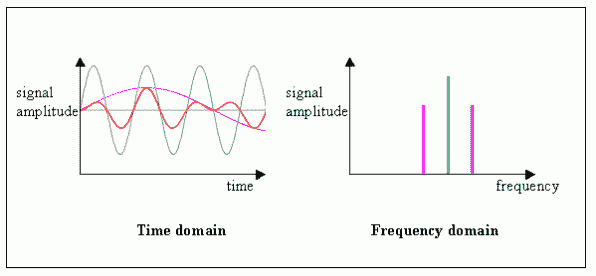
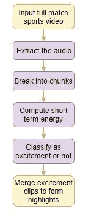
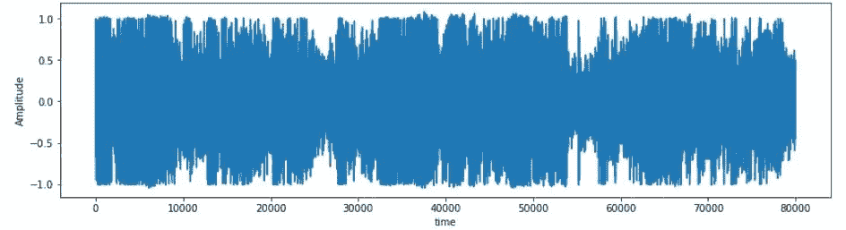
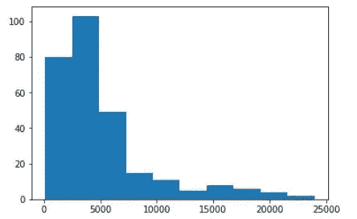

# 成为视频分析专家:使用 Python 自动生成精彩片段的简单方法

> 原文：<https://medium.com/analytics-vidhya/become-a-video-analysis-expert-a-simple-approach-to-automatically-generating-highlights-using-2cfa4a19c3b4?source=collection_archive---------4----------------------->

# 概观

*   使用一种简单的方法在 Python 中构建您自己的高光包
*   没错——了解自动高亮生成是如何工作的，而不需要使用机器学习或深度学习！
*   我们将使用全长板球比赛来实现我们自己的自动高光生成方法

# 介绍

我是一个超级板球迷。从我记事起，我就迷上了这款游戏，它仍然是我日常生活的动力。我相信很多人读到这里都会点头。

但是自从我开始全职工作以来，跟上所有的比赛就成了一个难题。我只能看到比赛的短暂结束，而不是整个比赛。或者我不得不跟着文本评论走——无论哪种方式，它都让我想要更多。

所以我心中的数据科学家决定为此做点什么。有没有一种方法可以让我使用我的 Python 技能来删除比赛中所有重要的部分？我本质上想用 Python 创建自己的高光包。

事实证明，我甚至不需要依靠机器学习或深度学习技术来完成它！现在，我想与我们的社区分享我的学习(和代码)。看看下面的亮点包。这将让您了解我们将在本文中使用简单的语音分析方法构建的内容:

厉害！我将讨论我是如何制作这个自动高亮生成程序的，这样你就可以学习并把它应用到你想要的任何比赛(或任何运动)中。让我们开始吧！

*如果你是 Python 新手或者需要快速复习，请务必在这里查看我们的免费课程***。**

# *目录*

1.  *体育视频集锦简介*
2.  *自动高亮显示生成的不同方法*
3.  *我的自动高光生成方法*
4.  *理解问题陈述*
5.  *在 Python 中实现自动高亮显示*

# *体育视频集锦简介*

*我们都在某个时候看过体育比赛的集锦。即使你不喜欢运动，你也会在坐在餐馆里、躺在旅馆里等时候在电视上看到精彩的节目。*

> *精彩片段生成是从体育视频中提取最有趣的剪辑的过程。*

*您可以将此视为视频摘要的一个经典用例。在视频摘要中，完整长度的视频被转换成较短的格式，以便保留最重要的内容。*

*在板球比赛中，完整的比赛视频包含像四、六、三柱门等动作。未经编辑的版本甚至还捕捉了一些无趣的事件，如防守、离开、宽球、告别等。*

*另一方面，高光是肾上腺素激增的地方。所有主要的谈论点，如 4，6，和 wickets 这些结合起来，使典型的亮点包。*

**

*从完整的比赛视频中手动提取精彩场面需要大量的人力。这是一项耗时的任务，除非你在一家日复一日做这项工作的视频公司工作，否则你需要找到一种不同的方法。*

*存储一个完整的比赛视频也是占用内存的。因此，从完整的比赛视频中自动提取精彩部分为创作者和用户节省了大量时间。这就是我们将在本文中讨论的内容。*

# *突出显示生成的不同方法*

*除了手动方式之外，还有不同的方式可以生成高光。我们可以使用的两种常见方法是自然语言处理(NLP)和计算机视觉(CV)。在跳到我的方法之前，让我们简单地讨论一下它们是如何工作的。*

# *基于自然语言处理的方法*

*在看下面的步骤之前，请想一想这个问题。如何使用 NLP 或基于文本的方法从板球比赛中提取重要信息？*

*以下是一步一步的步骤:*

*   *从输入视频中提取音频*
*   *将音频转录成文本*
*   *对文本应用基于提取的摘要技术来识别最重要的短语*
*   *提取相应重要短语的剪辑以生成精彩片段*

# *基于计算机视觉的方法*

*这种基于计算机视觉的方法看起来非常直观。毕竟，计算机视觉是我们训练机器看图像和视频的领域。因此，使用计算机视觉生成亮点的一种方法是持续跟踪记分卡，并仅在有四个、六个或三个检票口时提取剪辑。*

*您能想到使用这些技术的其他方法吗？请在下面的评论区告诉我——我很想听听你的想法。*

# *我的自动高光生成方法*

*在这一点上，你可能会感到奇怪——我们刚刚谈到了机器学习和深度学习的两个子领域。但是文章的标题和介绍表明我们不会使用这两个字段。那么不建模型真的能生成高光吗？是啊！*

> *不是每个问题都需要深度学习和机器学习。大多数问题都可以通过对领域和数据的透彻理解来解决。-Sunil Ray*

*我将使用**简单的语音分析**来讨论自动高亮生成的概念。在进入终极方法之前，让我们讨论一些术语。*

# *什么是短时间能量？*

*可以在时域或频域中分析音频信号。在时域中，相对于时间分量来分析音频信号，而在频域中，相对于频率分量来分析音频信号:*

**

***音频信号的能量或功率是指声音的响度**。它是通过时域中音频信号幅度的平方和来计算的。当计算整个音频信号块的能量时，它被称为**短时能量**。*

**

*资料来源:facto-facts.com*

> *在大多数体育运动中，每当有趣的事件发生时，解说员的讲话和观众都会增加。*

*让我们以板球为例。每当击球手击球或投球手击球时，解说员的声音就会提高。观众的欢呼声响彻整个场地。我们可以利用音频的这些变化从视频中捕捉有趣的瞬间。*

*以下是一步一步的过程:*

*   *输入完整的比赛视频*
*   *提取音频*
*   *将音频分成几块*
*   *计算每个块的短时能量*
*   *将每个块分类为兴奋或不兴奋(基于阈值)*
*   *合并所有精彩片段，形成视频集锦*

**

# *理解问题陈述*

*板球是印度最著名的运动，几乎在全国各地都有。因此，作为一个铁杆板球球迷，我决定从一个完整的板球比赛视频中自动提取亮点。然而，同样的想法也可以应用于其他运动。*

*对于这篇文章，我只考虑了 2007 年 T20 世界杯印度和澳大利亚半决赛的前 6 场比赛(PowerPlay)。你可以在 YouTube [这里](https://www.youtube.com/watch?v=lFq4eW9ewRE&t=2162s)看完整场比赛，从[这里](https://drive.google.com/open?id=1FRODSq1dgp-JvUcXRALKjn6bvIu15gU6)下载前六场比赛的视频。*

# *Python 中的自动高光生成*

*我在一个名为 **WavePad 音频编辑器**的软件的帮助下从视频中提取了音频。你可以从[这里](https://drive.google.com/open?id=1FRODSq1dgp-JvUcXRALKjn6bvIu15gU6)下载音频剪辑。*

*我们可以使用下面的代码以分钟为单位获得音频剪辑的持续时间:*

*现在，我们将把音频分成每个 5 秒的块，因为我们感兴趣的是找出特定的音频块是否包含音频声音的上升:*

*让我们听一段音频:*

*计算组块的能量:*

*在时间序列域中可视化块:*

**

*正如我们所见，信号的幅度随时间而变化。接下来，计算每个块的短时能量:*

*让我们理解组块的短时间能量分布:*

**

*正如我们在上面的图中看到的，能量分布是右偏的。我们将选择极值作为阈值，因为只有当评论员的讲话和观众的欢呼很高时，我们才对剪辑感兴趣。*

*这里，我认为阈值是 12，000，因为它位于分布的尾部。随意试验不同的值，看看你会得到什么结果。*

*将音频片段的连续时间间隔合并成一个:*

*提取特定时间间隔内的视频，形成集锦。记住——因为评论员的讲话和观众的欢呼只有在击球手击球后才会增加，所以我考虑在每个激动人心的片段后只发布五秒钟:*

*我已经使用在线编辑器将所有提取的剪辑合并成一个视频。以下是使用简单的语音分析方法从 PowerPlay 生成的精彩片段:*

*恭喜你走到这一步，并生成你自己的亮点包！继续把这个技巧应用到你想要的任何比赛或运动中。这可能看起来很简单，但是这是一个非常强大的方法。*

*遵循 Github 上的[代码](https://github.com/aravindpai/Cricket-Highlights-Generation)*

# *结束注释*

*这篇文章的要点是——在进入模型构建过程之前，要对领域和数据有一个透彻的理解，因为它能让我们在大多数问题中找到一个更好的解决方案。*

*在本文中，我们看到了如何使用简单的语音分析从完整的比赛视频中自动提取精彩片段。我会建议你也尝试不同的运动。*

*喜欢这篇文章吗？想分享一个不同的方法吗？欢迎在下面的评论区和我联系！如果你想学习 Python，这里有一门免费课程:*

*   *[用于数据科学的 Python](http://courses.analyticsvidhya.com/courses/introduction-to-data-science?utm_source=blog&utm_medium=guide-automatic-highlight-generation-python-without-machine-learning)*

*你也可以在分析 Vidhya 的 Android 应用上阅读这篇文章*

**