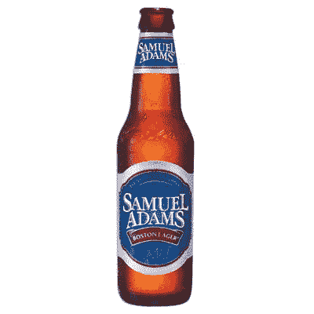
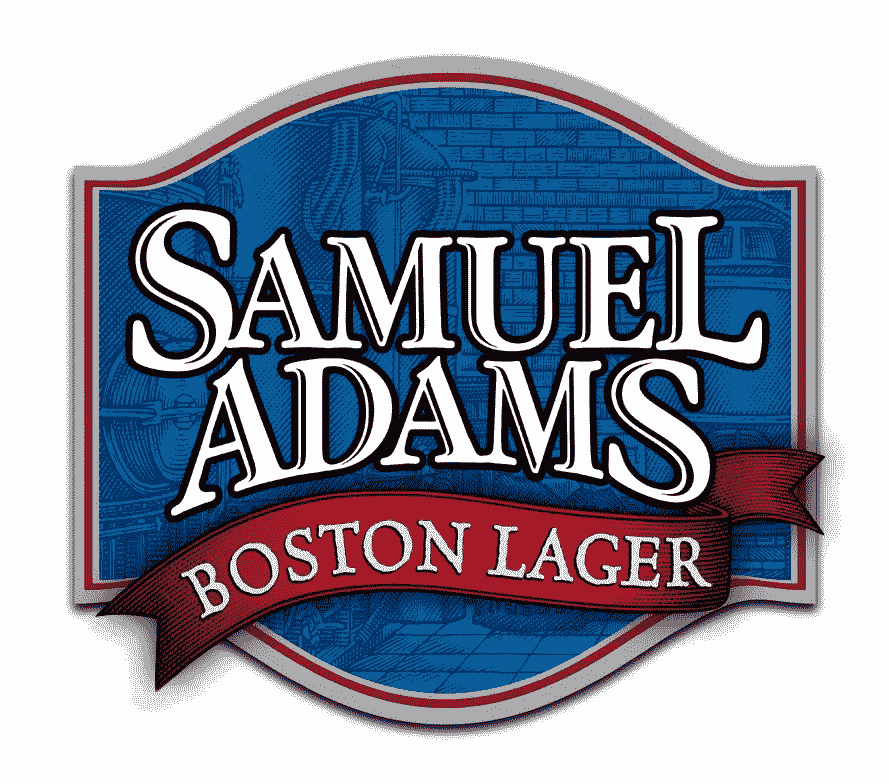
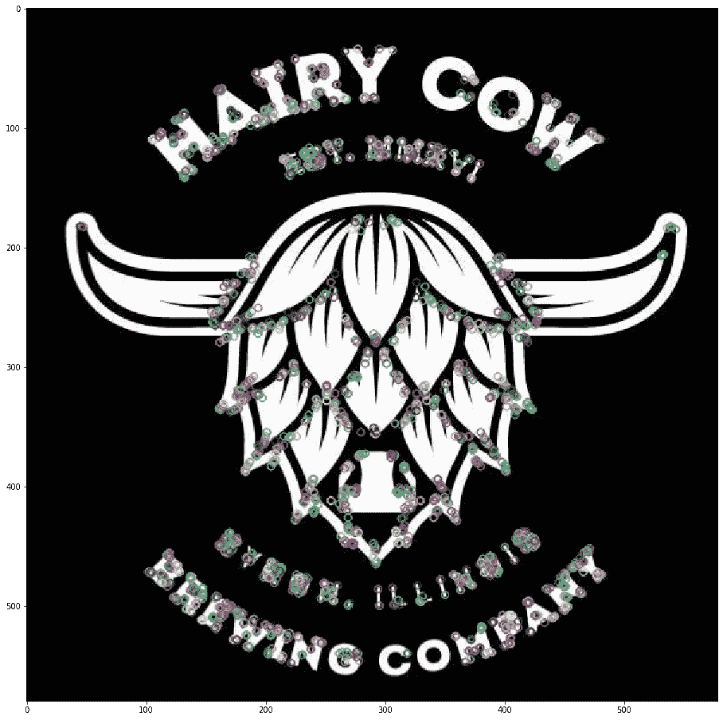
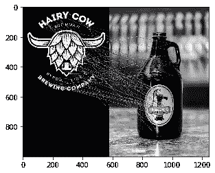

# 啤酒标签分类:使用 ORB，SURF 和 SIFT 制作你自己的啤酒分类器

> 原文：<https://medium.com/analytics-vidhya/beer-label-classification-make-your-own-beer-classifier-using-orb-surf-and-sift-2835cf94a0f4?source=collection_archive---------14----------------------->

在旅途中对啤酒瓶进行分类！

我遇到了一个啤酒标签分类器比赛，我想为什么不试试 ORB，SURF 和 SIFT，看看哪一个表现最好。

所以这里是我对啤酒标签分类的尝试。我不得不承认，搜集数据让我熟悉了数百家我从来不知道存在的啤酒公司。

Gif 礼遇:[谷歌](https://tenor.com/view/wisdom-wisdomous-intelligent-smart-gif-14536675)

好了，让我们直接开始编码吧！！

# **数据集:**

您将需要“查询”(测试图像)和“数据库”(训练图像)。像这样组织您的数据-
啤酒 _ 图像- >查询(包含测试图像的文件夹)
查询图像看起来像这样:

图片提供:[谷歌](https://www.myamericanmarket.com/us/samuel-adams-boston-lager-beer-bottle)

现在，对于列车图像，遵循相同的过程，即
Beer_images - >数据库(包含列车图像的文件夹)
列车图像看起来如下所示:

图片提供:[谷歌](https://www.behance.net/gallery/26090781/Samuel-Adams-Packaging-Illustrations-by-Steven-Noble)

# 导入库

# 关键点计算器

为了检查 ORB 是如何工作的，你可以使用下面的代码在一张图片上显示关键点。

您会看到类似这样的内容:

作者图片

图像顶部的圆环显示了关键点。

下面的代码将向您显示哪些点已经匹配，以便我们人类可以很容易地看到算法的性能。

作者图片

# 培训和准确性(ORB):

下面的代码接收所有的查询和数据库映像，并在其上运行 ORB。最后计算精度。

# 训练和准确性(SIFT/SURF):

在下面代码中给出的 descpt_id 中，您可以将“sift”更改为“surf ”,以创建相同的描述符。

# 准确度(SIFT):

上面创建的描述符然后被用于使用 SIFT 计算啤酒标签分类器的准确度。

# 精确度(SURF)

类似地，上面创建的描述符然后被用于使用 SURF 计算啤酒标签分类器的准确度。

# 结果

我测试了 23 张啤酒图片，使用 SIFT 达到了 75%的准确率。这样一个微型测试集在统计学上没有意义，但这个结果肯定是良好性能的标志。相反，SURF 给出了 27%的准确率，ORB 给出了 25%的准确率。

这些发现非常有趣，因为它假设 ORB 比 SIFT 好，但在我们的情况下，SIFT 是最好的，其次是 SURF，然后 ORB 是最后的。

根据 [StackOverflow](https://stackoverflow.com/questions/37617023/why-orb-is-not-as-good-as-sift-in-matching-for-these-two-images) 中提到的一篇论文，二进制描述符在特征匹配方面效率更高，占用内存更少。所以在检测的效率和精度之间有一个权衡。

比较 ORB 和 SIFT 的论文如下:

 [## 基于 ORB 的目标检测中前置滤波器的比较

### ORB:具有速度和内存占用的理想特征描述符。*总共 150 张正面和反面图像被用作…

www.sciencedirect.com](https://www.sciencedirect.com/science/article/pii/S0167865516303300) 

它说 ORB 比 SIFT 快两个数量级，但代价是作者发现 ORB 对噪声更敏感。

这解释了为什么 SIFT 在啤酒标签分类中表现最好。

# Github 代码:

我已经在我的 Github 上传了我的代码: [**啤酒标签分类**](https://github.com/Garima13a/Beer_Label_Classification)