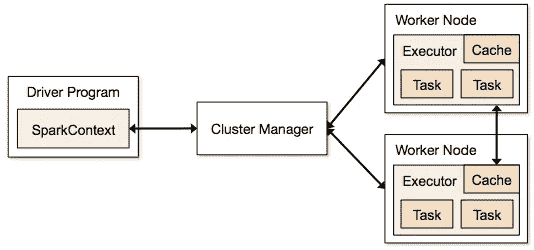
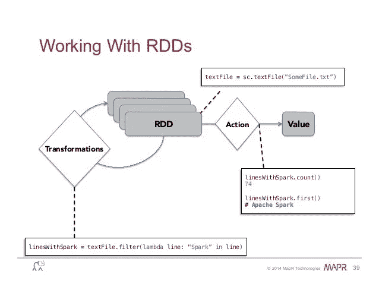

# Apache spark 大数据初学者指南

> 原文：<https://medium.com/analytics-vidhya/beginner-guideline-to-big-data-with-apache-spark-bcc861aa6a6e?source=collection_archive---------10----------------------->

在这篇博客中，我们将看到大数据，什么是 Apache spark，我们为什么需要它？

# **大数据:**

顾名思义，大数据是指无法用传统计算机系统存储和处理的海量数据。但是我们如何定义一个数据集为大数据呢？它取决于三个组成部分:

*   卷
*   速度
*   多样化

**容量:**指一个数据文件的大小，比如 10GB，1 TB 之类的。

**速度:**数据产生的规模，例如:1kb/微秒，1Mb/s

**多样性:**指数据的类型，例如:结构化、非结构化、半结构化。

根据以上组成部分，我们可以定义数据是不是大数据。

举个例子:如果你想在邮件中附加一个大小为 50 Mb 的文档，但是限制是 25 Mb，那么 50 Mb 的数据量在这里被称为大数据。

因此，在某些情况下的实时使用中，我们无法用传统的计算机系统读取和处理一些数据。为了解决这类问题，谷歌文件系统发布了名为“谷歌文件系统”的改变游戏规则的东西。在那之后，Hadoop 分布式文件系统(HDFS)和更多的东西进入了这个行业。

你可以在下面的链接中查看谷歌文件系统的论文

[https://static . Google user content . com/media/research . Google . com/en//archive/GFS-sosp 2003 . pdf](https://static.googleusercontent.com/media/research.google.com/en//archive/gfs-sosp2003.pdf)

好了，我们来看看 apache spark 在这里的作用是什么？

# **阿帕奇火花:**

根据 apache spark 文档页面"**的定义，Apache Spark**是一个用于大规模数据处理的统一分析引擎。

> “Apache Spark 是一个开源的数据处理引擎，用于处理大量数据，用于数据分析、机器学习等。以分布式的方式。”

它不是一种编程语言，但它为 python、java、scala 和 R 编程语言提供了 API。

但是我为什么要去阿帕奇星火呢？以下是其中的几个

我们为什么需要它？

**内存执行:** Apache spark 在 RAM 而不是本地内存中进行计算，这使得该过程比 Hadoop 分布式文件系统更快。

**惰性评估:**在 spark 中，直到动作执行后才会开始执行，只添加驱动程序需要的数据，这使得流程以一种更优化的方式进行。

# **架构:**

spark 系统的架构将会是这样的

体系结构

它基于主从架构工作，其中驱动程序被称为主设备，而工作人员被称为从设备。简单地说，主机不执行任何计算，它维护、跟踪并指示从机进行处理。主要部分是 **spark context (sc)** ，它是驱动程序的 spark context 类的实例。spark core 可以作为一个**弹性分布式数据集** ( RDD)来实现，这是一个以并行方式分布在节点的各个集群上的数据集，以快速的方式加速计算。与 RDD 一起工作，我们可以做两种类型的操作，它们是转化和行动。我们将看到我们何时以及为什么使用它们？

转型与行动

## **变身:**

我们不对数据做任何计算，只是做一些转换。对 RDD 进行这种操作的结果是另一个 RDD。

示例:

RDD 的诞生:

a = sc.parallelize(范围(100))

它创建了一个类似[0，1，2，…100]的列表

b = a . map(λx:x * 2)

它没有进行任何计算，只是对数据集中的 x => 2x 进行了转换，这将产生另一个 rdd。

## **动作:**

顾名思义，它是用来执行某种动作以获得某种计算结果的。

示例:

a.count() = >它将给出 RDD 中元素的数量

b.collect() = >它返回所有存在的元素。

# 总结…

这是我们如何使用 pyspark 编码的，py spark 是 apache spark 的 python API。您可以在下面的 GitHub 链接中看到如何使用 pyspark 在线性回归中创建模型的示例。

[https://github . com/bagavathypriyanavaneethan/BigData/raw/master/py spark/linearregwithspark . ipynb](https://github.com/bagavathypriyanavaneethan/BigData/raw/master/Pyspark/LinearRegwithSpark.ipynb)

谢谢你的阅读。

如果能通过评论听到你对这个博客的看法，那就太好了。

问候，

巴格瓦蒂·普里亚

参考:[https://spark.apache.org/](https://spark.apache.org/)