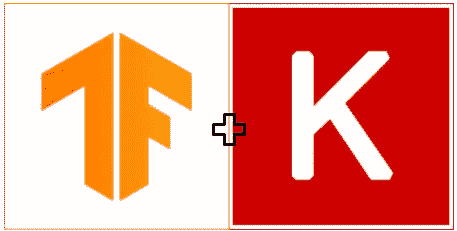
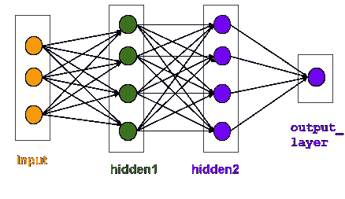
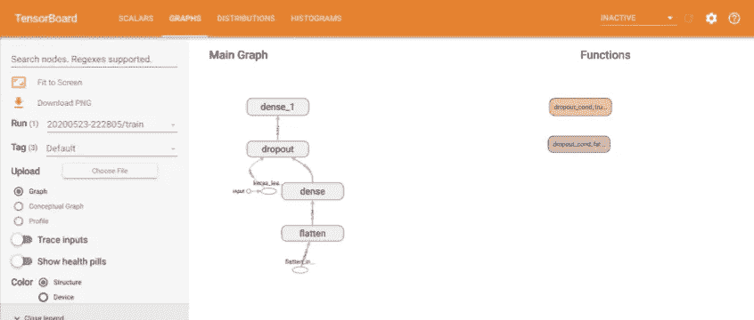
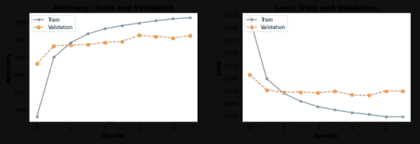

# 三种 Keras 模型 API 的初级介绍

> 原文：<https://medium.com/analytics-vidhya/beginner-level-introduction-to-three-keras-model-apis-24a45f7af3c9?source=collection_archive---------15----------------------->

在 [Unsplash](https://unsplash.com?utm_source=medium&utm_medium=referral) 上由 [Michal Ico](https://unsplash.com/@michalico?utm_source=medium&utm_medium=referral) 拍摄的照片

T 他的文章主要面向初学者和那些有多余时间阅读另一篇关于 Keras 的文章的人。

在本文中，我们将从三种不同类型的模型(顺序、功能和子类)API 的概述开始，我们可以用它们来创建 Keras 模型以解决不同的用例。还有其他方法来创建深度学习(DL)模型。然而，本文的范围是使用简单的数据和简单的模型为初学者演示 DL 概念。

使用的数据集:MNIST 数据

使用的平台/库:TensorFlow 2.2、Keras 和 Python 3.x

TensorFlow 库下的 Keras API

在深入细节之前，Keras 是什么？

*   K 是用 Python 编写的神经网络(NN)库。
*   用深度神经网络实现快速实验
*   可靠、模块化、可扩展，支持多后端和多平台
*   **一个**广泛用于 DL 模型产品化的神经网络库
*   简单易学，易于使用

【Keras 有什么？

Keras 有许多 API 来构建、训练、评估和可视化模型性能。下面列出了几个主要的 API。

**模型 API**

*   顺序、功能和子类

**层 API**

*   密集，Conv，LSTM，GRU，辍学，汇集，Batchnorm 等。

**损失 API**

*   类别交叉熵、均方误差、平均绝对误差等。

**指标 API**

*   精度、二进制精度、分类精度、top _ k _ 分类精度等。

**优化器 API**

*   SGD，Adam，RMSprop。阿达格拉德、阿达德尔塔、阿达马克斯等。

**激活 API**

*   Relu，tanh，sigmoid，elu，softmax，卢瑟等。

**回调 API**

*   模型检查点，张量板，提前停止，历史等。

上面的 API 是用于构建 Keras 模型的构建块(像乐高积木一样)。这些 API 使我们能够轻松地构建简单和复杂的模型。我们将使用上述大多数 API 来构建、训练和评估 Keras 模型。最后，我们可以可视化 Keras 模型的性能，以微调或生产模型。

任何 DL 问题都可以通过使用三个 Keras 模型 API 中的一个或多个来解决。让我们更深入地研究一下这些模型 API，找出为什么我们有三个 API，以及何时使用一个特定的 API。

# **1。顺序模式:**

简单地说，顺序模型由线性堆叠在模型中的 Keras 层组成。**这很简单，适用于约 60–70%的应用，但有一个主要限制，即它仅适用于单输入和单输出。**如果你的用例需要多个输入和/或输出，那么就使用功能性的或者子类化的模型 API。

您可以定义一个顺序模型，如下所示。

上述神经网络模型的架构

# **2。功能型号:**

与顺序模型不同，功能模型不太复杂，但可以处理多个输入和输出。它可以处理具有非线性拓扑的模型，可以共享和重用层，并且是一个更灵活的模型，提供了更多的旋钮来提高性能。这个模型 API 可以用于开发能够服务于大多数用例的复杂模型。

您可以定义一个功能模型，如下所述。

# **3。子类模型:**

与上面两个模型 API 相比，这是最复杂的，但是在建模复杂用例时提供了更多的灵活性。这里，Keras 模型类(`tf.keras.Model`)被子类化，这允许我们继承该类下的功能，例如 fit/predict/eval 等。

子类模型和上面两个模型 API 的主要区别之一是前者是调用方法中的一段 python 代码，而后者是一个静态图。由于这种差异，保存和加载子类模型与其他模型 API 有很大的不同。

> 因为这篇文章是为初学者准备的，给定任何用例，尝试使用顺序的(对于单输入单输出)或者功能模型 API(对于其他情况)。将来，当我们不再是初学者时，我们将处理子类模型。

> 下面是顺序模型 API 和功能模型 API 之间的主要区别

顺序与功能模型 API

# **训练和可视化:简单顺序模型**

由于我们不了解基础知识，所以让我们更深入地研究深度学习框架(Keras ),并检查更多用于训练、评估和可视化的 API。`tf.keras`中有几个 API，每个 API 都需要一篇单独的文章来深入研究。由于本文主要针对初学者，所以让我们在下面的代码中讨论一些重要的 API 和回调函数。

以下代码描述了

*   定义简单的 DL 模型，下载 MNIST 数据，培训和评估绩效
*   保存训练好的模型
*   加载保存的模型并评估性能
*   检查几个回调 API(`TensorBoard`、`ModelCheckpoints`、`History`)

模型的输出(只显示了一部分，以尽量缩短文章长度)

保存并加载模型

加载模型的性能如下

您可以看到，保存前和加载后的模型性能完全相同。出于某种原因，如果你想重新训练模型，那么你可以使用`loaded_model`从上次离开的地方重新开始训练(不需要从头再来)。

**TensorBoard 回调 API**

让我们使用`TensorBoard`来可视化这些图表。除了图形，你还可以检查模型，检查标量，分布，直方图等。

TensorBoard 检查图形，标量，分布，直方图

**历史回调 API**

您可以使用`model.history`回调来绘制训练和验证期间的准确度和损失。

培训和验证期间的准确性和损失

# **总结**

*   Keras 是一个广泛使用的神经网络库，简单易学，易于使用，能够快速实验深度神经网络
*   有三种 API(顺序、函数和子类)来构建模型
*   序列模型有一个主要的局限性，即它只适用于单输入单输出
*   顺序模型 API 是上述三种中最简单的，适用于大约 60–70%的用例。然而，函数类和子类更加复杂，但却适用于任何用例。
*   初学者应该尽量使用顺序的(针对单输入单输出)或者函数模型 API(针对其他情况)。
*   Keras 有许多 API 来构建、训练、评估和可视化模型性能

我认为这对一个初学者来说已经足够了。我们将在以后的文章中深入研究其中的一些 API。

谢谢大家！如果你喜欢这篇文章，请分享它，以帮助他人找到它！如果你有任何不明白的地方或者想要更多的解释，请在下面留下你的评论。

你可以在 [LinkedIn](https://www.linkedin.com/in/vishnuvardhanjanapati/) 、 [Stackoverflow](https://stackoverflow.com/users/9936228/vishnuvardhan-janapati) 和 [GitHub](https://github.com/jvishnuvardhan) 上找到我