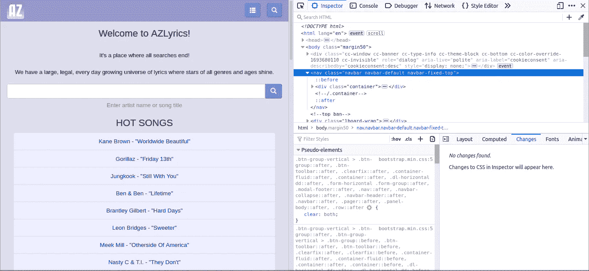
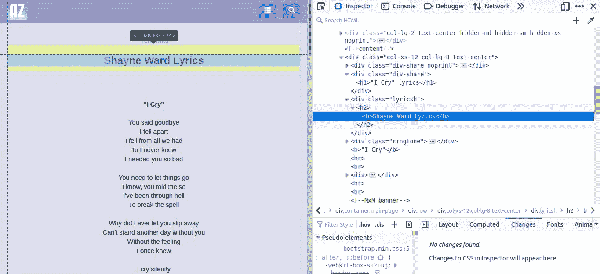
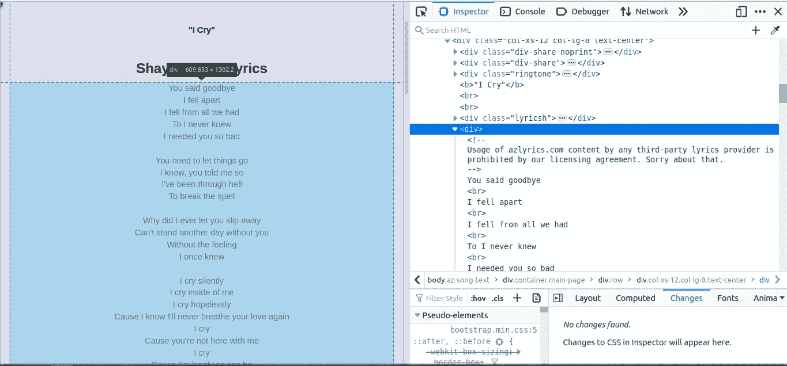

# 初级到高级 Python 中的 Web 抓取指南:Scrap AZLyrics 入门指南。

> 原文：<https://medium.com/analytics-vidhya/beginner-to-advance-web-scraping-guide-in-python-799ffd367067?source=collection_archive---------10----------------------->


照片由[维达尔·诺德里-马西森](https://unsplash.com/@vidarnm?utm_source=medium&utm_medium=referral)在 [Unsplash](https://unsplash.com?utm_source=medium&utm_medium=referral) 拍摄

# 介绍

网上有成千上万吨的信息。它的增长已经超出了最大胆的预测。而要想与时俱进，就需要比别人更快的处理信息。

在过去的几年里，开发了几个大型项目，涉及到刮擦和数据处理。它们是为完全不同的行业开发的，我们的方法也是为所有这些行业找到最佳解决方案。

# **我们将学习的主要工具:**

*   Python (3.5)
*   [*beautiful soup*](https://pypi.org/project/beautifulsoup4/)*库，用于处理从网页源代码(HTML 和 CSS)中提取的文本*
*   *[*请求*](https://pypi.org/project/requests/) 库用于处理与网页的交互(使用 HTTP 请求)*
*   *API 调用——丰富我们的数据*
*   *代理和用户代理轮换—生成随机标头以绕过安全性*

# *教程 1 —初学者教程*

*请随意选择你喜欢的网站。但是对于这个项目，我们选择了这个网站。 ***注意——本教程仅用于教育目的，我不建议将本网站用于任何非法活动*** 。首先看看我们在刮什么。*

**

*[https://www.azlyrics.com/](https://www.azlyrics.com/)*

*AZLyrics 提供了简单的歌词功能，可以搜索歌曲并获得歌手演唱的所有歌曲的列表。这是一个简单的网站，不需要任何帐户或验证来获得歌词。*

## *设置环境*

*假设你已经安装了 [venv](https://docs.python.org/3/tutorial/venv.html) ，但是如果你还没有，你可以通过[链接](https://packaging.python.org/guides/installing-using-pip-and-virtual-environments/#installing-virtualenv)找到如何在你的系统中安装 venv。如果你不熟悉这个概念，你可以查看这个[链接](https://www.geeksforgeeks.org/python-virtual-environment/)。现在创建一个新的文件夹，比如说`python-azlyrics_scrapper`，并在里面创建 venv。这将使 env 目录位于主目录中*

```
*python3 -m venv env*
```

*要激活 Python 环境，使用代码`source env/bin/activate.`
你还需要在你的开发环境中使用 Pip 安装各种依赖项，包括 requests、BeautifulSoup、Pandas、Regex。*

```
*pip3 install requests regex pandas beautifulsoup4*
```

## *构建简单的 URL 提取函数来提取歌词*

*创建新文件并另存为 print_lyrics.py。要编写代码，您可以使用任何开发 IDE。
我更喜欢使用 Sublime Text 或 Atom，但您也可以使用自己选择的 IDE。现在我们可以从在我们创建的文件中导入库开始*

```
*import requests 
from bs4 import BeautifulSoup*
```

*现在要删除一个网页，你必须了解一些 HTML 的基础知识。如果您通过按 F12 打开开发者工具或检查元素，您可以检查您想要从中提取数据的*

*的类。***

*在这里你可以看到类“lyricsh”中有歌手的名字，类“div-share”中有歌曲的名字。*

```
*<div class="div-share"><h1>"I Cry" lyrics</h1></div>

<div class="lyricsh">
<h2><b>Shayne Ward Lyrics</b></h2>
</div>*
```

*因此，要从服务器获取页面，我们必须使用请求库，使用网页的 URL 从互联网获取网页。如果您有一些问题，您可以访问此[链接](https://www.pythonforbeginners.com/requests/using-requests-in-python/)以更好地理解[请求库](https://2.python-requests.org/en/master/)。*

*在上面的代码中，我们通过请求库请求 URL，然后保存结果作为响应。要运行该文件，您可以使用以下命令*

```
*python3 print_lyrics.py*
```

*现在，为了从响应中提取细节，我们必须使用 BeautifulSoup 库来解析 html 页面，这可以使用命令
`BeautifulSoup(response.text , 'html.parser')`从响应中获取 HTML 解析文本来完成。从网页中解析不同的部分可能会有点混乱，但是通过[小练习](https://www.dataquest.io/blog/web-scraping-tutorial-python/)你可以很容易地从网页中获得想要的细节。*

*   *歌手名字在里面，带有‘lyric sh’*
*   *歌曲和歌词没有唯一的类别，你可以使用 find_all 函数来查找所有的并获取特定的索引以获得详细信息。
    我使用了 Hit 和 Trial 来获得上述结果，但也可以随意使用上述函数或获得独特的更简单的方法。*
*   *你可以改变其他人的网址，但网页和歌词的一般结构保持不变。*

**

*该文件的输出将是终端中的歌手姓名、歌曲名称和歌词。*

## *保存响应*

*为了将这个输出保存到磁盘，我将使用 JSON 来转储数据，但是您也可以使用 CSV 或 text。使用 SQL 将数据保存到磁盘可能是过度的，除非你打算废弃和管理数百万的歌词数据集。
对于几千首歌词来说，JSON 或 CSV 会很好用。完整的代码现在看起来会像*

*这将创建文件'数据. json '在同一目录下的歌手和歌词的歌曲。*

> ***您已经成功创建了您的第一个网络剪贴簿。
> 干得好…！！！***

# *从这里继续前进。*

## *教程 1 —简介*

*在[之前的教程](/@kaus.pathak_30409/beginner-to-advance-web-scraping-guide-in-python-799ffd367067)中，我们了解了网页抓取的基本概念，并创建了一个简单的函数，使用 requests 和 BeautifulSoup 从页面中提取歌词。*

## *教程 2 —使用 Python 中的头池和代理循环请求。*

*为了创建一个更大的项目，可以从互联网上删除成千上万的页面，你需要一个更清晰的工作环境，使用面向对象和继承的概念。你还需要有更详细的关于头文件池和代理池的知识来保持对服务器的匿名，我们已经在本教程的第二部分中讨论过了。*

## *教程 3 —工作环境和异步 I/O 编程*

*我们将进行异步 I/O 编程来提高你的报废速度，这将在本教程的第三部分中介绍。*

## *教程 4 —自动化站点抓取*

*有了之前教程中学习的所有概念，我们将在本教程的第四部分中创建实际的自动抓取器来下载和保存网页上的歌词。*

## *教程 5 — API 访问*

*为了方便地从互联网上访问歌词，我们将创建 Flask API 和前端来访问我们在本教程第五部分中废弃的歌词。*

## *教程 6 —在 Heroku 上托管我们的 Flask 服务器*

*为了提供容易的歌词访问，在本教程的第六部分，我们将在 Heroku 上托管我们的 Flask 服务器。*

**

*由[皮特·佩德罗萨](https://unsplash.com/@peet818?utm_source=medium&utm_medium=referral)在 [Unsplash](https://unsplash.com?utm_source=medium&utm_medium=referral) 上拍摄*

# *最后的话*

*感谢你阅读这篇文章，我们希望听到你的反馈。请随意评论任何问题。如果你喜欢，请为我们鼓掌:)。关注我们，获取我们的最新文章。*