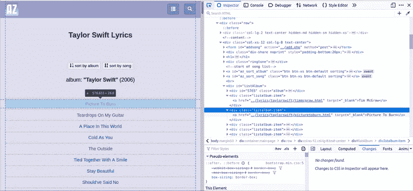

# 从初学者到高级 Python 中的网络抓取指南:自动歌词抓取器。

> 原文：<https://medium.com/analytics-vidhya/beginner-to-advance-web-scraping-guide-in-python-automated-lyrics-scraper-809163f279a1?source=collection_archive---------8----------------------->


在之前的教程中，我们学习了网页抓取、旋转请求和使用异步编程的基础知识。现在，我们将使用这些技巧从 AZLyrics 网站上删除歌词，并将删除的歌词保存为 JSON 格式。

# 工作流程


我们将使自动化的过程，接受歌手的网址，并保存那里的歌曲和专辑列表，并开始在那里的网页上收集所有的歌曲。以下是歌手样本页面的样子。



由于我们已经在*bin/Proxy . py*中开发了 2 个类，我们将在 *bin/main.py* 中创建一个新的主类，名为 *AZLyrics* ，并继承之前的类 *Proxy_Checker* 。

## 第 1 部分—解析主页面并从插入的 URL 中收集歌曲 URL。

这是我们新班级的样子:

这里我们定义了函数 *az_load_data(self)* 来加载 az_data 和 az_lyrics 里面的 json 数据。我们将使用这些变量来追加数据，并保存这些变量来备份我们的数据。
函数 *az_logger(self)* 将允许我们创建日志文件来检查我们在脚本中的进度。
现在，我们将为请求 URL 定义新的函数，但由于我们的大多数请求都将失败，我们将使用新的代理和标头进行请求，直到我们成功地从站点获取数据。此外，如果被识别为机器人网站将发送警告页面，我们也需要处理它，因为它看起来像一个正常的页面，状态代码为 200，但对我们没有用，因为它没有任何实际数据。所以这个函数看起来像这样:

使用这个函数，我们将从服务器请求页面，但我们仍然需要解析请求和过滤我们需要的数据。为此，我们将创建其他函数 *az_songs_by_list(self)* 来解析请求并保存页面中的所有 URL。

函数 *az_songs_by_list* 将数据保存在字典中，并将 URL 保存在 *az_data['simple_urls']* 数组中。使用 *add_urls()* ，我们可以接受并保存艺术家的 URL。

如果一切都正确，要运行我们到目前为止创建的脚本，我们将使用命令。

如果一切正确，您应该可以开始废弃该站点，并在*JSON _ data/data _ to _ scrap . JSON*中检查进度，日志将在 *log_data/main.log 中更新。*


更新后，您的*JSON _ data/data _ to _ scrap . JSON 文件*将看起来类似。
正如你看到的，通过抓取 3 位歌手，我们可以抓取 1686 首歌曲的网址。现在我们将使用这些网址从网站上删除歌词。

## 第 2 部分—通过 Asyncio 编程抓取 URL 和收集歌词。

根据之前教程的经验，我们将使用 Asyncio 概念来删除歌词。

*   **lyrics_from_link() —** 函数，接受解析后的网站并创建包含歌词的歌曲详细信息字典。
*   **get_batch_lyrics()** —函数创建线程，并发运行 **lyrics_from_link()** 函数。

> 注意—您应该不时地废弃代理，因为它们会在几个小时内更新并需要刷新。

完整的脚本将是:

现在，既然我们已经完成了我们的代码，我们将创建一个 *main.py* 文件来轻松访问我们所有的代码*。*如果正确，运行下面的代码将开始抓取 URL，您可以在日志中检查进度。一旦完成，您将在*JSON _ data/data _ lyrics . JSON*文件中看到更新。

```
import json
from bin.azlyrics import *if __name__ == “__main__”:
 azlyrics = AZLyrics()
 azlyrics.start_scrapping()
```


有了这个脚本，我可以在两个小时内删除大约 16k 首歌曲的歌词。
我使用的 max_workers 值设置为 100，但您也可以根据您的系统和带宽增加该值。

你也可以在 Github 的[链接上找到完整的代码。](https://github.com/terminate9298/azlyrics_scraper)

[](https://github.com/terminate9298/azlyrics_scraper) [## 终结 9298/azlyrics_scraper

### Python Webscraper 使用漂亮的组和并发编程和请求的概念来清除 AZLyrics.com…

github.com](https://github.com/terminate9298/azlyrics_scraper) 

> **你已经成功编写了代码，可以在不被阻塞的情况下删除 AZLyrics。做得好…！！！**

# 从这里继续前进。

## 教程 1 —简介

在[之前的教程](/@kaus.pathak_30409/beginner-to-advance-web-scraping-guide-in-python-799ffd367067)中，我们了解了网络抓取的基本概念，并创建了简单的函数来使用请求和美丽组从页面中提取歌词。

## 教程 2 —使用 Python 中的头池和代理循环请求。

为了创建一个更大的项目，可以从互联网上删除成千上万的页面，你需要一个更清晰的工作环境，使用面向对象和继承的概念。你还需要有更详细的关于头文件池和代理池的知识来保持对服务器的匿名，我们已经在本教程的第二部分中讨论过了。

## 教程 3 —工作环境和异步 I/O 编程

我们将做异步 I/O 编程来提高你的报废速度，这将在本教程的第三部分中介绍。

## 教程 4 —自动化站点抓取

有了之前教程中学习的所有概念，我们将在本教程的第四部分中创建实际的自动抓取器来下载和保存网页上的歌词。

## 教程 5 — API 访问

为了方便地从互联网上访问歌词，我们将创建 Flask API 和前端来访问我们在本教程第五部分中废弃的歌词。

## 教程 6 —在 Heroku 上托管我们的 Flask 服务器

为了提供容易的歌词访问，我们将在本教程的第六部分[的 Heroku 上托管我们的 Flask 服务器。](/@kaus.pathak_30409/beginner-to-advance-web-scraping-guide-in-python-deploy-a-python-web-app-using-flask-and-a0e3cc8ce9f6)


# 最后的话

感谢您阅读这篇文章，我们希望听到您的反馈。请随意评论任何问题。
如果你喜欢，请给我们鼓掌。关注我们，获取我们的最新文章。