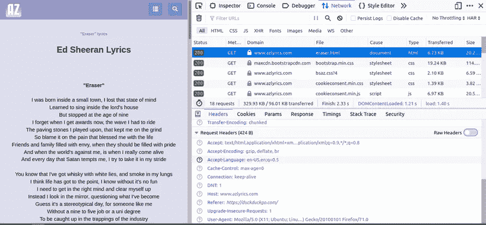
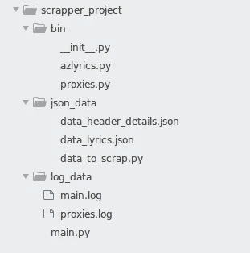

# 从初级到高级 Python 中的 Web 抓取指南:用头池和代理轮流请求。

> 原文：<https://medium.com/analytics-vidhya/beginner-to-advance-web-scraping-guide-in-python-ba24dca5dce0?source=collection_archive---------2----------------------->

照片由[希特什·乔杜里](https://unsplash.com/@hiteshchoudhary?utm_source=medium&utm_medium=referral)在 [Unsplash](https://unsplash.com?utm_source=medium&utm_medium=referral) 拍摄

web 抓取工具面临的一个常见问题是在抓取时被网站屏蔽。服务器使用请求头和代理客户端识别用户，如果将客户端分类为 Bot，代理客户端会阻止客户端。有许多方法可以防止阻塞，例如

*   轮换 IP 地址
*   使用代理
*   轮换和欺骗用户代理

将代理和轮换 IP 地址与轮换用户代理结合使用，可以帮助您让清除程序通过大多数防清除措施，并防止被检测为清除程序。
抓取时轮换 IP 地址的概念很简单，你可以让网站看起来你不是一个“机器人”或一个访问网站的人，而是从多个位置访问网站的多个“真实”用户。

# 教程 2 —使用头池和代理轮流请求以保持匿名。

## 第一眼

在[之前的教程](/@kaus.pathak_30409/beginner-to-advance-web-scraping-guide-in-python-799ffd367067)中，我们学习了使用`requests.get`命令获取网页，并使用 BeautifulSoup 解析请求。现在为了轮换请求，我们需要在`Requests.get`中传递头和代理参数

在这里，用户代理是一个字符串，它告诉服务器你的浏览器和操作系统。Referrer 告诉服务器 Url 被引用的位置。
例如，如果您在搜索引擎上搜索页面，然后点击该网页的链接 URL，推荐人将被设置为您的搜索引擎。
您可以通过打开检查元素来检查您的标题详细信息。它在 Firefox 浏览器中看起来会像这样。

在这里你可以看到 Referer 被设置为`https://duckduckgo.com`，User-Agent 对于你的浏览器来说是唯一的，有很多其他的请求头。
当参数代理被传递时，提供的代理将用于获取请求。在我们的项目中，我们将使用公共代理发送请求，但如果你打算放弃像谷歌或脸书这样的网站，我建议使用高级代理。现在，公共代理被定义为 3 类。

1.  **透明代理**–透明代理是一种服务器，位于您的计算机和互联网之间，重定向您的请求和响应，而不修改它们。它在 HTTP_X_FORWARDED_FOR 标头中发送您的真实 IP 地址，这意味着网站不仅会确定您的远程 _ADDR，还会检查特定的代理标头，这些标头仍会知道您的真实 IP 地址。HTTP_VIA 头也被发送，表明您正在使用代理服务器。
2.  **匿名代理**–匿名代理不会在 HTTP_X_FORWARDED_FOR 报头中发送您的真实 IP 地址，而是提交代理的 IP 地址，否则它将为空。HTTP_VIA 报头是用透明代理发送的，这表明您正在使用代理服务器。匿名代理服务器不再告诉网站你的真实 IP 地址。这有助于保护你在互联网上的隐私。网站仍然可以看到你在使用代理服务器，但最终，只要代理服务器不透露你的真实 IP 地址，这并不重要。如果有人真的想限制页面访问，匿名代理服务器将被检测和阻止。
3.  **精英代理**–一个精英代理只发送远程 _ADDR 报头，其他报头为空。这会让你看起来像一个不使用代理的普通互联网用户。精英代理服务器是通过互联网上的任何限制和最大限度地保护您的隐私的理想选择。你看起来像一个居住在代理服务器所在国家的普通互联网用户。

## 从互联网获取用户代理和代理的概念

1.  **用户代理** —为了从互联网上收集用户代理，我们将使用[whatismybrowser.com/](https://developers.whatismybrowser.com/)，它收集了数百万个用户代理，并根据检测到的一些信息(操作系统、浏览器、硬件类型、浏览器类型等)对它们进行了分类。
    您可以手动选择几个用户代理，或者删除几百个用户代理来创建用户代理的投票，完整的代码如下所示。
2.  **代理**——有很多网站可以让你在报废时免费使用代理。其中一些是[public proxy](http://pubproxy.com/)、 [ProxyScrape](https://www.proxyscrape.com/home) 、 [free-proxy-list](https://free-proxy-list.net/) 。
    您需要创建功能来废弃这些网站，因为它们需要在整个程序中不断废弃。
3.  **日志** —为了维护自动化项目，我们需要在 Python 中设置日志功能，以便在运行脚本时检查进度和错误。如果你过去没有练习过日志，我鼓励你少练习日志。你可以看看[官方文档](https://docs.python.org/2/howto/logging.html)和[极客论坛](https://www.geeksforgeeks.org/logging-in-python/)来寻求一些支持。
4.  **Python OOP 的概念** —我们将使用[面向对象编程](https://www.javatpoint.com/python-oops-concepts)的概念，如继承，在我们的程序中创建类和对象。
5.  **JSON 概念—** 将输出数据保存在驱动器中。

## 第一次看我们的工作目录

*   bin —编写代码类和函数。
*   json_data —将已处理和未处理的数据存储到磁盘。
*   log_data —检查脚本中的进度和错误。
*   main.py —我们将在其中执行程序的主文件。

我们还需要创建脚本来将数据放入 JSON 中。您可以使用您的格式，但下面的代码运行并准备每个 JSON 供将来使用。

# 工作码

这些都将帮助你轻松地维护数据的其余部分。您可以从代码中提供的链接中删除用户代理，或者从这里下载删除的数据。

如果你成功地在 *bin/proxies.py* 中编译这个脚本，这将从互联网上保存代理的碎片，并以 JSON 格式保存。您可以在*log _ data/proxy . log* 程序中检查项目进度，使用 free-proxy-list.com 来废弃最新的代理，但是您可以使用 pubproxy 或 proxyscrape 来废弃最新的代理，但是 *get_free_p_l()* 工作正常。

> **您已经成功创建了在报废时更改代理和头的类。做得好…！！！**

# 从这里继续前进。

## 教程 1 —简介

在[之前的教程](/@kaus.pathak_30409/beginner-to-advance-web-scraping-guide-in-python-799ffd367067)中，我们了解了网页抓取的基本概念，并创建了一个简单的函数，使用 requests 和 BeautifulSoup 从页面中提取歌词。

## 教程 2 —使用 Python 中的头池和代理循环请求。

为了创建一个更大的项目，可以从互联网上删除成千上万的页面，你需要一个更清晰的工作环境，使用面向对象和继承的概念。你还需要有更详细的关于头文件池和代理池的知识来保持对服务器的匿名，我们已经在本教程的第二部分介绍过了。

## 教程 3 —工作环境和异步 I/O 编程

我们将进行异步 I/O 编程来提高你的报废速度，这将在本教程第三部分中讨论。

## 教程 4 —自动化站点抓取

有了之前教程中学习的所有概念，我们将在本教程第四部分的[中创建实际的自动抓取器来下载并保存网页上的歌词。](/@kaus.pathak_30409/beginner-to-advance-web-scraping-guide-in-python-automated-lyrics-scraper-809163f279a1)

## 教程 5 — API 访问

为了方便地从网上访问歌词，我们将创建 Flask API 和前端来访问我们在本教程第五部分的[中废弃的歌词。](/analytics-vidhya/beginner-to-advance-web-scraping-guide-in-python-build-and-deploy-a-python-web-app-using-flask-202ffdf8fd40)

## 教程 6 —在 Heroku 上托管我们的 Flask 服务器

为了提供容易的歌词访问，我们将在本教程的第六部分通过 Heroku 托管我们的 Flask 服务器。

皮特·佩德罗萨在 [Unsplash](https://unsplash.com?utm_source=medium&utm_medium=referral) 上的照片

# 最后的话

感谢你阅读这篇文章，我们希望听到你的反馈。请随意评论任何问题。如果您喜欢，请为我们鼓掌:)。关注我们，获取我们的最新文章。