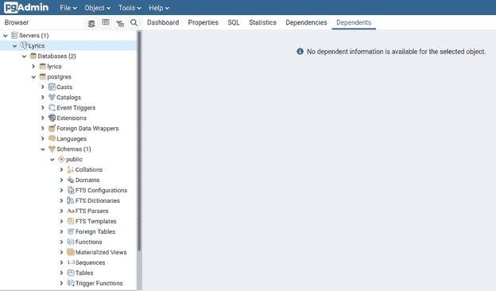
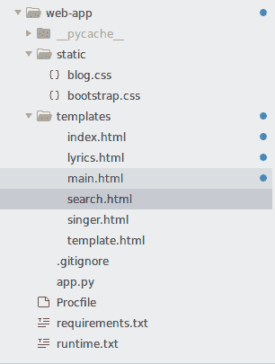
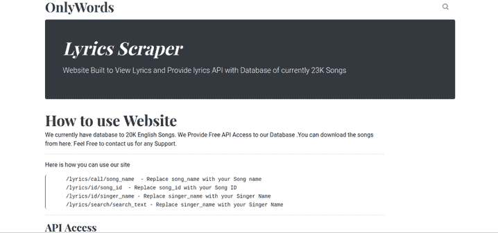

# 初级到高级——Python 中的 Web 抓取指南:使用 Flask 和 Postgres 构建和部署 Python Web 应用程序。

> 原文：<https://medium.com/analytics-vidhya/beginner-to-advance-web-scraping-guide-in-python-build-and-deploy-a-python-web-app-using-flask-202ffdf8fd40?source=collection_archive---------7----------------------->


在之前的教程中，我们创建了一个抓取项目来从 AZLyrics 下载歌词，它以 JSON 格式保存歌词。但我们也需要创建一个网站和 API 来更好地搜索我们的数据中的歌词。因此，为了创建基于 Web 的界面和 RESTful API，我们将使用 Flask 和 Postgresql 并在 Heroku 上部署我们的界面。

## 为什么 Flask 是一个好的 web 框架选择？

Flask 是一个快速、轻量级并且对初学者友好的用 Python 编写的 web 框架，它使用了 T2 的 Werkzeug WSGI 工具包和 Jinja2 模板引擎 T3。在 Flask 中编写“Hello World”程序的起始代码非常简单。

```
from flask import Flask
app = Flask(__name__)
@app.route(‘/’)
def hello_world():
   return ‘Hello, World!’
if __name__ == ‘__main__’:
   app.run()
```

## 一种数据库系统

PostgreSQL 是一个免费的开源关系数据库管理系统，强调可扩展性和 SQL 遵从性。它在 Heroku 中免费提供，最多 10，000 行，我们将在下一节中了解。

# 安装 Flask 和 PostgreSQL

使用 PIP 在 python 中安装 flask 简单明了。您只需要激活本地 python 环境(如果您正在使用),并使用 pip 命令来安装 Flask

```
pip install flask
```

在 Flask 中使用 PostgreSQL 可能有点复杂，但是如果出现错误，您可以查看大量的帮助和博客。我们将使用 [*Flask-SQLAlchemy*](https://stackabuse.com/using-sqlalchemy-with-flask-and-postgresql/) 扩展将我们的 API 连接到 Postgres 数据库。

```
pip install psycopg2-binary ,flask-sqlalchemy, Flask-Migrate
sudo apt-get install postgresql postgresql-contrib
```

我们将使用 Pgadmin4 作为客户端，这是一个流行的、功能丰富的 PostgreSQL 开源管理和开发平台。
为 PostgreSQL 创建超级用户。

```
sudo -u postgres createuser — superuser ***name_of_user***
```

并使用创建的用户帐户创建数据库。

```
sudo -u ***name_of_user*** createdb ***lyrics***
```

现在运行 **pgadmin4** ，您将能够看到您的第一个数据库。



现在我们将创建一个名为 **Web_App** 的新文件夹，我们将在其中创建我们的 flask 项目。我们还需要创建文件夹**静态**和**模板**，我们将在其中创建 HTML 和 CSS 文件。

现在，在 Web_App 文件夹中创建文件 **app.py** ，并将以下代码放入其中。

但是首先我们需要通过下面的命令在数据库中创建一个表。

```
>> from app import db
>> db.create_all()
```

你可以在 **pgadmin4** 中通过名字 Lyrics_dataset 来查表。但是，在运行 app.py 文件之前，我们需要将收集到的数据提交到数据库中。我们还需要为我们的前端网站创建一个模板。

这段代码将从 JSON 导入数据到表**的歌词 _ 数据集**，可以从我们的网站访问。现在完成我们的后端，我们将创建一个前端访问我们的网站。

我们将通过 Bootstrap 使用免费模板[博客](https://getbootstrap.com/docs/4.5/examples/blog/)作为我们的父模板，并扩展所有网站作为子模板。您还需要将文件 blog.css 和 bootstrap.css 放在静态文件夹中，并在 templates 文件夹中创建所有 HTML 文件。

## 基础模板

这个模板，我们称之为 template.html，定义了一个简单的 HTML 框架文档，你可以用它来创建一个简单的页面。用内容填充空白块是“子”模板的工作:

在这个例子中,标签定义了子模板可以填充的四个块。block 标签所做的只是告诉模板引擎，子模板可以覆盖模板的这些部分。

## 子模板

扩展基本模板，我们还将创建替换块的其他页面:



*   【main.html】—显示名称中带有搜索关键词的歌曲链接。
*   [search.html](https://gist.github.com/terminate9298/b8ed8ace918da054b5d72699935fb227)—显示歌词中带有搜索关键词的歌曲链接。
*   [singer.html](https://gist.github.com/terminate9298/647ae490fa9d8636aa0e0a10fe5b1f69)—按歌手显示歌曲链接。
*   [lyrics.html](https://gist.github.com/terminate9298/1cd69b90a26c2257a7cd85fb709dd835)—按 ID 显示歌曲的歌词。
*   [index.html](https://gist.github.com/terminate9298/fcc177e0b9a5be859586712bf8671676)—作为网站主页显示的索引页面。

如果您成功完成了这些步骤，现在就可以运行代码了。要运行 Flask server，您现在可以通过键入以下命令来运行 app.py:

```
python app.py
```

要运行 Postgre，您可以直接启动 **pgadmin4** ，这将在您的系统上启动 PostgreSQL 服务器。

# 查看我们的网站



如果您能够使用浏览器在服务器上查看您的网站:

```
[http://localhost:5000/](http://localhost:5000/)
```

您还可以使用 API 获取歌曲的歌词，例如:

```
[http://127.0.0.1:5000/api/lyrics/id/453](http://127.0.0.1:5000/api/lyrics/id/453)
```

> **你已经使用 Flask 和 Postgres 成功构建了一个 Python Web App。**
> 
> 做得好…！！！

# 从这里继续前进。

## 教程 1 —简介

在[之前的教程](/@kaus.pathak_30409/beginner-to-advance-web-scraping-guide-in-python-799ffd367067)中，我们了解了网页抓取的基本概念，并创建了一个简单的函数，使用 requests 和 BeautifulSoup 从页面中提取歌词。

## 教程 2 —使用 Python 中的头池和代理循环请求。

为了创建一个更大的项目，可以从互联网上删除成千上万的页面，你需要一个更清晰的工作环境，使用面向对象和继承的概念。你还需要有更详细的关于头部池和代理池的知识来保持对服务器的匿名，我们已经在本教程的第二部分[中讨论过了。](/analytics-vidhya/beginner-to-advance-web-scraping-guide-in-python-ba24dca5dce0)

## 教程 3 —工作环境和异步 I/O 编程

我们将进行异步 I/O 编程来提高你的报废速度，这将在本教程第三部分的[中介绍。](/@kaus.pathak_30409/beginner-to-advance-web-scraping-guide-in-python-introduction-to-asynchronous-programming-24bce03dafa7?postPublishedType=initial)

## 教程 4 —自动化站点抓取

有了之前教程中学习的所有概念，我们将在本教程第四部分的[中创建实际的自动抓取器来下载并保存网页上的歌词。](/@kaus.pathak_30409/beginner-to-advance-web-scraping-guide-in-python-automated-lyrics-scraper-809163f279a1)

## 教程 5 — API 访问

为了方便地从互联网上访问歌词，我们将创建 Flask API 和前端来访问我们在本教程第五部分中废弃的歌词。

## 教程 6 —在 Heroku 上托管我们的 Flask 服务器

为了方便访问歌词，我们将在本教程第六部分的 Heroku 上托管我们的 Flask 服务器。


# 最后的话

感谢你阅读这篇文章，我们希望听到你的反馈。请随意评论任何问题。

如果您喜欢，请为我们鼓掌:)。关注我们，获取我们的最新文章。