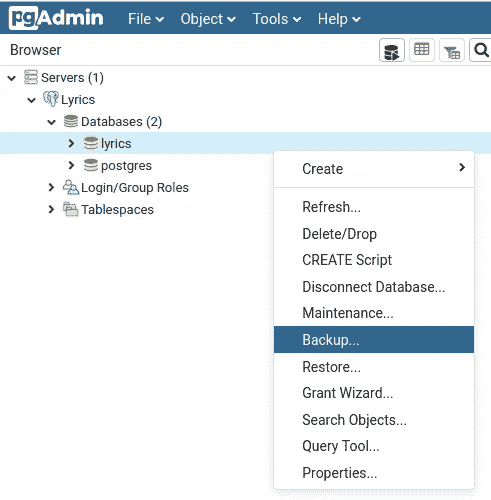

# 初级到高级——Python 中的 Web 抓取指南:在 Heroku 上使用 Flask 和 Postgres 部署 Python Web 应用程序。

> 原文：<https://medium.com/analytics-vidhya/beginner-to-advance-web-scraping-guide-in-python-deploy-a-python-web-app-using-flask-and-a0e3cc8ce9f6?source=collection_archive---------12----------------------->


在之前的教程中，我们了解了:

*   异步编程
*   使用头池和代理轮流请求。
*   网页抓取
*   使用 Flask 和 Postgresql 的歌词 RESTful API。

但在这最后的教程中，我们将使用 Heroku 部署应用程序并测试我们的 API。

# 关于 Heroku

Heroku 是首批云平台即服务(PaaS)之一，支持多种语言——Ruby、Java、Node.js、Scala、Clojure、Python、PHP 和 Go。

我们需要做的第一件事是定义我们的应用程序使用哪些库。这样，Heroku 就知道为我们提供哪些，就像我们在开发应用程序时如何在本地安装它们一样。

## 设置 Heroku

*   前往 [Heroku 注册](https://signup.heroku.com/)，通过验证您的 Gmail 帐户创建一个免费帐户。
*   [登录](https://id.heroku.com/login)您的账户

## 系统设置

1.  首先你需要为你的操作系统安装 [Git](https://git-scm.com/downloads) 。Git 允许并鼓励您拥有多个完全相互独立的本地分支。
2.  转到[本页](https://devcenter.heroku.com/articles/heroku-cli)并为您的操作系统安装 Heroku CLI。
3.  要在 Ubuntu 上安装 Heroku CLI，您可以[遵循以下步骤](https://tecrobust.com/insall-heroku-platform-on-linux-ubuntu/)。
4.  如果安装正确，您将能够在终端中运行命令:

```
git --version && heroku --version
```

## 格尼科恩

Gunicorn“绿色独角兽”是一个 Python Web 服务器网关接口 HTTP 服务器。它是一个 fork 之前的工人模型，移植自 Ruby 的 Unicorn 项目。Gunicorn 服务器广泛兼容许多 web 框架，实现简单，占用服务器资源少，速度相当快。
要使用 pip 安装 Gunicorn，请在终端中运行该命令

```
pip install gunicorn
```

## 登录 Heroku

要登录 Heroku CLI，您首先需要在终端中运行登录命令，这将带您进入浏览器中的登录页面:

```
heroku login
```

## 创建应用程序

要在 Heroku 上创建 app 和 PostgreSql，您需要运行以下命令。

```
heroku create <appname> 
heroku addons:create heroku-postgresql:hobby-dev --app <appname>
```

## 去找 URI

要在 heroku 上获得 URI 的 Postgresql 的详细信息

```
heroku config --app appname
# Add details to your app production file
```

## 配置文件

您需要将 3 个文件添加到您的基本目录，这将有助于 Heroku 部署您的应用程序:

1.  Procfile — Procfile 告诉 Heroku 应该运行什么命令(没有任何扩展名)
2.  requirements.txt —要安装的库及其支持的版本。
3.  runtime.txt 要使用的 Python 版本。

## 创建 Procfile

```
touch Procfile
# Add this
web: gunicorn app:app
```

## 创建需求. txt

```
pip freeze > requirements.txt
```

## 创建 runtime.txt

```
touch runtime.txt
# Add this
python-<your python Version>
```

## 使用 Git 部署

```
git init
git add . && git commit -m 'Deploy'
heroku git:remote -a <appname>
git push heroku master
```

# 上传数据库

恭喜你……！！！！！！你已经成功地用 Postgre 创建了你的第一个 flask 应用程序，但是你仍然需要将你在本地 Postgre 上传的数据上传到 Heroku。



*   创建数据集的备份
*   用格式“Plain”填充所需的 Name.sql
*   在“高级设置”中的“查询”下，将“使用插入命令”设置为 True。
*   一旦您成功地将数据库导出为 SQL 格式，您就可以将这些数据导入 Heroku PostgreSQL。
*   一旦执行，它开始向您的应用程序插入行(Heroku 限制- 10，000 行)

```
heroku pg:psql --app APP_NAME < SQL_FILE_NAME.sql
```

要运行网站，您可以检查网站或运行命令:

```
heroku open --app APP_NAME
```

> **您已经成功抓取歌词，构建 App 并部署在 Heroku 上。**
> 
> **干得好…！！！**

# 以前的教程。

## 教程 1 —简介

在[之前的教程](/@kaus.pathak_30409/beginner-to-advance-web-scraping-guide-in-python-799ffd367067)中，我们了解了网页抓取的基本概念，并创建了一个简单的函数，使用 requests 和 BeautifulSoup 从页面中提取歌词。

## 教程 2 —使用 Python 中的头池和代理循环请求。

为了创建一个更大的项目，可以从互联网上删除成千上万的页面，你需要一个更清晰的工作环境，使用面向对象和继承的概念。你还需要有更详细的关于头文件池和代理池的知识来保持对服务器的匿名，我们已经在本教程的第二部分介绍过了。

## 教程 3 —工作环境和异步 I/O 编程

我们将进行异步 I/O 编程来提高你的报废速度，这将在本教程的第三部分中介绍。

## 教程 4 —自动化站点抓取

有了之前教程中学习的所有概念，我们将在本教程的第四部分中创建实际的自动抓取器来下载和保存网页上的歌词。

## 教程 5 — API 访问

为了方便地从互联网上访问歌词，我们将创建 Flask API 和前端来访问我们在本教程第五部分中废弃的歌词。

## 教程 6 —在 Heroku 上托管我们的 Flask 服务器

为了方便歌词的访问，我们将在 Heroku 上托管我们的 Flask 服务器。


# 最后的话

感谢你阅读这篇文章，我们希望听到你的反馈。请随意评论任何问题。

如果您喜欢，请为我们鼓掌:)。关注我们，获取我们的最新文章。