# 初学者指南:R 中的探索性数据分析

> 原文：<https://medium.com/analytics-vidhya/beginners-guide-exploratory-data-analysis-in-r-47dac64d95fe?source=collection_archive---------2----------------------->

当我开始学习数据科学时，我阅读了多篇强调理解数据重要性的文章。对我来说没有意义。我天真地认为，我们被交给数据，我们通过算法推动这些数据，然后交出结果。

是的，我不是最聪明的。但我已经吸取了教训，今天我想分享我从那些试图弄清楚我的数据的不眠之夜中挑选出来的东西。我将使用 **R** 语言来演示 EDA。

> 为什么是 R？
> 
> 因为它从一开始就考虑到了数据科学。很容易拿起来弄脏手又没有陡峭的学习曲线，*咳* [**汇编**](https://jaxenter.com/most-difficult-programming-languages-152590.html#:~:text=The%20tough%20cookies-,POLL%20RESULTS%3A%20Assembly%20is%20officially%20crowned%20the,with%20the%20steepest%20learning%20curve)***咳*。**

**在我开始之前，这篇文章是给被归类为“数据科学婴儿”的人的指南。我相信 Python 和 R 都是伟大的语言，最重要的是你从数据中讲述的故事。**

## **为什么是这个数据集？**

**嗯，我认为大多数有抱负的数据科学家都会从这里开始。这个数据集是一个很好的起点，可以启动你的引擎，开始像数据科学家一样思考，同时作为一个新手友好地帮助你轻松完成这个练习。**

# **我们如何处理这些数据？**

*   **这个变量有助于预测房价吗？**
*   **这些变量之间有关联吗？**
*   **单变量分析**
*   **多变量分析**
*   **一点数据清理**
*   **以证明我们选择的变量的相关性来结束。**

**祝您掌握数据科学之旅好运！**

**现在，我们从导入包开始，我将解释为什么这些包会出现在这个过程中…**

```
easypackages::libraries("dplyr", "ggplot2", "tidyr", "corrplot", "corrr", "magrittr",   "e1071","ggplot2","RColorBrewer", "viridis")
options(scipen = 5)      #To force R to not use scientfic notationdataset <- read.csv("train.csv")
str(dataset)
```

**在上面的代码片段中，我们使用 scipen 来避免科学记数法。我们导入数据并使用 str()函数来获取数据集提供的变量和相应数据类型的选择要点。**

**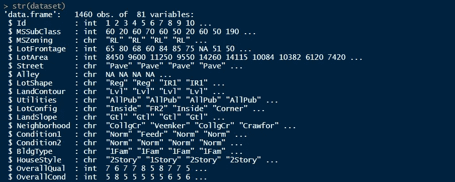**

**可变销售价格是我们所有假设和假设的因变量。所以先多了解一下这个变量是有好处的。为此，我们将使用直方图并获取频率分布，以直观地了解变量。您会注意到还有另一个函数，即 summary()，它本质上用于相同的目的，但是没有任何形式的可视化。有了经验，你将能够更好地理解和解释这种形式的信息。**

```
ggplot(dataset, aes(x=SalePrice)) + 
  theme_bw()+
  geom_histogram(aes(y=..density..),color = 'black', fill = 'white', binwidth = 50000)+
  geom_density(alpha=.2, fill='blue') +
  labs(title = "Sales Price Density", x="Price", y="Density")summary(dataset$SalePrice)
```

**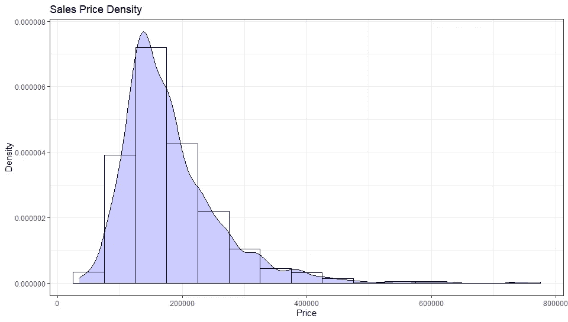******

**所以很明显，你会发现许多房产价格在 20 万美元以下。有超过 600，000 美元的财产，我们可以试着理解为什么会这样，是什么使这些房子如此昂贵。这可能是另一个有趣的练习…**

## **在决定你想买的房子的价格时，你认为哪些变量最有影响？**

**现在我们对销售价格有了一个基本的概念，我们将试着用一些其他的变量来形象化这个变量。请注意，了解您正在处理的变量的*类型*非常重要。我想让你参考这篇精彩的文章，它更详细地介绍了这个话题[这里](https://towardsdatascience.com/data-types-in-statistics-347e152e8bee)。**

**接下来，我们将处理两种变量。**

*   **分类变量**
*   **数字变量**

**回顾我们的数据集，我们可以辨别这些变量。首先，我们对数据集进行粗略的梳理，并猜测挑选一些最有可能相关的变量。请注意，这些只是假设，我们正在研究这个数据集以了解这一点。我选择的变量是:**

*   **格里瓦雷亚**
*   **总计 BsmtSF**
*   **年造的**
*   **总体平等**

**那么，哪些是定量的，哪些是定性的呢？如果你仔细观察*总体均衡*和*年度构建*变量，你会注意到这些变量永远不可能是量化的。年份和质量从本质上来说都是绝对的，但是 R 并不知道。为此，我们使用 *factor()* 函数将数值变量转换为分类变量，这样 R 就可以更好地解释数据。**

```
dataset$YearBuilt <- factor(dataset$YearBuilt)
dataset$OverallQual <- factor(dataset$OverallQual)
```

**现在，当我们在数据集上运行 *str()* 时，我们将看到 YearBuilt 和 OverallQual 都是因子变量。**

**我们现在可以开始绘制变量了。**

# **关系(不)如此复杂**

**将*年造*作为我们的第一个候选，我们开始绘图。**

```
ggplot(dataset, aes(y=SalePrice, x=YearBuilt, group=YearBuilt, fill=YearBuilt)) +
  theme_bw()+
  geom_boxplot(outlier.colour="red", outlier.shape=8, outlier.size=1)+
  theme(legend.position="none")+
  scale_fill_viridis(discrete = TRUE) +
  theme(axis.text.x = element_text(angle = 90))+
  labs(title = "Year Built vs. Sale Price", x="Year", y="Price")
```

**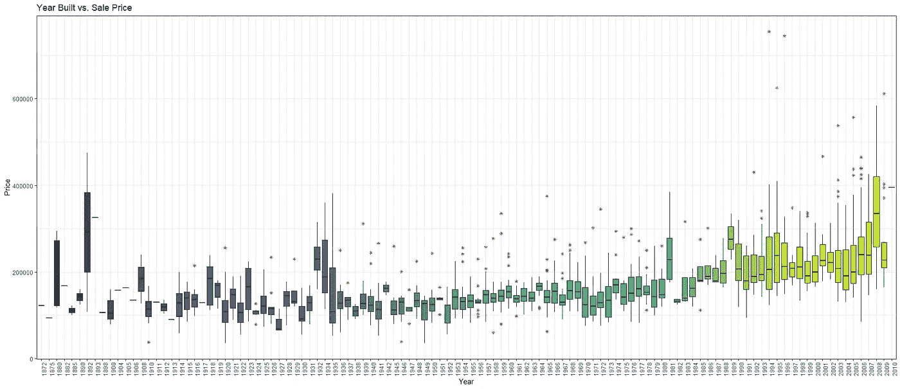**

**旧房子比新盖的房子卖得便宜。至于*整体质量*，**

```
ggplot(dataset, aes(y=SalePrice, x=OverallQual, group=OverallQual,fill=OverallQual)) +
  geom_boxplot(alpha=0.3)+
  theme(legend.position="none")+
  scale_fill_viridis(discrete = TRUE, option="B") +
  labs(title = "Overall Quality vs. Sale Price", x="Quality", y="Price")
```

**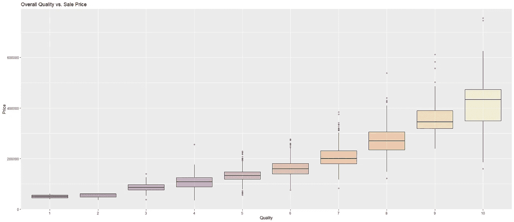**

**这是意料之中的，因为你自然会为质量更好的房子付更多的钱。你不会想让你的脚踩破地板吧？既然定性变量已经被排除了，我们可以把注意力集中在数值变量上。我们这里的第一位候选人是*格里瓦里亚*。**

```
ggplot(dataset, aes(x=SalePrice, y=GrLivArea)) +
  theme_bw()+
  geom_point(colour="Blue", alpha=0.3)+
  theme(legend.position='none')+
  labs(title = "General Living Area vs. Sale Price", x="Price", y="Area")
```

**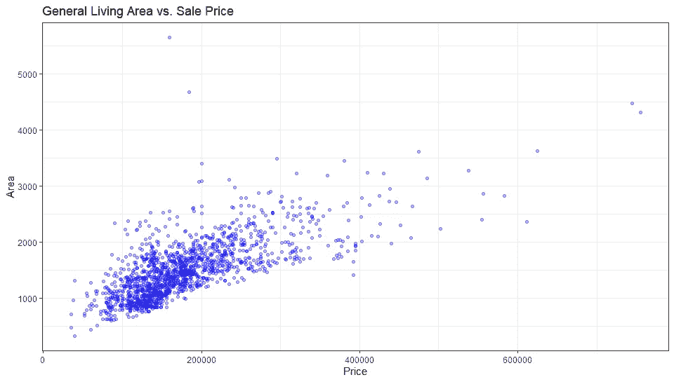**

**如果我说我没想到会这样，那我是在撒谎。顾客的第一反应是查看房间的面积。而且我认为 *TotalBsmtASF* 的结果也是一样的。让我想想…**

```
ggplot(dataset, aes(x=SalePrice, y=TotalBsmtSF)) +
  theme_bw()+
  geom_point(colour="Blue", alpha=0.3)+
  theme(legend.position='none')+
  labs(title = "Total Basement Area vs. Sale Price", x="Price", y="Area")
```

**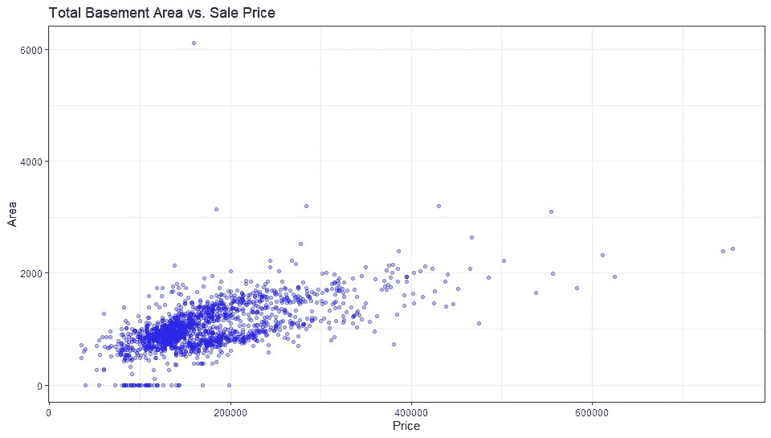**

# **那么，对于我们精心挑选的变量，我们能说些什么呢？**

***GrLivArea* 和 *TotalBsmtSF* 都与*销售价格*成线性关系。至于分类变量，我们可以有把握地说，我们选择的两个变量与*销售价格*有信心相关。**

**但这些并不是唯一的变量，还有比看上去更复杂的东西。因此，为了处理这些变量，我们将从相关矩阵中获得帮助，看看每个变量是如何相关的，以获得更好的洞察力。**

# **相关图的时间**

**那么什么是相关性呢？**

> **相关性是衡量两个变量相互关系的尺度。有正相关也有负相关。**

**如果你想阅读更多关于相关性的内容，那么看看这篇[文章](/@SilentFlame/pearson-correlation-a-mathematical-understanding-c9aa686113cb)。让我们创建一个基本的相关矩阵。**

```
M <- cor(dataset)
M <- dataset %>% mutate_if(is.character, as.factor)
M <- M %>% mutate_if(is.factor, as.numeric)
M <- cor(M)mat1 <- data.matrix(M)
print(M)#plotting the correlation matrix
corrplot(M, method = "color", tl.col = 'black', is.corr=FALSE)
```

**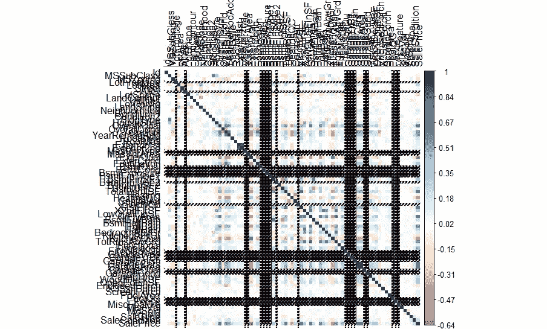**

## **请不要关闭此选项卡。我保证会好起来的。**

**但是不要担心，因为现在我们要弄脏我们的手，让这个情节可以解释和整洁。**

```
M[lower.tri(M,diag=TRUE)] <- NA                   #remove coeff - 1 and duplicates
M[M == 1] <- NAM <- as.data.frame(as.table(M))                   #turn into a 3-column table
M <- na.omit(M)                                   #remove the NA values from aboveM <- subset(M, abs(Freq) > 0.5)              #select significant values, in this case, 0.5
M <- M[order(-abs(M$Freq)),]                                  #sort by highest correlationmtx_corr <- reshape2::acast(M, Var1~Var2, value.var="Freq")    #turn M back into matrix 
corrplot(mtx_corr, is.corr=TRUE, tl.col="black", na.label=" ") #plot correlations visually
```

**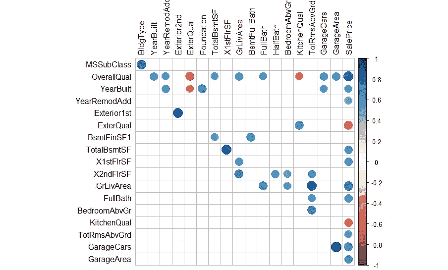**

## **现在，这看起来更好和可读。**

**查看我们的曲线图，我们可以看到与*销售价格*高度相关的许多其他变量。我们选择这些变量，然后通过只包含这些选择变量来创建一个新的数据帧。**

**既然我们已经有了可疑变量，我们可以使用一个配对图来可视化所有这些相互关联的变量。**

```
newData <- data.frame(dataset$SalePrice, dataset$TotalBsmtSF, 
                      dataset$GrLivArea, dataset$OverallQual, 
                      dataset$YearBuilt, dataset$FullBath, 
                      dataset$GarageCars )pairs(newData[1:7], 
      col="blue",
      main = "Pairplot of our new set of variables"         
)
```

**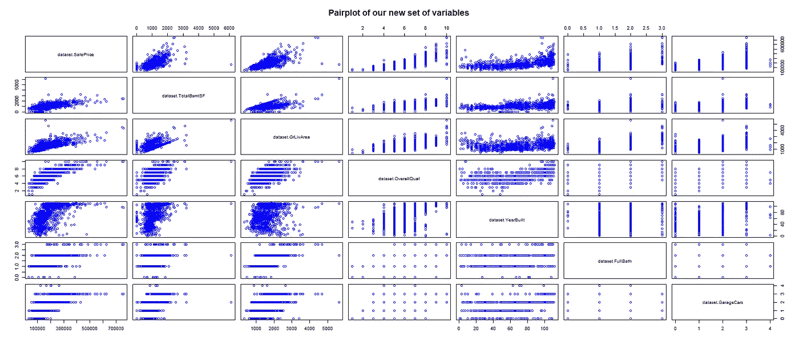**

## **当你在做的时候，清理你的数据**

**我们应该去掉一些无用的变量，因为我们确信这些变量没有任何用处。但是不要对原始数据集应用更改。总是创建一个新的副本，以防你删除一些你不应该有的东西。**

```
clean_data <- dataset[,!grepl("^Bsmt",names(dataset))]      #remove BSMTx variablesdrops <- c("clean_data$PoolQC", "clean_data$PoolArea", 
               "clean_data$FullBath", "clean_data$HalfBath")

clean_data <- clean_data[ , !(names(clean_data) %in% drops)]#The variables in 'drops'are removed.
```

# **单变量分析**

**回头看看我们的老朋友，我们看到一些极其昂贵的房子。我们没有深究为什么会这样。尽管我们知道这些极其昂贵的房子并不遵循其他房价遵循的模式。如此高的价格可能是合理的，但为了我们的分析，我们不得不放弃它们。这种记录被称为异常值。**

> **理解离群者的简单方法是把他们想象成你团队中的一个(或多个)喜欢用勺子而不是叉子吃面条的人。**

**因此，首先，我们捕捉这些异常值，然后根据需要从数据集中删除它们。先说*抓*部分。**

```
#Univariate Analysisclean_data$price_norm <- scale(clean_data$SalePrice)    #normalizing the price variablesummary(clean_data$price_norm)plot1 <- ggplot(clean_data, aes(x=factor(1), y=price_norm)) +
  theme_bw()+
  geom_boxplot(width = 0.4, fill = "blue", alpha = 0.2)+
  geom_jitter( 
              width = 0.1, size = 1, aes(colour ="red"))+
  geom_hline(yintercept=6.5, linetype="dashed", color = "red")+
  theme(legend.position='none')+
  labs(title = "Hunt for Outliers", x=NULL, y="Normalized Price")plot2 <- ggplot(clean_data, aes(x=price_norm)) + 
  theme_bw()+
  geom_histogram(color = 'black', fill = 'blue', alpha = 0.2)+
  geom_vline(xintercept=6.5, linetype="dashed", color = "red")+
  geom_density(aes(y=0.4*..count..), colour="red", adjust=4) +
  labs(title = "", x="Price", y="Count")grid.arrange(plot1, plot2, ncol=2)
```

**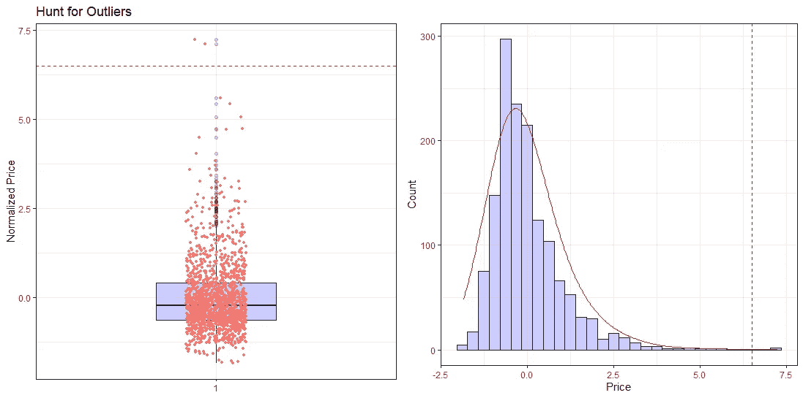**

**我在这里做的第一件事是标准化销售价格，这样它更容易解释，也更容易找出这些异常值。标准化销售价格的*平均值= 0* 和*标准差= 1* 。对这个新的可变 price_norm 运行一个快速的 *'summary()'* 给我们这个…**

**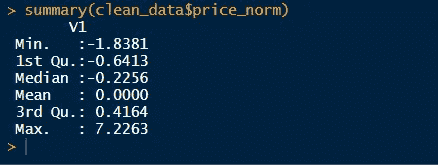**

**所以现在我们可以肯定这里存在异常值。但是我们真的需要摆脱它们吗？从之前的散点图中，我们可以说这些异常值仍然跟随趋势，还不需要清除。决定如何处理异常值有时会非常复杂。你可以在这里阅读更多关于离群值的内容[。](https://www.theanalysisfactor.com/outliers-to-drop-or-not-to-drop/)**

# **双变量分析**

**双变量分析是对两个变量(属性)的同时分析。它探讨了两个变量之间关系的概念，是否存在关联以及这种关联的强度，或者两个变量之间是否存在差异以及这些差异的意义。双变量分析有三种类型。**

*   **数字&数字**
*   **分类和分类**
*   **数字和分类**

**我们将在这里分析的第一组变量是*销售价格*和*格里瓦里亚*。两个变量都是数字，所以使用散点图是一个好主意！**

```
ggplot(clean_data, aes(y=SalePrice, x=GrLivArea)) +
  theme_bw()+
  geom_point(aes(color = SalePrice), alpha=1)+
  scale_color_gradientn(colors = c("#00AFBB", "#E7B800", "#FC4E07")) +
  labs(title = "General Living Area vs. Sale Price", y="Price", x="Area")
```

**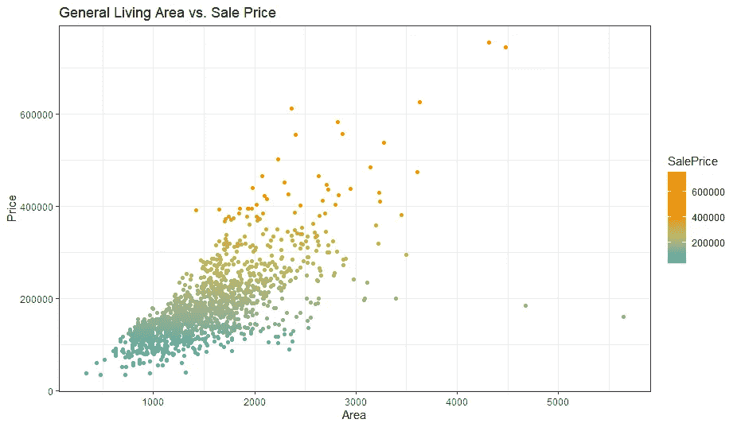**

**很快，我们注意到有两栋房子不遵循线性趋势，影响了我们的结果和假设。这些是我们的异常值。由于我们未来的结果容易受到这些异常值的负面影响，我们将删除它们。**

```
clean_data <- clean_data[!(clean_data$GrLivArea > 4000),]   #remove outliersggplot(clean_data, aes(y=SalePrice, x=GrLivArea)) +
  theme_bw()+
  geom_point(aes(color = SalePrice), alpha=1)+
  scale_color_gradientn(colors = c("#00AFBB", "#E7B800", "#FC4E07")) +
  labs(title = "General Living Area vs. Sale Price [Outlier Removed]", y="Price", x="Area")
```

**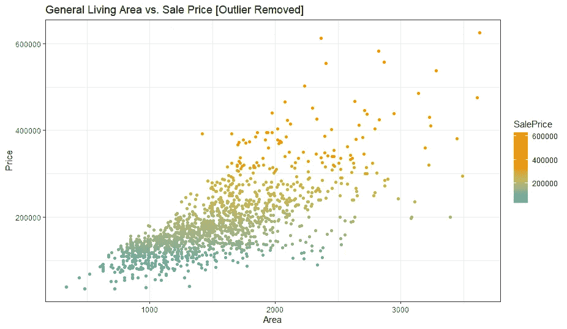**

**异常值被移除，并且 x 轴标度被调整。我们将分析的下一组变量是*销售价格*和*总销售价格*。**

```
ggplot(clean_data, aes(y=SalePrice, x=TotalBsmtSF)) +
  theme_bw()+
  geom_point(aes(color = SalePrice), alpha=1)+
  scale_color_gradientn(colors = c("#00AFBB", "#E7B800", "#FC4E07")) +
  labs(title = "Total Basement Area vs. Sale Price", y="Price", x="Basement Area")
```

**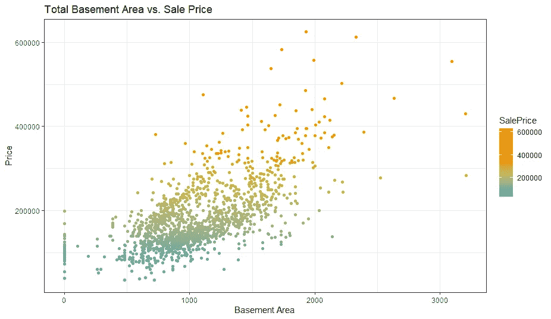**

**这里的观察结果符合我们的假设，不需要清除。如果没坏，就别修。我确实提到过，在处理异常值时，非常小心是很重要的。你不能每次都把它们拿掉。**

# **是时候深入挖掘一下了**

**我们围绕“销售价格”和其他重要变量建立了大量的可视化基础，但如果我说这还不够呢？不是因为这个坑还有更多的东西可以挖出来。我相信人们应该记住数据分析的四个骑士。**

*   **正态性:当我们谈论正态性时，我们的意思是数据应该看起来像正态分布。这很重要，因为许多统计测试都依赖于此(例如，t 统计)。首先，我们将只使用一个变量“销售价格”来检查正态性(通常最好从一个变量开始)。虽然人们不应该假设一元正态性将证明多元正态性的存在(这是相对更受欢迎的)，但它是有帮助的。另一件要注意的事情是，在较大的样本中，即超过 200 个样本，正态性不是这样的问题。但是，如果我们解决了常态，很多问题是可以避免的。这是我们正常工作的原因之一。**
*   ****同方差**:同方差指的是“*假设一个或多个因变量在预测变量*的范围内表现出相同的方差水平。如果我们希望误差项在自变量的所有值上都是相同的，那么就要检查同质性。**
*   ****线性**:如果你想评估数据的线性，我认为散点图应该是首选。散点图可以快速显示线性关系(如果存在的话)。在模式不是线性的情况下，探索数据转换是值得的。然而，我们不需要再次检查这一点，因为我们以前的图已经证明了线性关系的存在。**
*   ****没有相关错误**:在处理错误时，如果你注意到一个错误与另一个错误相关的模式，那么这些变量之间就有关系。例如，在某种情况下，一个正误差会产生一个负误差，这就意味着误差之间的关系。对于时间敏感的数据，这种现象更加明显。如果你发现自己在处理这样的数据，那么试着添加一个变量来解释你的观察。**

# **我认为我们应该开始做而不是说**

**从*开始销售价格*。请注意我们变量的总体分布。**

```
plot3 <- ggplot(clean_data, aes(x=SalePrice)) + 
  theme_bw()+
  geom_density(fill="#69b3a2", color="#e9ecef", alpha=0.8)+
  geom_density(color="black", alpha=1, adjust = 5, lwd=1.2)+
  labs(title = "Sale Price Density", x="Price", y="Density")plot4 <- ggplot(clean_data, aes(sample=SalePrice))+
  theme_bw()+
  stat_qq(color="#69b3a2")+
  stat_qq_line(color="black",lwd=1, lty=2)+
  labs(title = "Probability Plot for SalePrice")grid.arrange(plot3, plot4, ncol=2)
```

**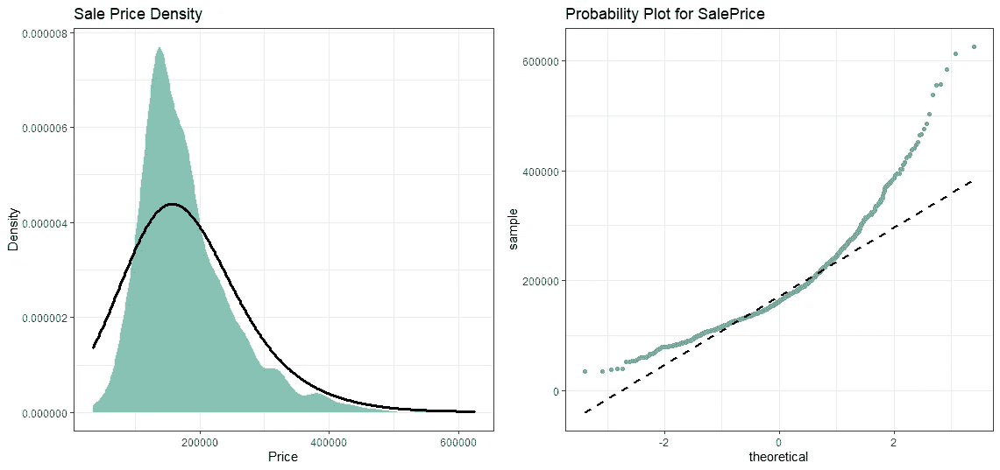**

***SalePrice* 不正常！但是我们还有另一个锦囊妙计。日志转换。现在，关于日志转换的一个伟大的事情是，它可以处理扭曲的数据，并使其正常。所以现在是时候对我们的变量应用对数变换了。**

```
clean_data$log_price <- log(clean_data$SalePrice)plot5 <- ggplot(clean_data, aes(x=log_price)) + 
  theme_bw()+
  geom_density(fill="#69b3a2", color="#e9ecef", alpha=0.8)+
  geom_density(color="black", alpha=1, adjust = 5, lwd=1)+
  labs(title = "Sale Price Density [Log]", x="Price", y="Density")plot6 <- ggplot(clean_data, aes(sample=log_price))+
  theme_bw()+
  stat_qq(color="#69b3a2")+
  stat_qq_line(color="black",lwd=1, lty=2)+
  labs(title = "Probability Plot for SalePrice [Log]")grid.arrange(plot5, plot6, ncol=2)
```

**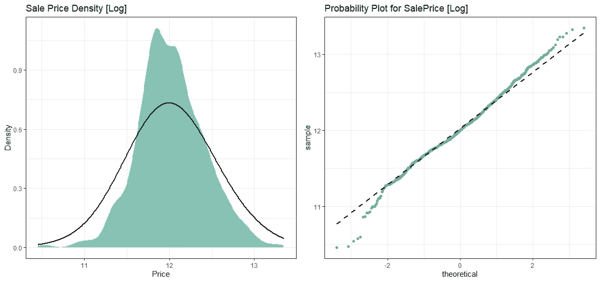**

# **现在用剩下的变量重复这个过程。**

## **我们先从格里瓦里亚开始**

**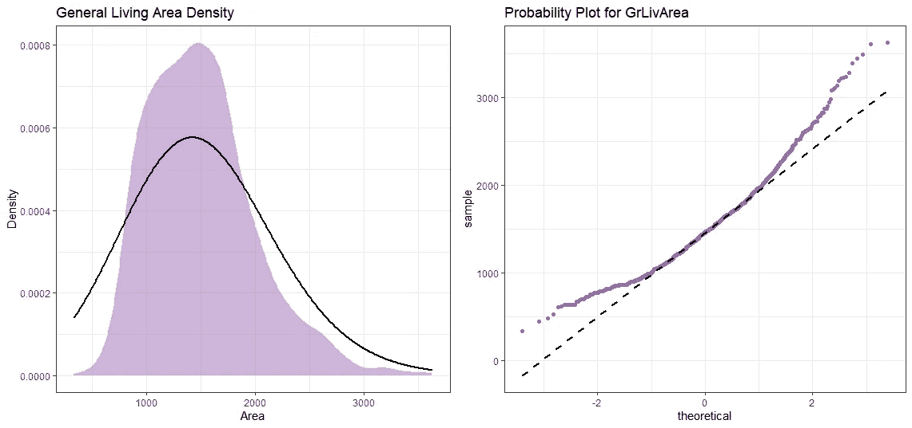**

## **对数转换后**

**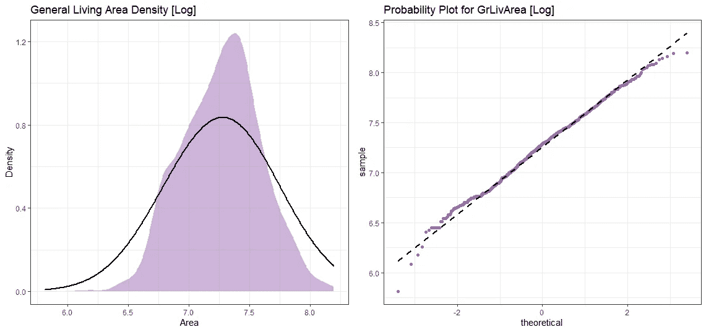**

## **现在为 TotalBsmtSF**

**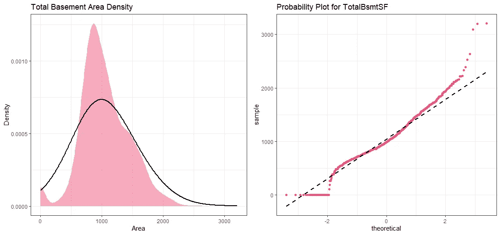**

# **坚持住！我们这里有一些有趣的东西。**

**看起来 *TotalBsmtSF* 有一些零。这对于对数转换来说不是好兆头。我们必须做点什么。为了在这里应用对数转换，我们将创建一个变量，它可以获得有无基底的效果(二进制变量)。然后，我们将对所有非零观测值进行对数转换，忽略那些零值。这样我们就可以转换数据，而不会失去有无基底的影响。**

```
#The step where I create a new variable to dictate which row to transform and which to ignore
clean_data <- transform(clean_data, cat_bsmt = ifelse(TotalBsmtSF>0, 1, 0))#Now we can do log transformation
clean_data$totalbsmt_log <- log(clean_data$TotalBsmtSF)clean_data<-transform(clean_data,totalbsmt_log = ifelse(cat_bsmt == 1, log(TotalBsmtSF), 0 ))plot13 <- ggplot(clean_data, aes(x=totalbsmt_log)) + 
  theme_bw()+
  geom_density(fill="#ed557e", color="#e9ecef", alpha=0.5)+
  geom_density(color="black", alpha=1, adjust = 5, lwd=1)+
  labs(title = "Total Basement Area Density [transformed]", x="Area", y="Density")plot14 <- ggplot(clean_data, aes(sample=totalbsmt_log))+
  theme_bw()+
  stat_qq(color="#ed557e")+
  stat_qq_line(color="black",lwd=1, lty=2)+
  labs(title = "Probability Plot for TotalBsmtSF [transformed]")grid.arrange(plot13, plot14, ncol=2)
```

**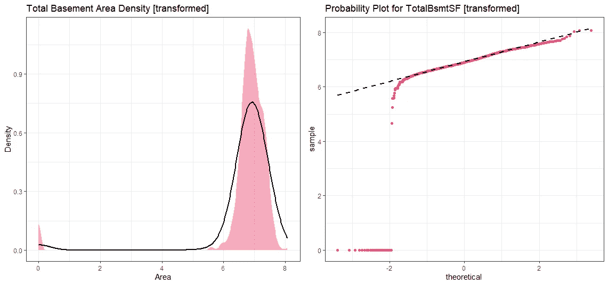**

**我们仍然可以在图表上看到被忽略的数据点，但是我可以相信你，对吗？**

# **等等，我的拼写正确吗？**

**寻找同方差的最好方法是使用图表来尝试和可视化变量。散点图应该可以完成这项工作。注意绘制时数据形成的形状。它可能看起来像一个圆锥形的等距离差，也可能看起来像一个菱形，其中大量数据点分布在中心周围。**

**从“SalePrice”和“GrLivArea”开始…**

```
ggplot(clean_data, aes(x=grlive_log, y=log_price)) +
  theme_bw()+
  geom_point(colour="#e34262", alpha=0.3)+
  theme(legend.position='none')+
  labs(title = "Homoscedasticity : Living Area vs. Sale Price ", x="Area [Log]", y="Price [Log]")
```

**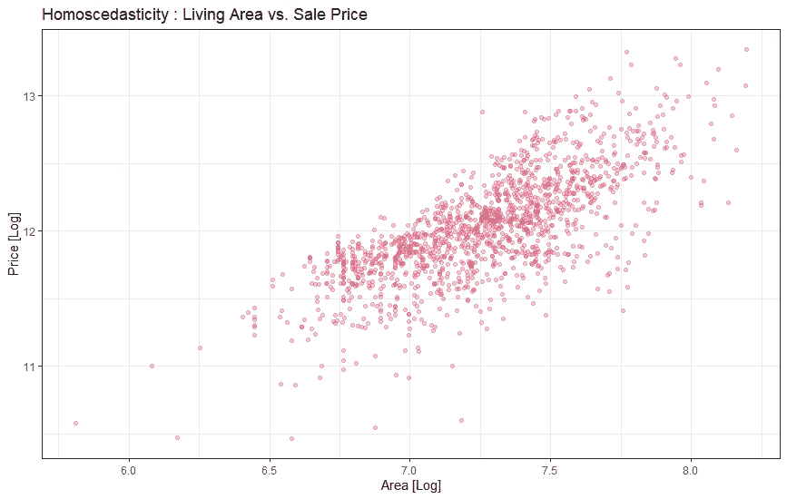**

**我们之前绘制了“SalePrice”和“GrLivArea ”,但为什么现在的图有所不同？没错，就是因为 **log 改造。****

**如果我们回到之前绘制的显示相同变量的图表，很明显数据在绘制时呈圆锥形。但是经过对数变换后，不再是圆锥形了。这里我们只用一个变换就解决了同方差问题。很强大吧？**

**现在让我们用“TotalBsmtSF”来检查“SalePrice”。**

```
ggplot(clean_data, aes(x=totalbsmt_log, y=log_price)) +
  theme_bw()+
  geom_point(colour="#e34262", alpha=0.3)+
  theme(legend.position='none')+
  labs(title = " Homoscedasticity : Total Basement Area vs. Sale Price", x="Area [Log]", y="Price [Log]")
```

**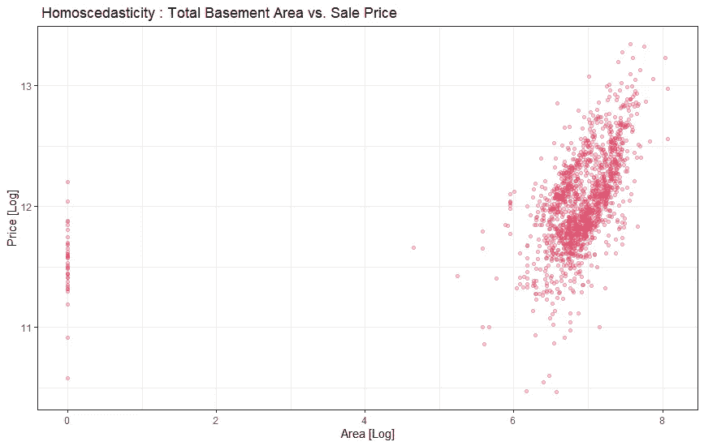**

**请帮我照顾好 0:)**

## **就这样，我们的分析到此结束。现在剩下的就是得到虚拟变量……剩下的你都知道了。:)**

> **多亏了佩德罗·马塞利诺，这项工作才成为可能。我在 Python 里找到了他对这个数据集的分析，想用 r 重写，给他点爱！**