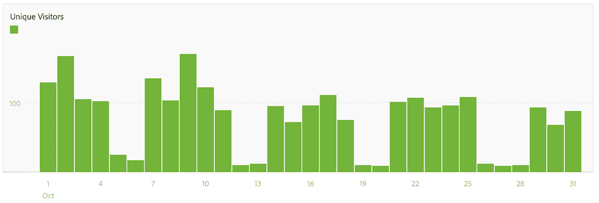

# 网络流量非技术性时间序列分析初学者指南

> 原文：<https://medium.com/analytics-vidhya/beginners-guide-to-a-non-technical-time-series-analysis-for-web-traffic-b9bcf15fb54e?source=collection_archive---------15----------------------->

您是否曾经看着图表进行分析，并想知道这组信息如何对您和您的组织有用？你的老板有没有要求你更加数据驱动，用数据支持你的主张？你有没有在看大数据的时候感到失落？嗯，是的，有时我仍然有这种感觉。在一项调查中，99%的受访者试图向数据驱动的文化转变，但只有三分之一的受访者真正成功，现实情况是，需要付出更多努力来弥合更多数据素养方面的差距。

我在不同行业的一些跨国公司工作过，分析过他们的网站，了解过他们的网站流量，从中我得到了一些可以普遍应用于大多数网站的经验。如果你刚刚开始从事网络分析，这将对你有所帮助。

# **什么是时间序列分析？**

[时间序列分析](https://study.com/academy/lesson/time-series-analysis-its-applications.html)是一段时间内特定间隔的数据收集，目的是识别趋势、周期和季节变化，以帮助预测未来事件。该数据是历史数据，有 3 个主要使用案例:

1.描述性分析(Descriptive Analytics)——试图弄清楚发生了什么

2.**预测分析** —试图根据过去观察到的情况预测未来会发生什么

3.**规定性分析** —试图利用数据来帮助导航未来事件(例如欺诈检测)。在本指南中，我们将重点关注 1 & 2(描述性分析和预测性分析)。

当将描述性分析和预测性分析应用于网站流量时，它可以带来有助于优化 web 性能、改进关键性能指标和潜在识别可疑 web 活动的见解。

许多人倾向于加入酷的机器学习项目的行列，处理预测和说明方面，偶尔省略描述性分析。但实际上，描述性分析可能是任何分析项目中最关键的第一步，即了解过去发生了什么。

进行描述性分析时面临的挑战之一是不知道从哪里开始。因此，我将分享一个简单的方法，你可以用它来启动你发现过去发生了什么的旅程。

## **medium.com 2019 年预计网络流量**

资料来源:Neilpatel.com

# **宏到微的方法**

首先，通过查看一年中几个月的网站总流量，它给出了大部分网站流量的宏观视图。从宏观角度查看之后，您可以使用指标来帮助深入(微观角度)到特定的时间粒度或网页，以便更清楚地了解可能有助于您可能想到的假设的不同组件。通过从宏观到微观，它可以帮助您识别对您的 web 流量有最大影响的因素/活动。这让你在发现真知灼见时更加有效，让你的时间和努力获得更好的回报。

## **宏观视图**

看一个网站的整体流量的时候，主要有两点要问。

首先，**的网络流量是否符合组织的战略？**如果组织正在扩张并采用收购策略，理想情况下，您会希望看到网站流量增加。这显示了网络流量与组织战略的一致性。

第二，**是否满足关键绩效指标(KPI)？**满足组织的网络流量 KPI 意味着该部门达到了目标，达到目标的人会得到好东西！

## 需要注意什么？

通过利用下面的 5 个指标，你将能够开始挑选开始分析的领域。这 5 个指标是-

1.  **流量无变化(一致)**
2.  **一次增加**
3.  **减少**
4.  **模式/趋势** —数据遵循一套规则或一系列增加/减少
5.  **峰值/异常** —突然的，通常是急剧的增加/减少

在本指南的上下文中(在接下来的几个可视化中)，我们将关注科技行业中一个组织(企业对企业)网站的网络流量。

# **时间粒度和可能的假设**

## 一年中的月份

一年中有几个月的独立访问者(2019)

在一年中几个月的时间粒度中，在比较不同年份时，有两种截然不同的趋势值得关注。它们是**季节性趋势**和**周期性趋势**。

**季节性趋势**是时间序列中的一个[特征，其中数据经历每个日历年重复出现的有规律且可预测的变化](https://www.investopedia.com/terms/s/seasonality.asp)，它可以简单到 12 月由于更多的人去度假而交通减少。

**另一方面，周期性趋势**类似于季节性趋势，除了它是周期性的，其间的周期不是恒定的。这方面的一个例子是技术进步的周期，以及产品中的不同技术如何使其更快或更慢地过时。

## **一个月中的天数**

一个月中有天的独立访问者(2019 年 10 月)

以一个月中的几天为时间粒度，有 3 种活动可能会影响网络流量。这三个是**活动**、**新闻**和**事件**。

**活动**可以以各种形式出现，并且通常在控制范围内或可扩展。它可以是线上或线下的(有时两者都有)，一个为你的网站带来流量的营销活动，甚至是一个让人们更频繁地参与内容的活动。根据活动目标的不同，它会相应地影响网络流量。记下正在进行的任何活动是一种好的做法，这样就可以正确地归因于各自的网络流量来衡量有效性(专业提示:实验在一周的不同时段举行活动&)。在上图中，在独立访客较少的日子(例如 12 & 13 Oct)开展在线互动活动是不明智的，因为与在较忙的日子(例如 2 & 9 Oct)开展互动活动相比，回报并不理想。

**新闻**是由媒体、组织或个人在任何渠道发布的可能直接或间接提及您的组织/个人/产品或服务的信息。发布的时间通常是不可控的，但公司可以通过新闻稿和禁运信息在一定程度上影响它，直到某些日期。一定要看看新闻，因为你可能会惊讶于网络流量的某些峰值是如何归因于他们的。

**事件**通常是计划好的，可以在各种渠道发生。它类似于营销活动，但通常是营销活动的子集，持续时间较短。在上面一个月中几天的 web 流量的可视化中，10 月 2 日发生了一个事件，导致 web 流量出现峰值。通过记录活动登录页面的流量，可以将其与类似的未来活动进行比较，以检查有效性(专业提示:实验在一周的不同天举行活动)。

我相信你已经注意到，每隔 5 天，网站流量就会有 2 天明显下降…你能猜到原因吗？(提示:查日历 2019 年 10 月！).

如果你喜欢弄清楚第一个问题，这里有另一个问题，需要更多的调查工作。你为什么认为 10 月 28 日的网络流量会进一步下降？(提示:查看 2019 年 10 月新加坡日历！)

了解为什么会出现某些高峰和低谷(专业提示:找出原因并尽可能复制/解决它们)将有助于运营规划，让您的组织更有效率！

## **一天中的小时数**

一天中数小时的独立访客(2019 年 10 月 2 日)

在一天中的几个小时的时间粒度中，你可以找到这 5 个影响网络流量的活动。这 5 项活动分别是**战役**、**事件**、**新闻**、**维护**、**可疑网页流量**。

**活动**可以持续数周，也可以持续一天中的几个小时。好的做法是记下活动进行的时间，对其进行归因并衡量其效果(专业提示:尝试在一天的不同时间举行活动)。

与营销活动类似，**事件**可能会在几天内发生，记下事件发生的时间也是一种很好的做法，以便对其进行归因并衡量其有效性。在上面的可视化图中，与前一天相比，在下午 2-4 点左右可以看到一个峰值(虚线趋势线)。这是因为 10 月 2 日有一个实际的活动，在此期间鼓励参与者访问该网站(提示:实验在一天的不同时间举行活动)。

**新闻**大多是不可控的，但知道消息来源并了解它如何影响您组织的网络流量仍然是件好事。通过检查一天中流量峰值出现的时间，您可以区分一个事件(您的组织不会在凌晨 4 点举行本地事件)和来自不同时区的外国新闻！

维护是可以计划的，或者你的网站可能只是关闭了(当我在办公室里大声喊出来的时候，我的软件开发同事的心总是漏跳一拍)。通常，您会在该时间段内看到流量急剧下降。这里的最佳实践是在流量最少的时间进行维护，并记录下所有维护，以便可以正确地确定流量下降的原因。在最坏的情况下，网站可能会在几天内多次崩溃/继续维护，这可能会严重影响你当月的网络流量 KPI。因此，记录它以便解释为什么没有达到 KPI 或目标变得更加重要。

**可疑的网络流量**可能会在特定时间出现网络流量高峰时出现。这可能是试图对您的网站进行分布式拒绝服务(DDoS)攻击。应对这些峰值进行调查，并在必要时向您的网络安全团队报告。

这个指南给了你一个想法，在分析你的网站性能时，从哪里开始寻找什么。有许多不可控的因素影响着你的网络流量，你可能无法准确地识别和归因于它们。因此，对这个行业、你的组织和它的过程有一个很好的理解将会给你一个优势来解决一些谜团，甚至预测它们(描述性和预测性分析)。我希望你已经从这本指南中学到了一些有用的东西。祝好运和愉快的调查！

如果你觉得这篇文章有趣或有帮助，请分享它，这样你也可以帮助其他人学习。