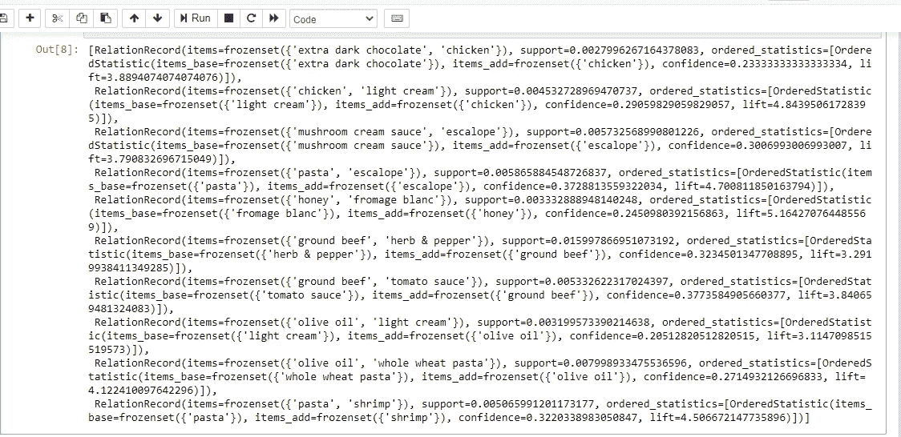
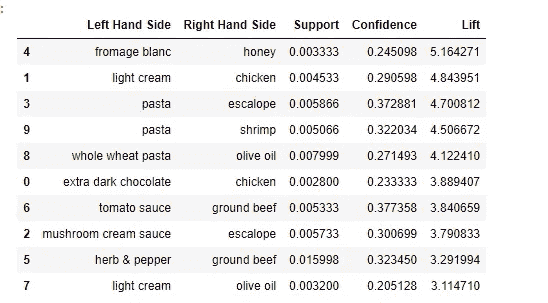

# 使用 Apriori 学习关联规则的初学者指南

> 原文：<https://medium.com/analytics-vidhya/beginners-guide-to-association-rule-learning-using-apriori-723c1bc02ae6?source=collection_archive---------18----------------------->

我们经常在亚马逊上浏览时遇到“购买了 A 商品的顾客也购买了这些”或“看过电影 A 的人也在网飞上看过这些”的情况。这种类型的购买或观看建议是通过所谓的关联规则学习来实现的。今天我要和大家分享一个非常著名的关联规则学习算法 **Apriori** 。这种算法以其更复杂的形式被世界各地的许多企业用来提供相关产品的折扣或建议人们购买相关产品。

照片由在 [Unsplash](https://unsplash.com?utm_source=medium&utm_medium=referral) 上拍摄

关联规则学习是一种机器学习方法，用于发现大型数据库中变量之间有趣和有用的关系。它旨在使用一些感兴趣的度量来识别在数据库中发现的强规则。

Apriori 算法有三个基本部分，这三个部分是其运行所必需的。让我们先了解一下这些基本理论。我将使用一些变量的随机值来简化这一部分。数据集将在本文的后面部分详细解释。

支持度:支持度是一个项目集出现在数据集中的频率的指示。让我们考虑产品 A。那么产品 A 的支持由下式给出

Supp(A) =(购买 A 的用户数)/(用户总数)

**信心:**信心是我们的规则被发现为真的频率的指示，即，如果我们通过说如果一个人购买产品 A，那么他也可能购买产品 B 来形成规则。因此，

Conf(A → B) =(同时购买 A **和** B 的用户数量)/(购买 A 的用户数量)

**升力:**升力是我们预测中的改进。它描述了规则的质量或相关性。

升力(A → B) =形态(A→B)/支持(B)

这里有一个简单的例子来描述这些术语。假设我们有一个 100 人的样本，其中 40 人购买了产品 a。然后，

Supp(A) = 40/100 = 2/5

在这 40 个人中，假设有 7 个人也买了 A，那么，

Conf(A → B) = 7/40

现在，假设 10%的人买了 B，不管他们是否买了 A。然后，

Supp(B) = 10/100 = 1/10 并且

升力(A→B)=(7/40)/(1/10)=(7/40)* 10 = 7/4 = 1.75

这就是我们需要知道的一切。现在，让我们直接进入它的 Python 实现。我们这里的目标是从数据集中确定哪些产品最常一起购买。

我们将从安装将要使用 Apriori 的库开始。通常，这个库不包含在标准的 Anaconda 发行版中。该库的名称为 [Apyori](https://pypi.org/project/apyori/) 。

然后我们将导入一些标准库，如 NumPy 和 pandas。

现在让我们导入数据集。这里要记住的一件非常重要的事情是，Apriori 只接受规则计算的字符串列表形式的输入。因此，要始终注意将每个元素转换成一个字符串，并将它们排列成一个字符串列表，其中每个列表都是一个特定用户进行的交易。数据集在[这里](https://drive.google.com/file/d/1iHPLs2m5o-b5yzRZEi7aVo5KPQkuNyDU/view?usp=sharing)可用。

数据集有 7501 行和 20 列。每一行代表客户在某一天进行的交易。每一列对应一种特定的产品。我们将把这个数据帧转换成一个 7501 列表的列表，其中每个列表代表一个事务。任何缺少的值将由字符串“nan”填充。

既然已经创建了事务列表，那么是时候训练我们的模型了。首先，我们导入先验。

我们将创建一个变量**规则**，它将包含先验函数的输出。

在这里，我按照以下逻辑设置了最小支持度:只有当一个产品一天至少出现三次时，算法才会考虑制定规则。一周有 7 天，因此，由于数据集有一周的观察，我们每周将有至少 21 次产品出现，因此对任何考虑中的产品的最小支持是(21/7501)。最小置信度是我用试错法设定的。经过几次尝试后，我将最小置信度设置为 0.2，因为较高的置信度会导致较少或没有规则。电梯的情况也是如此。

max_length 和 min_length 用于描述规则两侧产品总数的最大和最小总和。在这里，我只使用一种产品，对应于这种产品，算法将确定哪种产品与它一起被最频繁地购买。如果您希望在众多产品中确定购买的产品，请相应地设置最大和最小长度。

为了简洁明了地显示规则，我将把它打印成一个列表。

结果将以下列方式显示。

最终规则。图片由作者提供。

在以 RelationRecord 开始的每一行中，items_base 告诉我们最初购买的产品，items_add 提供与 items_base 一起购买的产品。从第二行可以明显看出，在获得数据集的超市中，每当人们购买淡奶油时，他们往往也会在篮子中加入鸡肉。这个观察值的升力是 4.84，这告诉我们这确实是一个强规则。

现在我将这些结果排列在一个整洁干净的数据框中。尝试和理解这段代码是可选的。

这将是我将所有内容放入数据框的最后一段代码，我还将显示前 10 条相关规则。

显示前 10 个相关规则的数据框，根据其各自的提升按降序排列。图片由作者提供。

现在这里有一些有趣的奖励。有人可能会问，那么，我们用这样一套规则做什么呢？作为超市经理，如果由我来决定，我会利用这些规则为经常一起购买的商品提供有趣的优惠，这将使我在市场竞争中获得优势，并吸引更多的顾客。

谢谢你坚持到最后。希望你喜欢它！！