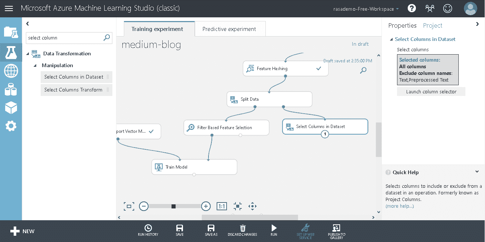

# 使用自定义数据集的 Azure Machine Learning Studio 初学者指南

> 原文：<https://medium.com/analytics-vidhya/beginners-guide-to-azure-machine-learning-studio-using-custom-dataset-c4015a75f98b?source=collection_archive---------13----------------------->

在我们谈论任何事情之前，我们从一个友好的例子开始怎么样？当您收到电子邮件时，提供商会自动将其放入收件箱/垃圾邮件文件夹。几乎所有时候，它们都被正确地放置在相应的文件夹中，而有时，甚至我们希望在收件箱中看到的邮件也被标记为垃圾邮件😕。但更重要的是，谁为我们做这项工作？🤔

***机器学习在这里是后台的魔术师*** *！*

机器学习通过对一组数据进行学习，使某项任务变得简单。邮件被正确放入收件箱的次数以及邮件未能完成工作的次数，取决于机器学习模型的精确度。

> *简单来说，机器学习使用一些算法来学习相似数据的不同示例，以执行特定领域的特定任务。*

当我开始学习机器学习时，[我发现谷歌的这个课程](https://developers.google.com/machine-learning/crash-course/)帮助我更好地理解概念。只要你有一台具有良好计算能力的机器，你就可以在任何地方练习机器学习。现在，一旦你有了一个运行良好的模型，接下来呢？你如何付诸行动？你需要把它部署在某个地方，对吗？有很多选项可供选择，比如要么在云上获得一个空间，创建自己的环境并部署在那里，要么从现有的服务提供商中选择，如[亚马逊网络服务](https://aws.amazon.com/machine-learning/)、[微软 Azure](https://azure.microsoft.com/en-in/services/machine-learning/) 或[谷歌云](https://cloud.google.com/ai-platform)。

在上述所有选项中，我发现 Microsoft Azure 更容易开始，因为 Azure Machine Learning Studio 提供了用户友好的界面。

在我们开始之前，你需要一个微软账户，然后点击这个链接[https://studio.azureml.net](https://studio.azureml.net)。现在，点击**签到**按钮。在写这篇文章的时候，Azure Machine Learning Studio 提供了 10 GB 的免费存储空间，这已经足够了。它也有基于 API 和存储使用的付费订阅。

登录后，您应该能够看到类似如下的内容:

Azure 机器学习工作室主页

在左边的面板中，你可以找到 ML Studio 中的工具，其中除了**设置**之外的所有选项都是只有当你有一个或多个**实验**设置时才有用。在这里，我将只涉及**实验**，在下一篇文章中，我将讨论使用机器学习模型作为 **web 服务**。

实验是形成工作流的不同模块的集合。

如果你有一些机器学习的经验，训练模型的过程一般有这些步骤:

1.  **数据采集**
2.  **数据预处理**
3.  **拆分数据**
4.  **型号选择**
5.  **向模型输入数据**
6.  **车型评价**

ML 工作室的实验也遵循同样的模式。

**数据采集**

大多数情况下，每当有人想创建自己的机器学习服务时，他们总是会使用自己的数据。这里，我们也将使用自定义数据集。ML Studio 让你可以选择使用 Azure 存储中 blob 的数据、Azure SQL 数据库的数据、url 的数据、在 Studio 中存储数据集的数据等等。我们将着眼于在工作室中存储数据集。

我们将在这里使用可用的垃圾短信收集数据集。这是一个分类为垃圾短信的集合。下载数据集并解压缩内容。现在，让我们把它带到 azure。在 ML Studio 中，点击**数据集。**点击本地文件中的新>。选择 SMSSpamCollection 文件。使用自定义数据集时，有些数据集有列名，而有些没有。我们的没有列名。所以我们将选择( **.nh.tsv** ) ，其中‘NH’代表*无表头*。如果数据集有列名，请选择不带“nh”的文件格式。

ML Studio 上传自定义数据集

现在点击左栏的实验，点击**新建**按钮，选择*空白实验*。应出现以下窗口，其中包含一个空实验:

左侧面板包含创建实验时可以选择的所有项目。你所要做的就是，将它们拖放到实验可视化的中心。当您从左侧面板中选择项目时，右侧有修改参数的选项。

现在，让我们导入数据。在左栏中，点击**保存的数据集** > **我的数据集**>**SMSSpamCollection**并将其拖至实验中心，如下所示:

在 ML Studio 中导入数据集

让我们看看我们的数据是什么样的。右键点击**SMSSpamCollection**>**数据集** > **可视化**。

窗口应该如下所示:

垃圾短信收集数据集

第一列代表“标签”,下一列代表将被用作“特征”的消息。

**数据预处理**

数据没有列名。因此，出现的不是标题名称，而是类似“Col1”、“Col2”的内容。让我们重新命名这些头名。从左栏中，搜索“编辑元数据”，拖动**编辑元数据**并将其放在 **SMSSpamCollection** 下。如您所见，左栏中的每个项目都有“ends ”,可以连接到其他节点的“ends”。将 **SMSSpamCollection** 的下端连接到**编辑元数据**的上端。

在 ML Studio 中连接项目

现在点击**编辑元数据**。在右侧，应该会出现一个面板。点击**启动列选择器**。应该会出现一个窗口，询问您要选择哪些列。选择要重命名的列。这里是**栏 1** 和**栏 2** 。现在，在**新列名**下，键入以下内容:

*标签，文字*

这里，列名应该用逗号(，)隔开，并遵循从**启动列选择器**菜单中选择的顺序。右击**编辑元数据**并点击**运行所选内容。某个过程应该开始，一旦完成，您应该会在项目名称旁边看到一个勾号。每次进程运行完毕，项目名称旁边都会出现一个勾号。现在，我们有了列，即标签**和文本**列。**

ML Studio 列选择器

现在，我们需要告诉 ML Studio‘Text’列是数据中的特性列。让我们开始吧。再次添加**编辑元数据**，将其放在之前的**编辑元数据**下，并将其连接到之前的**编辑元数据**，如下所示:

点击**编辑元数据**，选择**启动列选择器**，选择**文本**列。现在在右侧面板上，将**数据类型**设置为“字符串”,将**字段**设置为“特征”。右键点击第二个**编辑元数据**项，并点击**运行选定项。**

机器学习模型只理解数字。我们有文本数据。我们需要一些数据的文本表示，以便模型可以在数据上学习。但在此之前，我们先对它做一些预处理。

在左栏中搜索**预处理文本**并将其添加到**下编辑元数据**并将它们连接起来。

现在点击**预处理文本**，在右栏点击**启动列选择器**，选择**文本**列。让其余的字段保持原样。现在右击**预处理文本**并点击**运行所选内容。**现在让我们看看预处理后的数据是什么样的。再次右击**预处理文本** > **结果数据集** > **可视化**。应该会出现一个窗口。

ML Studio 垃圾短信收集预处理数据

名为**的预处理文本**的列已被添加到数据中。

让我们将这些文本数据转换成数字形式。搜索**特征散列**并将其置于**预处理文本**下。把这两个项目连接起来。

现在，点击**特征散列**并在右栏点击**启动栏选择器**并选择**预处理文本**栏。我将不涉及更多关于**特性散列的内容。**但是简单来说，它应该在我们的特征栏中给出代表文本的数字特征。保持其他参数不变。右击**特征散列**并点击**运行所选。**一旦过程完成，再次右击**特征散列** > **变换数据集** > **可视化**

ML Studio 功能哈希

特征散列过程创建了 1024 个特征列来表示我们的文本数据。

**拆分数据**

在左栏中，搜索**分割数据**并将其拖至**特征散列**项目下方。像这样连接这两个项目:

ML Studio 拆分数据

点击**分割数据**，在右侧的“行的分数”下，输入“ *0.7”。我们将选择 70%的数据用于训练，30%用于评估，其余参数保持不变。*

**模型选择和向模型输入数据**

我们已经准备好了训练数据。现在，我们需要告诉实验我们想要训练我们的模型。但在我们这样做之前，让我们从生成的所有 1024 个特征中选择最佳特征，以便简化我们的模型。搜索基于**过滤器的特征选择**，拖动并将其置于**分割数据**下，连接两个项目。

基于过滤器的特征选择

点击基于**过滤器的特征选择**，在右栏，您将被要求选择目标。点击**启动列选择器**并选择**标签**列。在**所需特征数量**字段中，输入 *100* 。这意味着在所有的 1024 列中，我们需要 100 个最好的特性。有各种*特征评分方法*，这里可以详细阅读[。现在右击**基于过滤器的特征选择**并点击**运行选择。**一旦该过程完成，您可以通过再次右击**过滤器基于特征选择** > **过滤数据集** > **可视化**来查看所选特征。](https://docs.microsoft.com/en-us/azure/machine-learning/studio-module-reference/filter-based-feature-selection)

从搜索栏中搜索**列车型号**并将其置于**基于过滤器的特征选择**下。现在将基于特征选择的**过滤器的末端**与**列车模型**的第二上端连接。要训练模型，您需要提到目标/标签。为此，在右栏点击**启动栏选择器**并选择**标签**栏。我们告诉实验，我们将训练模型..但是等等！什么算法？我们将使用**两类支持向量机**。从左栏中找到它，并将其放置在**列车模型**附近。将**支撑矢量机**的端部与**火车模型**的上部第一端连接。

**模型评估**

我们告诉模型根据训练数据进行训练。现在让我们提一下它将评估哪些数据。我们将告诉我们的模型，分割数据的另一部分必须用于评估。但是在我们这样做之前， **Feature Hashing** 创建了 1024 列，包括“标签”、“文本”和“预处理文本”列。我们不再需要“文本”和“预处理文本”列，因为它们是文本形式的。让我们先摆脱他们。搜索**在左栏选择数据集**中的列，拖动并放置在**分割数据**下。将**分割数据**的第二个下端连接到数据集中**选择列的上端。**

ML Studio 列选择

点击**选择数据集**中的列，并在右列点击**启动列选择器**。转到**所有列**选项卡，在它下面你会看到一个下拉菜单。选择**排除**，在旁边的文本框中，逐个输入'*文本、预处理文本'、*。这告诉列选择器包括除这里提到的列之外的所有列。

现在，当我们准备好过滤后的数据时，我们需要告诉模型根据这个测试数据进行预测。为此，搜索**得分模型**，并将其置于数据集中的**训练模型**和**选择列之间。将**评分模型**的上端第一端连接到**训练模型**的下端，将**评分模型**的上端第二端连接到数据集中**选择列的下端。****

ML 工作室分数模型

右键点击**评分模型**，点击**运行选中的**。该过程将结束，实验将在数据集中创建两列。一个是**得分标签**，另一个是**得分概率。**

您可以通过右键单击**得分模型** > **得分数据集** > **可视化**来查看这些列。但在此之前，您需要在数据集项中添加一个**选择列，并排除所有 1024 个特征列，以便查看评分标签及其概率。如果您不想查看评分数据集，可以跳过这一步。**

一旦我们准备好分数，我们需要一些度量来确定我们的模型有多精确，对吗？让我们这样做吧。搜索**评估模型**并将其置于**评分模型**下方。连接两个项目。

ML Studio 评估模型

当实验中的所有项目都已放置并连接后，它们看起来应该是这样的:

ML Studio 完整实验

点击大的**运行**按钮，让流程结束。这可能需要一段时间。一旦实验完全运行，右击**评估模型** > **评估结果** > **可视化**

应该会出现一个窗口，您可以在其中看到 ROC 图。向下滚动一点，您应该会看到类似这样的内容:

ML Studio 评估结果

我们获得了超过 95%的准确率，这已经很不错了。

就是这样！你刚刚在 Azure 机器学习工作室上训练了一个模型。在我的下一篇博客中，我们将探讨如何将该模型用作 web 服务。

感谢您的阅读！😄