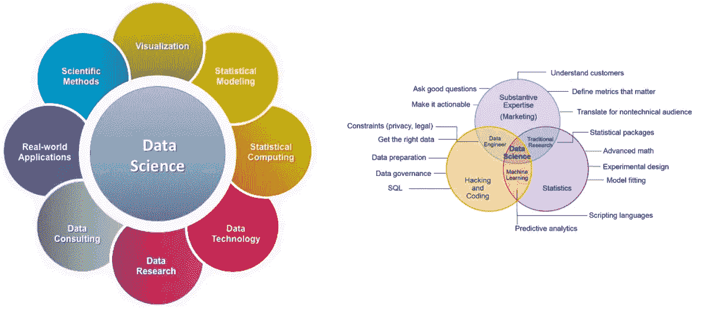
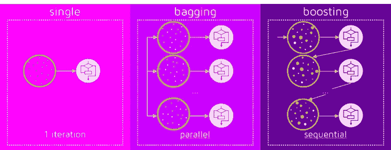

# 探索数据科学的世界——门外汉技术，但有效

> 原文：<https://medium.com/analytics-vidhya/beginners-guide-to-data-science-in-layman-technique-but-effective-c8bffd34081c?source=collection_archive---------12----------------------->


> 什么是数据科学？数据科学家是做什么的？

**数据科学**是一个跨学科领域，使用科学方法、流程、算法和系统从许多结构化和非结构化数据中提取知识和见解。数据科学与数据挖掘、机器学习和大数据相关。



## 数据科学家是做什么的？(在高层次上)

*   了解业务问题。(向业务部门提问，了解要预测的内容、业务和科学目标)
*   获取数据(最近，公司正在寻找非常熟悉数据接收(创建数据管道、清理、转换、编排)的数据科学家)+组合建模
*   探索数据(绘制数据，检查模式和异常情况)
*   对数据建模(构建、拟合和验证模型)
*   将结果与业务用户保持一致(结果有意义吗？)
*   将结果可视化(讲故事的艺术)

## 为什么我们需要机器来学习？


*   人们懒惰、愚蠢、麻木(无意冒犯😜)…..

我厌倦了成为你想要我成为的样子…感觉如此不忠实，迷失在表面之下…我不知道你对我有什么期望…承受着走在你的鞋下的压力…陷入了暗潮，只是陷入了暗潮…我走的每一步对你来说都是另一个错误
陷入了暗潮，只是陷入了暗潮…拉拉拉拉拉拉"

## 在深入研究技术之前，我们应该了解其中的 3 个组成部分:

1.  **数据**是通过观察收集的特征或信息。

*   公司通过两种方式收集数据:1 .手动和 2。自动的
*   手动收集的数据很少出错，但需要更多时间来收集。


*   自动方法是收集数据的一种先进方法。我们可以收集任何需要的东西。
*   例子:像谷歌和微软这样的聪明公司使用 ReCaptcha 来“选择所有的猫、街灯、汽车等”来登录或进一步操作。我们选择合适的图像，并间接地输入我们的知识来训练他们的数据。
*   这正是他们为将正确的对象映射到数据所做的“免费劳动”。
*   收集好的数据是极其困难的。

**2。变量**也被称为特征，参数是机器需要考虑的因素。这些可以是销售、性别、风格、日期等列。

特征对于任何类型的模型都非常重要，因为数据和正确的变量/特征为模型提供了模式以获得更好的结果。

## 特征工程:

要素工程是从现有要素中创建新要素，或从数据集当前的列表中产生新变量。

样本示例:

*   **小时箱**:宁滨在决策树的帮助下创建了一个新功能*小时*功能。
*   **温度箱**:类似地，温度变量的装箱特征
*   **年份库**:创建了 8 个季度库，为期 2 年
*   **日类型**:日分为“工作日”、“周末”或“假日”

很少有先进的 Python 库来自动化特征工程，如**[**feature tools**](https://www.featuretools.com/)**。****

**Featuretools 是一个用于执行自动化特征工程的开源库。这是一个非常棒的工具，旨在快速推进特征生成过程，从而将更多时间集中在机器学习模型构建的其他方面。**

****3。** **算法**最明显的部分。任何问题都可以用不同的方式解决。您选择的方法会影响最终模型的精度、性能和大小。不过，这里有一个重要的细微差别:如果数据很糟糕，即使最好的算法也无济于事。有时它被称为“垃圾输入—垃圾输出”。所以不要太在意准确率的百分比，先尝试获取更多的数据。**

## **我看到一些人说“深度学习在市场上是新的，可能会取代机器学习”**

****

***“深度学习将取代机器学习？”*不好意思，哥们！这不是真的。**

****人工智能**是一个整体知识领域的名称，类似于生物学或化学。**

****机器学习**是人工智能的一部分。很重要的一部分，但不是唯一的。**

****神经网络**是机器学习类型之一。很受欢迎的一个，但是班里还有其他的好人。**

**深度学习是一种建立、训练和使用神经网络的现代方法。基本上，这是一个新的架构。如今在实践中，没有人将深度学习与“普通网络”分开。我们甚至为他们使用相同的库。为了不显得像个傻瓜，最好只说出网络的类型，避免使用流行词汇。**

**总的原则是在同一水平上比较事物。这就是为什么*“深度学习会取代机器学习吗”*这句话听起来像*“轮子会取代汽车吗”*。**

## **让我们深入研究机器学习:**

****

****经验法则:****

****经典 ML** :数据简单，特征清晰**

**强化学习:没有数据，但是我们有一个可以互动的环境。**

**强化学习就是按顺序做决定。简单来说，我们可以说，输出取决于当前输入的状态，下一个输入取决于前一个输入的输出。**

**下棋**

****合奏**:当我们在现实问题中以质量为目标时**

****神经网络&深度学习**:数据中复杂的模式，不清晰的特征，相信奇迹。**

# **回归:**

**让我们暂时忽略我们在互联网上找到的关于回归的所有典型解释。**

**首先，我们要了解什么是**【相关性】**？然后讨论**相关和回归的区别。****

*   **相关和回归都讨论变量之间的关联或关系。但是，回答这种关联需要什么样的洞察力以及有多深入，这是相关性和回归之间的不同之处。**
*   **相关性是一种可以用来量化关联的技术。它给关联分配一个数字，告诉你给定变量相互依赖的程度。相关技术将自身转化为一种度量，称为相关系数。相关系数用 r 表示**

****皮尔逊相关系数(r):** 皮尔逊相关系数是基于方差的概念定义的。它是两个变量 x 和 y 之间的线性关系或依赖性的度量。其值在+1 和-1 之间变化(包括+1 和-1)。值 1 表示完全正相关，0 表示不存在相关，而-1 表示完全负相关。**

*   **相关系数介于-1 和+1 之间；-1 ≤r ≤+1。**
*   **相关性是无单位的:相关性是一个系数，一个无单位的数。它的方差除以方差。单位被取消了。所以，说相关性是 0.15 米或者 0.13 公斤是不对的。**
*   **r=0 表示没有线性关联。**

****回归:**如前所述，回归还涉及变量之间的关联和关系。但是有多深，将通过下面的例子来回答。**

**我们假设，价格和手机销量之间存在弱负关联(r = -0.25)。当价格为 800 美元或 1，500 美元时，分析师可能更有兴趣量化会产生多少销售额。仅仅相关在这里是不够的；分析师需要一个模型或方程，当他给出价格作为输入时，可以给他销售额。这就是回归出现的原因。**

*****“回归模型有助于在给定独立变量(如价格)值的情况下确定因变量(本例中为销售额)的值。”*****

# ****线性回归:****

**根据因变量 y 和自变量 x 之间的关系，我们需要估计可能的最佳拟合。它可以是简单的直线或曲线，以最适合数据的为准。**

********

****线性回归的假设:****

**提示:记住**线****

****L:线性假设****

*   **r 平方值是在假设自变量(x)和因变量(y)之间的关系是线性的情况下计算的**

****I:独立性假设****

*   **y 的独立性是尝试拟合线性回归时最常见的假设之一。你可以期望 y 的值依赖于独立变量，而不是依赖于它自己以前的值。例如，在分析一年的销售数据时，如果当月的销售额取决于上月的销售额，那么 R 平方就没有任何意义。**

****N:正态假设****

*   **R-squared 是在假设因变量 y 对于自变量 x 的每个值呈正态分布的情况下计算的。**

****等方差或同方差(同方差):****

*   **每个 X 值下 Y 的方差都是相同的。在 x 的不同箱中有不同的方差称为异方差。它与同方差相反，同方差意味着因变量在自变量的所有点上具有相同的方差。**

****其他假设:****

*   **残差的平均值应该为零**
*   **独立变量不应相互关联(多重共线性)**
*   **独立变量应该有正的方差**
*   **观察值或数据行的数量应该大于自变量的数量。**

# ****我们的模型有多好？****

**我们建立的回归线可能有很好的估计和准确性。但是它仍然可以被挑战。有人可能会提出另一个模型，声称他们的估计更好。他们可能会提出一条具有不同截距和斜率的新直线。**

**在这样的条件下，当前的模式应该如何辩护？换句话说，如何量化给定模型的准确性？如何计算估计中的误差？**

****误差平方和(SSE):** 好的模型会有非常接近实际值的预测值。**

****总平方和(SST):** 我们需要考虑相对于 y 内总变差的 SSE，以确定准确的误差百分比。**

****回归平方和(SSR):** 每个模型都会有小百分比的误差。**

****SST = SSE + SSR****

********

****R 平方:决定系数-****

**R-square 是一种拟合优度或精度度量。R 平方越高，模型越好。所以，决定系数什么都不是，而是解释的变异与(因变量的)总变异的比率。**

**r 的平方= SSR/SST**

**r 的平方=(解释方差)/(总方差)**

**r 的平方= 1-(SSE /SST)**

****R 平方的限制:****

**当向模型中添加新的独立变量时，R 平方将增加或保持不变。除非你去掉一个变量，否则它永远不会减少。**

**r 平方是模型中独立变量列表所解释的变化总量。如果你添加任何新的垃圾自变量，一个与因变量没有影响或关系的变量，R 平方仍然可能略有增加，但它永远不会减少。**

****调整后的 R 平方:****

**调整后的 R 平方仅来自 R 平方。**

**调整后的 R 平方预计如下:**

*   **给出模型中已解释变量的概念的一种度量。**
*   **当一个垃圾变量被添加时，一个惩罚模型的措施。**
*   **一种同时考虑模型中观察值和独立变量数量的度量。**
*   **只有当一个重要的或有影响的独立变量被加入时才会增加的一种度量。在模型中加入任何垃圾或琐碎的变量，它都会减少。**

**调整后的 R 平方满足所有这些期望。以下是调整后的 R 平方的公式:**

****

**其中:**

**R2 是通常的 R 平方。**

**n 是记录的数量。**

**k 是独立变量的个数。**

**每增加一个新的垃圾变量，调整后的 R 平方都会增加一个惩罚。只有在模型中增加了有意义或高影响力的变量时，它才会显示出增长。**

# ****分类算法:****

******分类*** *是基于包含类别成员已知的观察值(或实例)的训练数据集，识别新观察值属于一组类别(子群体)中的哪一个的问题。例子是将给定的电子邮件分配到“垃圾邮件”或“非垃圾邮件”类别，以及基于观察到的患者特征(性别、血压、某些症状的存在或不存在等)给给定的患者分配诊断。).分类是模式识别的一个例子"****

***流行的分类算法:[朴素贝叶斯](https://en.wikipedia.org/wiki/Naive_Bayes_classifier)，[决策树](https://en.wikipedia.org/wiki/Decision_tree_learning)，[逻辑回归](https://en.wikipedia.org/wiki/Logistic_regression)， [K 近邻](https://en.wikipedia.org/wiki/K-nearest_neighbors_algorithm)，[支持向量机](https://en.wikipedia.org/wiki/Support_vector_machine)***

# *****逻辑回归:*****

***它用于预测给定一组独立变量的二元结果(1 / 0，是/否，真/假)。为了表示二元/分类结果，我们使用虚拟变量。***

******

***这里，log(p/1-p)是链接函数。对结果变量的对数变换允许我们以线性方式对非线性关联进行建模。***

***这里(p/1-p)是奇数比。每当发现奇数比的对数为正时，成功的概率总是大于 50%。你可以看到概率永远不会低于 0 和高于 1。***

*****假设**:***

1.  ***因变量不需要正态分布。***
2.  ***它不使用 OLS(普通最小二乘法)进行参数估计。相反，它使用最大似然估计(MLE)。***
3.  ***误差需要是独立的，但不是正态分布的。***
4.  ***逻辑回归假设独立变量和对数优势的线性。尽管该分析不要求因变量和自变量线性相关，但要求自变量与对数概率线性相关。***
5.  ***逻辑回归要求自变量之间很少或没有多重共线性。这意味着独立变量之间的相关性不应该太高。***

# *****我的模型有多好？*****

*****AIC(阿凯克信息标准)** —逻辑回归中调整后的 R 的类似度量是 AIC。AIC 是拟合度的度量，它根据模型系数的数量来惩罚模型。因此，我们总是偏好 AIC 值最小的模型。***

*****零偏差和剩余偏差** —零偏差表示模型预测的响应，只有截距。值越低，模型越好。剩余偏差表示通过添加独立变量的模型预测的响应。值越低，模型越好。***

*****混淆矩阵:**实际值与预测值的表格表示。这有助于我们找到模型的准确性，避免过度拟合。***

******

*****ROC 曲线:**受试者操作特征(ROC)通过评估真阳性率(灵敏度)和假阳性率(1-特异性)之间的权衡来总结模型的性能。***

******

# *****集合模型:*****

***“一群模特在学习纠正彼此的错误”***

*****流行算法:** Bagging(随机森林)& Boosting (GBM，ADA Boosting 等)***

*****装袋:**使用相同的算法，但在原始数据的不同子集上进行训练(并行)。最后——只是一般的答案。***

***装袋最著名的例子是随机森林算法，它只是在决策树上装袋***

*****Boosting:** 依次逐个训练的算法。每一个后续的都将大部分注意力放在被前一个错误预测的数据点上。***

******

# *****预测:*****

*****时间序列:**任何随时间变化的过程，只要区间固定，都是时间序列过程。***

***由于时间是相关的，线性回归模型的基本假设(即观察值是独立的)在这种情况下不成立。***

***随着趋势的增加或减少，大多数 TS 具有某种形式的**季节性趋势**，即特定时间范围内的变化。***

*****使时间序列平稳:*****

***除非我们的时间序列是平稳的，否则我们无法建立时间序列模型。在不符合平稳性标准的情况下，首先需要稳定时间序列，然后尝试随机模型来预测这个时间序列。有多种方法可以实现这种稳定性。其中一些是去趋势、差分等。***

******

***平稳时间序列应具有:***

*   ***常数平均值***
*   ***恒定方差***
*   ***不依赖于时间的自协方差***

1.  *****绘制滚动统计:**我们可以绘制移动平均线或移动方差，看它是否随时间变化。移动平均值/方差是指在任何时刻‘t’，我们将取去年，即过去 12 个月的平均值/方差。但是这更多的是一种视觉技术。***
2.  *****Dickey-Fuller 检验:**这是检验平稳性的统计检验之一。这里的零假设是 TS 是非平稳的。测试结果包括一个**测试统计**和一些**不同置信水平的临界值**。如果“检验统计量”小于“临界值”，我们可以拒绝零假设，说序列是平稳的。***

## *****如何使时间序列平稳？*****

***在现实世界中，没有一个时间序列是平稳的***

***TS 的非平稳性背后有两个主要原因:
1。**趋势** —随时间变化的平均值。例如，在这种情况下，我们看到，平均而言，乘客数量随着时间的推移而增长。
2。**季节性** —特定时间范围内的变化。人们可能会因为加薪或节日而在某个特定的月份倾向于购买汽车。***

***让我们首先处理趋势并消除它:***

1.  ***第一种技术是**变换**(对数、平方根、立方根等)。***
2.  ***有许多方法可以做到这一点，一些最常用的是:***

*   *****聚合** —取一段时间内的平均值，如月/周平均值***
*   *****平滑** —取滚动平均值***
*   *****多项式** F **拟合** —拟合回归模型***

*****平滑**是指进行滚动估计，即考虑过去的几个实例。有各种各样的方法，但我将在这里讨论其中的两种。***

# ***移动平均数***

***在这种方法中，我们根据时间序列的频率取“k”个连续值的平均值。这里我们可以取过去 1 年的平均值，即最后 12 个值。***

```
*moving_avg = pd.rolling_mean(ts_log,12)*
```

***从原始序列中减去这个。请注意，由于我们取了最后 12 个值的平均值，因此没有为前 11 个值定义滚动平均值。***

***然而，这种特定方法的缺点是必须严格定义时间段。在这种情况下，我们可以采用年平均值，但在预测股票价格等复杂情况下，很难得出一个数字。因此，我们采用“加权移动平均法”,即较新的值被赋予较高的权重。可以有许多分配权重的技术。一个流行的方法是**指数加权移动平均法**，其中权重被分配给所有带有衰减因子的先前值***

```
*expwighted_avg = pd.ewma(ts_log, halflife=12*
```

# ***消除趋势和季节性***

***以上技巧很简单，但并不适用于所有情况，尤其是季节性很强的情况。让我们讨论两种去除趋势和季节性的方法:***

1.  *****差分**——以特定的时间间隔计算差分***
2.  *****分解** —对趋势和季节性建模，并将其从模型中移除。***

## ***区别***

***处理趋势和季节性最常用的方法之一是差分。在这种技术中，我们取某一特定时刻的观测值与前一时刻的观测值之差。这在提高平稳性方面非常有效。***

## ***分解***

***在这种方法中，趋势和季节性分别建模，并返回序列的剩余部分。在这种方法中，趋势和季节性从数据中分离出来，我们可以建立残差模型。***

# ***预测时间序列:***

***一旦数据具有平稳性，我们就应该专注于创建时间序列模型。在执行趋势和季节性估计技术后，可能有两种情况:***

1.  ***一个**严格平稳序列**其值之间没有相关性。这是一种简单的情况，我们可以将残差建模为白噪声。但这是非常罕见的。***
2.  ***数值之间具有显著**相关性的系列。在这种情况下，我们需要使用一些统计模型，如 ARIMA，来预测数据。*****

*****ARIMA** 代表**自回归综合移动平均线**。平稳时间序列的 ARIMA 预测只不过是一个线性(像线性回归)方程。预测值取决于 ARIMA 模型的参数(p，d，q ):***

# *****AR 流程:*****

***自回归(AR)过程是指序列的当前值依赖于其以前的值。自回归也是一个指示性的名称，表示它是对自身的回归。自回归过程由 AR(p)表示，其中 p 是自回归过程的阶。在 AR 过程中，系列的当前值是以前值的一个因子。p 确定序列的当前值依赖于多少个以前的值***

******

***a1 是 Yt-1 对 Yt 的量化影响因子，e t 是 t 时刻的随机误差，Et 也称为白噪声。***

# *****移动授权流程:*****

***移动平均(MA)过程是一个时间序列过程，其中序列中的当前值和先前值几乎相同。但系列中的当前偏差取决于先前的白噪声或误差或冲击(即 Et、Et-1 等)。***

***通常，Et 被认为是一个不可观测的术语。它可以是由于某种未知的原因，当前系列中的一个小的随机变化；这可能是由于一些外部影响。***

******

***其中:***

*   ***b1 和 b2 是 Et-1 和 Et-2 对电流偏差的量化影响的因子。***
*   ***mu 是整个系列的平均值。***
*   ***Yt -mu 是 t 时刻的偏差。***

# *****ARMA 流程:*****

***如果一个过程表现出自回归过程和移动平均过程的性质，则称之为 ARMA 过程。在 ARMA 时间序列过程中，序列的当前值取决于其以前的值。ARMA 过程中与平均值的小偏差是以前误差的一个因素。你可以把 ARMA 过程想象成一个既有长期趋势又有短期季节性的序列。ARMA(p，q)是 ARMA 过程的一般符号，其中 p 是 AR 过程的阶，q 是 MA 过程的阶。***

******

## *****如何确定使用哪个流程？*****

1.  *****自相关函数(ACF):** 它是 TS 与其自身的滞后版本之间的相关性的度量。例如，在滞后 5 时，ACF 会将时刻' t1'…'t2 '的序列与时刻' t1–5 '…' t2–5 '的序列进行比较(t1–5 和 T2 为端点)。***
2.  *****部分自相关函数(PACF):** 该函数测量 TS 与其自身的滞后版本之间的相关性，但是在消除了已经由介入比较解释的变化之后。例如，在滞后 5 时，它将检查相关性，但去除已经由滞后 1 至 4 解释的影响。***

*****识别 AR(P)流程的经验法则:*****

*****ACF 图形**，慢慢变小或变为零。要么朝一个方向减少，要么以正弦(正弦波)激情减少。***

*****PACF 图，**切掉。截止延迟表示 AR 过程的顺序。***

*****识别并购流程的经验法则:*****

*****ACF 图，**切断。截止延迟表示毫安过程的顺序。***

*****PACF 图，**慢慢变小或消失为零。或者在一个方向上减小，或者以正弦或正弦波模式减小。***

***因为我们处理的是误差，通常幅度很小，PACF 图可能不清楚，也很难解释。在这种情况下，我们必须使用反向自相关函数(IACF)图来代替 PACF 图。***

*****识别 ARMA 过程的经验法则:*****

*****ACF/PACF/IACF 图，**全部阻尼降为零。***

# *****模型验证:*****

***任何人都希望误差为零或小于 5%。以下是一些衡量误差或准确性的标准。***

1.  ***平均绝对偏差***
2.  ***平均绝对百分比误差(MAPE)。这是最广泛使用的方法***
3.  ***均方误差***
4.  ***另一个相关的度量是均方根误差，即 RMSE = MSE 的平方根。***

# *****结论:*****

***希望我已经详细说明了数据科学的重要性以及回归、分类和预测模型的概要。数据科学不是火箭科学，可以通过实践和试验不同的模型轻松学会。特别感谢所有的书籍和文章给了我数据科学的知识。***