# 散景数据可视化初学者指南

> 原文：<https://medium.com/analytics-vidhya/beginners-guide-to-data-visualization-with-bokeh-818cbd5eeebb?source=collection_archive---------19----------------------->

## 从头开始用 Python 构建基于 web 的可视化

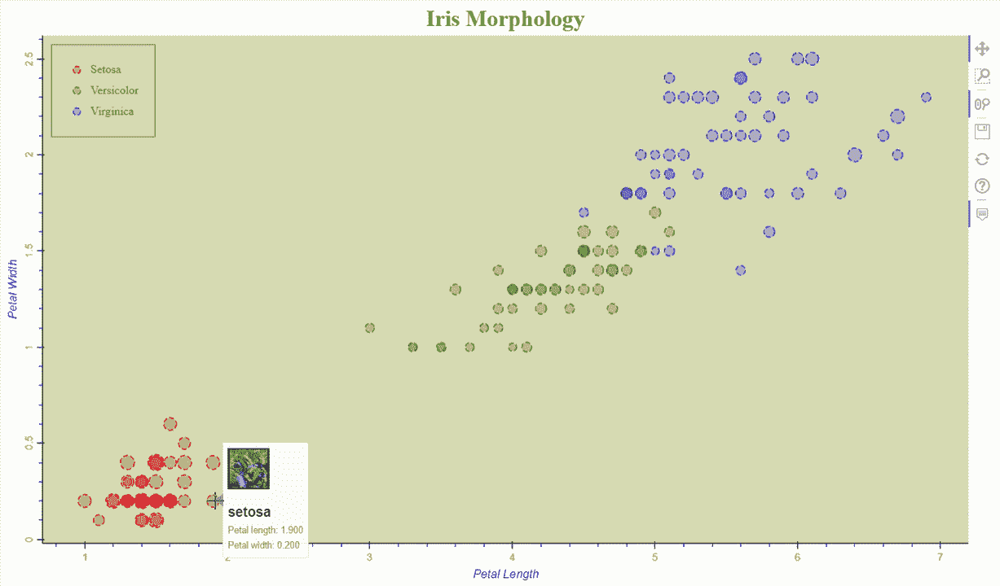

**Bokeh 是 Python 中的数据可视化库**。它提供了高度互动的图形和情节。它与其他 python 绘图库的不同之处在于，来自散景的**输出将出现在网页**上，这意味着如果我们在 Python 编辑器中运行代码，最终的绘图将出现在浏览器中。这提供了在任何使用 Django 或 Flask 的网站上嵌入散景图的优势。

我们大多数人都熟悉 iris 数据集，它包含三种不同花卉的形态学数据，即 Setosa、Virginica 和 Versicolor。**让我们通过学习散景的基础知识，从头开始绘制上图。**

## 重要的事情先来

安装散景库。

```
pip install bokeh
```

## 导入必要的包。

```
from bokeh.plotting import figure
from bokeh.io import output_file, show
from bokeh.sampledata.iris import flowers
from bokeh.models import HoverTool, ColumnDataSource
```

1.  散景绘图是一个用于创建可视符号的接口，我们从该接口导入**图**，该图充当保存我们的绘图的容器。
2.  我们需要 output_file 和 show from bokeh i/o 来渲染我们的图形。 **output_file** 用于指定显示图形的 HTML 文件路径，并通过 **show** 进行渲染。
3.  散景附带样本数据，我们正在导入数据帧类型的**虹膜数据集**。这就像阅读熊猫的 CSV 文件一样。
4.  **HoverTool** 用于在鼠标指针悬停在绘图点上时显示数据，而 **ColumnDataSource** 是 DataFrame 的散景版本。我们稍后将对此进行更多的讨论。

## 定义输出文件路径

用 output_file 定义输出文件是我们要做的第一件事，show()是最后一件事。任何类型的绘图和定制都必须在这两条线之间完成。

```
output_file(’iris.html’)’’'Plotting and customizing code'''
show()
```

我们将输出路径指定为“iris.html ”,这将在我们工作的同一目录下创建一个 html 文件。这个 HTML 文件将包含我们现在要绘制的图表，可以独立于 Python 代码共享和使用。

## 创建体形对象

我们需要创建一个图形对象，它是保存图形的容器。任何类型的绘图都必须参照图形对象“f”进行。

```
output_file('iris.html')
f = figure()
'''Plotting and customizing code'''
show(f)
```

## 让我们策划

现在，我们将绘制我们的第一个图形，这将是基础，在此基础上，我们将调整其属性来定制图形。

```
output_file("iris1.html")f=figure()f.circle(x=flowers['petal_length'], y=flowers['petal_width'])show(f)
```

圆形是图形对象在散景中绘制散点图的一种方法，x 和 y 分别是 x 轴和 y 轴的参数。我们得到了一个非常基本的情节。

> 圆形只是许多绘图样式中的一种，散景支持大量这样的绘图，你可以在这里找到。

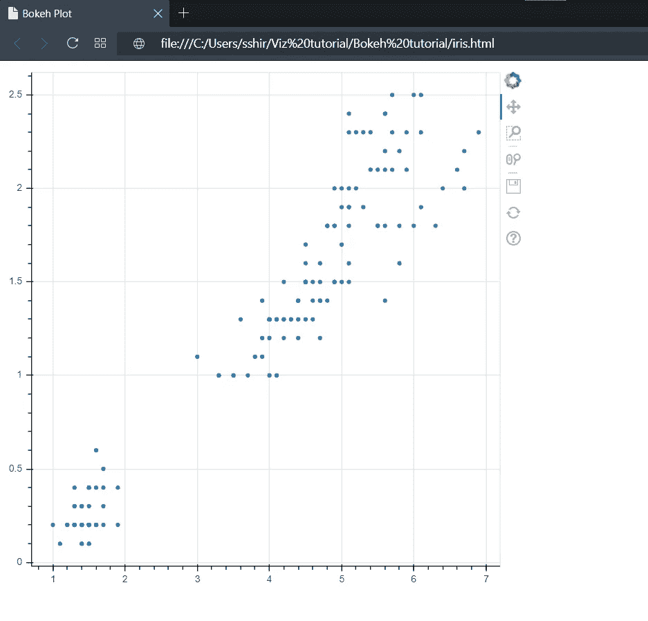

如您所见，该图是在浏览器中查看的 HTML 文件输出。这是散景的优势，我们可以简单地在我们的网站中嵌入任何这样的图形，并可以独立查看。

## 散景工具

散景为我们提供了一些与剧情互动的工具。默认情况下，它们位于垂直朝向绘图边界外侧的右上角。

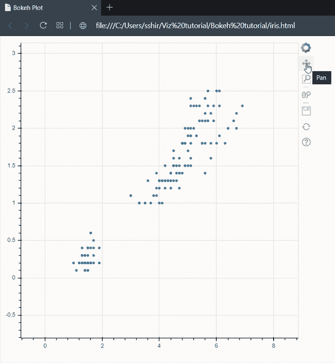

## 添加背景色

让我们增加图的高度和宽度，并添加背景色。我将只展示每个定制部分所需的代码，您可以在本文末尾找到完整的代码。所有的定制代码应该在“f . circle()”之后**。**

```
f.plot_width=1100
f.plot_height=650
f.background_fill_color='olive'
f.background_fill_alpha=0.3
```

这些方法非常简单明了。plot_width 和 plot_height 分别改变宽度和高度，用橄榄色和 alpha 填充背景色是颜色透明度的百分比。无论绘图样式如何，除了一些小的变化外，定制方法保持不变。

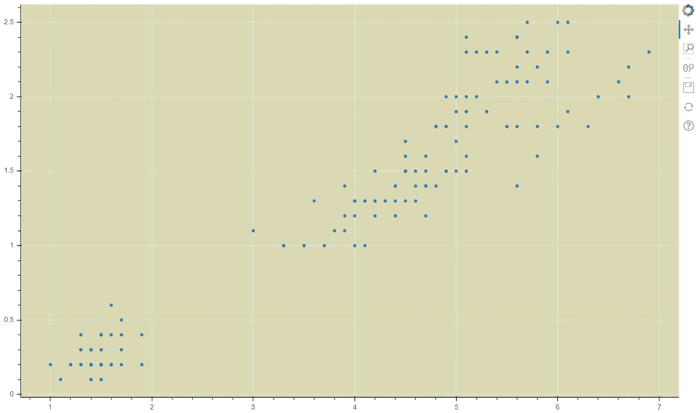

## 添加标题和轴标签

一个情节只有当我们有了标题才是可读的。这是任何人的眼睛在情节中首先会寻找的东西。

```
f.title.text='Iris Morphology'
f.title.text_color='Olive'
f.title.text_font='times'
f.title.text_font_size='25px'
f.title.align='center'
```

“标题”是这里使用的方法。它有很多方法可以调整，我建议你尝试一下。

现在我们将添加 x 轴和 y 轴标签，使其更具可读性。

```
f.xaxis.axis_label='Petal Length'
f.yaxis.axis_label='Petal Width'
f.axis.axis_label_text_color='blue'f.axis.minor_tick_line_color='blue'
f.yaxis.major_label_orientation='vertical'f.axis.major_label_text_color='orange'
```

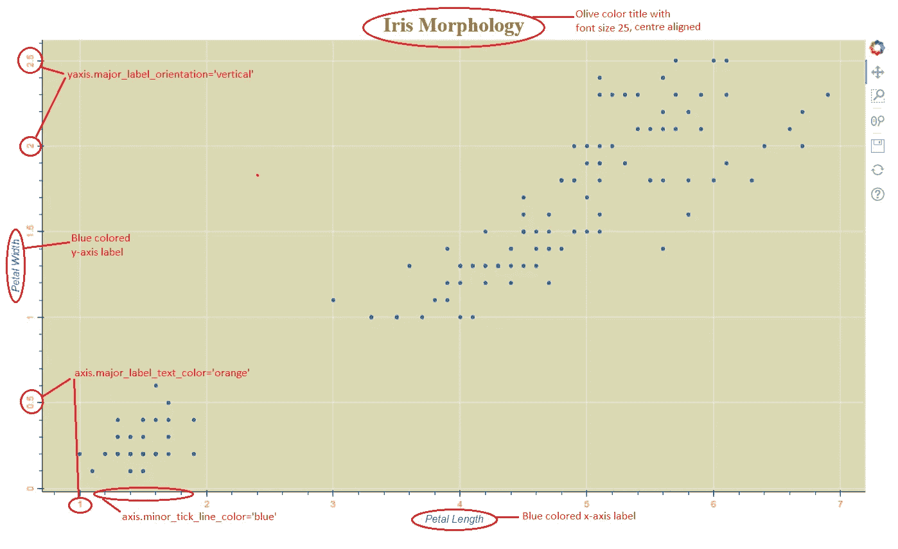

## ColumnDataSource

我们可以将 ColumnDataSource 视为 DataFrame 的**散景版本，因为 Pandas 操作与 DataFrame **一起工作得更好，散景与 ColumnDataSource** 一起工作得更好。我们将从 flowers 数据帧中创建一个 ColumnDataSource，让我们使用散景的生活变得更轻松。**

我们将为每种花卉创建不同 ColumnDataSource。这样我们可以很容易地绘制出散景图。

```
setosa = ColumnDataSource(flowers[flowers["species"]=="setosa"])versicolor = ColumnDataSource(flowers[flowers["species"]=="versicolor"])virginica = ColumnDataSource(flowers[flowers["species"]=="virginica"])
```

ColumnDataSource 对象只不过是一个 python 字典。让我们来看看 setosa ColumnDataSource。

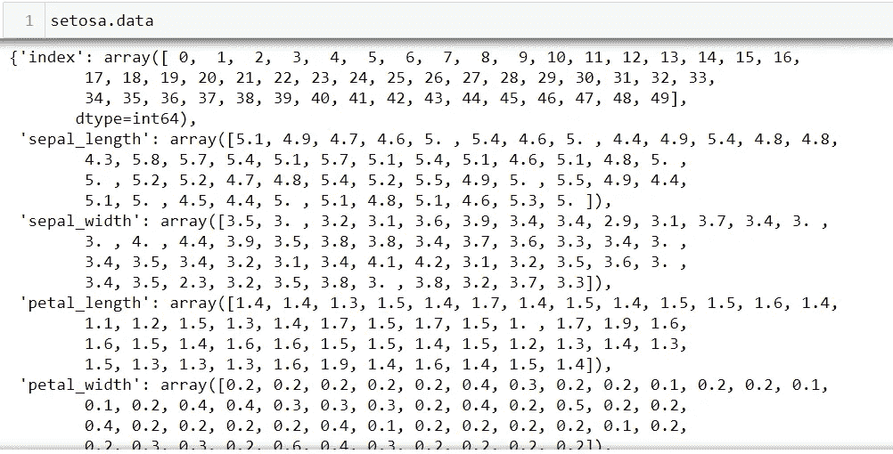

从现在开始，我们将会遇到 ColumnDataSource 的使用。

## 添加颜色和图例

我们将尝试用不同的颜色显示**不同物种的分散点**。Setosa 用红色，Versicolor 用绿色，Virginica 用蓝色。要做到这一点，我们必须用三种 f.circle()方法分别绘制这三个物种，但要在同一个图上。这让我们可以灵活地给每个物种添加一个图例。

源是一个 ColumnDataSource，x 和 y 值是我们想要绘制的那个 ColumnDataSource 的键。请注意，我们已经为每个分散点增加了大小，以显示每个点的密度，我们将每个值乘以 4 的唯一原因是为了使点在图表上更明显。line_dash 参数用于使散点边界变为虚线而不是普通线，legend_label 用于添加图例。

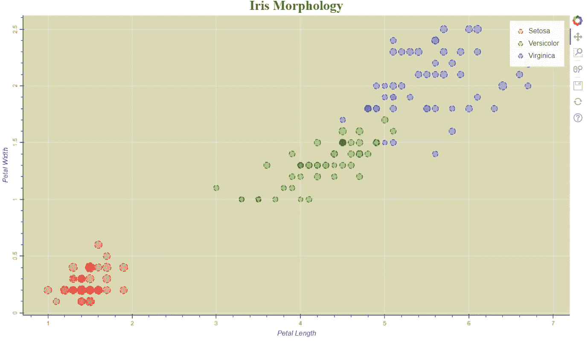

请注意，图例重叠在散布点上，看起来也不太好。我们来定制一下吧。

```
f.legend.location = 'top_left'
f.legend.label_text_color = 'olive'
f.legend.label_text_font = 'times'
f.legend.border_line_color = 'black'
f.legend.margin = 10
f.legend.padding = 18
```

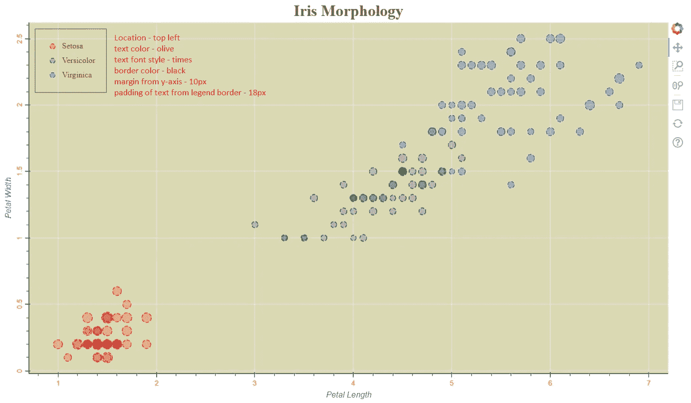

## 添加悬停效果

我想在分散点上停留时看到更多的信息，比如花瓣的长度和宽度，这基本上是轴坐标，也是相应物种的图像。

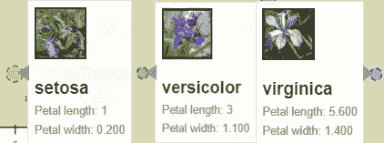

还记得我们**一开始进口的 HoverTool** 吗？这就是它发挥作用的地方。我们可以用 HoverTool 做很多事情。为了实现上述目标，我们需要**在 HoverTool 中添加一个 HTML 代码**，然后将 HoverTool 添加到 figure 对象中。

## 添加物种图像的 HTML 代码

```
<div>
    
    </img>
</div>
```

等等，“src”属性中的“@imgs”是哪里来的？在创建 ColumnDataSource 之前，我们需要将各个物种的图像的 URL 添加到 DataFrame 中。

```
#image url to species
urlmap = {'setosa':'[https://upload.wikimedia.org/wikipedia/commons/thumb/5/56/Kosaciec_szczecinkowaty_Iris_setosa.jpg/800px-Kosaciec_szczecinkowaty_Iris_setosa.jpg'](https://upload.wikimedia.org/wikipedia/commons/thumb/5/56/Kosaciec_szczecinkowaty_Iris_setosa.jpg/800px-Kosaciec_szczecinkowaty_Iris_setosa.jpg'),
        'versicolor':'[https://upload.wikimedia.org/wikipedia/commons/thumb/2/27/Blue_Flag%2C_Ottawa.jpg/800px-Blue_Flag%2C_Ottawa.jpg'](https://upload.wikimedia.org/wikipedia/commons/thumb/2/27/Blue_Flag%2C_Ottawa.jpg/800px-Blue_Flag%2C_Ottawa.jpg'),
        'virginica':'[https://upload.wikimedia.org/wikipedia/commons/thumb/9/9f/Iris_virginica.jpg/800px-Iris_virginica.jpg'](https://upload.wikimedia.org/wikipedia/commons/thumb/9/9f/Iris_virginica.jpg/800px-Iris_virginica.jpg')}#creating new img column in DataFrame with image url as values
flowers['imgs'] = [urlmap[x] for x in flowers['species']]
```

“urlmap”是包含物种的图像 URL 的 python 字典，然后我们使用列表理解将 URL 添加到我们的数据帧的每个实例中。我们的数据框架看起来像这样。

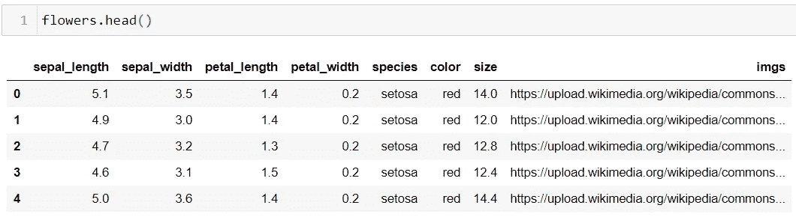

之后，我们创建 ColumnDataSource，这就是“src”属性中“@imgs”的来源。

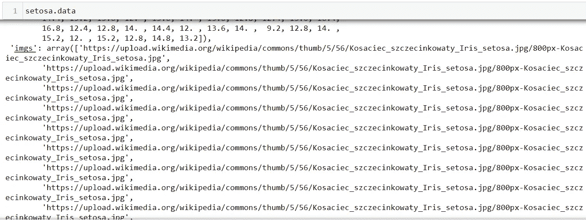

然后我们添加 HTML 代码来显示物种名称、花瓣长度和花瓣宽度。无论你在 HTML 代码中的什么地方找到“@”，都意味着它引用了 ColumnDataSource，Bokeh 足够聪明，可以根据图上的每个分散点来映射数据。这就是 Bokeh 和 ColumnDataSource 携手工作的方式，因此 ColumnDataSource 优于 DataFrame。

> 注意:
> 
> 我注意到当我使用“@”时，Medium 指的是 Twitter 个人资料链接。这不是这篇文章的目的。如果这以任何方式伤害了各自 Twitter 处理者的感受，我道歉。

就这样，我们的第一个散景图已经准备好了，如果你已经走了那么远，干杯。

## 源代码

> 点击源代码右下角的“查看原始代码”来复制粘贴代码


照片由[莫瓦尼奇·李](https://unsplash.com/@morvanic?utm_source=medium&utm_medium=referral)在 [Unsplash](https://unsplash.com?utm_source=medium&utm_medium=referral) 上拍摄

学习 Matplotlib 和 Seaborn

[](/towards-artificial-intelligence/analyzing-citibike-data-eda-e657409f007a) [## 分析 CitiBike 数据:EDA

### 充分利用 Matplotlib 和 Seaborn

medium.com](/towards-artificial-intelligence/analyzing-citibike-data-eda-e657409f007a) 

让我们连接…

[](https://www.linkedin.com/in/sujan-shirol/) [## Sujan Shirol -技术作家- Python 开发者| LinkedIn

### 我相信教学是最好的学习方式。技术作家在媒体的最大出版物的启动，走向人工智能&…

www.linkedin.com](https://www.linkedin.com/in/sujan-shirol/)