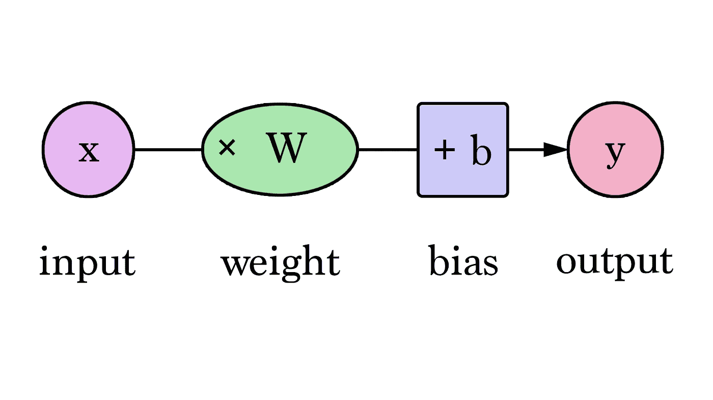

# 深度学习概念指南

> 原文：<https://medium.com/analytics-vidhya/beginners-guide-to-deep-learning-concepts-46a414b0e80a?source=collection_archive---------10----------------------->

通过经验学习，记忆所学的东西是由我们的大脑负责的技能…那么有没有人想过机器是否能像我们一样思考，像我们一样学习？是的，机器可以像我们一样思考，甚至比人类更能思考，通过使用一些算法像我们一样学习。这种现象被称为“ ***机器学习*** ”。

深度学习是机器学习的子集，机器学习是 AI 的子集。基本上深度学习可以被称为对机器学习的改进。

> **机器学习:**机器学习是人工智能(AI)的一种应用，它为系统提供了自动学习和根据经验改进的能力，而无需显式编程
> 
> **深度学习:**深度学习是模仿人脑处理数据的概念，用于决策和预测，用于图像识别等。这里出现了神经元的概念，神经元是大脑传输数据的主要部分，我们将在课程中进一步看到神经网络。

在学习深度学习之前，我们首先需要了解“线性回归”和“逻辑回归”，这将是有用的。

> **线性回归:**线性回归是一种机器学习算法，它执行的任务是根据给定的自变量(x)来预测因变量值(y)。因此，这种回归技术找出了 x(输入)和 y(输出)之间的线性关系。该方程的形式为“y = ax + b”。

这种线性回归在两组数据点之间放置了一条分隔线，以区分其各自的类别。

使用线性回归的二元分类

> **逻辑回归:**逻辑回归是一种监督学习分类算法，用于预测目标变量的概率。这是一种统计方法，用于分析决定结果的一个或多个独立变量。线性变换(ax + b)通过激活函数，比如 sigmoid，输出由 sigmoid 激活函数给出。

# **线性回归与逻辑回归:**

线性回归不使用任何激活函数，但在逻辑回归中并非如此，在逻辑回归中，线性变换(ax + b)通过激活函数 sigmoid 并生成输出。

现在我们将进入深度学习的主要概念，包括神经元、神经网络、权重、偏差、成本函数、反向传播、超参数、梯度下降等。

**1)神经元:**神经元是神经网络的主要模块之一，神经网络只不过是一个携带信息并将其传递到另一层的单元。在神经网络中，输入数据被传递给神经元，这是神经网络的起点。

基本神经网络架构

在上面的架构中，输入层、隐藏层有一些节点，这些节点只是神经元，它们接收数据并进一步传递。

**2)神经网络:**神经网络只不过是神经元和隐藏层的集合。

**3) Bias :** Bias 是神经网络中的一个附加参数，与权重一起用于调整输出，以及对**神经元**的输入(X * W)的加权和。因此，偏差是一个常数，它以一种最适合给定数据的方式帮助模型。

**4)权重:**权重是转换输入数据的[神经网络](https://deepai.org/machine-learning-glossary-and-terms/neural-network)中的参数。通常用‘W’来表示。没有具体的符号，但通常我们使用变量“W”。我们将权重与输入数据相乘，并添加偏差。假设“X”是输入数据,“W”是权重,“b”是偏差，那么将进入隐藏层的数据将是“激活函数(X * W + b )”,其中激活函数可以是 tanh、sigmoid 等等。基本上，我们在开始时为权重和偏差分配一个随机数，并通过称为反向传播的特殊概念定期改进权重，我们将进一步学习这一概念。

使用输入数据、权重和偏差的基本数据流

在神经网络中，模型的训练是通过使用称为反向传播的概念来完成的。

如果你熟悉机器学习和使用模型训练数据，我们就像“训练”一样调用模型 api 的方法，它使用反向传播。如果您有机会查看模型 api 代码，您将在培训方法中找到反向传播代码。

**5)成本函数:**成本函数是神经网络相对于其给定的训练样本和预期输出有多好的度量。它是单个误差的总和。求成本函数有各种各样的公式。其中一些是:

成本=真实标签*日志(预测标签)

损失可能性(成本)=总和(真实标签*对数(预测标签)-(1-真实标签)*对数(1-预测标签)

**6)反向传播:**由于我已经明确神经网络中的训练是反向传播，我们将讨论反向传播的主要概念。

反向传播是训练模型的概念，其中调整随机分配的权重和偏差，使得使用权重和偏差的导数将成本降低到最小。当代码中的所有内容都是正确的，并且您选择的超级参数非常适合您的网络时，成本的斜率将如下图所示。

**7)超参数:**超参数基本分为 4 类

**i)学习率:**学习率是一个超参数，它控制着我们对网络权重的调整程度。学习率用于反向传播，其中学习率乘以权重和偏差的导数。(w +=学习率*导数 _w，b +=学习率*导数 _b)。基本上为了网络的最佳性能，我们需要选择学习率非常小。

**ii)正则化:**拟合数据时的一个问题是过拟合，这个问题可以通过使用正则化来避免。

**iii)隐藏层:**神经网络中的隐藏层是介于输入层和输出层之间的层，其中神经元接受一组加权输入，并通过激活函数产生输出。

**iv)激活函数:**激活函数是非线性变换，它有自己的一套算法来生成输出。线性变换即。加权和与偏差一起通过激活函数来生成输出，如果没有它，那么在数学上计算如此复杂的映射将是无效的。神经网络中使用的一些激活函数有 Tanh、Sigmoid、ReLu、Softmax **。**

> **Sigmoid 函数公式:** 1 / (1 + e^-x)

> **Softmax 函数公式:** a = exp(x)，a / a.sum(axis = 1)
> 
> 其中 x 是数据，假设加权和+偏差。
> 
> **ReLu(整流线性单位)Softmax 函数:** *y = max(0，x)*

> **Tanh(双曲正切)激活函数:**y = tanh(x)->(e^x -e^-x)/(e^x +e^-x)

我们以下列方式调整反向传播的权重和偏置

> **用于更新从隐藏层到输出层的权重 w2:**
> 
> w2 +=学习率* Z.T.dot(目标预测值)
> 
> **用于更新从隐藏层到输出层的偏差 B2:**
> 
> b2 +=学习率*(目标-预测)。总和()
> 
> **用于更新从输入层到隐藏层的权重 w1:**
> 
> **对于 Sigmoid 激活函数:** dZ = numpy.outer(目标预测，w2) * Z * (1 — Z)
> 
> **对于双曲正切激活函数:** dZ = numpy.outer(目标预测，w2) * (1 — Z * Z)
> 
> **对于 ReLu 激活功能:** dZ =(目标-预测)。点(w2。t)* Z *(1-Z)
> 
> dz 是隐藏节点的误差。因此，最终的权重更新公式为:
> 
> w1 +=学习率* X.T.dot(dZ)
> 
> **用于更新从输入层到隐藏层的偏差 B1:**
> 
> b1 的 dZ 将与 w1 的 dZ 相同，具有各自的激活功能。
> 
> 因此，最终偏差更新公式为:
> 
> b1 +=学习率* dZ.sum(轴= 0)

其中 Z 是隐藏层神经元的输出，Target 是实际标签，而 predicted 是预测标签。

> 这些权重和偏差的更新不过是**“梯度下降”**。

所以我们想到的问题是，如何选择超参数？如果你问我是否有找到超参数的特殊方法，我的答案是否定的…基于输入和你正在做的分类类型，你必须做一个学习率和隐藏层的试错法。因此，对于哪种超参数配置，您可以获得完美的网络精度和最佳分类率，这些配置将是最好的..

因此，对于二元分类，我们使用**“Sigmoid 激活函数”**，对于多类分类，我们使用**“soft max 激活函数”。**

正如我已经说过的，学习率应该是小的，如果学习率很高，那么成本函数将转到“INF”或“NaN”。

一些常用的神经网络架构有:

*   **卷积神经网络(CNN)**
*   **递归神经网络(RNN)**
*   **长短期记忆(LSTM)**
*   **玻尔兹曼机**
*   **深度信念网络**

所以如果你想知道这些神经网络是如何工作的，你需要练习和编码。除非你练习，否则你很难理解。所以我有一些免费的数据集供你练习。

*   MNIST
*   西法尔
*   SVNH
*   虹膜

你也可以通过在浏览器中访问“谷歌的神经网络游乐场”来了解这些神经网络如何与不同的超参数一起工作。它是神经网络的可视化。

# 最终注释:

我用简单的术语来表达概念，这样就不会变得复杂，更容易理解，你也会对学习产生兴趣。我希望我贡献了一些知识，你也学到了一些东西…！如果是的话，我很高兴发表这篇文章，如果你喜欢我的文章，请不要忘记鼓掌。感谢任何形式的反馈。谢谢各位！！！