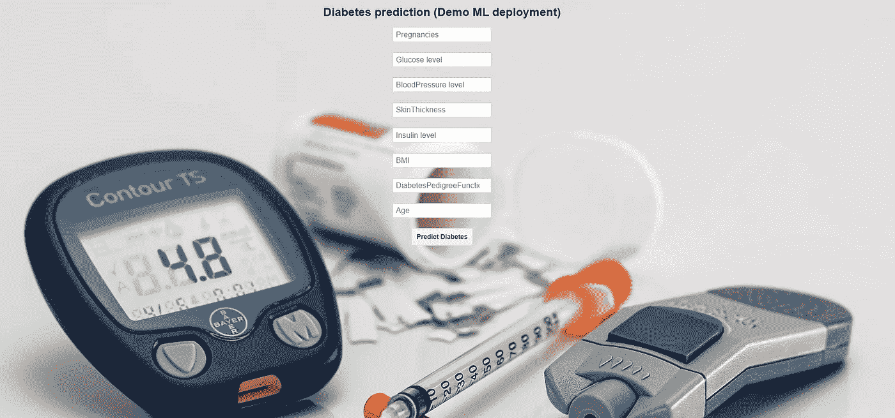

# 机器学习模型部署初学者指南

> 原文：<https://medium.com/analytics-vidhya/beginners-guide-to-model-deployment-dcf3abcdcc4c?source=collection_archive---------7----------------------->

## 使用 Flask 将机器学习模型部署到 Heroku

你是机器学习领域的初学者，想知道如何将你的项目变成现实吗？我刚开始学 ML 的时候也是这种情况。大多数 ML 课程关注于 EDA、特征工程和模型调整，而忽略了模型部署。