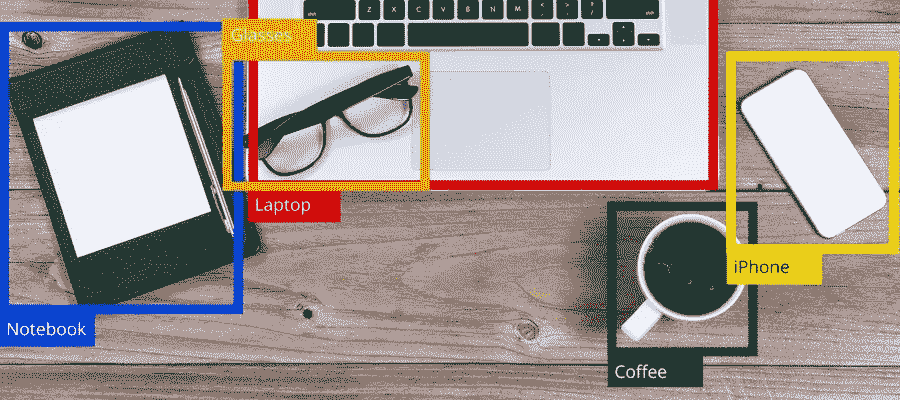

# 目标检测算法初学者指南

> 原文：<https://medium.com/analytics-vidhya/beginners-guide-to-object-detection-algorithms-6620fb31c375?source=collection_archive---------0----------------------->

在深度学习领域，名为“对象检测”的子学科涉及诸如通过图片、视频或网络摄像头馈送来识别对象的过程。

如今，物体检测几乎在任何地方都被使用。用例是无穷无尽的，无论是跟踪对象，视频监控，行人检测，异常检测，人数统计，自动驾驶汽车或人脸…