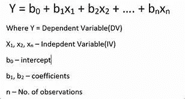

# 优化线性回归模型初学者指南。

> 原文：<https://medium.com/analytics-vidhya/beginners-guide-to-optimize-linear-regression-models-41272e6b5d91?source=collection_archive---------1----------------------->

线性回归是机器学习问题中使用最广泛的统计工具之一。对于那些不熟悉什么是线性回归模型的人；线性回归是一种对一个**因变量**和几个不同的**自变量**之间的关系进行建模的方法。简而言之，借助一个或多个已知变量来预测未知变量是很困难的。但是，本文主要讨论如何创建一个线性回归模型，该模型不会过度拟合，能够很好地概括训练数据，同时计算效率也很高。

读者可能会想为什么这值得深思。如果线性回归过度概括或过度拟合，其输入依赖于线性回归的输出的大型机器学习模型的可靠性可能存在合理的缺陷。更糟糕的是，线性回归模型的计算费用**随着**解释变量**(用于预测的变量)的增加而增加**。要快速了解线性回归方程，请参见下图。

假设可用的数据集包含数百个不同的特征和相应的目标值来训练我们的回归模型并获得系数的估计值(b0，b1，b2…).然而，在计算能力有限的情况下，不仅要选择**合适的特征**，还要估计要使用的特征的**最佳数量**的难题仍然存在。感谢内置的 python 库，如 scikit learn 和 numpy，它们很容易提供回归系数的估计值。现在，我们将深入研究选择适当特征的方法，以及我们希望在回归方程中出现的特征数量。假设我们要预测的变量叫做“Y”。我们的主要目标是分别获得 Y 的**相关系数**和我们的每个独立变量的**。为此，我们可以使用 numpy 库中的 corrcoef()函数。下面给出了示例实现。这里 train_set 是训练数据(一个数据帧)。**

在(解释变量数)中迭代 x:

print(np.corrcoef(Y，train_set['列名']))

输出将是因变量和每个相应的自变量之间的相关系数。不熟悉相关系数的建议通过[环节](https://youtu.be/bCpfd2PxBVA)。现在列出以**递增**数量级的相关系数的变量(记住相关系数也可以是负的)。准备并预处理这些要素，使其成为回归方程的一部分。过多的独立变量将**过度拟合**训练数据，并导致不太好的回归模型。您还可以通过搜索[偏差-方差权衡来深入了解过度拟合和欠拟合。对于那些熟悉但希望回忆起来的人来说，也有一个简单的图来说明偏差-方差的权衡。](https://towardsdatascience.com/understanding-the-bias-variance-tradeoff-165e6942)

已经准备了足够的特征作为实际训练数据集的一部分，现在准备检查添加更多独立变量的**是否提高了模型的准确性，并且没有过度拟合。为此我们用**的概念解释了变异**和**未解释的** **变异**。一般来说，解释的变化越好，我们模型的预测能力就越强。然而，我们应该明白，在寻求更大的预测能力时，我们往往会过度拟合我们的模型。现在让我们学习如何估计我们的回归模型的预测能力。 **R 的平方**是**解释变化量**与**总变化量**的比值，其数值始终小于 1。直观上，R 平方表示我们模型的**预测能力**。因此，当我们添加一个独立变量作为回归模型的一部分时，它总是会增加。调整后的 R-square 来了。调整后的-R-square 是**不是** **总是** **递增**；它就像 R-square 的一个修改版本，如果另一个独立变量**的添加没有像**预期的那样提高**模型的预测能力，那么它的值**就会减少**。因此，如果在增加额外的独立变量后，调整后的 R 平方值降低，我们的模型并没有提高其预测的准确性。相反，它刚刚开始过度拟合训练数据集。点击了解更多关于调整后的 R_square [的信息。可以使用下面的公式计算调整后的 R 平方。而 R 平方可以通过将预测(Y)值与实际平均值(mean(Y))的平方偏差的**总和**除以实际(Y)值与实际平均值(mean(Y))的平方偏差的**总和**来容易地计算。](https://analyticsindiamag.com/r-squared-vs-adjusted-r-squared/)****

p 是要估计的参数的数目

继续**向模型中添加**独立变量，直到你发现调整后的 r 平方的值最终开始**下降**。这是加入自变量会招致**过拟合**的点帖。在这里停下来，使用 scikit-learn、numpy 等在线性回归模型中传递**选择的变量**。这是创建回归模型背后的拟议方法，该模型不会过度拟合、概括良好且计算效率高，因为还检查了特征(独立变量)数量的存在。