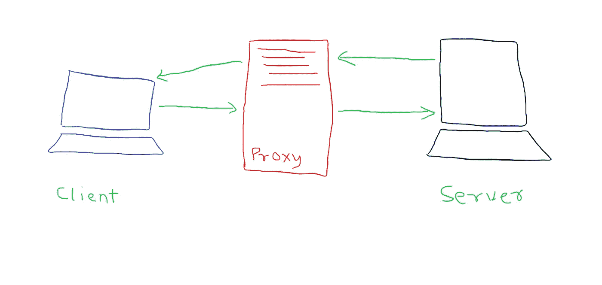
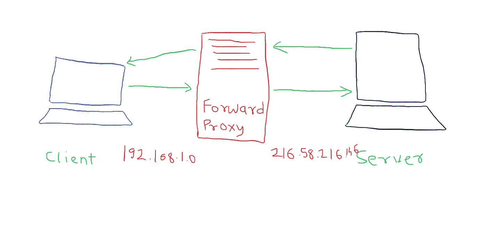
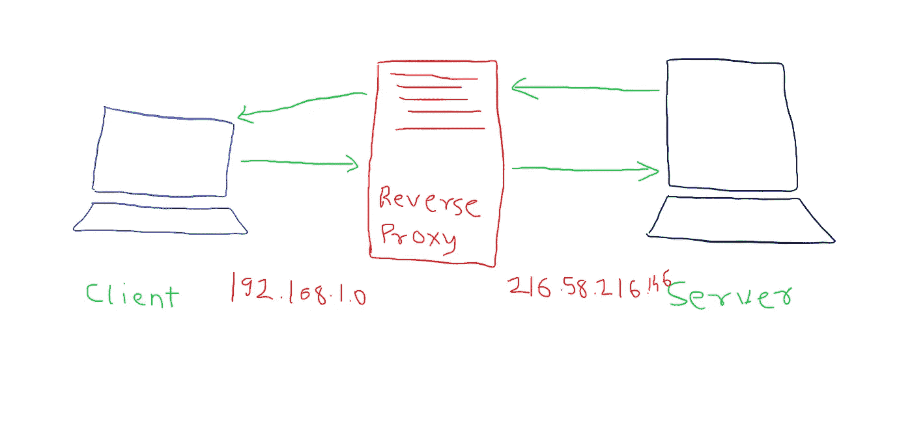
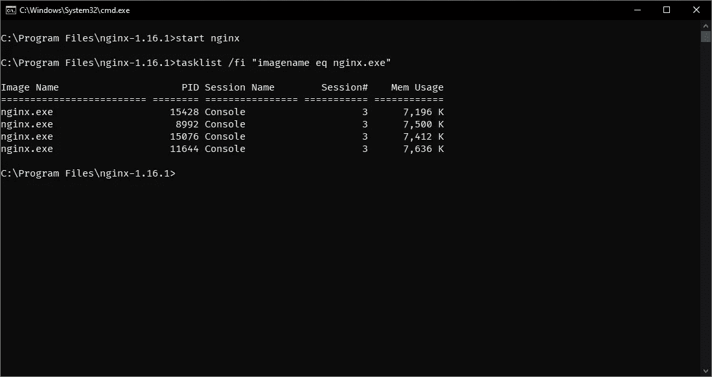
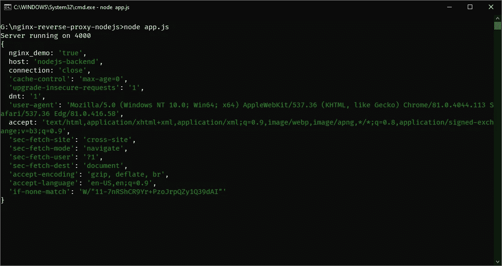
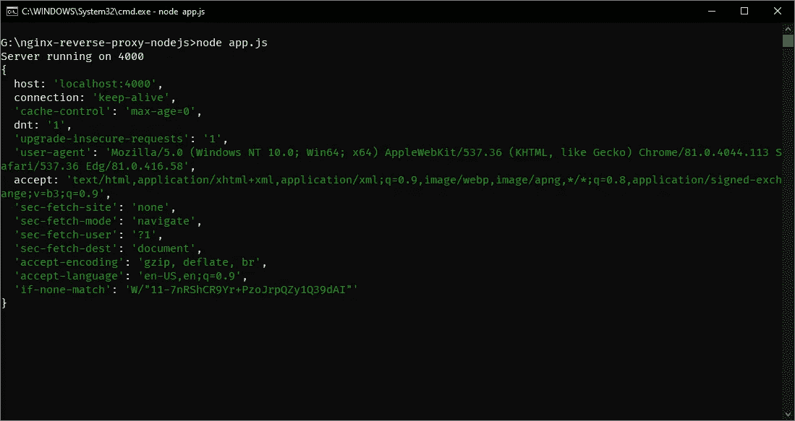
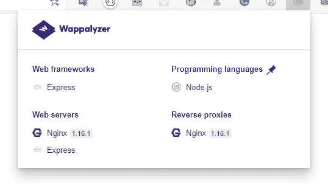

# 代理服务器初学者指南

> 原文：<https://medium.com/analytics-vidhya/beginners-guide-to-proxy-servers-5da649719a9c?source=collection_archive---------17----------------------->

在这篇博客中，我们将学习实现 NodeJS 服务器的反向代理


由 [Pakata Goh](https://unsplash.com/@pakata?utm_source=medium&utm_medium=referral) 在 [Unsplash](https://unsplash.com?utm_source=medium&utm_medium=referral) 上拍摄的照片

# 代理服务系统

代理是位于客户机和实际服务器之间的服务器。



代理服务系统

## 代理服务器的类型

*   **转发代理**

在客户端配置的转发代理。客户端向服务器发出请求，而不是直接向实际的服务器发出请求，它通过一个转发代理服务器。转发代理将转发请求，服务器获得请求，服务器响应代理。代理将该响应传递给客户端。请求的源 IP 地址将是代理的地址。源 IP 地址在服务器上不可见。



正向代理

这意味着它的行为就像一个 VPN。因此您可以访问受限网站。

*   **反向代理**

在服务器端配置的反向代理。如果服务器配置了反向代理，则客户端向服务器发出请求。该请求发送到反向代理服务器。客户端不会知道请求将被反向代理。客户端会认为，只是向服务器发送一个请求。反向代理会将请求转发给服务器。

DNS 将返回反向代理的地址，而不是实际的服务器。它实际上是正向代理的反义词。

Revere proxy 可以用作负载均衡器、安全屏障、收集日志等。



反向代理

现在实现所有这些，

我们将使用 Nginx 代理。

在 Windows 上下载 Nginx

[http://nginx.org/en/download.html](http://nginx.org/en/download.html)

我们将使用一个简单的 ExpressJS 服务器。

快速服务器

下载 Nginx 文件粘贴到 C: \驱动器。

Nginx 配置

为监听请求配置 Nginx 服务器，并将其转发给服务器。

在我的例子中，配置文件位于

```
C:\Program Files\nginx-1.16.1\conf
```

下一步，在*nginx.exe*所在的同一个目录下运行以下命令，启动 Nginx 服务器

```
start nginx
```

要查看正在运行的任务

```
tasklist /fi "imagename eq nginx.exe"
```



Nginx 服务器正在运行

当向端口 80 发出请求时，它实际上会通过 Nginx 代理。

正如您所看到的标题内容。



本地主机:80/嗨

现在向服务器发出一个请求。



本地主机:4000/嗨

现在你可以看到它被直接请求到服务器。

甚至 Wappalyzer 检测代理服务器。



Wappalyzer Chrome 扩展

## 密码

[](https://github.com/pprathameshmore/nginx-reverse-proxy-nodejs) [## pprathamesmore/nginx-反向代理节点

### 在 GitHub 上创建一个帐户，为 pprathamesmore/nginx-reverse-proxy-nodejs 开发做贡献。

github.com](https://github.com/pprathameshmore/nginx-reverse-proxy-nodejs) 

谢谢，

呆在家里，注意安全。

编码快乐！

请随时联系

[https://pprathameshmore.github.io/](https://pprathameshmore.github.io/#)