# R Markdown 初学者指南

> 原文：<https://medium.com/analytics-vidhya/beginners-guide-to-r-markdown-5437cc85685f?source=collection_archive---------18----------------------->

## 创建一份没有额外压力的专业报告

卢卡斯·布拉塞克在 [Unsplash](https://unsplash.com/s/photos/graph-report?utm_source=unsplash&utm_medium=referral&utm_content=creditCopyText) 上的照片

R 的有趣特性之一是 Markdown 选项，这是在专业报告中展示您的见解、代码和图表的一个很好的方式。

在我的 R 入门课上，除了理解统计数据这一重要部分之外，我还经历了创建 R Markdown 报告的挑战。我会花上几个小时嵌入我的代码，由于某种原因，我无法让文档看起来像我想象的那样。

在这个指南中，我将分解一些我从研究中学到的最方便的工具和我在这个过程中犯的错误。**让我们开始吧！**

一旦你进入 R Studio，Help 按钮(老实说，没人用它)会弹出备忘单选项。

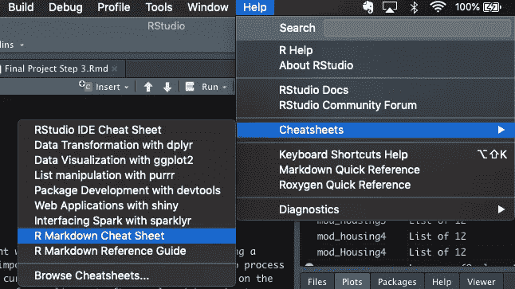

要使报告进入新文件->并单击 R Markdown。

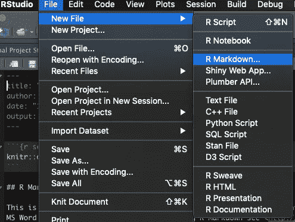

这个小问卷会弹出来询问标题、作者姓名和输出格式。你有三种选择:HTML、PDF 和 Word。人们更喜欢 HTML，因为它是工作量最少的输出。为了生成 PDF 文件，您必须安装 TeX。

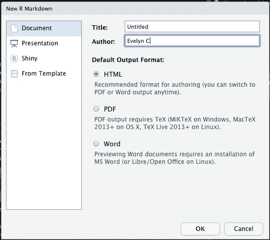

您现在已经准备好开始编写和编码了！

**接下来，我们开始格式化。**

标题、作者和日期的格式化是自动完成的。在这个例子中，我没有改变任何东西。

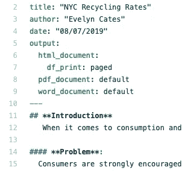

你可以看到我用了两个##，这是我想要的尺寸。单词开头和结尾的两个**表示单词是如何突出显示的。在第一张图中，我截取了 R 中的截图，底部是 HTML 输出。

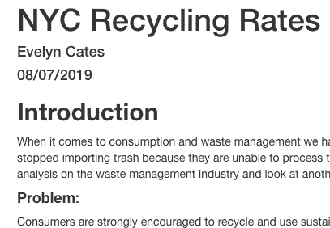

HTML 格式的输出

记住，间距很重要！我不小心在标签后面加了一个空格，它没有意识到这是为了让字体变大。它只是按照我在控制台上的格式写的。

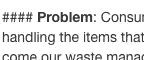

HTML 格式的输出

对于格式的更详细的分解，我建议查看一下 [R Studio 参考文献](https://rstudio.com/wp-content/uploads/2015/03/rmarkdown-reference.pdf)。

**嵌入代码:**

关于在 R Markdown 中设置，首先要知道的事情之一是 3 个反勾号**(` ` `)。**这是代码开始和结束的方式。每次嵌入代码时都需要这个集合。在下面的例子中，在写了 r 之后，我写了 set up，因为我没有数据框名称。一旦你完成了，确保用 3 个反勾号结束这个组块。此外，ggplot2、knit 和 dplyr 也是 r。

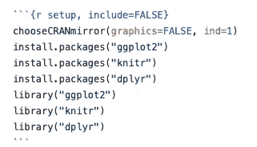

将代码嵌入到 r 中。

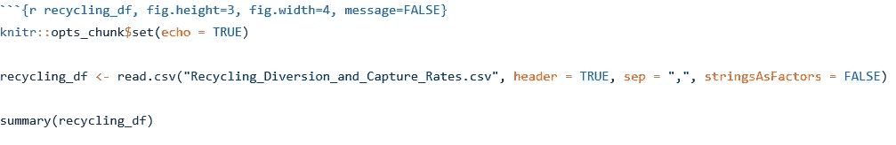

嵌入带有数据帧名称的代码。

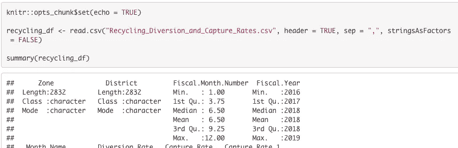

输出

如果你在数据块之间有注释，它会显示为紫色，不用担心，它不会显示在报告中。此外，根据您希望最终产品如何，您可以选择显示或不显示代码。

**附加信息:**

*拼写*——自己动手拼写。r 很聪明，但不会帮你做拼写检查。我太习惯于自动进行拼写检查了，以至于我完全忘记了检查我的拼写。为了避免这种情况，我建议用 word doc 或任何你喜欢的地方来写。r 确实自动缩进，所以我想这是一个胜利。

*来源*——如果你要添加引文，R 有一个很好的方法来以一种有组织和简单的方式书写引文。你所要做的就是在你想输入的数字旁边加上括号[ ]和插入符号(^)。这是我第一次引用 R:

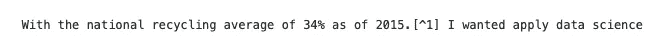

引用

在我报告的底部，我写下了来源，颜色变成了蓝色。这是正确的，并且正在按预期工作。

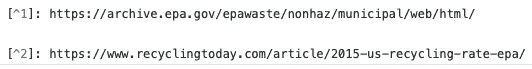

这就是我目前所知道的，我希望这个指南能有所帮助，减少一些压力。

*来源:*

[https://r studio . com/WP-content/uploads/2015/03/rmarkdown-reference . pdf](https://rstudio.com/wp-content/uploads/2015/03/rmarkdown-reference.pdf)