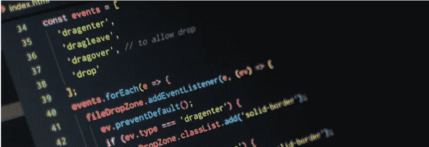

# JavaScript 重构初学者指南

> 原文：<https://medium.com/analytics-vidhya/beginners-guide-to-refactoring-in-javascript-15497920d102?source=collection_archive---------16----------------------->

当你第一次开始你的编码之旅时，构建一个网页/应用程序似乎遥不可及。当你终于准备好创建你的第一个应用程序时，你的首要任务就是让它工作起来。你把函数放在它们看起来合适的地方，你的命名约定可能不是那么描述性的。但是最终…它成功了！