# SQL 初学者指南

> 原文：<https://medium.com/analytics-vidhya/beginners-guide-to-sql-986f60ed3443?source=collection_archive---------24----------------------->

> SQL 或结构化查询语言用于访问和操作数据库。

[活动发起人](https://unsplash.com/@campaign_creators?utm_source=medium&utm_medium=referral)在 [Unsplash](https://unsplash.com?utm_source=medium&utm_medium=referral) 上的照片

# **T5 什么是数据库？**

> 数据库是结构化和相关信息的集合。数据库用于以省时的方式插入、检索和更新信息。

# **为什么需要数据库？**

假设你在一个组织工作，这个组织雇佣了 1000 多名员工。该组织需要一个数据库，其中包含员工的所有信息，如姓名、性别、年龄、职务、加入日期等。

数据库中的信息看起来有点像电子表格中的信息，但是与电子表格相比，检索这些信息要快得多。

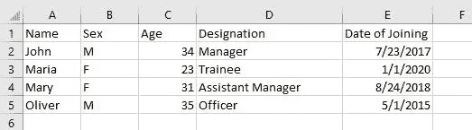

包含员工数据的电子表格

一个数据库可能包含数百万条类似于上图所示的记录。几乎不可能在不导致计算机崩溃的情况下从电子表格中更新或检索数百万条记录。

为了让您的生活更轻松，您可以使用数据库并使用 SQL 来检索、添加、删除或操作现有数据。

让我们假设你的电脑上已经安装了***【DBMS】****。如果它不存在，那么你可以从互联网上安装任何 DBMS。SQLite、MySQL、Microsoft SQL server 是可以用来创建数据库的一些 DBMS。在本文中，我将使用 Microsoft SQL server。*

# *在 DBMS 中创建数据库。*

*这可以通过使用**创建数据库**语句来完成:*

***语法:**创建数据库*数据库 _ 名称*；*

***创建员工数据库；***

*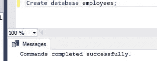*

*员工数据库已创建*

*下一步是在我们的雇员数据库中创建表。我们将在雇员数据库中创建两个表，即雇员和薪水。*

> *一个数据库可以包含数十或数百个表*

*我们可以使用 **Create Table** 语句来创建 *employees* 表，将 emp_no、first_name、birth_date、last_name、gender、hire_date 作为其列(或属性)。*

***创建雇员表(emp_no INT，***

***出生日期日期，***

***名字 VARCHAR(20)，***

***姓氏 VARCHAR(20)，***

***性别 CHAR，***

***聘用日期日期，***

***主键(emp_no)***

***)；***

*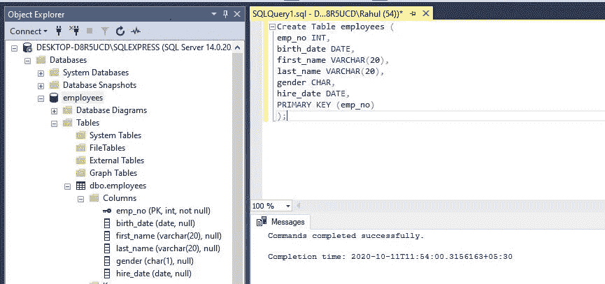*

*员工表已创建*

*以类似的方式，可以创建包含 emp_no、salary、from_date、to_date 列的*salary*表。*

***创建薪资表(***

***emp_no INT，***

***薪资 INT，***

***开始日期日期，***

***截止日期***

***)***

*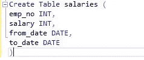*

*已创建薪金表*

*一旦我们创建了*雇员和薪水*表，我们需要将数据插入到这些表中。这可以通过将**插入到**语句中来完成*

***Insert INTO employees(雇员编号，出生日期，名字，姓氏，性别，雇佣日期)值(223，' 1965–10–12 '，' John '，' Oliviar '，' M '，' 2018–10–23 ')；***

***插入雇员(雇员编号，出生日期，名字，姓氏，性别，雇佣日期)值(225，' 1968–04–20 '，' Emma '，' Masterson '，' F '，' 2017–03–12 ')；***

> *Microsoft SQL server 接受 YYYY-MM-DD 格式来插入日期*

*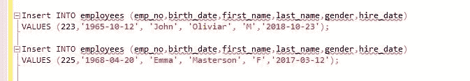*

*插入到雇员表中的值*

*同样，可以将数据加载到薪水表中。*

*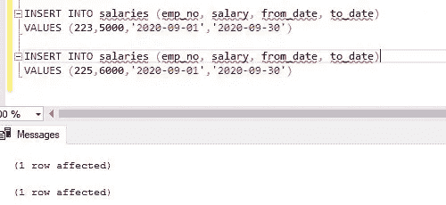*

*插入薪金表的值*

# ***从数据库中读取数据***

*可以使用 SELECT 命令从表中读取数据。为了写出完整的数据，我们可以使用下面的语法。*

***语法:** SELECT * FROM *table_name。**

***SELECT * from 员工；***

*上述语句将提供 employees 表中的所有数据。*

*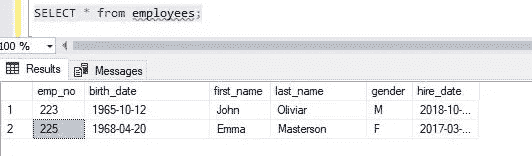*

*SELECT *语句从 employees 表中读取所有记录*

*要读取几列，我们可以提供列名而不是*。*

***SELECT 雇员编号，名字，姓氏 from 雇员；***

*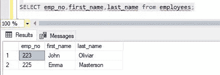*

*使用 SELECT 语句读取选定的列*

# *WHERE 语句*

*WHERE 语句可用于根据某些条件过滤数据。例如，在 employees 表中，我们可以根据性别或其他属性选择记录。*

***语法:**SELECT * from*table _ name*WHERE 条件；*

***SELECT * from employees where gender = ' F '；***

*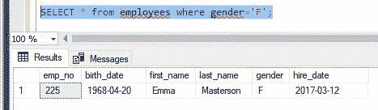*

*基于过滤器选择的数据*

***SELECT emp_no，first_name，last _ name from employees where gender = ' F '；***

*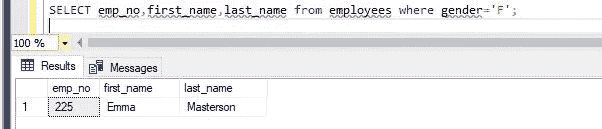*

*根据筛选器选择了几列*

# ***更新表格中的数据***

*UPDATE 语句用于修改表中的现有记录。*

***语法:**更新*表名**

*设置*列 1 =值 1，列 2 =值 2，列 3 =值 3，..**

*其中*条件*；*

*在我们的员工表中，我们将名为 Emma 的员工的雇佣日期更改为“2018-03-12”*

***更新员工***

***SET hire _ date = ' 2018–03–12 '***

***其中 first _ name =‘Emma’；***

*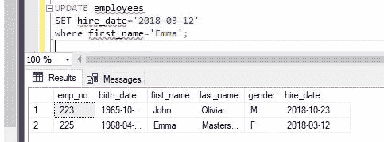*

*使用过滤器更新雇用日期*

# *从数据库中删除数据和表*

*DELETE 语句用于从表中删除数据。*

*要根据条件删除记录，使用以下语法*

***语法:**从*表名*中删除*条件*；*

*我们将从雇员表中删除 Emma 的记录。*

*从员工中删除*

*其中 first _ name = ' Emma*

*删除记录后，只剩下“约翰”的记录。*

*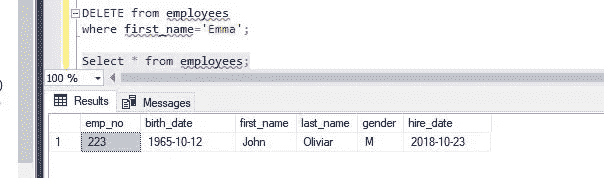*

*艾玛的记录被删除了*

*要从数据库中删除整个表，使用以下语法:*

***语法:**DROP TABLE*TABLE _ name；**

*我们将从数据库中删除雇员表。*

*删除表雇员；*

*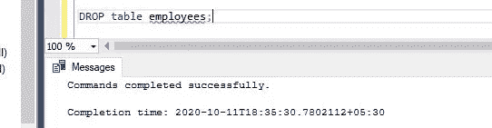*

*雇员表已从数据库中删除*

# ***从 DBMS 中删除数据库***

*要从 DBMS 中删除数据库，我们可以在 DBMS 中使用 DROP database 语句。应该非常小心地使用该语句，因为这将删除数据库中存在的所有表和所有数据。我们将删除本文中使用的雇员数据库。*

***语法:**删除数据库*database _ name*；*

*删除数据库员工；*

**

*从 DBMS 中删除的数据库员工*

*感谢阅读这篇文章。请在评论中提供您的反馈。你的评论将有助于我改进这篇文章以及其他文章。*

*如果你喜欢这篇文章，请不要忘记鼓掌。*

*请关注我，有更多这样的文章。谢谢你*