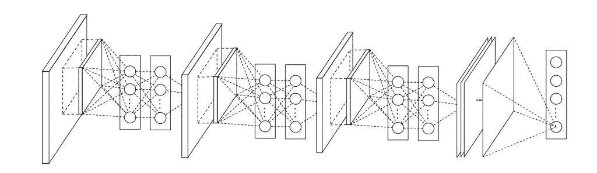
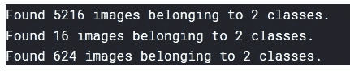
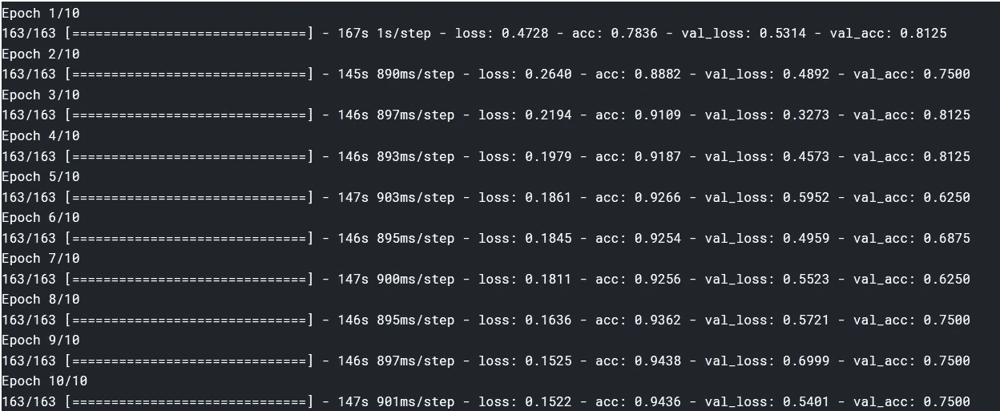
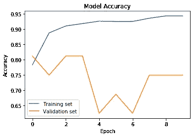
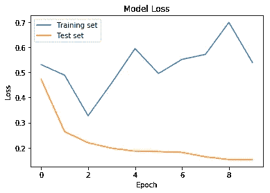

# CNN 使用 Keras 入门指南

> 原文：<https://medium.com/analytics-vidhya/beginners-guide-to-start-with-cnn-using-keras-1430044a8400?source=collection_archive---------15----------------------->



我开始学习神经网络已经有一段时间了，最近互联网上有很多关于 CNN 的热点。我发现这是完全合理的，因为这种神经网络在现代技术时代有大量的应用，即物体检测、行人检测、文本检测。在接下来的 10 分钟里，您将学习使用 keras 制作自己的卷积神经网络，在它的帮助下，我们将使用一个人的胸部 x 光图像来预测他/她是否患有肺炎。本文主要面向对神经网络和 python 知之甚少的读者。

本文使用的数据集在 [kaggle](https://www.kaggle.com/paultimothymooney/chest-xray-pneumonia) 上提供。

# 导入所需的库

最初，我们将从导入必要的库开始。

```
import numpy as np # linear algebra
import pandas as pd # data processing, CSV file I/O (e.g. pd.read_csv)
import matplotlib.pyplot as plt # visualizing plots
import os # reading files from system directory
from keras.models import Sequential # keras model
from keras.layers import MaxPooling2D, Activation, Conv2D, Dense, Dropout, Flatten # keras layers
from keras import optimizers 
from keras.optimizers import RMSprop # keras optimizer
from keras.preprocessing.image import ImageDataGenerator # keras image preprocessor
```

# 将图像从文件系统加载到数据帧中

我们将从定义两个 ImageDataGenerators 开始，它们将用于在 dataframes 中加载数据。

```
train_datagen = ImageDataGenerator(rescale = 1./255,
                                   shear_range = 0.2,
                                   zoom_range = 0.2,
                                   horizontal_flip = True)test_datagen = ImageDataGenerator(rescale = 1./255)
```

*   train_datagen 将帮助我们标准化训练数据集，并使用经过一些修改的单个图像作为另一个输入图像，因为数据集是有限的，稍微不同的图片将有助于提高我们模型的准确性。
*   test_datagen 将用于测试我们的模型，因此除了将其重新调整到与训练数据集相同的级别之外，不需要太多的规范化参数。

```
train = train_datagen.flow_from_directory('../input/chest-xray-pneumonia/chest_xray/chest_xray/train',target_size = (64, 64),batch_size = 32,color_mode='grayscale',class_mode = 'binary')val = test_datagen.flow_from_directory('../input/chest-xray-pneumonia/chest_xray/chest_xray/val',target_size=(64, 64), batch_size=32,color_mode='grayscale',class_mode='binary')test = test_datagen.flow_from_directory('../input/chest-xray-pneumonia/chest_xray/chest_xray/test',target_size = (64, 64),batch_size = 32,color_mode='grayscale',class_mode = 'binary')
```

上面的代码将数据集加载到三个框架中。除了 ***class_mode*** 之外，其他参数的名称都是不言自明的，这些参数基本上表示数据中有多少个不同的类；在这种情况下，2 表示患者是否患有肺炎。



上述代码将得出每个数据帧中加载的图像数量

# 创建我们的卷积神经网络

我们的神经网络将由几层组成，我将在一分钟内逐一解释。Keras 使得在我们的模型中添加层变得非常容易，并创建一个由我们添加的不同层组成的通用神经网络对象。该对象随后可用于拟合数据。

```
model = Sequential()
model.add(Conv2D(32, (3, 3), padding='same',
                 input_shape=(64,64,1),activation='relu'))
model.add(MaxPooling2D(pool_size=(2, 2)))
model.add(Dropout(0.25))model.add(Conv2D(64, (3, 3), padding='same',activation='relu'))
model.add(MaxPooling2D(pool_size=(2, 2)))
model.add(Dropout(0.25))model.add(Flatten())
model.add(Dense(100,activation='relu'))
model.add(Dense(1, activation='sigmoid'))model.compile(optimizer='adam',loss="binary_crossentropy", metrics=["accuracy"])
```

*   顺序模型是层的线性堆叠。我们可以稍后在对象中传递一个层列表来创建堆栈。
*   2D 卷积层用于图像的空间卷积。当使用 conv2d 层作为我们模型的第一层时，我们还提供了 input_shape 参数，即*(高度、宽度、通道)。*Conv2D 中最初的两个参数分别是 *batch_size* 和 *kernel_size* 。 *Relu* 激活函数用于忽略负值，因为它定义为 y = max(0，x)。你可以在官方的 [keras 文档中读到更多关于参数的细节。](https://keras.io/layers/convolutional/)
*   接下来是具有 pool _ size，2)的 MaxPooling2D 图层，这表示输入将在两个空间维度上减半。这样做是为了通过总结特征图中特征的存在来对特征图进行下采样。
*   Dropout 层将在训练期间使网络变薄，由于所需的节点数量减少，我们的网络将运行得更快。参数是节点的丢失率。
*   展平层只是展平我们的张量，然后将它加密成更少的节点。最后的密集层在单个节点(变量)中提供输出，并且这里使用的激活函数是 sigmoid，因为它将预测概率作为输出。因为我们需要介于 0 和 1 之间的输出。
*   最后一步是用我们在开始时导入的优化器和损失类型编译模型。我们认为“准确性”是将在培训期间评估的指标。

# 我们训练吧！

现在我们已经准备好了模型和数据，我们可以开始根据这些数据训练我们的模型了。这就像下面这行代码一样简单。

```
cnn_model = model.fit_generator(train, steps_per_epoch=163, epochs=10, verbose=1, callbacks=None, validation_data=val, validation_steps=624,class_weight=None, max_queue_size=10, workers=1, use_multiprocessing=False, shuffle=True, initial_epoch=0)
```

*   每个时期的步骤通常计算为(我们的训练数据帧中的图像数量/批量大小)。
*   epochs 是我们将根据数据训练模型的迭代次数。
*   shuffle 参数设置为 true，以便在下一个时期对数据进行加扰，从而防止过拟合。
*   其余参数可在[官方文档](https://keras.io/models/sequential/#fit_generator)中阅读。



准确度随着历元数的增加而增加

# 在测试数据集上评估我们的模型

一旦我们的模型训练完成，我们就可以在测试数据集上对它进行评估，这将为我们提供更精确的准确性和模型的能力。

```
test_accu = model.evaluate_generator(test,steps=624)
print(test_accu[1]*100)
```

这将导致我们的模型在 x 射线图像的帮助下正确预测肺炎的准确性。在我们的例子中，我们得到了 **89.91** ，对于一个如此简单的模型来说，这已经很不错了。

# 取得的成果

```
plt.plot(cnn_model.history['acc'])
plt.plot(cnn_model.history['val_acc'])
plt.title('Model Accuracy')
plt.ylabel('Accuracy')
plt.xlabel('Epoch')
plt.legend(['Training set', 'Validation set'])
plt.show()
```



历元计数的精确度

```
plt.plot(cnn_model.history['val_loss'])
plt.plot(cnn_model.history['loss'])
plt.title('Model Loss')
plt.ylabel('Loss')
plt.xlabel('Epoch')
plt.legend(['Training set', 'Test set'])
plt.show()
```



历元计数损失

# 结论

在本文中，我们看到了在 keras 中创建一个 CNN 模型是多么容易，它可以基于图像输入进行预测，并获得非常好的结果。现在，您可以为不同的应用程序创建自己的模型，并自己练习学习。