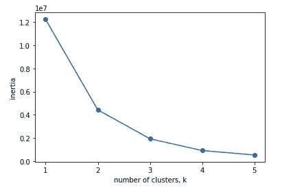
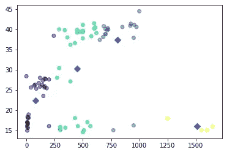
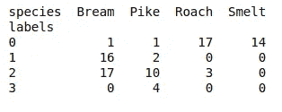
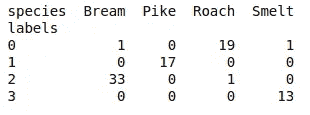

# 无监督学习初学者指南

> 原文：<https://medium.com/analytics-vidhya/beginners-guide-to-unsupervised-learning-76a575c4e942?source=collection_archive---------0----------------------->


PC: Quora

每当有人谈论机器学习时，他们总是会首先提到:监督学习、**非监督训练、**强化训练是主要的大类。

但是这种被称为无监督的技术背后真正的原因是什么呢？来，让我们用一些例子来看看。

大多数时候，我们建立模型来预测或预报一些事情。这种特殊类型的技术是众所周知的监督训练。在这种情况下，我们知道数据中的标签和模式。

但是*无监督学习*与此有点不同，我们训练我们的模型**在数据中找到隐藏的模式，以基于学习标记未来看不见的项目。**我们这样做

1.  没有特定的预测任务，
2.  有时对大数据进行降维

让我用一个“鱼测量”数据集给你演示一个例子。该数据集包括:

*   鱼的种类
*   鱼的重量
*   长度 1(鱼从鼻子到尾巴起点的长度，以厘米为单位)
*   长度 2(鱼从鼻子到尾巴切口的长度，单位为厘米)
*   长度 3(鱼从鼻子到尾巴末端的长度，以厘米为单位)
*   鱼的最大高度，以厘米为单位
*   宽度鱼的最大宽度，以厘米为单位

这里的任务是将鱼分成正确的种类。但不幸的是，我们不知道这些特征是如何相互关联的，所以给这些鱼贴上正确的物种类型标签是一项艰巨的任务。那么我们能做什么呢？

这就是无监督学习派上用场的地方。有许多预定义的算法，如 K-means 聚类、层次聚类、DBSCAN，我们也可以根据需要使用神经网络构建自己的聚类模型。在本文中，我不打算解释那些算法，为了简单起见，我们将在我们的示例中使用[**K-Means**](https://www.youtube.com/watch?v=f4jvifS41M4)**聚类。**

## **识别数据中可能的聚类数**

**在我们需要训练我们的模型之前，我们应该知道我们要标记多少不同类型的物种(集群)。那么怎么才能搞清楚呢？一种方法是我们可以简单地从用例中得到一个想法。例如，如果我们要根据一些属性对苹果和桔子进行分类，我们知道分类数是 2。同样，我们可以从利益相关者那里得到一些想法。但理想的方法是使用**惯性。**惯性是每个聚类的误差平方和。因此，惯性越小，集群越密集**

**首先，我们用不同的聚类数对数据进行聚类，并绘制聚类数与惯量的关系图。**

```
ks = range(1, 6)
inertias = []for k in ks:
    # Create a KMeans instance with k clusters: model
    model = KMeans(n_clusters = k)# Fit model to samples
    model.fit(samples)# Append the inertia to the list of inertias
    inertias.append(model.inertia_)# Plot ks vs inertias
plt.plot(ks, inertias, '-o')
plt.xlabel('number of clusters, k')
plt.ylabel('inertia')
plt.xticks(ks)
plt.show()
```

****

**惯性图**

**正如我们所见，随着集群数量的增加，惯性变得越来越低。那么最佳的集群数量是多少呢？**

*   **一个好的集群应该有紧密的集群**
*   **但是不能有太多的集群**
*   **一个简单的经验法则是找到图形的拐点**

**因此，在我们的鱼类聚类案例中，有 4 个聚类，其中惯性的递减斜率较低。**

## **检查群集的质量**

**既然我们知道了集群的数量，让我们建立一个模型并可视化结果。**

```
model = KMeans(n_clusters = 4)
model.fit(samples)labels = model.predict(samples)#lets see how the species are clustered based on the weight and height
xs = samples.iloc[:,0] #weight column
ys = samples.iloc[:,4] #height columnplt.scatter(xs, ys, c = labels, alpha = 0.5)
centroids = model.cluster_centers_
centroids_x = centroids[:,0]
centroids_y = centroids[:,4]plt.scatter(centroids_x, centroids_y, marker = 'D', s = 50)
plt.show()
```

****

**模型-1**

**视觉上，它似乎完美地聚集在一起。菱形标记是每个聚类的中心点(平均值)。但是记住我们的眼睛会欺骗我们！**

**让我们仔细检查我们的质量，通过计算物种是如何聚集成每个物种的。一个简单的方法是使用 pandas 交叉表方法。**

```
#lets create a dataframe of predicted labels and species actually the were
df = pd.DataFrame({'labels': labels, 'species': species})#lets do a crosstab evaluation to verify the quality of our clustering
ct = pd.crosstab(df['labels'], df['species'])
print(ct)
```

****

**标签和种类的交叉表视图**

**正如我们所看到的，聚类不够完美。一些来自鲷属物种的鱼聚集在标签 0、1 和 2 下。此外，其他物种也被错误地聚集成两个或多个不同的群(标签)。**

**那么这里的问题可能是什么呢？是的，你是正确的——我们拥有的特征在不同的度量中被缩放，因此**特征之间的均值和方差是不同的，这使得聚类不完美**。那么如何解决这个问题，改进模型呢？**

## **特征缩放和标准化**

**这是用于解决上述问题的两种不同的技术。**

**1 — **标准化**是我们将特性的标准偏差和平均值降低到 1 和 0，达到标准刻度的过程。**

**2 —另一方面，**归一化**是我们降低 0 和 1 之间的所有特征值范围的过程。**

**在我们的示例中，我们将标准化数据并查看群集质量。Scikit 中有许多技术可以用来做这件事。我们将使用*“standard scale*模块来实现我们的目标。**

```
scaler = StandardScaler()
kmeans = KMeans(n_clusters= 4)pipeline = Pipeline([('Scaler',scaler), ('KMeans',kmeans)])
pipeline.fit(samples)labels2 = pipeline.predict(samples)df2 = pd.DataFrame({'labels': labels2, 'species': species})ct2 = pd.crosstab(df2['labels'], df2['species'])print(ct2)
```

****

**标准化后的交叉表视图**

**万岁，现在的集群看起来比以前的好多了。我们仍然可以通过添加更多数据、调整 KMeans 的超参数以及使用特征缩放技术来改进这一点。这篇文章里我讲了很多东西。亲自动手尝试所有的概念。**

**哎呀，别忘了给 [Github 回购](https://github.com/Mathanraj-Sharma/Python/blob/master/Beginners%20guide%20to%20Unsupervised%20Learning/cluster.ipynb)打个星。**