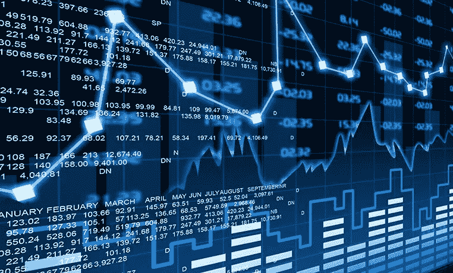

# 初级 Python 金融分析演练—第 1 部分

> 原文：<https://medium.com/analytics-vidhya/beginners-python-financial-analysis-walk-through-part-1-cbc89be80fbe?source=collection_archive---------16----------------------->

使用 Python 进行财务分析

# 介绍

你好，欢迎来到我的第一个编码项目！

我的名字是 Keith，我鼓励你阅读更多关于我的来理解我为什么分享这个代码以及我的目标是谁。

大约一年前，我发现自己陷入了许多大学毕业生都会经历的成长经历。我坐在那里盯着我的第一张工资支票，不知道该拿那些钱做什么！作为一名学生，没有太多多余的钱，我突然发现自己需要学习个人理财。在网上搜索建议，我发现了投资的普遍建议。有什么比被动地用你的钱去赚更多的钱更好的赚钱方式呢？建立一个经纪账户很容易，但是我应该买哪些股票呢？什么公司是我辛苦挣来的收入的避风港？什么是“风险回报权衡”？我的股票应用程序中的复杂曲线是什么意思，我如何使用它们来做出购买决定？我不知道从哪里开始。

在一个艰苦漫长的研究过程中，我学到了一些金融基础知识，但我发现浏览股票价格的电子表格令人深不可测和沮丧。有没有更简单的方法来汇总股市数据？我能想象每个公司的趋势来预测他们未来的行为吗？

图片改编自 https://images.app.goo.gl/NcCP3op6pVLzGhh2A

如果你发现自己在问这些问题中的任何一个，你就在你应该在的地方。现在是开始投资的最佳时机。就在过去几个月里，股市反弹至新高，道琼斯指数上涨了 50%以上。换句话说，你投资的每一美元都会得到 1.5 倍的回报！想象一下，如果你有 1.5 倍的工资！在这个项目中，我希望启动你的投资之旅，并向新手解释一些金融基础知识，使用 Python 来辩论和分析数据，并最终确定有前途的股票。代码很简单，大部分在两天内完成(超过两个周末)，尽管不可否认的是，制作它花了很长时间。

对于任何计算机科学家来说，这段代码只包含 Python 基础知识。对任何金融分析师来说，这种分析可能是他们在大一学的。然而，这个项目的简单明了正是需要分享的。这项工作突出了仅仅凭借**对计算机科学和金融的基本**理解，当然，还有一点点兴趣就能完成的事情。

所以，事不宜迟，我衷心欢迎你来看看我的第一个副业项目！

# 项目背景

这是我第一次尝试做“财务分析”。在这段代码中，我提取历史股票数据以了解历史最佳和最差日回报，查看回报标准差以估计波动性和风险，并可视化趋势以预测我感兴趣的公司股票的增长或衰退。

这并不意味着是一个完整的财务分析，虽然这个工具帮助我购买了一些盈利的股票，但我不建议用这个工具来取代深入的研究。

这个项目走查是为那些像我一样直到几个月前还不知道从哪里开始分析股票并找到合适的股票的人准备的。希望能分享到目前为止学到的东西，也邀请大家和我一起学习。

简单地说，我把我最近发现的两个兴趣(数据科学和投资)放在一起，看看会发生什么！

# 项目大纲

为了让我的代码尽可能容易理解，我把这个项目分成了几个小部分，如下文所述。关于每一步的更多细节，我将提供一些链接，链接到一些独立的博客文章，这些文章超越了高层次的总结，进入了更深入的讨论。

使用 Python 进行财务分析的步骤:

1.  项目介绍(第一部分)
2.  获取数据/数据准备/探索性数据分析(第二部分:[此处](/@chan.keith.96/beginners-python-financial-analysis-walk-through-part-2-7087764dce85)
3.  随时间可视化(第三部分:[此处](/@chan.keith.96/beginners-python-financial-analysis-walk-through-part-3-fb80de8e99c7))
4.  简单的风险管理:回报分析和标准差(第四部分:[此处](/@chan.keith.96/beginners-python-financial-analysis-walk-through-part-4-8ff5dd958af9))
5.  “预测”未来的股票走势:简单的移动平均线和布林线图(第五部分:[这里](/@chan.keith.96/beginners-python-financial-analysis-walk-through-part-5-3777eb708d01)
6.  结论:将所有这些放在一起(第 6 部分:[此处](/@chan.keith.96/beginners-python-financial-analysis-walk-through-part-6-ad396a787fd8))

到项目结束时，你应该能够使用 Python 提取和分析股票市场数据，了解每只股票的一些风险，透过日常交易的噪音观察更大的趋势，并确定要购买的估值不足的公司。我们开始吧！

 [## 初级 Python 金融分析演练—第 2 部分

### 使用 Python 提取历史股票市场数据

medium.com](/@chan.keith.96/beginners-python-financial-analysis-walk-through-part-2-7087764dce85)