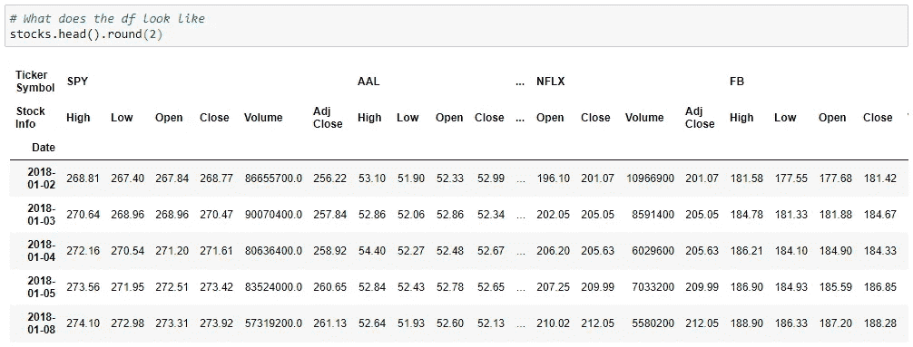
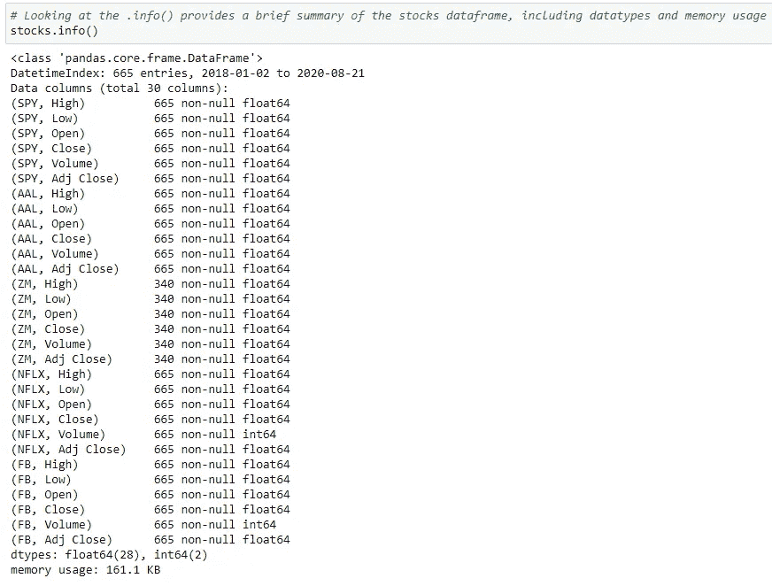
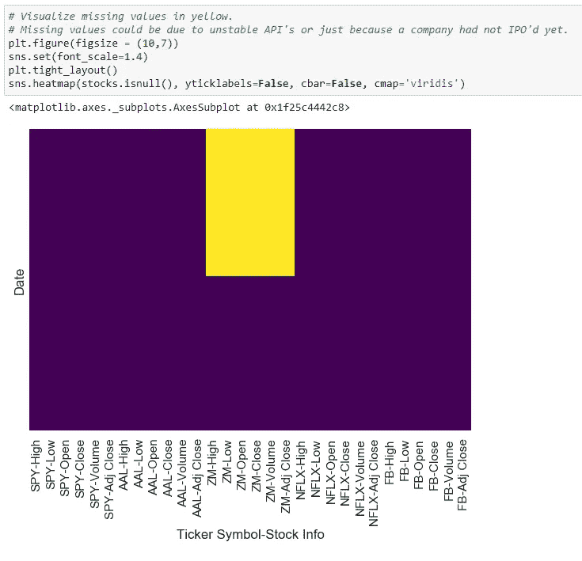

# 初级 Python 金融分析演练—第 2 部分

> 原文：<https://medium.com/analytics-vidhya/beginners-python-financial-analysis-walk-through-part-2-7087764dce85?source=collection_archive---------14----------------------->


提取数据。图片改编自[https://www . shutterstock . com/image-vector/hand-hold-magnet-over-data-privacy-1119911477](https://www.shutterstock.com/image-vector/hand-hold-magnet-over-data-privacy-1119911477)

# 使用 Python 提取历史股票市场数据

在我的金融分析附带项目的第 2 部分中，我演示了如何使用 Python 轻松提取历史股票市场数据。该代码可以提取多个公司的数据，因此我们可以将公司的表现与其竞争对手的表现进行比较。最后，我将向您展示我所采取的步骤，以理解我们所看到的内容，并确保数据为进一步的分析做好准备。

# 获取数据

您必须首先安装 pandas-datareader 来使用此代码。您可以通过在命令提示符下键入**pip install pandas-datareader**来安装这个 python 包。

pandas-datareader 软件包通过远程数据访问从各种互联网资源获取数据，并将其放入 pandas 数据框架中。pandas-datareader 包支持的各种 API 不断变化。在撰写本文时(2020 年 7 月 18 日)，它支持许多来源，如 Stooq、Tiingo 和 IEX，但不支持谷歌金融或雅虎金融。雅虎金融是股票数据 API 的黄金标准，直到 2017 年被关闭；然而，它在 2019 年又回来了。[来源](https://towardsdatascience.com/best-5-free-stock-market-apis-in-2019-ad91dddec984)

目前，雅虎财经还没有被正式列为 pandas-datareader [文档](https://pandas-datareader.readthedocs.io/en/latest/remote_data.html)的支持来源；然而，在仔细研究了 GitHub 之后，我发现仍然可以从雅虎财经中找到代码。这可能是几年前 pandas-datareader 支持雅虎时的产物。

理解 pandas-datareader 的优缺点:pandas-datareader 包依赖于各种 API 来获取股票数据。一般来说，API 可能不是稳定的数据源。但是，通过 pandas-datareader，雅虎财经 API 有几个优点:
1。调整后的收盘价股票市场数据可用。
2。最近的股票市场数据是可用的。不需要 API 键来获取股票市场数据
[来源](https://blog.quantinsti.com/stock-market-data-analysis-python/)

虽然我最终在这个项目中使用了 pandas-datareader，但是 yfinance 包也有很多实用功能。yfinance 包包装了新的 Yahoo Finance API，并提供了更详细的基本面数据，包括分钟级别的股票市场数据、市盈率、收入、EBIT、损益表、资产负债表、现金流等。经过这次和熊猫-datareader 的初步探索，希望用 yfinance 来补充财务分析。

# 数据准备

我们从选择想要分析的日期和股票代码开始这个项目。对我来说，在全球疫情新冠肺炎震动美国经济的时候，我对股票市场非常感兴趣。我选取了 2018 年 1 月到今天(2020 年 8 月中旬)的时间框架来分析。真的，我有兴趣看看新冠肺炎对 2020 年股市的影响，并让 2018/2019 年的数据设定一个比较基准。

在 COVID 经济中，我最感兴趣的是以下几只股票:

*   S&P500 交易所交易基金(SPY)——SPY 是一种交易所交易基金，跟踪标准普尔 500 股票市场指数，也就是在美国公开交易的 500 家最大的公司。因此，它被认为是整个美国经济的良好代表。
*   美国航空公司(AAL)——航空公司的业务大幅减少，截至 3 月 25 日，40%的预定航班被取消，4 月和 5 月 80-90%的国际航班被取消。据[商业内幕](https://www.businessinsider.com/coronavirus-airlines-bailout-empty-flights-requirement-2020-4)报道，由于载客量下降到 5-15 %,即使没有取消的航班也面临着运力下降。
*   Zoom (ZM) —电信公司是 COVID 经济中的大赢家。[美国消费者新闻与商业频道](https://www.cnbc.com/2020/04/03/how-zoom-rose-to-the-top-during-the-coronavirus-pandemic.html)表示，随着公司采用视频会议服务，家庭用户将欢乐时光和生日派对转移到虚拟平台，Zoom 应用的日下载量同比增长了 30 倍。
*   网飞(NFLX)和脸书(FB)——其他一些著名的大公司应该不需要解释

我使用 pandas-datareader 包查询所有数据，并将每个公司的数据编译到一个名为 stocks 的数据框架中。这将便于以后对所有公司进行比较。如果你想把所有的公司数据合并到一个数据框架中，或者把它们分开，这是个人的喜好。我已经给出了一个如何做到这两者的例子。对于每个股票代码，datareader 包返回当天的最高价和最低价、开盘价和收盘价以及每天的交易量。

```
# Set the start and end dates for your analysis. The end date is set to current day by default
start_date = '2018-01-01'
end_date = datetime.date.today().strftime('%Y-%m-%d')# List the ticker symbols you are interested in (as strings) 
tickers = ["SPY", "AAL", "ZM", "NFLX", "FB"]# I want to store each df separately to do Bollinger band plots later on
each_df = {}
for ticker in tickers:
    each_df[ticker] = data.DataReader(ticker, 'yahoo', start_date, end_date)# Concatenate dataframes for each ticker together to create a single dataframe called stocks
stocks = pd.concat(each_df, axis=1, keys = tickers)# Set names for the multi-index 
stocks.columns.names = ['Ticker Symbol','Stock Info']
```

股票数据框架应该是这样的。



图 1:股票信息的数据框架

现在我们已经将所有数据放在一个整洁的数据框架中，我们可以开始研究数据了。

# 探索性数据分析

在这一步，我试图更好地理解我在看什么。我试图发现模式，检测异常，并回答我有多少数据点这样的问题？有什么奇怪的吗？我漏了什么信息吗？

首先，我用熊猫。DataFrame.shape 属性来了解我的 DataFrame 中的总行数和列数，如图 2 所示。这让我大致了解了我正在处理的数据的形状和大小，这是 665 天的市场交易。作为一种直觉检验，对于大约 2.5 年的数据来说，这听起来是正确的。记住，我们只有非节假日工作日的股票数据。


图二。测试。形状属性

如图 3 所示，我使用熊猫。DataFrame.info()方法查看股票数据帧的简要摘要，包括数据类型和内存使用情况。使用。info()方法，您可以确保数据是您所期望的数据类型，也就是说，当您真正想处理浮点数时，您不想处理字符串格式的数字。



图 3。测试。信息()方法

在这里，我可以看到我拥有的 Zoom(ZM)股票的数据比其他公司的少得多。我们将暂时搁置这一观察，稍后再来讨论。

我使用。图 4 中的 describe()方法来了解我的数据的描述性统计。这一步有助于您了解正在处理的值的相对范围，并帮助您识别任何奇怪的值或异常值。这里似乎没有很多奇怪的异常值。


图 4。使用。describe()方法来查看统计数据

最后，我喜欢使用热图来可视化缺失的数据。意识到数据差距总是一种好的做法，尤其是在进行平均值、中间值、最小值和最大值等汇总计算之前。

对于某些代号，您可能会看到一些缺失值。不要惊慌，大多数丢失的价值都是在公司首次公开募股(IPO)或公开交易之前。因此，在股票上市之前，没有关于其股价的数据。这正是我们在图 5 中看到的 Zoom，该公司于 2019 年 4 月 18 日首次公开募股。在此之前的任何日期都没有数据，缺少的数据以黄色显示。



图 5。使用热图可视化缺失值

# 结论

这绝对是项目中最不‘性感’的部分，但是数据准备是我们后面可以做的分析的基础。如果你像我一样，看了看股票数据框架中的所有市场数据，可能会有一些数字在你的大脑中游动，嘲笑你无法理解这一切。在下一部分中，我们将研究如何可视化庞大的股票数据框架，并将大量的数字浓缩成易于理解的图表。

*点击链接，跟随项目进入第 3 部分！*

[](/@chan.keith.96/beginners-python-financial-analysis-walk-through-part-3-fb80de8e99c7) [## 初级 Python 财务分析演练—第 3 部分

### 随着时间的推移可视化

medium.com](/@chan.keith.96/beginners-python-financial-analysis-walk-through-part-3-fb80de8e99c7)