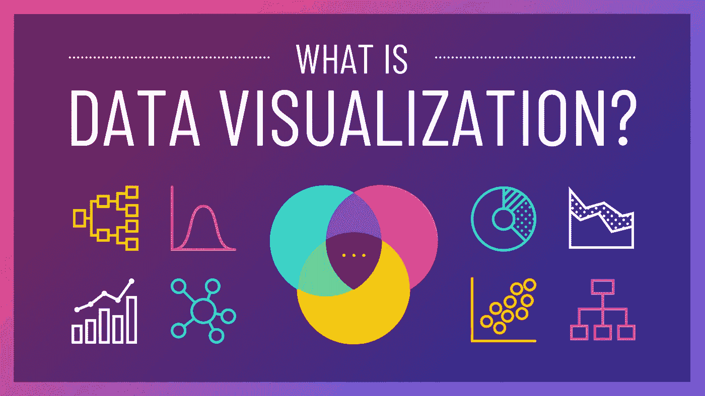
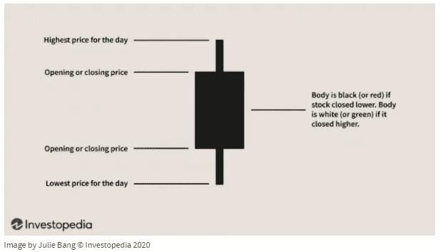
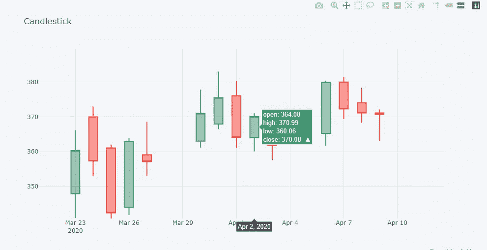
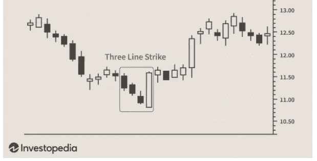

# 初级 Python 财务分析演练—第 3 部分

> 原文：<https://medium.com/analytics-vidhya/beginners-python-financial-analysis-walk-through-part-3-fb80de8e99c7?source=collection_archive---------20----------------------->



数据可视化。图片改编自[https://venngage.com/blog/data-visualization/](https://venngage.com/blog/data-visualization/)

# 随着时间的推移可视化

欢迎来到我的财务分析项目的第 3 部分，在这里我们开始使用数据可视化来理解我们在一个巨大的数据框架中的所有数字。数据可视化通过将模式、趋势和异常值呈现在表面上，使人脑更容易理解大数据。我们将使用两个图表来揭示隐藏在数据中的故事。故事时间到了！

# 一段时间内的收盘价

第一个要创建的可视化是你每天在新闻上或手机投资应用中看到的。一段时间内股票收盘价的折线图是即时观察高水平趋势和不稳定价格运动的好方法。

Python 使得这些数据使用起来非常简单，仅用几行代码，我们就将 665 行数据转换成一个浓缩的可视化图形。首先，让我们创建一个名为“closing_prices_df”的数据框架，其中只包含每只股票的调整后收盘价。我们可以用熊猫的横切面法很容易地做到这一点。DataFrame.xs()。

```
# Create a dataframe for the closing_prices of the stocks
closing_prices_df = stocks.xs(key='Adj Close',axis=1,level=1)
```

然后，我们可以使用 plotly 软件包绘制一段时间内的收盘价。

```
# Create a dataframe for the closing_prices of the stocks
closing_prices_df = stocks.xs(key='Adj Close',axis=1,level=1)# Using plotly to create line plot of stock closing prices over time. 
# You can double click on the ticker symbols in the legend to isolate each ticker

fig = px.line(closing_prices_df, x=closing_prices_df.index, y=closing_prices_df.columns, title=”Adjusted Closing Prices”)
fig.update_layout(hovermode=’x’,yaxis_title=”Price”)
fig.show()
```

图 1:选定股票的每日调整收盘价

我使用 plotly 包绘制了这个图表，我喜欢它的易用性、美观性，尤其是交互性。您可以通过将鼠标悬停在图表上来缩放、平移、切换公司和比较数据，所有这些都在 Python 笔记本中完成！试试吧！

同样，这个折线图对于观察趋势和异常非常有用。例如，在图 1 中，您可以在图表的右侧看到 2020 年 3 月前后几只股票的大幅下跌。大约在这个时候，全球性的疫情新冠肺炎让美国公众感到恐惧，并在人们准备应对全球经济放缓时导致大量抛售股票。

通过仔细研究图表，我们可以用数据来讲述故事。

Zoom technologies 无视股市趋势。当其他公司挣扎着浮在水面上时，Zoom 绑上火箭推进器，一飞冲天。事后看来，这并不奇怪。每个欢乐时光、生日晚宴和家庭团聚都转移到 Zoom 的虚拟平台上，作为人们在没有物理距离的情况下保持社交联系的一种方式。随着在家工作的文化迅速成为常态，公司也广泛采用了这一平台。

我让你来摆弄这张图表。调查每一个高峰，每一个低谷，每一个不规则。通过查看历史股市表现，尝试发掘更多故事。令人着迷的是，股票市场与政治和时事的联系如此紧密。

# 烛台图表

接下来，我创建一个蜡烛图。蜡烛图是一种常用的显示股票价格变动的金融视觉工具。它们比折线图包含更多的信息，包括单日开盘价、收盘价、最高价和最低价。在我的蜡烛图中，每天的价格波动被总结成一个“蜡烛图”。烛台的结构如图 2 所示。



图 2:烛台结构。图片改编自[https://www.investopedia.com/terms/c/candlestick.asp](https://www.investopedia.com/terms/c/candlestick.asp)

如果股票收盘高于开盘价，烛台是绿色的。否则，如果白天价格下跌，烛台就是红色的。快速看一下蜡烛线的长度就能看出当天的波动。因为蜡烛图包含如此多的信息，仔细观察蜡烛图可以揭示投资者对证券的情绪。例如，一根长长的绿色烛台表示乐观的情绪。

这里，我们使用 plotly 为我们感兴趣的公司创建了自己的蜡烛图。

```
import plotly.graph_objects as go# User input ticker of interest
ticker = "SPY"fig = go.Figure(data=[go.Candlestick(x=each_df[ticker].index,
                open=each_df[ticker]['Open'],
                high=each_df[ticker]['High'],
                low=each_df[ticker]['Low'],
                close=each_df[ticker]['Close'])])fig.update_layout(
    title='Candlestick Chart for ' + ticker,
    yaxis_title='Price',
    xaxis_title='Date',
    hovermode='x'
)
fig.show()
```

我不会在这里嵌入 plotly 图表，但图 3 中显示了一个快照。



图 3:网飞烛台图表

除了作为一种有效的和视觉上吸引人的方式来解释股票价格运动，蜡烛图经常被用于基于*蜡烛图*的交易策略中。多个烛台在一起可以形成可识别的模式，投资者用它作为可操作的买入或卖出信号。这些图案有三只黑乌鸦、乌云盖顶，甚至弃婴等五颜六色的名字。为了说明这样一种模式，根据“蜡烛图百科全书”的作者 Bulkowski 的说法，图 4 所示的“三线打击”预测下降趋势反转的准确率为 83%。不用说，任何在 83%的时间里有效的交易信号都会让你在股市中获得显著的优势！



图 4。看涨三线 Strick 烛台模式。图片改编自[https://www . investopedia . com/articles/active-trading/092315/5-most-powerful-烛台模式. asp](https://www.investopedia.com/articles/active-trading/092315/5-most-powerful-candlestick-patterns.asp)

我不会在这里讨论这些模式，但是我鼓励感兴趣的读者去查阅它们。Investopedia 有一篇关于 [5 种最强大的烛台模式](https://www.investopedia.com/articles/active-trading/092315/5-most-powerful-candlestick-patterns.asp)的文章。

# 结论

现在，我们已经创建了两个快速可视化工具来理解趋势和异常，我们离使用趋势来做出股票的买入/卖出决策又近了一步。在这个项目的第 4 部分，我们将介绍简单的风险管理，或者如何使用风险回报权衡来寻找适合你风险承受能力的公司。如果这对你来说还不算什么，没问题！去看看！

[](/@chan.keith.96/beginners-python-financial-analysis-walk-through-part-4-8ff5dd958af9) [## 初级 Python 财务分析演练—第 4 部分

### 简单的风险管理

medium.com\](/@chan.keith.96/beginners-python-financial-analysis-walk-through-part-4-8ff5dd958af9)