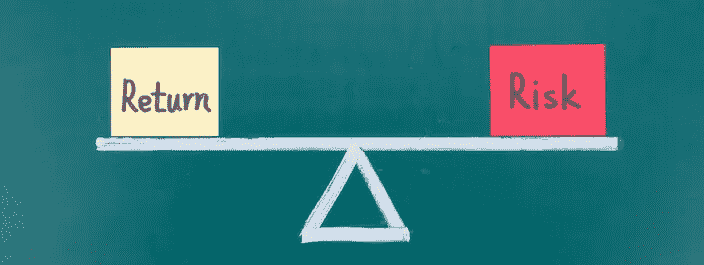
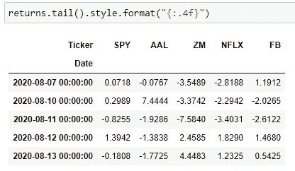
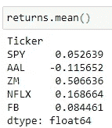
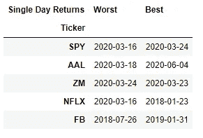
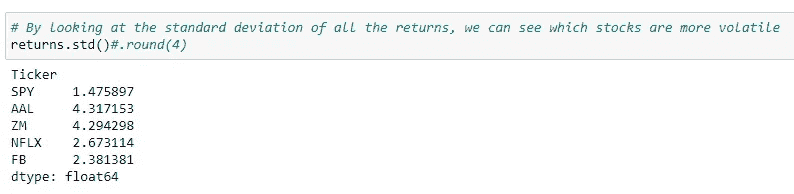
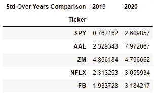
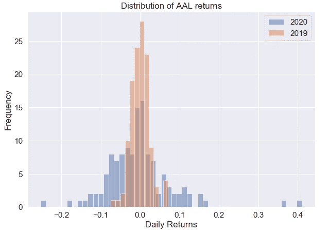
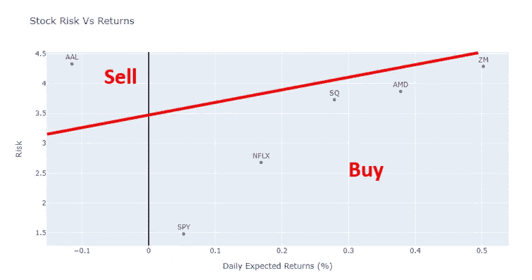

# 初级 Python 财务分析演练—第 4 部分

> 原文：<https://medium.com/analytics-vidhya/beginners-python-financial-analysis-walk-through-part-4-8ff5dd958af9?source=collection_archive---------18----------------------->



风险回报权衡。图片改编自[https://blog.wealthfront.com/risk-return/](https://blog.wealthfront.com/risk-return/)

# 简单的风险管理

你已经成功地做出了更明智的股票决策！欢迎来到财务分析项目的第 4 部分。在这一部分，我将介绍如何量化股票随时间的表现，并将其与每项投资的风险进行比较。理解风险和回报之间的关系对你做出长期有效的决策至关重要。

# 退货分析

在[第三部分](/@chan.keith.96/beginners-python-financial-analysis-walk-through-part-3-fb80de8e99c7)中，我们看到大多数公司的股票随着时间的推移而上涨，但我真正感兴趣的是了解它们上涨了多少。把数字给我！让我们通过关注收盘价并评估每天的百分比变化来量化这些公司的回报。我可以用熊猫轻松做到这一点。函数的作用。

在[第三部分](/@chan.keith.96/beginners-python-financial-analysis-walk-through-part-3-fb80de8e99c7)中，我创建了一个名为‘closing _ prices _ df’的数据框架来存储每只股票的每日收盘价。现在，让我们创建一个新的数据框架来存储收盘价的每日百分比变化。我称之为“回报”数据框架。

```
# Create a new df called returns that calculates the return after each day.
returns = pd.DataFrame()# We can use pandas pct_change() method on the 'Adj Close' column to create a column representing this return value. 
for ticker in tickers:
    returns[ticker]=closing_prices_df[ticker].pct_change()*100
```



图 1:查看每日退货的退货数据框架的尾部

使用图 1 中的数据框架，我们现在可以看到一只股票每天经历了多少盈亏。例如，AAL 在 8 月 10 日上涨了 7.44%，但在接下来的三天里连续下跌了 1.92%、1.38%和 1.77%。然而，当看所有这些数字时，很难看到全局。

我们来总结一下数据，看看日均收益。平均回报是投资随时间变化的期望值。作为投资者，你想知道从你的投资中能得到什么。我们可以简单地通过使用。mean()函数。



图二。每家公司的平均回报

在图 2 中，我们看到了大约 2.5 年的平均回报率。换句话说，如果你两年半前在脸书投资，你可以预期你的投资价值每天增长 0.08%**。**

**但是，在查看像 mean 这样的不完整数据集的聚合函数时，您应该小心。请看图 2，Zoom 的平均日回报率为 0.5%，是 5 家公司中最高的。请记住，在这个项目的第 2 部分中，我们丢失了 Zoom 的一半数据。换句话说，爆炸式增长不是过去 2.5 年的平均值，而是其中一半的时间。**

**最后，AAL 的预期收益是负的。不用说，我们应该努力避免让你赔钱的投资！甚至在冠状病毒之前，美国航空公司的股票就已经在下跌。当然，COVID 加速了它的衰落。**

# **最佳和最差日收益**

**接下来，出于好奇，我看看这些公司最好和最差的单日回报率。**

```
# Date of worst single day returns for each company.
worst = returns.idxmin()# Date of best single day returns for each company.
best = returns.idxmax()# Create a dataframe to see best and worst day returns by company
best_and_worst_returns = pd.DataFrame({"Worst":worst, "Best":best})
best_and_worst_returns.columns.names = ['Single Day Returns']
best_and_worst_returns.index.names = ['Ticker']
best_and_worst_returns
```

****

**图 3:公司单日最佳和最差回报**

**不出所料，许多最糟糕的单日回报发生在 2020 年 3 月。全球疫情危机和石油输出国组织国家间同时爆发的石油价格战导致美国市场崩溃。当时，高盛预测美国 GDP 将收缩 24%，创下历史最大跌幅。不用说，市场对这种熊市投机的反应是剧烈波动，3 月中旬被证明是 2020 年许多股票的最低点。**

**然而在图 3 中，你也可以看到间谍在最差回报的一周后获得了最佳回报。整个市场在这个月非常不稳定，但投资者在这个时候开始重拾对经济增长的希望。当使用不同的日期进行最佳/最差日回报分析时，你经常会注意到这些日期与重大新闻相吻合。在谷歌上快速搜索每个日期，了解是什么导致了如此高的回报率，这通常很有意思。**

**除了查看最佳和最差日收益，我们还可以从收益数据图中收集更多信息。接下来，我们将讨论收益标准差。**

# **返回标准偏差**

**识别和分析投资风险的方法有很多，良好的风险管理对于做出明智的决策至关重要。衡量风险的基本方法之一是通过标准差。将标准差应用于回报率可以揭示投资的历史波动性。Investopedia 简明扼要地总结了这一观点；“标准差高的股票波动性更大，因此股票的风险也更高。”然而，较低的标准差并不总是可取的，因为它也表明较低的潜在回报。这种风险回报权衡的平衡取决于投资者及其承担风险的意愿。**

**让我们使用图 4 中的代码来计算收益的标准差。**

****

**图 4。回报率的标准差**

**从图 4 中，我们可以看到间谍的标准差最低。这意味着间谍是最安全的投资之一，这解释了为什么间谍是最大的 ETF，也是世界上最受欢迎的 ETF 之一。这是有道理的，因为 SPY 包含 500 家公司的股票，本质上是一种多元化投资，这意味着如果 500 家公司中的一家破产，其他 499 家公司将帮助减轻股东的损失。**

**回想一下，returns df 包含 2018 年至今(2020 年 8 月中旬)的市场价格。因为像 2020 年新冠肺炎这样的剧烈事件，我有兴趣将 2020 年和 2020 年之前的数据分开。我想看到 2019 年和 2020 年之间的逐年比较，我创建了一个新的数据框架来看这个。**

```
# Looking at the standard deviation over YTD 2020 just to see effect of coronavirus
std_2020 = returns.loc['2020-01-01':'2020-08-01'].std()# as compared to the same time period in 2019
std_2019 = returns.loc['2019-01-01':'2019-08-01'].std()# Create a dataframe to compare year to year stdev by company
std_comparison_df = pd.DataFrame({"2019":std_2019, "2020":std_2020})
std_comparison_df.columns.names = ['Std Over Years Comparison']
std_comparison_df.index.names = ['Ticker']
std_comparison_df
```

****

**图 5。2019 年至 2020 年回报率标准差的逐年比较**

**通过比较 2019 年至 2020 年的标准差，很明显，所有股票的波动性都高于间谍。我们还看到 AAL 和 ZM 的波动性最高。也许这是由于冠状病毒的情况，这种情况几乎使航空公司停飞，并刺激了一种新的在家工作的文化，使 Zoom 的电信业务大放异彩。**

**以目前 2020 年的疫情来看，2020 年的标准差大于 2019 年应该不足为奇；由于冠状病毒，股票市场一片混乱。观察 SPY，2020 年的波动性大约是现在的 3-4 倍。通过使用分布图来可视化每日回报的分布，我们可以更好地理解这些数据。**

# **回报分布图**

**让我们用分布图来画出每日收益。**

```
# User input ticker of interest
ticker = “AAL”a = returns[ticker].loc[‘2020–01–03’:’2020–07–01'].dropna()
b = returns[ticker].loc[‘2019–01–03’:’2019–07–01'].dropna()plt.figure(figsize = (10,7))
a.plot(kind=’hist’, label=’2020', bins=50, alpha=0.5)
b.plot(kind=’hist’, label=’2019', bins=12, alpha=0.5)
plt.title(‘Distribution of ‘ + ticker + ‘ returns’)
plt.xlabel(‘Daily Returns (%)’)
plt.legend()
plt.show()
```

****

**图 6。美国航空公司(AAL)2019-2020 年每日收益分布对比**

**在图 6 中，我们看到了 2019 年与 2020 年 AAL 每日回报率的差异。我们看到，与 2020 年的广泛分布相比，2019 年的回报分布范围更窄。投资者对航空公司的情绪在 2020 年大幅波动。大量航班取消和休闲航空旅行的减少导致投资者怀疑航空公司的利润并抛售股票。然而，疫苗开发消息或 COVID 病例减少的每一个暗示都导致航空公司股票上涨。这种反复发生了多次，导致了如图 6 所示的日回报率的广泛分布。**

**虽然我在这里看到的是冠状病毒引起的波动性变化，这导致了动荡和夸张的价格波动，但你可以延长分析期，以了解过去 X 年公司股票有多稳定。**

# **风险与回报**

**综上所述，理解风险回报权衡对于做出个人投资决策至关重要。让我们在同一张图上画出风险与回报的关系。**

```
fig = px.scatter(returns, x=returns.mean(), y=returns.std(), text=returns.columns, size_max=60, labels={
                     "x": "Daily Expected Returns (%)",
                     "y": "Risk",
                 },
                title="Stock Risk Vs Returns")
fig.update_xaxes(zeroline=True, zerolinewidth=2, zerolinecolor='Black')#, range=[-0.005, 0.01])
fig.update_yaxes(zeroline=True, zerolinewidth=2, zerolinecolor='Black')#, range=[-0.01, 0.1])
fig.update_traces(textposition='top center')fig.show()
```

****

**图 7。我们感兴趣的公司的风险与回报**

**绘制风险与回报图只会让你对两家公司的相对表现有所了解。这个图，当与你个人的风险回报容忍度相结合时，可以告知你买入/卖出的决定。常识告诉我们，我们希望风险最小化，回报最大化。随着风险的增加，我们期望更高的回报，但总有一定的风险，投资者不再认为回报是值得的。红线以下的公司被认为是值得投资的，而红线以上的公司则不值得购买。图 7 中区分买入和卖出的红线是任意画出的，并且根据你承担风险的意愿而变化。作为一名年轻的投资者，我可能愿意承担更多的风险，希望获得更高的回报(从而将红线拉得更高)，但这与接近退休年龄的人(将红线拉得更低)是非常不同的策略。此外，如果情绪投资者对股价的大幅波动做出负面反应，他们可能会选择承担较少的风险。**

**然而，值得记住的是这个情节仅仅基于历史数据。在图十中，AAL 显示了高风险和负回报，但这反映了冠状病毒的剧烈影响。没有人知道随着人们恢复航空旅行，AAL 股票是否会在不久的将来实现天价上涨。另一方面，美国航空公司也可能申请破产。**

# **结论**

**在本节中，我们将建立对风险和回报的基本理解。风险和回报是非常有价值的信息，让投资者了解购买股票的预期。从风险和回报中，你可以衡量股票在一年中的波动幅度。然而，它并没有告诉你未来价格运动的方向。我将在下一节，第 5 部分，讲述如何使用简单的均线和布林线来猜测价格方向。我们在那里见！**

**[](/@chan.keith.96/beginners-python-financial-analysis-walk-through-part-5-3777eb708d01) [## 初级 Python 财务分析演练—第 5 部分

### “预测”未来的股票走势

medium.com](/@chan.keith.96/beginners-python-financial-analysis-walk-through-part-5-3777eb708d01)**