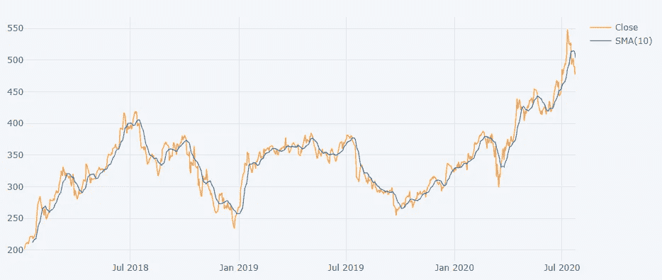
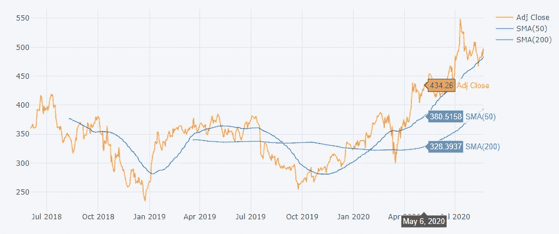
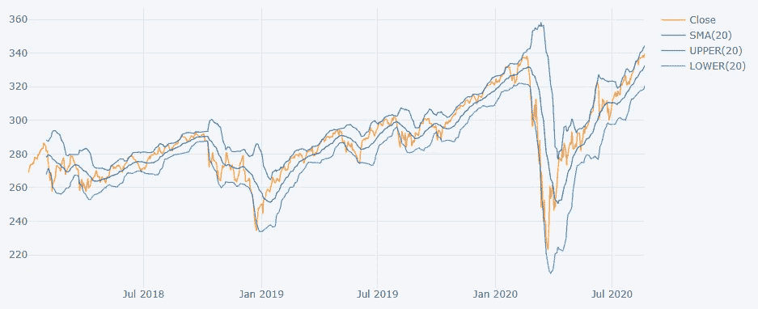
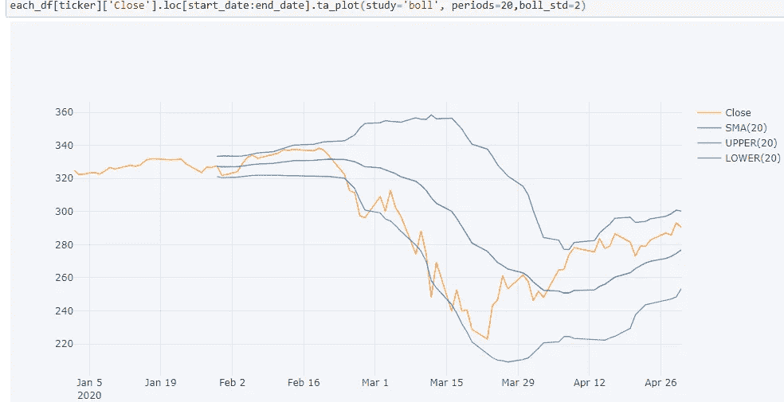

# 初级 Python 财务分析演练—第 5 部分

> 原文：<https://medium.com/analytics-vidhya/beginners-python-financial-analysis-walk-through-part-5-3777eb708d01?source=collection_archive---------19----------------------->


图片改编自[https://www . dnaindia . com/personal-finance/report-India-s-personal-wealth-to-grow-13-by-2022-2673182](https://www.dnaindia.com/personal-finance/report-india-s-personal-wealth-to-grow-13-by-2022-2673182)

# “预测”未来的股票走势

伙计，我很高兴你来了！这一部分涵盖了我认为是整个项目中最令人兴奋的部分！在这一点上，如果你已经通读了项目的第 1-4 部分，你就会理解我评估股票历史表现的步骤，但是我们都在问的问题是“我如何预测一只股票是否会上涨并让我变得富有？”这可能是你在这里的首要原因；你想知道如何选择一只更有可能获得更高回报的股票。让我们看看如何使用简单的移动平均线和布林线图来实现这一点。让我们赚钱吧！

# 简单移动平均线

我们先来了解一个简单的均线(SMA)。SMA 是一段时间内不断更新的平均价格。例如，10 天移动平均线将对第一个数据点的前 10 个收盘价进行平均。下一个数据点将加上第 11 个收盘价，并减去第一天的价格，然后取新的平均值。这个过程在滚动的基础上继续。实际上，移动平均线消除了日常波动，更好地显示了股价的潜在趋势。较短的时间范围不太平滑，但能更好地表示源数据。

有许多方法来绘制移动平均线，但为了简单起见，这里我使用袖扣包来完成。

```
# The cufflinks package has useful technical analysis functionality, and we can use .ta_plot(study=’sma’) to create a Simple Moving Averages plot# User input ticker of interest
ticker = “NFLX”each_df[ticker][‘Adj Close’].ta_plot(study=’sma’,periods=[10])
```



图 1:覆盖在 NFLX 收盘价上的 10 天简单移动平均线

上图 1 显示了网飞(NFLX)收盘价的 10 天移动平均线。很明显，均线减少了收盘价的波峰和波谷，给了潜在趋势更好的可视性。在过去的 2 年里，我们可以清楚地看到股价呈上升趋势。

# 死亡十字架和黄金十字架

在这个概念的基础上，你可以比较不同时间段的多个 SMA。当短期均线持续位于长期均线之上时，我们可以预期股价会上涨。有两种流行的交易模式利用了这个概念:死亡交叉和黄金交叉。我将求助于 Investopedia 的定义:“当 50 天均线低于 200 天均线时，死亡交叉就发生了。这被认为是一个熊市信号，进一步的损失正在酝酿之中。当短期 SMA 突破长期 SMA 时，就会出现黄金交叉。这可能预示着未来还会有进一步的上涨。”[来源](https://www.investopedia.com/terms/s/sma.asp)

让我们来看看叠加两个形状记忆合金到网飞。

```
# User input ticker of interest
ticker = “NFLX”
start_date = ‘2018–06–01’
end_date = ‘2020–08–01’
each_df[ticker][‘Adj Close’].loc[start_date:end_date].ta_plot(study=’sma’,periods=[50,200])
```



图 2:一个死亡十字架后面跟着一个黄金十字架的例子

从图 2 中我们可以看到，网飞是一个有趣的案例研究。大约在 2019 年 8 月，我们会看到一个死亡十字路口。当时我没有关注网飞的股价，但它似乎一直在下跌。我会把它作为一个练习留给你来解释下降。不久之后，死亡十字之后是 2020 年 2 月附近的黄金十字。自从二月份的黄金十字勋章以来，网飞的股票一直在上涨。

现在我们知道冠状病毒解释了那段时间的许多价格变动。随着越来越多的人呆在家里，越来越多的人转向网飞作为家中唯一的娱乐来源。在接下来的几个月里，网飞的付费用户数量大幅增长。这并不奇怪。

然而，令我感兴趣的是，在 2020 年 2 月至 3 月的重大经济地震期间，当股市的其余部分暴跌时，我们没有看到死亡交叉。恰恰相反，我们实际上看到了一个金色的十字架！如果我们关注橙色线，我们会看到网飞的股价在 2020 年 3 月也受到了重创，所以这并不是说网飞没有感受到 COVID 的影响。要点是，股票下跌是由于一次性事件，而不是趋势，如 SMA 所示。如果在 3 月份，我们仅仅基于 50 天和 200 天的均线进行交易，我们将会获得所有的收益。

接下来，我将谈论另一个用来预测股票走势的工具。

# 布林线图

布林线图是一种技术分析工具，由三条线组成，一条简单移动平均线(SMA)和平均线上下两条边界线。最常见的是，边界带是 20 天均线的+/- 2 标准差。

布林线图的一个主要用例是帮助理解超卖股票和超卖股票。当股票的市场价格越来越接近高波段，股票被认为是超买，当价格越来越接近低波段，股票越来越超卖。虽然不建议作为买入/卖出的唯一依据，但上下波段附近的价格波动可以预示股票的异常高/低价格。后者是我通常寻找的，因为我希望以低价买入超卖股票，让它们的价值朝着移动平均线回升。

布林线也允许交易者监控和利用波动变化。正如我们之前在本项目的第 4 部分中了解到的，股票价格的标准差是波动性的一种度量。因此，当股价波动时，上下波段会扩大。相反，当市场平静下来时，波段收缩；这叫做挤压。交易者可能会将挤压视为交易机会的潜在迹象，因为挤压往往伴随着波动性的增加，尽管价格运动的方向是未知的。

让我们在深入之前先画出布林线，这样我们就可以看看我在说什么了。袖扣包再次使绘制布林线变得非常简单，如图 3 所示。

```
# User input ticker of interest
ticker = "SPY"

each_df[ticker]['Close'].ta_plot(study='boll', periods=20,boll_std=2)
```



图 3。间谍 2018–2020 年布林线图

在上升趋势中，价格会在高波段和移动平均线之间反弹。在这个上升趋势中，低于移动平均线的价格交叉可能是增长放缓或趋势反转的迹象。您可以在下面的图 4 中看到这个交叉点。在这里，我绘制了间谍 2020 年前 4 个月的布林线。看看 2 月 18 日左右橙色收盘价线是如何跌破 20 天 SMA 的。在此之前，间谍有一个稳定的上升趋势。之后，出现了大幅下跌。



图 4。不寻常的间谍市场价格 2020 年 2 月至 3 月

正如你在上面看到的，2020 年 2 月到 3 月这段时间显示了一个主要的下降趋势。一个月内 4 次跌破低波段是不寻常的。对于标准偏差，95%的值应该在+/- 2 标准偏差范围内，所以我们看到了非常不寻常的活动。当然，这是可以理解的，因为冠状病毒的恐慌在这个时间段袭击了美国。这是一个很好的例子，说明了强劲的下跌趋势是什么样子的。在接下来的几个月里，我们看到了强劲的上升趋势。

# 结论

在这一节中，我们学习了如何使用均线和布林线图，从不稳定的交易数据中抽身出来，关注趋势。在每天的涨跌中进行日内交易很难获利，但如果你能发现强劲的增长趋势，获利就简单多了。使用这些技术，你也可以识别趋势反转，并在趋势早期买入股票。在较短的时间范围内，你可以使用布林线来寻找低估或高估的股票。有了这种分析，你就有希望获得更多信息，并根据数据做出购买股票的决定。在下一节也是最后一节，我们将总结我们所学的一切。

[](/@chan.keith.96/beginners-python-financial-analysis-walk-through-part-6-ad396a787fd8) [## 初级 Python 财务分析演练—第 6 部分

### 把所有的放在一起

medium.com](/@chan.keith.96/beginners-python-financial-analysis-walk-through-part-6-ad396a787fd8)