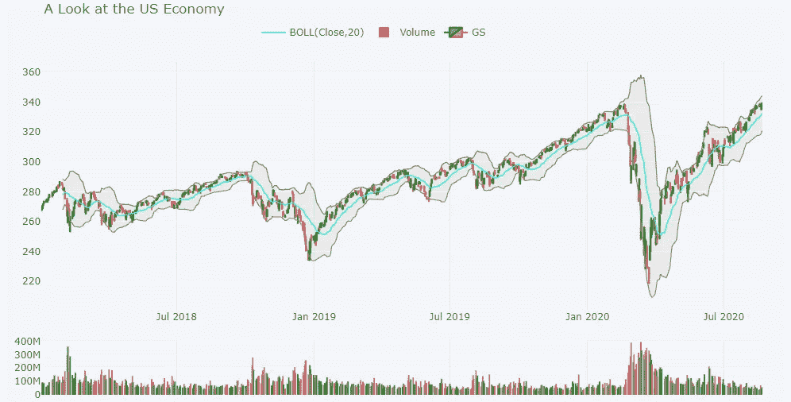
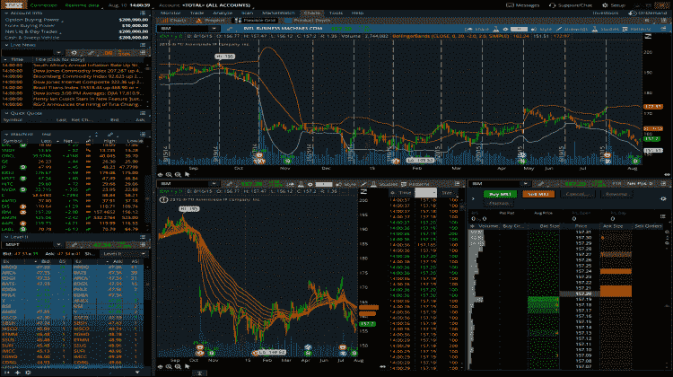

# 初级 Python 财务分析演练—第 6 部分

> 原文：<https://medium.com/analytics-vidhya/beginners-python-financial-analysis-walk-through-part-6-ad396a787fd8?source=collection_archive---------22----------------------->


你成功了！图片改编自[https://manchesterfbc.com/inside-fbc/finish-line](https://manchesterfbc.com/inside-fbc/finish-line)

# 把所有的放在一起

你成功了！最后，我们在项目的结尾，把所有的东西放在一起，还有一个情节要制作。

我结合了蜡烛图，简单均线，布林线图，甚至在一个图中添加了交易量。袖扣包有一个非常漂亮的 QuantFig 类，可以为此目的向同一个图添加多种技术分析。

```
df_of_interest = each_df['SPY']
qf = cf.QuantFig(df_of_interest,title='A Look at the US Economy',legend='top',name='GS',up_color='green', down_color='red')
qf.add_bollinger_bands(periods=20, boll_std=2, colors=['cyan','grey'], fill=True,)
qf.add_volume(name='Volume',up_color='green', down_color='red')
qf.iplot()
```



图一。蜡烛图、简单移动平均线、布林线图和交易量的组合

# 结论

通过这个项目，我同时学到了很多关于编码和投资的知识。这篇博客文章记录了我所学到的东西，我希望把这些信息传达给你。开始投资永远不会太晚，当你开始投资时，我鼓励你[回顾这个项目](/@chan.keith.96/beginners-python-financial-analysis-walk-through-part-1-cbc89be80fbe)，记住你所学到的基本面！

总之，我们已经成功地了解了如何使用 Python 来提取和理解基本的股票信息。使用一些基本的 Python 代码，我们能够查询股票数据，了解它们的历史回报，进行基本的风险分析，甚至使用过去的表现(试图)预测未来的市场行为。

在这个项目进行到一半的时候，我了解到像 Think 或 Swim 和 Yahoo Finance 这样的平台实际上有很多可视化功能。虽然它们提供了比本文所涉及的更全面的可视化，但这些平台也可能一开始就令人生畏。我认为在你的市场研究中加入更高级的概念和分析之前，先了解基础知识是有好处的。



图二。其他复杂的可视化平台

这仅仅是旅程的开始，随着我对编码和金融了解的加深，我想对这一分析进行补充。目前，我想探索的一些方向包括更多的技术分析，使用 yfinance 的基本面分析，以及使用 Dash 或 PowerBI 创建用户友好的仪表板。

我希望你喜欢这个财务分析演练，并发现它有指导意义，初学者友好，易于遵循。请在下面的评论区让我知道你最喜欢什么，以及你希望在未来的分析中看到什么！

如果你喜欢你所读的，请伸出手[连接](/@chan.keith.96/about-me-50d21398984d)！我总是欢迎有机会与其他程序员、投资者或热心的学习者交谈！