# 编程:Git 初学者

> 原文：<https://medium.com/analytics-vidhya/beginners-with-git-c1edf326665?source=collection_archive---------43----------------------->

了解 Git 以及如何在我们的项目中使用它:)

注 1:这是我第一次写博客，如果有任何错误发生，我想道歉😢🙏。

注 2:对不起，我的英语很差呵呵呵😂

注 3:2020 年 4 月 14 日，Git 宣布私有库现在是免费的，根据本文

# 内容列表

1.  Git 是什么？
2.  安装 Git
3.  开源代码库
4.  创建第一个项目
5.  将项目上传到 GitHub
6.  Git 命令和备忘单

# **1。Git 是什么？**

Git 是一个版本控制系统，它管理、编辑、更改、跟踪我们项目中的文件，并协调多人对这些文件的工作。这在开发团队中非常常见，可以帮助他们在线存储源代码，并与其他同事共享，而无需使用 USB 驱动器。

例如，一个名为 A 的开发团队创建了一个包含大量文件的项目。USB 可以帮助存储这些文件，但如果 USB 丢失或损坏了怎么办？所有存储在里面的备份源代码文件将全部消失！为了解决这个事情，Git 和 GitHub 就派上了用场。A 可以用 Git 命令把他所有的代码上传到网上，然后他所有的源代码会直接安全的保存在 A 的 GitHub 账户上。现在，他的所有团队成员都可以访问 A 的帐户，并克隆或下载他的代码进行进一步开发。

# **2。安装 Git**

转到这个[链接](https://git-scm.com)下载 Git 并安装它(这是最简单的方法😆)，如果你感兴趣的话，这个网站里面也有教程和文档可以阅读:)。

或者你也可以通过终端安装它！(不带括号)

> Fot Linux 使用:“sudo apt-get install git”
> 
> 对于通过自制软件安装的 Mac OS X:“brew 安装 git”

一旦成功安装 Git，然后让我们设置用户名和电子邮件，通过终端使用 Git。

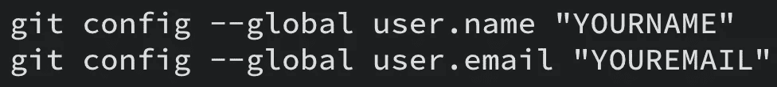

为 Git 配置用户名和电子邮件

检查配置发生了什么变化

检查列表中已编辑的配置

# 3.开源代码库

什么是 Github？

GitHub 是一个网络服务器，人们用它来上传 Git 文件，然后与他人分享。大多数程序员和软件开发人员用它来存储开源项目，如 Node.js、Angular、Rails、Bootstraps 等。(也有其他 web 服务器与 GitHub 非常相似，它被称为 GitLab)。

第一步让我们通过点击[这个](https://github.com)来创建一个账户。

GitHub 网站

创建后，您将能够创建自己的存储库

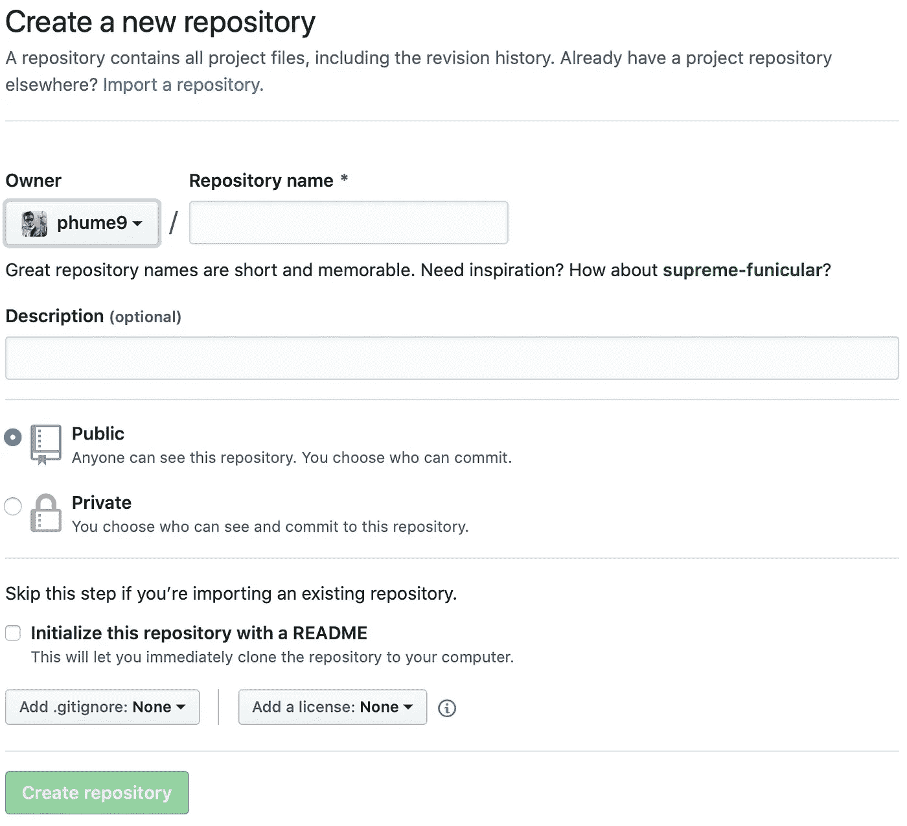

在 GitHub 中创建存储库

写下您想要存储库名称和描述。请注意，您只能将其设置为公共，但如果您想将其设置为私人，您需要付费。

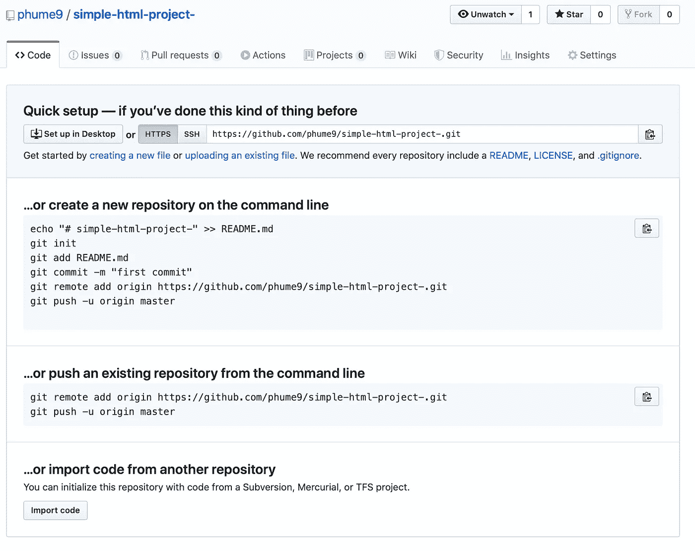

创建了名为 simple-html-project 的存储库

一旦创建了库，你将会被 GitHub 教程所指导，学习如何添加文件，提交，添加 HTTPS 链接，推送等等。现在我们成功地创建了我们的存储库，下一个主题我们将创建我们的第一个项目。

# **4。创建第一个项目**

现在，一旦你安装了 Git，让我们创建我们的第一个项目，这样我们就可以使用 Git 命令上传到 GitHub。

创建一个简单的 HTML 项目。(CSS 是可选的)

名为 index.html 的简单 HTML 项目文件

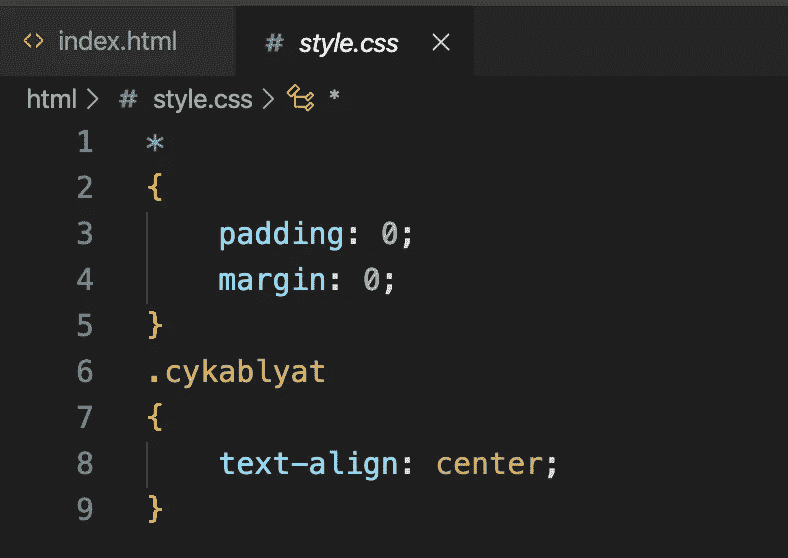

CSS 文件命名为 style.css 只是使文本居中

**Git 初始化**

打开终端，进入我们项目的文件夹，然后输入以下内容

> git 初始化

当我们第一次启动项目时，使用 git init

git init 命令将创建空的 git 存储库，并创建一个名为。git 存储在您的项目文件夹中(隐藏)。

**Git 状态**

我们使用 git status 命令来检查我们的存储库的状态。

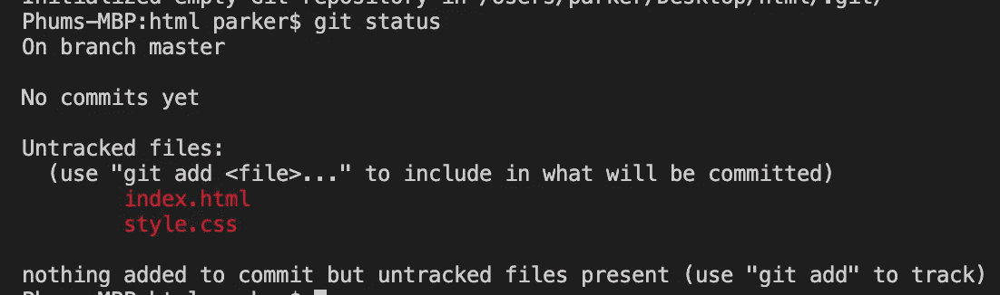

使用 git status 来检查我们的存储库的状态

如上图所示，它告诉我们我们的文件还没有被跟踪，所以为了让 git 跟踪文件供我们使用:

**Git 添加**

> git add“FILENAME”跟踪单个文件或 git add。跟踪文件夹中的所有文件。

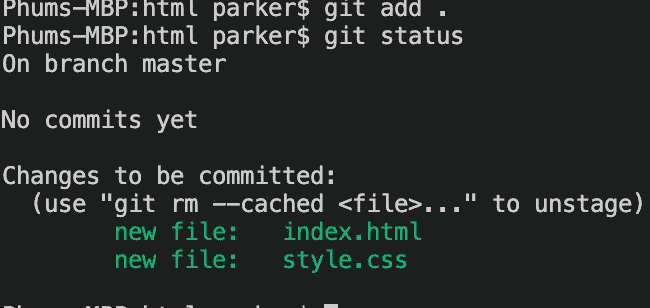

git 添加。命令

现在我们的文件被跟踪和暂存。现在准备提交。

**Git 提交**

git commit 是为我们的存储库创建快照，以便我们可以回来检查我们修改或编辑了什么代码。

> git commit -m "消息/第一次提交"

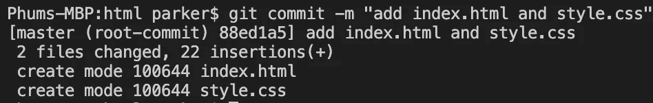

git 提交命令

# 5.将项目上传到 GitHub

提交后，我们现在将上传到我们创建的 GitHub 库。为此，我们首先将 HTTPS 链接添加到我们的项目，这样我们就可以上传到我们的 GitHub 库。

**添加 HTTPS**

> git 远程添加起点 HTTPS 链接

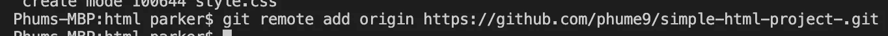

将 HTTPS 加入我们的项目

现在我们添加了 HTTPS 链接。接下来，让我们使用以下方法上传文件:

**Git 推送**

> git push -u 原始主机

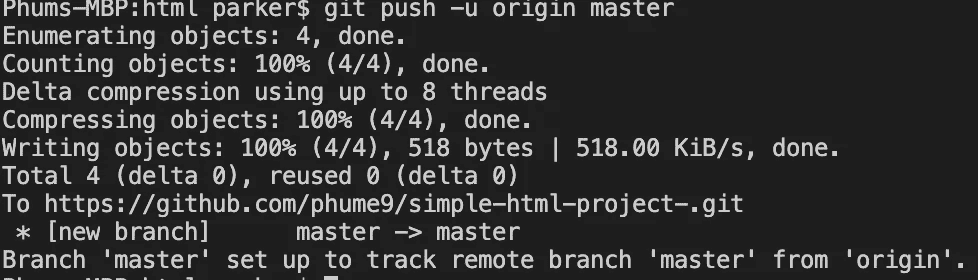

git 推送命令

现在回到 GitHub，回到我们最初创建的存储库，检查文件。

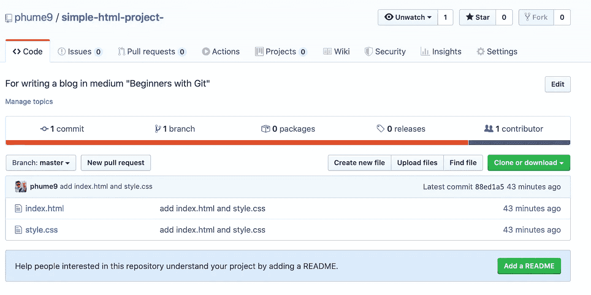

成功上传到 GitHub

祝贺🥳，你已经成功地将你的项目文件上传到 GitHub 网站。

# 6.Git 命令和备忘单

以下是 git 命令的列表

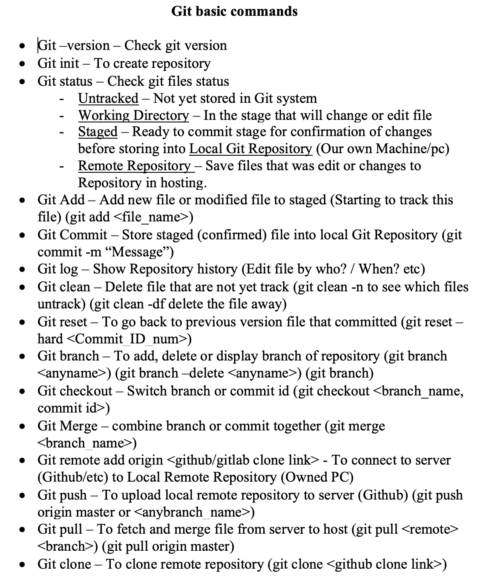

Git 基本命令

Git 冲突文件？如果您的项目中有任何冲突的文件，以下是解决方案:

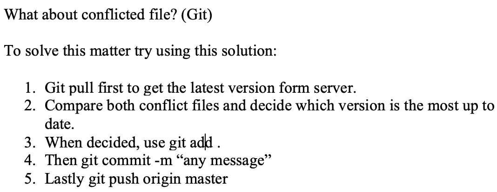

Git 冲突文件

# 结论

Git 使用起来非常简单方便。它成了我最喜欢的存放我所有源代码的地方，不用担心数据丢失。如果遇到任何问题，您可以恢复到以前的版本。它确实让你的编程生活变得更好。

对于还在学习或者犹豫要不要 Git 的人，我推荐你尝试一下，给它一个理解的时间。我保证这值得你花时间，你以后会感谢你自己😊。

**附加资源**

这里列出了对学习 Git 有用的资源。

1.  [https://github.com](https://github.com)
2.  https://git-scm.com
3.  [https://deva hoy . com/blog/2015/08/introduction-to-git-and-github/](https://devahoy.com/blog/2015/08/introduction-to-git-and-github/)
4.  [https://codeburst.io/so-wtf-is-git-fa7daa0e0271](https://codeburst.io/so-wtf-is-git-fa7daa0e0271)
5.  [https://medium . com/% 40 pakin/git-% E0 % B8 % 84% E0 % B8 % B7 % E0 % B8 % AD % E0 % B8 % AD % E0 % B8 % B0 % E0 % B9 % 84% E0 % B8 % A3-git-is-your-friend-c 609 C5 F8 EFA](/%40pakin/git-คืออะไร-git-is-your-friend-c609c5f8efea)
6.  [https://opensource.com/resources/what-is-git](https://opensource.com/resources/what-is-git)

本博客结束