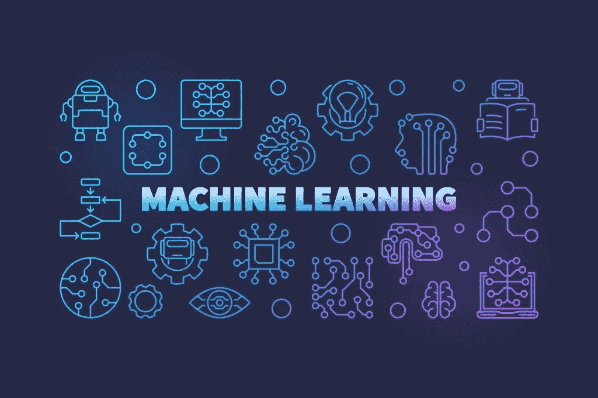
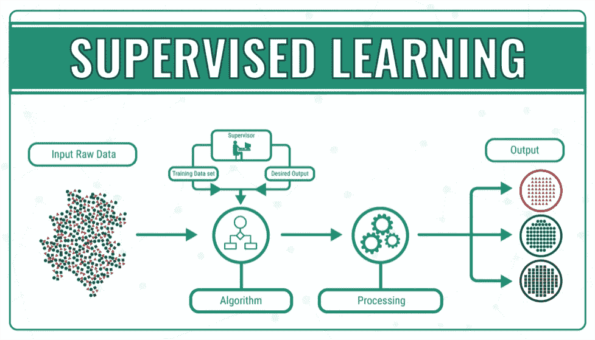
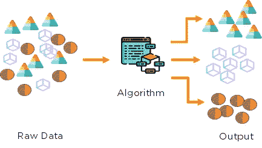
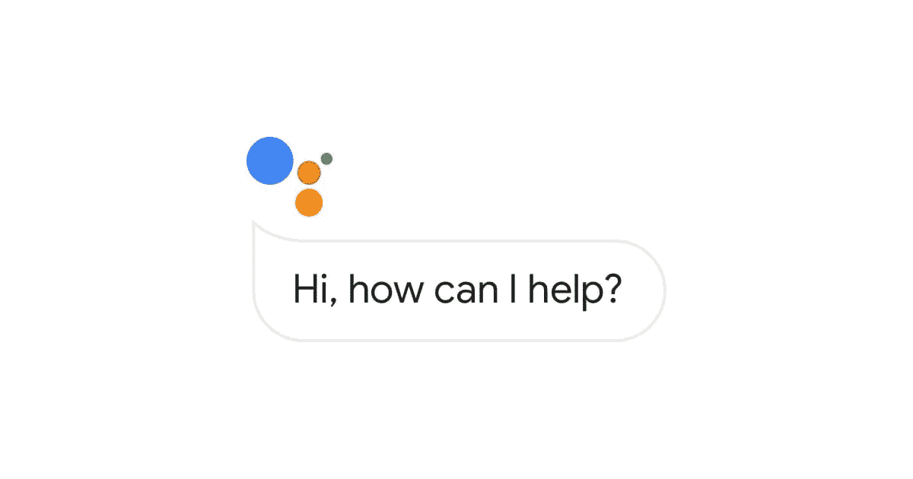

# 从机器学习开始旅程

> 原文：<https://medium.com/analytics-vidhya/beginning-the-journey-with-machine-learning-a9e9cc1a16ec?source=collection_archive---------30----------------------->

在上一篇文章中，我们讨论了数据科学以及在解决现实生活中的问题之前需要学习的东西。今天，我们将讨论数据科学最重要的组成部分之一，即机器学习。

***机器学习****(****ML****)是计算机系统用来执行特定任务的算法和统计模型的科学研究，不使用明确的指令，而是依靠模式和推理。*

在机器学习中，使用机器学习算法构建数据模型，这些算法接收数据并研究数据中形成的模式，然后向数据科学家、研究人员或分析师提供所需的结果。数据分为两组，即训练集和测试集。该模型在训练集上被训练，并且在训练之后，该模型被用于评估测试集并给出期望的结果。

# **机器学习的类型**

## 监督机器学习

监督机器学习是一种使用输入输出示例训练模型的技术。输入示例由要分析的特征组成，输出由分析每个输入示例后得出的相应结果组成。

有两种类型的监督机器学习:

*   **回归:**在这种类型的监督学习中，输出具有连续值。例如，房价是一个取决于房屋特征的连续值。该模型的目标是根据提供的特征(卧室数量、面积等)预测房屋的价格。).
*   **分类:**在这种类型的监督学习中，输出是标签的形式(离散值)。在二元分类中，输出有两个标签，例如 0/1 或是/否。在多类分类中，输出有两个以上的标签，例如，数据集包含四种不同类型的花图片，标签是这些花的名称。

**监督学习算法的例子:**

*   线性回归
*   最近邻
*   高斯朴素贝叶斯
*   决策树
*   支持向量机(SVM)
*   随机森林

## 无监督机器学习

无监督机器学习是一种机器学习，其中在没有标签帮助的情况下从输入中得出推论。在这种情况下，输出是不给出的，模型必须自己学习，即这种类型的机器学习支持自学习。

无监督学习可以进一步分为聚类和关联

*   **聚类:**它处理在一段未分类的数据中寻找模式。在群集中，组由称为群集的相似数据组成，您可以设置群集算法要形成的群集数量。
*   **关联:**关联是你想要发现描述大部分数据的规则的地方，比如购买 X 的人也倾向于购买 y。

一些无监督的机器学习算法是:

*   k 均值聚类
*   k 近邻
*   降维
*   主成分分析
*   奇异值分解
*   独立成分分析
*   分销模式
*   分层聚类
*   混合模型

## 强化学习

强化学习是以奖励制度为基础的。对于每一个正确的预测，机器都会得到奖励，对于每一个错误的答案，机器会受到惩罚或者没有奖励。例如，如果机器正确识别了猫的图片，它会得到 1 else 0。它使代理能够在一个交互式环境中，通过使用来自其自身行为和经验的反馈进行反复试验来学习。在强化学习中，目标是找到一个合适的行动模型，使代理人的总累积报酬最大化。

Q-learning 和 SARSA(State-Action-Reward-State-Action)是两种常用的无模型 RL 算法。

# 机器学习的应用

## 推荐系统

购物网站、社交媒体平台和媒体服务提供商公司，如网飞和亚马逊 Prime，正在使用推荐系统为客户提供个性化的平台访问。像亚马逊和 Flipkart 这样的购物网站试图了解你的喜好和厌恶，并根据你的喜好推荐商品，或者如果你和其他用户有相同的喜好，它会尝试推荐其他用户的选择。网飞和亚马逊 Prime 根据你喜欢的类型推荐电影，或者如果你和其他用户有相同的兴趣，推荐其他用户的选择。

## 虚拟助手

谷歌助手

像 Alexa 和 Google assistant 这样的虚拟助手可以帮助用户进行操作，比如你可以要求 Google Assistant 设置提醒或设置警报或进行搜索。它们帮助我们很容易地找到和搜索东西，我们不必浪费大量的时间在冲浪。这里机器学习的几个主要应用是:

*   语音识别
*   语音到文本转换
*   自然语言处理
*   文本到语音转换

## 自动驾驶汽车

谷歌自动驾驶汽车

自动驾驶汽车是机器学习最精彩的应用之一。机器学习增强了驾驶体验，因为司机可以坐下来，而汽车会自动带他到目的地。无人驾驶汽车可以自己转弯。乘客的安全也得到了提高，因为它不断监测道路上的任何危险，并采取措施，通过降低车速或在有深切口时小心转弯来防止任何事故。

## 谷歌翻译

去新的地方曾经是如此困难，因为你不能阅读不同语言的公告板。现在，在谷歌翻译的帮助下，去新的地方不再是一件困难的事情。

您可以输入文本并查看不同语言的转换，也可以单击文本的图片。Google lens 首先捕获点击的图片中的文本，然后使用 google translate，然后对给定的文本进行文本分析，并将其翻译成您选择的语言。

谷歌的 **GNMT** (谷歌神经机器翻译)是一种神经机器学习，它在数千种语言和字典上工作，使用自然语言处理来提供任何句子或单词的最准确翻译。由于单词的语气也很重要，它使用了其他技术，如词性标注、NER(命名实体识别)和组块。