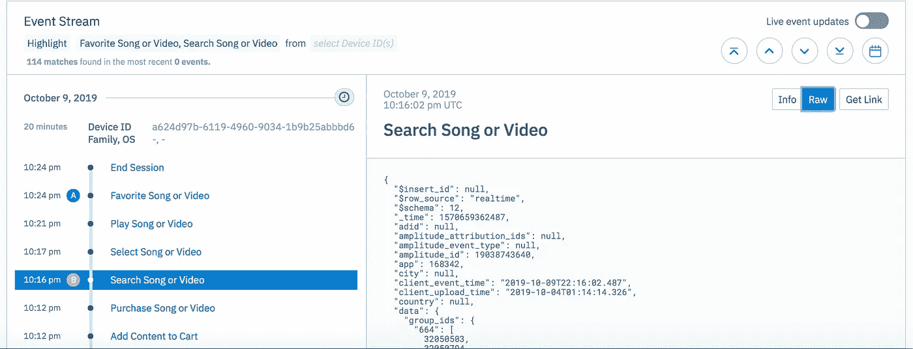
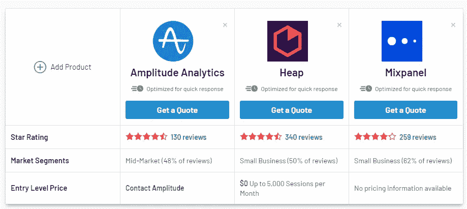
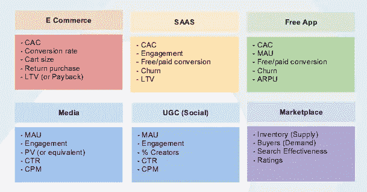
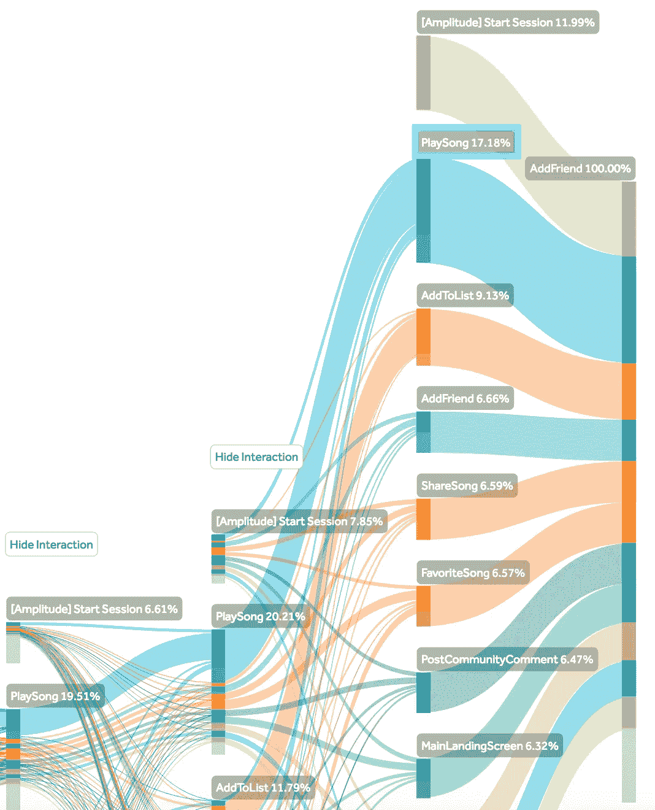
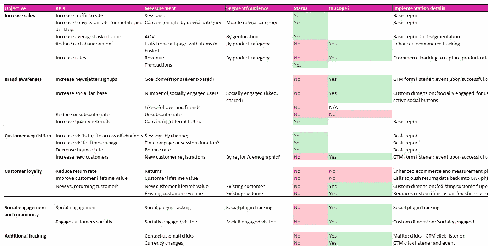
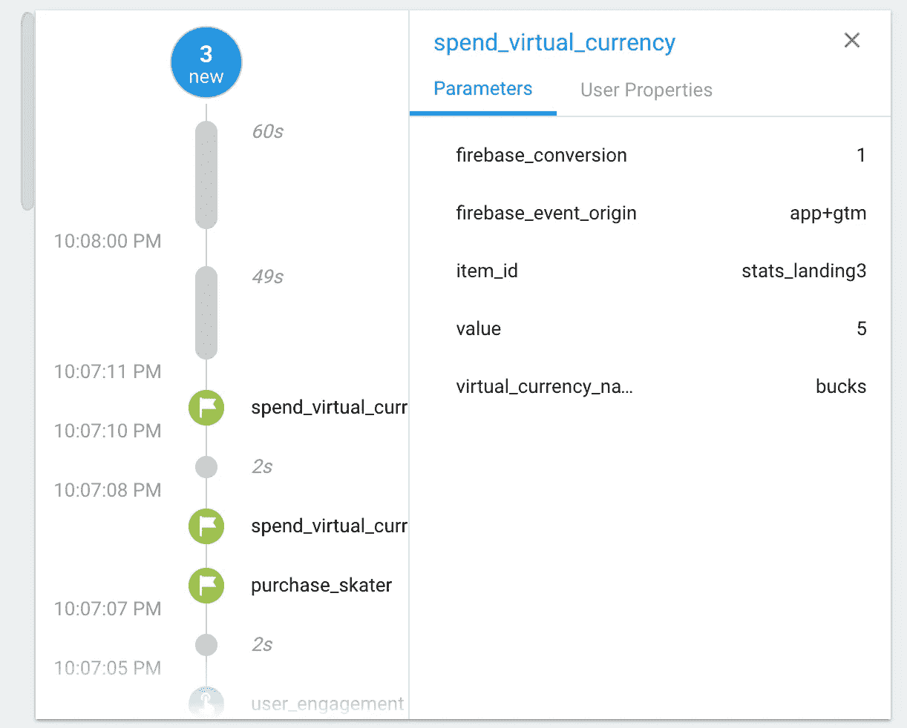

# 行为分析 I—超越浏览量

> 原文：<https://medium.com/analytics-vidhya/behavioral-analytics-i-beyond-pageviews-66c6237047c5?source=collection_archive---------23----------------------->

如果你正在读这篇文章，你很有可能**在市场营销、产品或数据领域**任职。你可能已经听过行为分析这个术语几次了，但是你仍然不确定它意味着什么或者它需要什么。

如果是这样的话，你来对地方了。(非有意押韵😅)

在这篇致力于这个主题的博客系列文章中，我将带你了解如何开始行为分析，以将你的产品、应用或网站提升到一个全新的水平。

让我们开始吧…

# 什么是行为分析？

行为分析是一种数据分析，可以帮助你了解**用户如何与网站、移动应用或任何其他数字产品互动**。它超越了基本的“虚荣指标”，如浏览量或新用户会话。顾名思义，它与用户行为紧密相连。

本质上，行为分析试图**回答业务特定的问题，以提高你的应用、网站或产品的采用或使用**。如果你的产品或应用还没有达到产品市场的契合度，这一点尤其有用。

> **行为分析的基石是*事件。***

在技术术语中，一个事件代表了用户可以在你的产品中执行的一个动作。例如，打开应用程序、登录或完成交易。

振幅内的用户事件流

正如你从上面的图片中看到的，用户在这个应用程序中所做的每一个动作都被跟踪了。给你分解一下，用户在 2019 年 10 月 9 日开始了一个“会话”，晚上 10:24 结束。从活动面板中，我们可以看到这个用户“搜索了一首歌”、“购买了一首歌”、“收藏了一首歌”等等。

此外，您在屏幕截图右侧看到的代码格式类型中的乱码是该工具正在为您收集的 JSON 模式(一个原始数据文件)。

请记住，默认情况下，您选择的工具不会收集这些信息，您必须定义想要收集哪些数据点以及为什么要收集。由**振幅**提供的 [**数据分类剧本**](https://help.amplitude.com/hc/en-us/articles/115000465251#events) 是帮助您定义事件跟踪属性的一个很好的起点。

# 行为分析 vs 谷歌分析

让我们抛开这个问题，回答最重要的问题。**行为分析和谷歌分析有什么区别？**

这是一个快速而肮脏的答案。

> 谷歌分析是一种工具，行为分析是一种方法。

**谷歌分析**——或 GA——是最广泛的**分析工具，用来衡量你的营销努力**。换句话说，它可以让你确定你的网站的流量来源，你的用户访问了哪些页面，以及你的活动是如何进行的。

当然，GA 也通过事件和目标来追踪现场行为。但它不会消除数据的匿名性，这意味着，你无法将具体的行动与个人用户联系起来，他们都是未知的。**而 Mixpanel、Heap 或 Amplitude 将 CRM 信息与用户的具体行为**联系起来，从而为您提供**更多粒度的用户行为数据。**

如果您想深入这个主题，探索这些工具的特性和局限性，我强烈建议您阅读 CXL 的这篇文章[，并浏览 G2 页面，获取关于软件工具](https://cxl.com/blog/mixpanel-vs-google-analytics/)的[基准测试。](https://www.g2.com/categories/product-analytics)

G2 软件比较网站

总之，使用一种工具相对于其他工具的优势**完全取决于您需要回答的问题**。如果与营销或用户获取有关，也许你最好的选择是谷歌分析，而如果你的目标是了解用户如何与你的产品互动，那么你可能需要考虑这些工具。

# 从行为分析开始的步骤

进行行为分析比简单地在分析工具中运行报告要复杂得多。这一切都归结于回答围绕产品使用的问题。

*   用户在产品内部的第一个动作是什么？
*   用户卡在哪里？
*   为什么有些用户没有完成入职流程？
*   他们在使用 XYZ 这个功能吗？
*   用户对移动通知的反应如何？
*   哪些广告是注册人数最多的原因？

这是一些可能帮助你开始的一般性问题，但是行为分析应该遵循一个过程。这是我追随的一个👇

## #1 选择您的业务目标和 KPI

首先，你从事什么行业？你和你的团队在朝着什么方向努力？你怎么知道你是否在进步？

根据精益分析的 6 种业务模式

一旦你了解了你所在的行业，是时候制定 KPI 和指标了，它们会把指针指向你想去的地方。你可以看到上面的一些例子来自于《精益分析》一书，这是所有对商业/创业感兴趣的人的必读之作。

例如，冥想应用的 KPI 和指标与优步或 Deliveroo 等双边市场有很大不同。

## #2 定义用户的“快乐之路”

用户可以在你的应用中做的最重要的一件事是什么？这一行动如何与你的产品目的相一致？

快乐路径是一系列的行为，用户可以通过你的产品来实现他/她的目标。假设你管理一个健身应用。用户的快乐之路将如下所示:

应用程序打开→注册完成→支付信息提交→入职完成→第一次锻炼完成

> 我们关注的是“用户动作”而不是屏幕

振幅漏斗分析示例

## #3 制定跟踪计划

既然你已经意识到用户可以采取的所有关键行动和业务成果，那么是时候**构建你的分析工具**了。这被称为**跟踪计划**，它必须遵循严格的分类，这样开发者或工程师就可以将你的“愿景”实现到后端基础设施中。

电子表格中的跟踪计划

这一步对于成功的报告和数据分析至关重要。如果没有仔细和深思熟虑的计划，你将来在回答业务或产品特定的问题时会遇到许多障碍。

此外，在勾画您的计划时，确保您在**【用户属性】**和**【事件属性】**之间建立了一个区别。用户属性描述使用您的应用程序的个人属性(例如，年龄、性别、位置)，而事件属性描述事件的属性(例如，流量来源、使用的设备)。

为了让您的生活更轻松， **Segment** 已经建立了一个包含您需要知道的一切的页面，以便[创建一个可靠的跟踪计划](https://segment.com/academy/collecting-data/how-to-create-a-tracking-plan/)。

## #4 为跨设备跟踪设置唯一标识符

如今，大多数人可以通过多种设备(手机、电脑、平板电脑、智能电视)访问同一个数字产品，这使得跟踪唯一用户变得非常困难。因此，为了更准确地报告，您需要设置一个唯一的标识符。

**唯一标识符可以是一封电子邮件或一串字符串，无论用户使用什么设备，该标识符都将保持不变。**通过这种方式，你将能够全面了解用户使用过程中可能出现的设备切换。

用户是否通过移动设备注册，但在桌面上完成注册？为什么我们 60%的活跃用户在晚上 9 点后在平板电脑上浏览？我不知道，但他们一定有原因😛

## #5 实施您的分析计划

现在是实施整个计划的时候了。确保您遵循您选择的分析工具的指导方针，在您的网站或应用程序上部署跟踪代码。通常，如果你的产品是一个应用程序，你会在每个页面上安装一段代码或者一个 SDK。

**不要试图衡量一切**，瞄准那些你在跟踪计划中定义的关键事件和指标。否则，您将最终遭受数据过载之苦。

**调试时，确保您的事件根据您在**之前建立的规则或标准正确触发。仔细检查不同操作系统和浏览器版本的行为。一切正常吗？

Firebase 中的调试器

最后，如果您发现了值得追踪的新的有趣事件，只需将它们添加到下一个部署或发布中。请记住，您的数据分类计划不是一成不变的，而是可以根据需要进行调整的动态文档。

## #6 开始处理您的数据

这是有趣的部分开始。还记得你一开始写下的那些问题吗？现在你可以回答他们了。

行为分析将允许您:

*   将您的细分提升到一个全新的水平
*   创建不同的人物角色来提高你的针对性
*   创建行为群组，了解用户如何与你的产品互动
*   衡量新实验的性能
*   发现用户在你的应用或网站中的重要路径
*   了解哪些事件是提高保留率的关键
*   找出谁是你的超级用户
*   衡量新产品发布的影响

天空是极限…