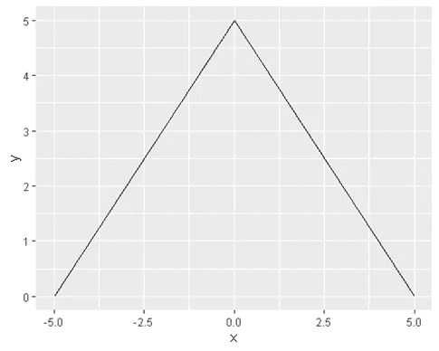
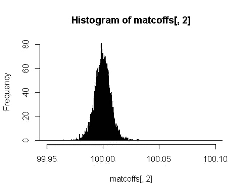

# 幕后:线性回归

> 原文：<https://medium.com/analytics-vidhya/behind-the-scenes-linear-regression-81836eb9ab6?source=collection_archive---------29----------------------->


在 [Unsplash](https://unsplash.com?utm_source=medium&utm_medium=referral) 上由 [Carlos Muza](https://unsplash.com/@kmuza?utm_source=medium&utm_medium=referral) 拍摄的照片

# 真实现象

在任何预测中，我们试图做的是模拟一个我们只能观察的真实现象。我们不知道确切的机制

假设我们有一个*真*现象 y = 100*x1 + 200*x2

其中 x1 >= 2000 且<= 4000 and x2 > = 100 且<= 500

Lets generate some data

```
x1range <- as.numeric(2000:4000)
 x2range <- as.numeric(100:500)

 #generate 5000 data points
 num <- 5000
 x1 <- sample(x1range , num , replace= TRUE)
 x2 <- sample(x2range , num , replace= TRUE)
 ytrue <- 100*x1 +200*x2 

 head(x1)## [1] 2644 3743 2620 2256 3008 2902head(x2)## [1] 277 425 223 457 321 336head(ytrue)## [1] 319800 459300 306600 317000 365000 357400
```

# Errors

It is very difficult to find the true phenomenon because all observations have error.

YObs = YTrue + Error

YTrue = YObs — Error

To know anything about YTrue we have to know about YObs and Error distribution. Yobs is the observed data so we have that already. therefore now we need to make some assumptions about the error distribution to be able to even begin to guess YTrue.

Errors usually have the following properties 1\. Centered on 0\. Mean error is 0\. 2\. Equally likely to be above or below the mean. Symmetric about the mean. 3\. Chance of having an infinite error is almost zero. Therefore as x -> inf prob(x) -> 0。

许多不同的分布可以用来满足这个条件。拉普拉斯使用三角形误差分布来满足上述各点。

```
library(ggplot2)
 exampleTri <- data.frame( x= c(-5,0,5) ,y= c(0,5,0) )
 ggplot(data= exampleTri , aes(x , y)) + geom_line()
```



**正态分布**是另一个符合上述标准的分布

我们可以做出的一个假设是，我们观察到的 *y 的*的误差呈正态分布。这个假设来自**中心极限定理(CLT)** 。

对于我们的例子，我们也为误差分布的标准偏差选择一个随机值，10。

```
# generate random error values from normal distribution
 etrue <- rnorm(num , mean=0, sd=10)

 x1obs <- x1
 x2obs <- x2

 # add errors to ytrue
 yobs = ytrue + etrue

 # create a dataframe that will be our ‘observed’ data
 dfobs <- data.frame(x1obs,x2obs,yobs)
 head(dfobs)## x1obs x2obs yobs
 ## 1 2644 277 319798.2
 ## 2 3743 425 459299.3
 ## 3 2620 223 306590.7
 ## 4 2256 457 316997.2
 ## 5 3008 321 364999.8
 ## 6 2902 336 357393.5
```

*dfobs* 现在形成了我们观察到的数据集，我们将尝试从中估计 y 的真实值。

# 大量样本和系数的抽样分布

CLT 告诉我们的是，如果我们重复实验很多次，那么我们为每个样本计算的样本统计量本身就是正态分布的。在我们的情况下，这将适用于系数估计。

# 对系数的 CLT 进行经验验证

为了验证 CLT 告诉我们的，我们将这样做

1.从我们观察到的数据中抽取一个样本

2.执行线性回归

3.得到系数，然后从 1 开始重复。

```
#initialize coefficient result as 0
 coffs <- c(0,0,0)

 # do our experiment 10,000 times
 expnum <- 10000

 # each time we repeat our experiment take a sample of size 10 from the observed data
 numObsInSample <- 10

 for(i in seq(0,expnum,1)){

 # take sample
 sampIndices <- sample(nrow(dfobs),numObsInSample)
 samp <- dfobs[sampIndices,]

 # perform linear regression
 lm <- glm( yobs ~ x1obs + x2obs , data = samp )
 cf <- coef(lm)

 # save coeffients for later analysis in the coffs variable
 coffs <- c(coffs , cf)
 }

 # convert our results into a matrix with 3 cols
 matcoffs <- matrix(coffs, byrow = TRUE ,ncol=3)
 head(matcoffs)## [,1] [,2] [,3]
 ## [1,] 0.000000 0.00000 0.0000
 ## [2,] -1.262689 100.00116 199.9726
 ## [3,] 3.376745 99.99244 200.0463
 ## [4,] 6.812219 99.99737 200.0031
 ## [5,] -9.508069 100.00255 200.0046
 ## [6,] 2.779624 99.99692 200.0182We can see that the coeffients of x1 and x2 are pretty close to our actual true phenomenon in most of our experiments!YTrue = 100*x1 + 200*x2Now according to CLT these coefficients should be normally distributed. Let’s verify.Let’s check basic descriptive stats about these firstsummary(matcoffs)## V1 V2 V3 
 ## Min. :-105.995 Min. : 0.00 Min. : 0.0 
 ## 1st Qu.: -12.307 1st Qu.:100.00 1st Qu.:200.0 
 ## Median : 2.118 Median :100.00 Median :200.0 
 ## Mean : 1.616 Mean : 99.99 Mean :200.0 
 ## 3rd Qu.: 15.668 3rd Qu.:100.00 3rd Qu.:200.0 
 ## Max. : 104.031 Max. :100.03 Max. :200.2sd(matcoffs[,2])## [1] 0.9999169sd(matcoffs[,3])## [1] 2.000062
```

看起来 V2 和 V3 总是分别在 100 和 200 左右。但这是误导。我们需要提高精确度并再次检查。我们将尝试在系数为 x1 的 99.95 和 100.1 的非常小的空间内绘制直方图。



哇！看起来像正态分布！所以我们可以看到 B 系数本身是正态分布的。

# 是我的“贝塔”,他们告诉我他们是什么？

通常我们无法重复实验 10，000 次，所以我们不知道 B 系数的分布。我们现在可以安全地假设(基于上面的分析)它是正态分布的。但现在的问题是，我们从样本中得到一组 B 系数，我们有多大把握不是偶然得到这些系数的？可能这些系数实际上是 0，x1 和 x2 对 y 没有影响，因为这个样本，我们可能偶然发现了这些值。如果我们再取一个样本，发现这些其实是零呢？！我们希望对这些抛给我们的数字有一定程度的信心。

# 假设检验

如果我们的自变量——x1，x2 对 Y 没有影响，那么它们的系数应该为零

Y = 0*x1 + 0*x2

但是我们坚信 x1 和 x2 确实对 Y 有影响，并且想要证明这一点。

因此，我们作出这些系数为 0 的无效假设，并试图拒绝我们的假设。

对于这种情况，使用 T 检验。 [T-dist] T 分布在我们不知道分布的详细信息时用作正态分布的近似值。为了得到整个分布，t 分布所需要的只是自由度。这与正态分布不同，正态分布需要我们指定均值和标准差，而这两者我们都没有(因为我们没有为此进行 10，000 次或 100 万次实验)。

对我们有利的 t 分布存在，现在这里的权衡是准确性。显然，我们是在近似正态分布，所以我们的估计会有误差。但这对于我们的目的来说已经足够了——对我们对 B 系数的估计充满信心。但是这将在另一篇文章中讨论。但是基本的想法如下。

# 估计分布的标准偏差

现在摆在我们面前的问题是，我们不知道这个 B 分布的标准差。

为了使术语正确，我们不知道 B 分布平均值的标准误差[维基百科](https://en.wikipedia.org/wiki/Standard_error)。要做的两件事是

1.  使用自举来获得系数估计

Bootstrapping 类似于我们上面所做的重复抽样，但这次抽样不是从总体而是从样本本身！！

Bootstrapping 帮助我们估计抽样分布的标准误差。因此，我们将得到我们的“标准差”,然后开始对我们的系数估计感到有信心。

1.  使用 T 检验

得到标准误差后，我们就可以计算 T 统计量并进行 T 检验，以确定系数在统计上是否显著不同于零。

最后两个主题将在另一篇文章中详细讨论！

# 来源

[T-dist](https://stattrek.com/probability-distributions/t-distribution.aspx)