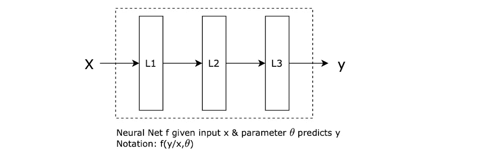
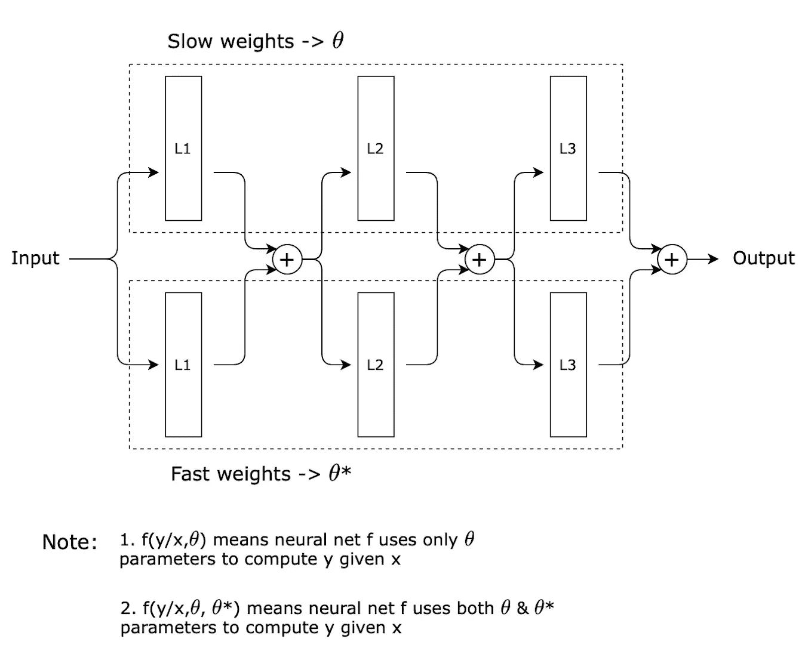
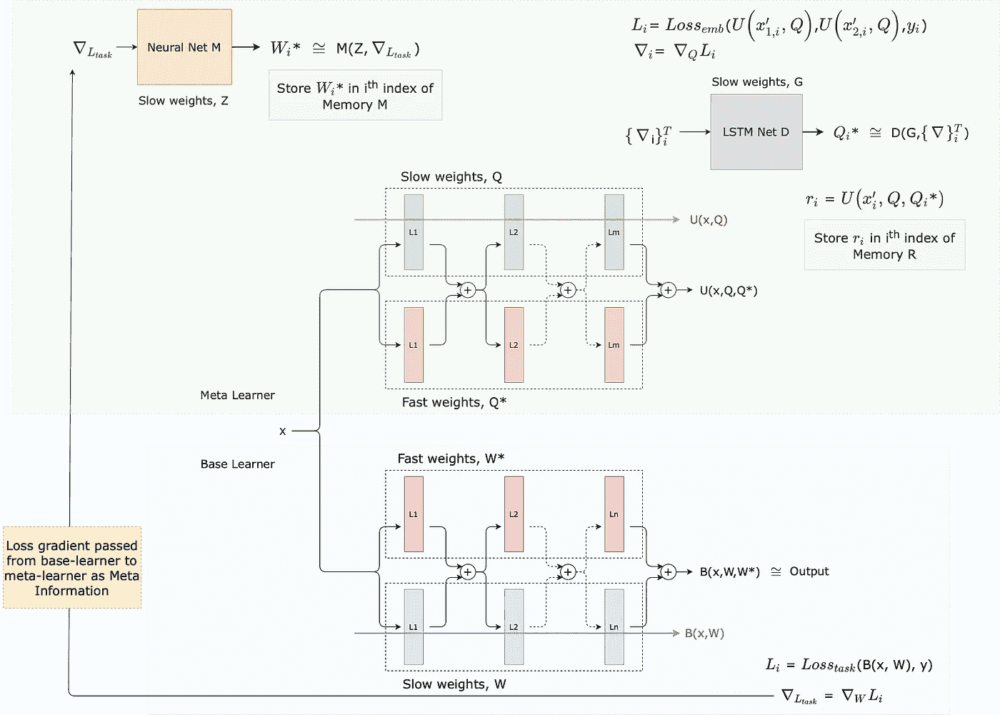
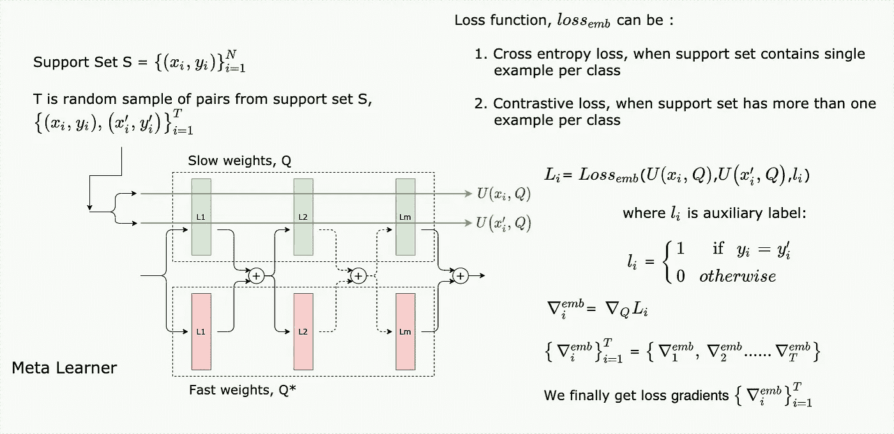
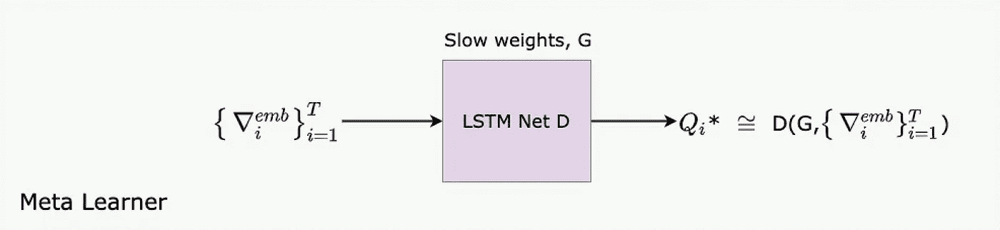
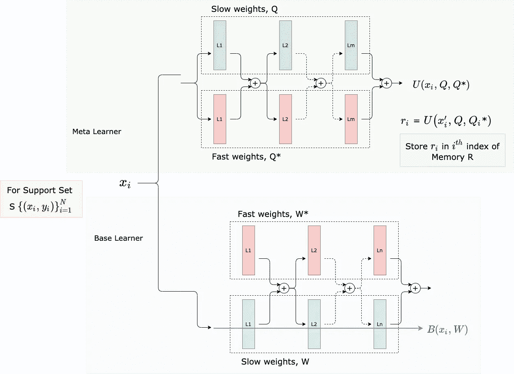
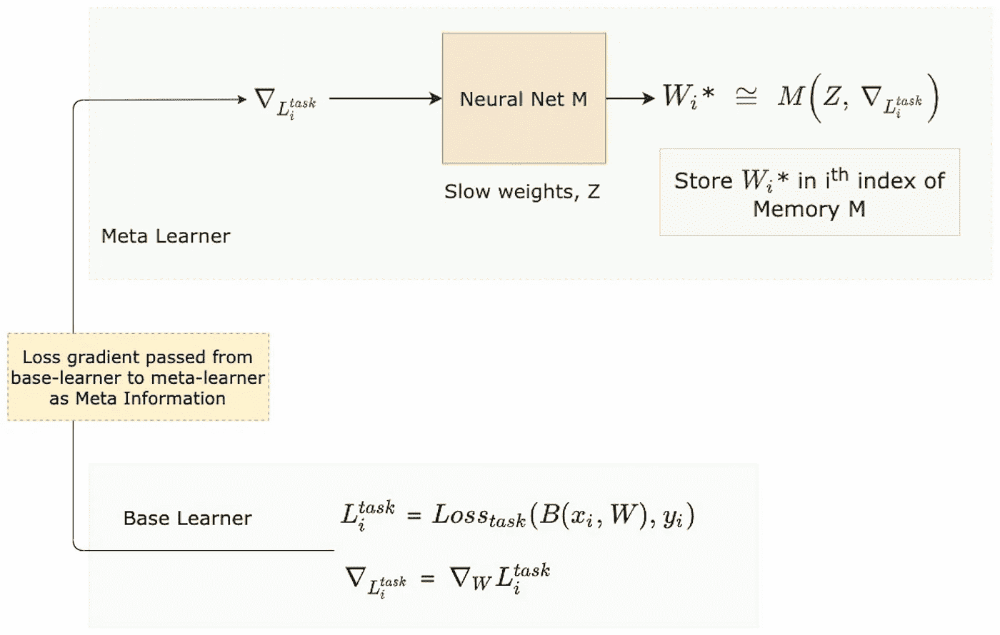
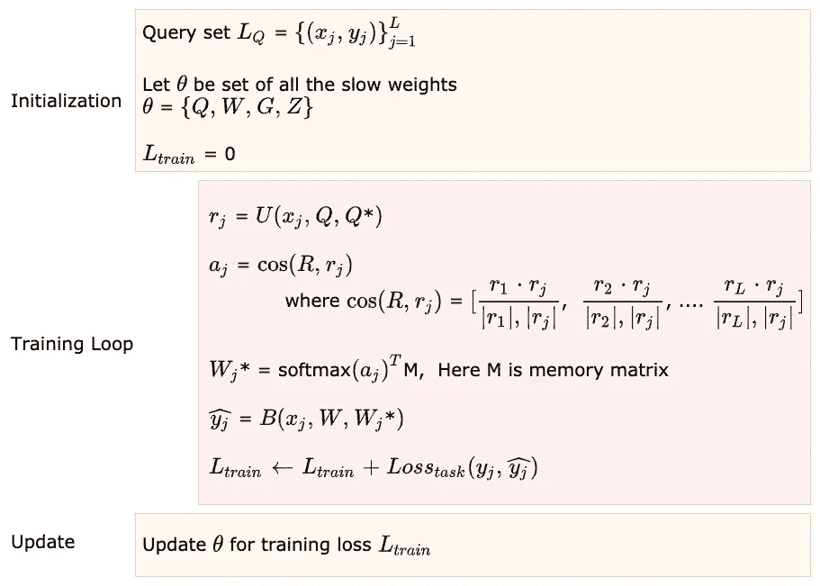

# 从新手的角度看元网络的幕后

> 原文：<https://medium.com/analytics-vidhya/behind-the-scenes-with-metanets-from-a-newbies-perspective-d5a98507b0d5?source=collection_archive---------16----------------------->

最近，我迷上了元学习的想法，随之而来的是深入研究的需要，我随机地从一篇文章跳到另一篇文章，以便更好地理解它。接下来的一周，我发现了这篇美丽的论文，标题是**元网络** [ [1](https://arxiv.org/abs/1703.00837) ，作者是于虹的 Tsendsuren Munkhdalai。最初，我有点难以理解这个模型是如何工作的，因为它有很多活动部件，至少对我来说是这样。
所以当我最终理解了它背后的理论时，我想我应该记录一个完全业余爱好者对此的看法，这样它可以作为我的业余爱好者的起点，也可以作为我将来需要快速修改时的个人笔记。

# 先决条件

我假设你对元学习有基本的了解。如果你没有，不用担心。现在，我将把你们带到一个非常好的系列讲座，即斯坦福大学助理教授切尔西·费恩的*斯坦福 CS330:多任务和元学习* [ [2](https://www.youtube.com/playlist?list=PLoROMvodv4rMC6zfYmnD7UG3LVvwaITY5) 。我会说前三节课足以推进元网络理论。

我还假设我们已经清楚地了解了元学习范围内的神经网络是如何使用支持集和查询集来训练的，如果你想快速回顾一下，请参考[ [3](https://www.borealisai.com/en/blog/tutorial-2-few-shot-learning-and-meta-learning-i/) ]

写这篇文章的目的是为 MetaNetworks 的论文[ [1](https://arxiv.org/abs/1703.00837) ]提供一个更容易的参考点，因此我强烈建议读者在继续阅读之前阅读原文。

以下是我的理解，如果我错了，或者我错过了一些重要的东西，或者有些东西需要更清楚的解释，请纠正我…干杯:)

# 我们开始吧

神经网络仍在试图克服用少量训练数据对新任务进行快速概括的挑战，同时保留以前在旧任务中学习到的特征。为了明确我所说的任务是什么意思，我们可以将任务视为一个机器学习问题，其中我们有一些数据和一些损失函数，我们希望对其进行优化，以产生一个合理的模型。
众所周知，标准的神经网络缺乏持续学习的能力，或者在确保不扭曲先前学习的特征的同时，动态地增量学习新概念的能力。

现在，在我们深入研究 MetaNet 如何解决这个问题之前，让我们先来看一下它的定义，这些定义可能现在还不清楚，但请记住我现在要说的话，以后会明白的。

元网络(Meta Networks 的缩写)跨任务学习元级知识，并通过由**归纳转移**提供的快速参数化来转移其**归纳偏差**。

> **归纳迁移** [ [src](https://link.springer.com/referenceworkentry/10.1007%2F978-0-387-30164-8_401) ]指的是学习机制在之前的任务中学习了不同但相关的概念或技能后，提高当前任务绩效的能力。
> 
> 而学习算法的**归纳偏差** [ [wiki](https://en.wikipedia.org/wiki/Inductive_bias) ] 则是**学习器**在没有遇到给定输入的情况下用来预测输出的一组假设。

## 我的意思是…

因此，根据元学习的正式定义，您在由{Ta，Tb，Tc}组成的某组任务 Ts 上训练一个模型，并且您期望该模型应该能够动态地消耗新任务{ Tx }的非常有限的训练数据，以获得预测或概括任务 Tx 本身的分布的能力，这样的例子是少数镜头学习。现在，为了对新任务 Tx 进行快速概括， **MetaNet** 依赖于一种叫做*快速权重*的东西。

我们都熟悉神经网络是如何训练的，我们通常在神经网络中有一组参数或权重，它们通过随机梯度下降来更新，通过缓慢改变这些权重来最小化一些损失函数。模型随时间更新以学习特征的权重被称为慢权重。

为任何新任务产生所需最佳权重的一个更快的方法是用另一个神经网络为现有神经网络产生权重，这些产生的权重被称为*快速权重*。这是元学习的黑盒适应背后的核心概念。

元网络试图通过使用两个学习者(即元学习者和基础学习者)来捕捉元学习的本质，我这样说是因为元学习是用两级学习的问题来表述的:

1.  独立于任务执行的元级模型的缓慢学习，即元级学习者的目标是使用不同任务的底层共享结构来获取不同任务的一般知识。
2.  快速学习在每个任务中起作用的基础级模型，即，知识然后可以从元学习者转移到基础级学习者，以通过让元学习者向基础学习者提供任务特定的快速权重来提供新任务 Tx 的上下文中的概括。

> 学习发生在两个不同的层次(即元空间和任务空间)。基础学习者在输入任务空间中执行，而元学习者在任务不可知的元空间中操作。
> 
> -于虹 Tsendsuren Munkhdalai

回到定义，元网络试图在生成的快速权重的帮助下微调或更新基础学习者的假设或权重集，简而言之，通过元学习者执行的归纳转移机制来改变他们的归纳偏差(即他们所学特征的性质)。

在我们转向元网络体系结构之前，一些小细节将在后面的章节中派上用场。

## 层增强

标准神经网络符号，即在给定输入 x 和参数θ的情况下预测 y，其中θ表示整个网络的权重。

图 2:具有 3 层的标准神经网络的可视化

MetaNet 架构中的神经网络通过慢速和快速权重来参数化，慢速和快速权重被组合以使用层增强过程来进行最终预测。

增强层的输入首先通过慢速和快速权重进行变换，然后通过非线性函数(即，在元网络情况下的 Relu ),从而产生由与慢速权重或快速权重相关联的层创建的两个单独的激活向量。最终，激活向量通过逐元素相加来聚集。因此，给定的*y*x 可以通过单独使用权重或组合使用权重来计算。

图 MetaNet 中 3 层神经网络的可视化，具有慢速和快速权重

## 接下来是排名损失

它本身是一个独立的话题，如果你对它有一些基本的了解，它会很有用。因此，请务必通读[ [4](https://gombru.github.io/2018/05/23/cross_entropy_loss/) ， [5](https://gombru.github.io/2019/04/03/ranking_loss/) ]，这将帮助您理解什么是度量学习，它的用例是什么&交叉熵损失[ [4](https://gombru.github.io/2018/05/23/cross_entropy_loss/) ]或对比损失[ [5](https://gombru.github.io/2019/04/03/ranking_loss/) ]意味着什么。在我们继续之前，您需要了解这些基本主题。

我们将需要在损失梯度中嵌入输入表示的度量学习，这将作为元信息消费，相信我，这将在以后更有意义。

# 建筑构成

图 4:扩展的 MetaNet 架构

让我们来看一下元学习者和基础学习者的正式定义，稍后我会试着一步一步地给你解释。确保使用图 4 作为思维导图的参考。

元网络由两个主要的学习组件组成，一个基础学习器和一个元学习器，并配有外部存储器。

## **元学习者**

元学习器由三个神经网络组成:

1.  动态表征学习神经网络**U。与标准神经网络不同，*由慢权值***Q*** 和元级快速权值 ***Q**** *参数化。* *将原始输入编码成特征向量 ***r*** ，这些特征嵌入被训练成可用于辨别两个输入使用代表性损失嵌入(即交叉熵或对比损失)的不同程度。****
2.  **LSTM 网 ***D*** 参数化 ***G*** 用于学习嵌入函数*的快速权重***【Q ****。它以*的代表损失嵌入的损失梯度作为输入。****
3.  ***由 ***Z*** 参数化的神经网络 ***M*** 用于学习基学习器的快速权值，即由 ***W*表示。*** 快速权重***【W *】***通过使用示例级别损失的梯度作为元信息来产生，该元信息是基础学习者在学习阶段使用支持数据集提供给元学习者的。***

## ****基础** **学习者****

**与元学习器类似，基学习器由神经网络组成，由慢权重****W****和任务级快速权重***【W ****参数化。基础学习者是通过任务损失估计主要任务目标的学习者，表示为 ***B*** 。慢速权重在训练期间通过学习算法更新，而快速权重由元学习者的神经网络*生成。*****

## ***扩展内存***

***需要两个存储矩阵来存储每个任务的表示向量*和通过消耗跨 N 路任务的 K-shot 支持数据集而产生的快速权重***【W *】***。****

## **让我们找到一些清晰**

**为了更好地理解我们刚刚命名的每个组件的角色，我们可以将注意力集中在它们在 MetaNet 培训过程中的使用位置和它们完成的任务上，MetaNet 培训过程主要包括:**

1.  **元信息的获取**
2.  **快速权重的生成**
3.  **慢速权重的优化**

**最初，我们从支持集中随机抽取成对的样本，用于生成元学习者的快速权重。这些随机样本通过神经网络 ***U*** ，而仅使用其慢权值 ***Q*** 来产生表征损失嵌入，以捕获表征学习目标。**

****

**图 5:元学习者中的损失梯度生成**

**乍一看，交叉熵似乎与度量学习无关，因为它没有明确涉及成对距离公式。即便如此，仍有一些理论分析将交叉熵与几个成对损失公式联系起来。因此，作者的主张，建议它用于度量学习与表征损失嵌入函数是合理的。**

**接下来，LSTM 神经网络*观察对应于每个采样样本的损失梯度，并产生任务特定参数 ***Q**** 。注意输入到 LSTM ***D*** 的顺序并不重要。或者，梯度的总和或平均值可以使用 MLP。然而，在初步实验中，作者已经观察到后者导致较差的收敛性。***

****

**图 6:生成任务级快速权重的损失梯度消耗**

**接下来，我们浏览完整的支持集，以计算:**

1.  **我们从神经网络 ***B.*** 得到的任务目标的损失梯度，这个损失梯度将被用作元信息，传递给每个数据点的元学习者。**
2.  **使用损失梯度生成任务级快速权重，即 ***W**** 。**

****注**:对于神经网络 ***B*** ，给定 x 的 y 的输出概率分布的损失函数即 loss_task 可以用交叉熵或 MSE 来计算。**

**对于支持集中的每个数据点，我们计算如下:**

****

**图 7:示例级元信息和任务级特征向量的生成**

**稍后，我们将示例特定损失梯度馈送到神经网络 ***M*** ，以针对支持集 S 中的每个数据点产生任务级快速权重，即 ***W**** ，其将被存储在存储器 **M** 中的数据点特定索引处。类似于其对应的表示向量 ***r*** 如何保存在内存 **R** 中。**

****

**图 8:用于生成示例级快速权重的损失梯度消耗**

**最后，通过遍历查询/训练集中的所有数据点，我们构造训练损失 L_train 来优化所有慢权重{***Q******W******G******Z***}。**

****

**图 9:在训练阶段更新慢速权重**

**对于每个单独的任务，重复整个过程。**

**你可以找到 MetaNet 的一次性学习训练工作流程的算法视图，这与我们在第 3 节下提到的[ [这里的](https://arxiv.org/pdf/1703.00837.pdf) ]有关，即元网络。**

**我肯定会推荐访问本文的结果部分，因为作者不仅在四组基准测试上运行了 MetaNet w.r.t 其他最新模型的变体实验，即 Omniglot previous split、Mini-ImageNet、MNIST 作为域外数据和 Omniglot standard split。**

**他们还进行了一些有趣的概括测试，例如:**

1.  ****N 路训练和 K 路测试:**在本实验中，MetaNet 在 N 路单射分类任务上进行训练，然后在 K 路单射任务上进行测试。其中训练类 N 和测试类 K 的数量是变化的。**
2.  ****固定权重基学习器的快速参数化:**在这个实验中，他们试图证明 MetaNet 可以学习有效地参数化一个固定权重的神经网络。通过显示跨基础学习者的准确性收敛，与具有固定权重的基础学习者相比，元学习者看到了更多的学习尝试。**
3.  ****元级连续学习:**元网在两级学习空间中运行，即示例级空间和元级(梯度)空间。元空间被认为是任务独立的，因此它应该支持终身学习。
    为了测试这一理论，作者最初在 Omniglot 数据集上训练和测试该模型，然后通过切换到 MNIST 数据集继续训练。在对大量 MNIST 一次性任务进行训练后，他们在原始 Omniglot 数据集上重新评估了该模型。
    准确性的提高表明元网络增强了逆向迁移学习和持续学习的能力。但只限于 MNIST 训练中的某一点。之后元权重开始忘记 Omniglot 信息。**

**如果你对自己尝试这个模型感兴趣，那么作者已经将他们的代码公之于众。**

 **[## 比特桶

### 元网络的链接码

bitbucket.org](https://bitbucket.org/tsendeemts/metanet/src/master/)** 

## **参考资料:**

1.  **[元网【arXiv:1703.00837】，于虹 Tsendsuren Munkhdalai](https://arxiv.org/abs/1703.00837)**
2.  **[斯坦福 CS330:多任务和元学习，2019 年](https://www.youtube.com/playlist?list=PLoROMvodv4rMC6zfYmnD7UG3LVvwaITY5)**
3.  **[教程-2:少数镜头学习和元学习](https://www.borealisai.com/en/blog/tutorial-2-few-shot-learning-and-meta-learning-i/)**
4.  **[了解分类交叉熵损失](https://gombru.github.io/2018/05/23/cross_entropy_loss/)**
5.  **[理解排名损失、对比损失、边际损失、三联损失、枢纽损失以及所有这些容易混淆的名称](https://gombru.github.io/2019/04/03/ranking_loss/)**
6.  **[度量学习:交叉熵与成对损失](https://arxiv.org/abs/2003.08983)**
7.  **[元网官方链接代码](https://bitbucket.org/tsendeemts/metanet/src/master/)**
8.  **[元学习:学会快速学习](https://lilianweng.github.io/lil-log/2018/11/30/meta-learning.html)【元学习文献综述】**

**如果你认为我们是志同道合的人，应该联系，那么你可以在 LinkedIn 上找到我，或者发电子邮件到 vamshikdshetty@gmail.com 找我。如果您有任何想法、问题或反馈，请在下面随意评论，我很乐意收到您的来信。**