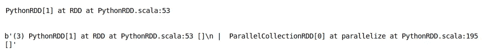
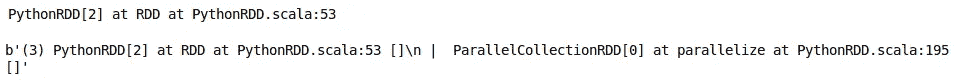
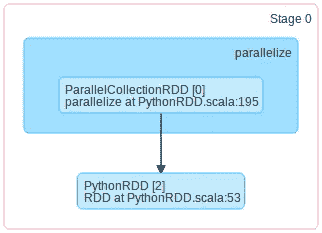
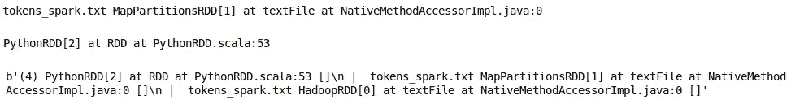
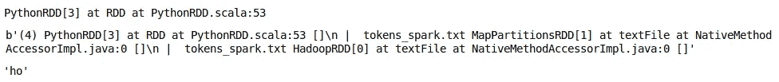
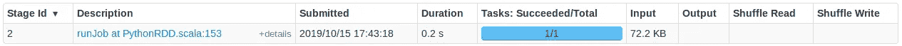
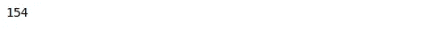
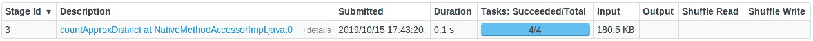

# 懒惰是有用的 Spark 中的懒惰评估

> 原文：<https://medium.com/analytics-vidhya/being-lazy-is-useful-lazy-evaluation-in-spark-1f04072a3648?source=collection_archive---------0----------------------->


[图像来源](https://www.thedailystar.net/star-weekend/almost-useful-life-hacks/news/its-hard-work-being-lazy-1708627)

假设您有一个包含数百万行的非常大的数据文件。你需要通过映射、过滤、随机分割甚至是非常基本的加减运算来进行分析。

**现在，对于大型数据集，即使是一个基本的转换也需要执行数百万次操作。**

在处理大数据时，优化这些操作至关重要，Spark 以一种非常有创意的方式处理它。你只需要告诉 Spark 你想对数据集做什么样的转换，Spark 就会维护一系列的转换。当您从 Spark 请求结果时，它会找出最佳路径并执行所需的转换，然后给您结果。

现在，让我们举个例子。您有一个 1 GB 的文本文件，并为它创建了 10 个分区。您还执行了一些转换，最后，您请求查看第一行的外观。在这种情况下，Spark 将只从第一个分区读取文件并给出结果，因为您所请求的结果不需要读取整个文件。

我们来举几个实际例子，看看 Spark 是如何进行懒评的。在第一步中，我们创建了一个包含 1000 万个数字的列表，并创建了一个包含 3 个分区的 RDD:

```
# create a sample list
my_list = [i for i in range(1,10000000)]# parallelize the data
rdd_0 = sc.parallelize(my_list,3)rdd_0
```


接下来，我们将执行一个非常基本的转换，比如给每个数字加 4。请注意，此时 Spark 尚未开始任何转换。它只是以 RDD 血统的形式记录了一系列的转变。使用函数 **toDebugString** 可以看到 RDD 血统:

```
# add value 4 to each number
rdd_1 = rdd_0.map(lambda x : x+4)# RDD object
print(rdd_1)# get the RDD Lineage 
print(rdd_1.toDebugString())
```



我们可以看到 *PythonRDD[1]* 与 *ParallelCollectionRDD[0]* 连接。现在，让我们继续添加另一个转换，将 20 添加到列表的所有元素中。

你可能会想，如果在一个步骤中增加 24，而不是多做一步会更好。但是检查 RDD 血统这一步之后:

```
# add value 20 each number
rdd_2 = rdd_1.map(lambda x : x+20)# RDD Object
print(rdd_2)# get the RDD Lineage
print(rdd_2.toDebugString())
```



我们可以看到，它已经自动跳过了那个多余的步骤，并将在一个步骤中添加 24，而不是我们定义的那样。因此，Spark 自动定义执行任何动作的最佳路径，并且只在需要时执行转换。

我们再举一个例子来理解懒评的过程。

假设我们有一个文本文件，我们用 4 个分区创建了它的 RDD。现在，我们定义一些转换，比如将文本数据转换成小写，对单词进行切片，给单词添加一些前缀等等。

但是最后，当我们执行一个操作，比如获取转换数据的第一个元素时，Spark 只在第一个分区上执行转换，因为不需要查看完整的数据来执行请求的结果:

```
# create a RDD of the text file with Number of Partitions = 4
my_text_file = sc.textFile('tokens_spark.txt',minPartitions=4)# RDD Object
print(my_text_file)# convert to lower case
my_text_file = my_text_file.map(lambda x : x.lower())# Updated RDD Object
print(my_text_file)# Get the RDD Lineage
print(my_text_file.toDebugString())
```



在这里，我们将单词转换成小写，并切分每个单词的前两个字符(然后请求第一个单词)。

```
# slice the words
my_text_file = my_text_file.map(lambda x : x[:2])# RDD Object
print(my_text_file)# Get the RDD Lineage
print(my_text_file.toDebugString())# Get the first element after all the transformations
print(my_text_file.first())
```



这里发生了什么？我们创建了文本文件的 4 个分区。但是根据我们需要的结果，并不需要在所有分区上读取和执行转换，因此 Spark 只需要这样做。

如果要统计独一无二的单词呢？然后我们需要读取所有分区，这正是 Spark 要做的:

```
print(my_text_file.countApproxDistinct())
```



*原载于 2019 年 10 月 28 日*[*【https://www.analyticsvidhya.com】*](https://www.analyticsvidhya.com/blog/2019/10/pyspark-for-beginners-first-steps-big-data-analysis/)*。*