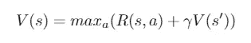
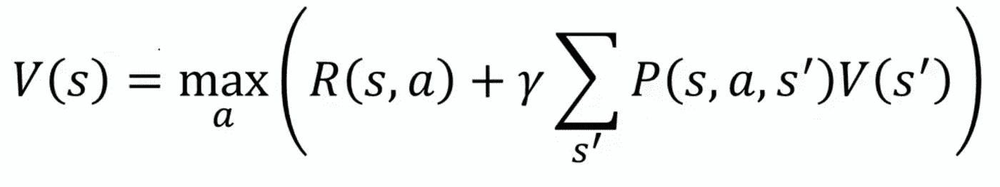
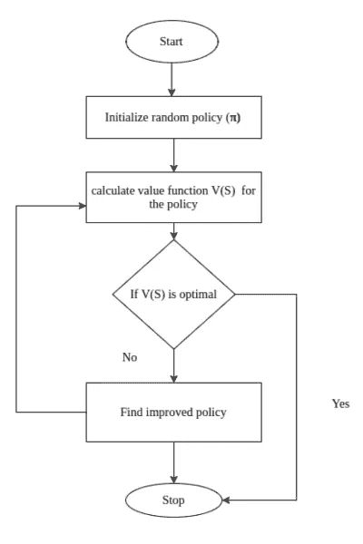

# 贝尔曼方程和动态规划

> 原文：<https://medium.com/analytics-vidhya/bellman-equation-and-dynamic-programming-773ce67fc6a7?source=collection_archive---------0----------------------->

报名参加我的计算机视觉直播课程:[https://bit.ly/cv_coursem](https://bit.ly/cv_coursem)

这是一系列关于强化学习的文章，如果你是新手并且没有学习过之前的文章，请务必阅读(本文最后的链接)。到目前为止，我们只讨论了强化学习的基础知识，以及如何使用马尔可夫决策过程(MDP)来描述强化学习问题。从现在开始，我们将致力于解决 MDP 问题。

**贝尔曼方程**

如果你读过任何与强化学习相关的东西，你一定在什么地方遇到过贝尔曼方程。贝尔曼方程是解决强化学习的基本块，在强化学习中无处不在。这有助于我们解决 MDP。求解意味着找到最优策略和价值函数。

最佳值函数 V*(S)是产生最大值的函数。

给定状态的值等于给定状态下最优动作的奖励的最大动作(使值最大化的动作)并加上一个乘以贝尔曼方程中的下一状态值的折扣因子。

确定性环境的贝尔曼方程

让我们来理解这个等式，V(s)是处于某一状态的值。V(s ')是我们在采取行动 a 后将处于下一个状态的值，R(s，a)是我们在状态 s 采取行动 a 后得到的回报，因为我们可以采取不同的行动，所以我们使用最大值，因为我们的代理人希望处于最佳状态。γ是前面讨论过的贴现因子。这就是确定性环境中的贝尔曼方程(在第 1 部分中讨论过)。对于非确定性环境或随机环境，情况会略有不同。

随机环境中的贝尔曼方程

在随机环境中，当我们采取一项行动时，并不确定我们会在特定的下一个状态结束，而是有可能在特定的状态结束。P(s，a，s ')是通过采取行动 a 从 s 结束 is 状态 s '的概率。这是未来状态总数的总和。例如，如果通过采取一个行动，我们可以以 0.2，0.2 和 0.6 的概率在 3 个州 s₁,s₂和 s 州 s₃结束。贝尔曼方程将会是

v(s)= maxₐ(r(s,a)+γ(0.2*v(s₁)+0.2*v(s₂)+0.6*v(s₃)

我们可以用一种叫做动态规划的特殊技术来求解贝尔曼方程。

**动态编程**

动态规划是一种解决复杂问题的技术。在 DP 中，我们不是一次解决一个复杂的问题，而是将问题分解成简单的子问题，然后针对每个子问题，我们计算并存储解决方案。如果出现同样的子问题，我们不会重新计算，而是使用已经计算过的解。

我们使用两种强大的算法求解贝尔曼方程:

*   价值迭代
*   策略迭代

**值迭代**

我们将通过图表和程序来学习它。

价值迭代

在值迭代中，我们从随机值函数开始。因为如果随机初始化，值表不会被优化，所以我们迭代地优化它。

让我们从编程开始，我们将使用开放的人工智能健身房和 numpy。

价值迭代

**政策迭代**

策略迭代

在策略迭代中，首先决定或初始化代理需要采取的动作，并根据策略创建值表。

策略迭代的代码:

策略迭代

# 强化学习系列

1.  [强化学习简介。](/@sanchittanwar75/introduction-to-reinforcement-learning-dc49e5c04310)
2.  [马尔可夫链和马尔可夫决策过程。](/@sanchittanwar75/markov-chains-and-markov-decision-process-e91cda7fa8f2)
3.  贝尔曼方程和动态规划→你在这里。

**参考文献**

1.  Sudarshan Ravichandran 的 python 强化学习实践
2.  [https://medium . com/@ taggatle/02-reinforcement-learning-move-37-the-bellman-equation-254375 be 82 BD](/@taggatle/02-reinforcement-learning-move-37-the-bellman-equation-254375be82bd)