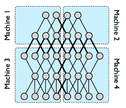
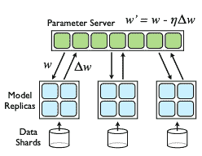
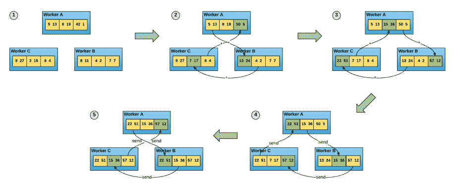
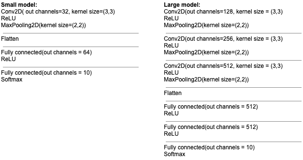
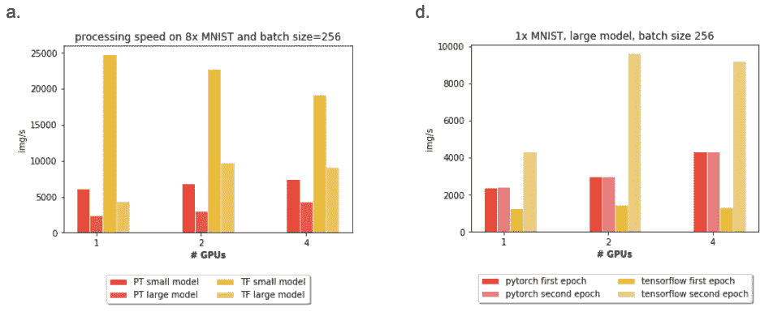
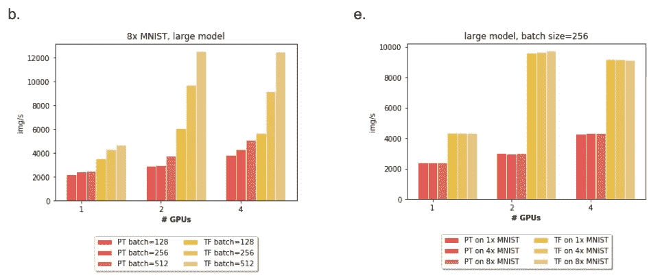
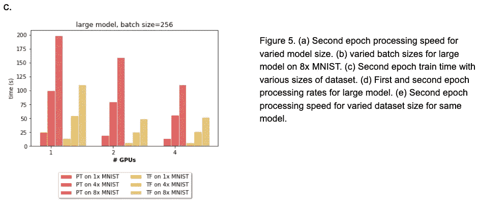

# 基准数据:深度学习模型的并行分布式训练

> 原文：<https://medium.com/analytics-vidhya/benchmarking-data-parallel-distributed-training-of-deep-learning-models-in-pytorch-and-tensorflow-99613f00987d?source=collection_archive---------12----------------------->

# TL；博士；医生

我使用 PyTorch DataParallel 和 TensorFlow MirroredStrategy 来改变数据集大小、模型大小、批处理大小以及 GPU 和 train 的数量。我注意到 TensorFlow 具有更高的处理速率和更大的规模，但我认为 TensorFlow MirroredStrategy 和 PyTorch DistributedDataParallel 之间的比较更公平。

代号:[https://github.com/r-o-s-h-a-n/data_parallel_benchmark](https://github.com/r-o-s-h-a-n/data_parallel_benchmark)

服务器的嗡嗡声帮助我疏导我的编码能量。图为:不是我。

# **简介**

近年来，深度学习模型已经成为从不断增加的数据量和复杂性中进行学习的最先进的模型。深度学习模型需要大量的数据来提取有用的特征。这个过程可能需要大量的时间来训练——大约几周。由于某些计算的重复性，分布式计算在这个领域有了价值。分布式深度学习可以分为两个潜在重叠的子类别:模型并行和数据并行。

## 模型并行性

在模型并行中，模型的各个部分位于不同的处理器上。只有具有跨越分区边界的边的节点才需要在机器之间传输它们的状态。如果一个模型太大而无法在单个 GPU 上运行，那么训练几乎肯定需要某种形式的模型并行性。数据并行的一个突出的早期成功例子是 Google 的 DistBelief 模型[1]。

图一。dist faith 模型跨多台机器进行划分。粗体的边要求跨机器传输。[1]

## 数据并行性

在数据并行中，训练数据被划分到不同的处理器上，并且每个模型被复制到不同的机器上。每台机器根据本地包含的数据训练其复制品，并且共享参数更新。共享权重更新的方法是研究的主题。这些方法可以同步或异步执行，每种方法都有自己的挑战。

图二。数据并行的参数服务器方法。[2]

在参数服务器方法中，每个处理器与参数服务器共享其权重更新。参数服务器负责存储模型的当前全局状态。处理器在训练后将权重更新写入参数服务器，并在训练前读取最新的权重。这个方法遇到了读写参数服务器的瓶颈问题。

更有效的方法是环全归约。这是由优步 Horovod 软件[3]推广的，但现在已经在包括 TensorFlow 在内的其他包中实现了。在这种方法中，没有中央参数服务器，但是机器形成一个环，并且每台机器仅从一台其他机器监听，并且向一台其他机器发送基于元素的更新。

图 3。来自优步·霍罗沃德论文的环形全图。在状态传输阶段，更新状态的元素在环形结构中一次共享一个。[3]

# 评估系统

执行数据并行分布式深度学习的软件包有很多。其中最突出的两个是 TensorFlow [4]和 PyTorch [2]，本文将对它们进行评估。

TensorFlow distributed [4]提供了多种分发策略。我评估了 Keras API 上的同步镜像策略。在 MirroredStrategy 中，每个 GPU 接收一部分训练数据以及模型的副本。每个 GPU 都在本地进行训练，然后使用高效的 all-reduce 算法传递变量更新。

PyTorch 提供 DataParallel，用于在具有多个内核的单台机器上进行数据并行训练。它的工作方式类似于 TensorFlow MirroredStrategy，其中每个核心都包含模型的副本。然而，我观察到了两个关键的区别。在 TensorFlow MirroredStrategy 中，每个 GPU 都在静态数据分片上训练，而在 PyTorch DataParallel 中，每个 GPU 在每次批量迭代中都接受一批数据，这可能会导致通信成本增加。此外，PyTorch 使用参数服务器策略，并且没有给出改变通信策略的选项。[5]在以前的工作中已经看到全归约策略比参数服务器更有效。[3]

在运行我的实验之后，我后来发现 PyTorch 确实有一个被称为 DistributedDataParallel 的框架，预计比 DataParallel 快。一个优化是，它在训练时间之前对数据进行分片，而不是在每次批量迭代时。在未来的研究中，将它的性能与 TensorFlow MirroredStrategy 进行比较是合适的。

# 方法

对于我的实验，我在 MNIST 数字数据集上进行训练。我改变了 GPU 的数量、批量大小、数据集大小和模型大小。我记录了训练第一个纪元和第二个纪元的时间。在第一个时期，模型可能会产生一次性启动成本，例如数据分片。因为同步数据并行训练的操作是确定性的:正向传递、计算损失、反向传播误差、梯度步长，许多资源在各时期之间变得空闲，所以该模型在第二时期和所有未来时期期间将可能具有相似的运行时间。为此，我只记录第一和第二个纪元的火车时间。

MNIST 数据集包含 60k 训练集图像和 10k 测试集图像。当我改变训练集大小时，我简单地将 MNIST 数据集连接到其自身的副本。我在 1x MNIST、4x MNIST 和 8x MNIST 上运行实验，它们对应于 60k、240k 和 480k 的图像。

我在每批 128、256 和 512 张图像之间改变批量大小。我使用两种尺寸的模型:具有 402，442 个可训练参数的较小模型，以及具有 2，636，554 个可训练参数的较大模型。都使用交叉熵损失和 adam 优化器，参数:学习率=0.001，beta =(0.9，0.999)，eps=1e-07，weight_decay=0，amsgrad=False。

图 4。用于图像分类的小型和大型模型结构。小模型包含 402，442 个可训练参数，大模型包含 2，636，554 个可训练参数。

GPU 的数量在 1、2 和 4 之间变化。所有实验都是在谷歌云平台上由 n1-highmem-2 (2 个 vCPUs，13 GB 内存)和数量可变的 NVIDIA Tesla K80 GPUs 组成的机器上运行的。TensorFlow 实验在使用谷歌、英特尔优化的深度学习图像的实例上运行:TensorFlow 2.0.0。PyTorch 实验是在 Google 的实例上运行的，深度学习图片:PyTorch 1.2.0。

# 结果

在图 5a 中，对于采用 1x MNIST 数据集的小型模型上的 TensorFlow，秒历元处理速率会随着 GPU 数量的增加而非直觉地降低。在 PyTorch 上，我们看到第二个纪元的处理速度随着 GPU 的增加而增加。结果表明，对于 TensorFlow，数据集大小或模型大小都很小，并行化带来的开销超过了并行化带来的速度提升。

我们在图 5c 中看到，总的第二历元训练时间随着 GPU 的增加而减少，并且当我们使用更大的数据集时，这种影响更加明显。然而，我们在图 5e 中看到，当我们只改变数据集大小时，处理速度保持不变。这与图 5a 的结果形成对比，图 5a 显示，当我们增加模型大小时，处理速率随着 GPU 的增加而增加。这种效果似乎变成抛物线，在 2 GPUs 时具有最佳性能。也许这个实验中使用的大约 260 万个参数的大型模型仍然不够大，不足以利用 4 GPUs 的数据并行性。

此外，我们在图 5b 中看到，对于给定数量的 GPU，增加的批量会提高处理速度，但这种影响随着 GPU 数量的增加而更加明显。当批处理大小最大化每个设备上的可用内存时，数据并行效果最佳。(批量大小是一个学习参数，在没有调整学习速率的情况下不应调整。)总的来说，我们注意到 TensorFlow MirroredStrategy 优于 PyTorch DataParallel，并且不同的策略对处理速度有显著的影响，特别是当比较第一和第二时段训练处理速度时(图 5d)，其中 TensorFlow 在第一时段中似乎较慢，这可能是由于数据分片。

# 结论

就易用性而言，在 PyTorch 中实现数据并行比在 TensorFlow 中更简单。然而，我们观察到 TensorFlow MirroredStrategy 比 PyTorch DataParallel 具有更快的处理速度和规模。这可能部分是由于其最初的缓慢时期，在此期间它将数据分段。然而，这可能不是苹果对苹果的比较，未来的研究应该将 TensorFlow MirroredStrategy 与 PyTorch DistributedDataParallel 进行比较。

# 引用的作品

[1]迪恩，杰弗里，等，“大规模分布式深度网络”*神经信息处理系统的进展*。2012.

[2] PyTorch (2019)版本 1.2.0。Github 仓库。https://github.com/pytorch/pytorch

[5]拉什卡、塞巴斯蒂安和埃里克·关。"皮托尔奇如何与拉什卡、塞巴斯蒂安和埃里克·关相提并论. "PyTorch 的并行方法和分布式方法是如何工作的？" *PyTorch* ，2018 年 11 月，discuse . py torch . org/t/how-pytorchs-parallel-method-and-distributed-method-works/30349/16。

[3]谢尔盖耶夫、亚历山大和迈克·德尔·巴尔索。" horo VOD:tensor flow 中快速简单的分布式深度学习." *arXiv 预印本 arXiv:1802.05799* (2018)。

[4]tensor flow(2019)2 . 0 . 0 版本。Github 仓库。代号:[https://github.com/tensorflow/tensorflow](https://github.com/tensorflow/tensorflow)文件:[https://www.tensorflow.org/guide/distributed_training](https://www.tensorflow.org/guide/distributed_training)