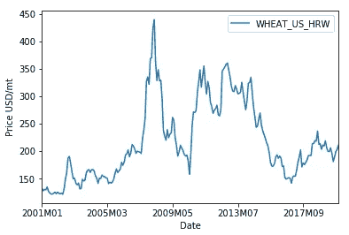
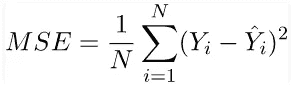
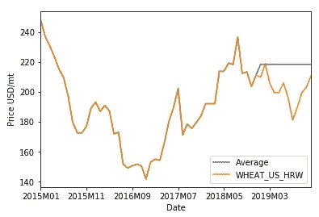
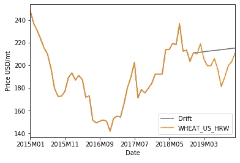
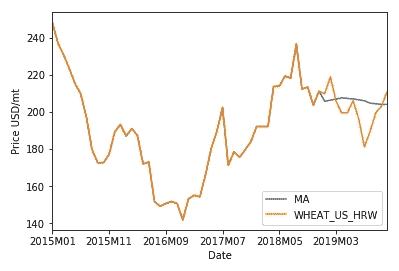
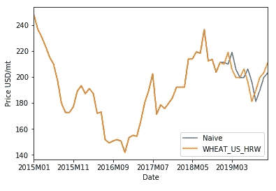

# 时间序列预测的基准方法

> 原文：<https://medium.com/analytics-vidhya/benchmarking-methods-for-deep-learning-based-time-series-forecast-ec45f78b61e2?source=collection_archive---------10----------------------->

## 为时间序列预测设定基线的四种简单方法。

亚当·本特利在 [Unsplash](https://unsplash.com/s/photos/bench?utm_source=unsplash&utm_medium=referral&utm_content=creditCopyText) 上的照片

> 一个简单、常识性的方法将建立一个基线，为了证明更高级的机器学习模型的有用性，你必须超越这个基线。

F 为了让数据科学家在构建模型时保持理智，他们设定了一个基线——模型必须超越的分数。通常，最先进的技术被用作基线，但是对于目前还没有解决方案的问题，人们应该建立自己的基线。正如 Francois Chollet 所说，基线被用来证明更先进的预测技术的有效性。

在本文中，我们将回顾应用于时间序列预测问题的四个基本基线。

为了演示每种基线方法，让我们使用 2001 年至 2019 年间来自[世界银行](https://www.worldbank.org/en/research/commodity-markets)的小麦历史月度价格。将预测 2019 年的价格。

2001 年至 2019 年的小麦价格(美元/公吨)

为了量化基线方法的性能，我将使用*(MSE)。顾名思义，MSE 是一个误差函数，用于测量预测值和真实值之间的平均平方差。*

**

*均方误差*

*MSE 可以使用上面的等式来计算，其中 *N* 是观测值的数量， *Yi* 是真实值， *Yi(hat)* 是预测值。因为它是一个误差函数，所以你希望它尽可能小。*

# *平均法*

*这种方法只是取整个历史数据的平均值，并使用它来预测未来的值。对于方差较小或其值接近平均值的数据非常有用。*

*使用小麦价格数据，对 2019 年价格的预测等于 2001 年至 2018 年的平均月价格。这种方法的 MSE 是 19.7。为了使可视化更清晰，只显示了最近 60 次观察，包括预测值。下图中蓝色的扁平线代表 2001 年到 2018 年的平均值，橙色的代表真实值。*

**

*平均法*

# *导洞掘进法*

*漂移是从数据中观察到的变化量。在这种方法中，漂移被设置为在整个历史数据中看到的平均变化，并使用它来预测未来的值。基本上，这只是意味着使用第一个和最后一个值画一条直线，并将这条线延伸到未来。这种方法适用于随时间推移而遵循一般趋势的数据。*

*漂移法预测在下图中显示为蓝线。其斜率遵循数据中的第一个价格和 2018 年的最后一个价格之间的直线斜率。使用这种方法对小麦价格数据的 MSE 低于平均方法 12.4。*

**

*导洞掘进法*

# *移动平均数*

*平均值法的一个变体是使用固定数量的最近值的一系列平均值，这被称为移动平均法。这种方法常用于股票价格的技术分析。如果你更关心长期趋势而不是短期趋势，这是很有用的。*

*如果我们将移动平均窗口的大小设置为 24，那么我们将使用最近的 24 个值来预测下一个时间步。重复此步骤，将窗口向前移动一步，之前的预测将包含在平均值中。不断重复，直到达到预期的预测长度。使用窗口 24，2019 年的移动平均预测在下图中显示为蓝线。小麦价格数据的均方误差为 5.84，这要好得多。*

**

*移动平均法*

# *天真的方法*

*该方法使用最新值作为下一时间步的预测值。这种方法遵循的假设是，它明天的价值等于它今天的价值。为了使用小麦价格数据做到这一点，我们只需将 2019 年的价格向前移动一步，并将其用作预测价格。请注意，在下图中，蓝线领先橙线一个时间步长。对于许多经济和金融时间序列，这种方法非常有效。小麦数据的 MSE 甚至更好，为 4。*

**

*天真的方法*

# *结论*

*在大多数情况下，从上面的演示中我们可以看出，在所讨论的四种方法中，简单方法表现最好，通常用作预测任务的基准。这些方法看起来非常简单，但是这些基本的基线有时很难超越。*

*尽管可以根据被分析数据的特征直接选择上述任何基线方法，但只要资源允许，尝试所有已知的方法是一个好的做法。例如，如果您使用深度学习进行预测任务，ARIMA 模型可能是基线的一个好选择，因为它可以提供比本文中讨论的任何方法都更好的结果。*

# *参考*

*[1] F. Chollet，*用 Python 进行深度学习* (2018)，曼宁出版公司。*

*[2] R.J. Hyndman 和 G. Athanasopoulos，(2018) *预测:原理与实践*，第二版(2018)，OTexts:澳大利亚墨尔本。OTexts.com/fpp2*