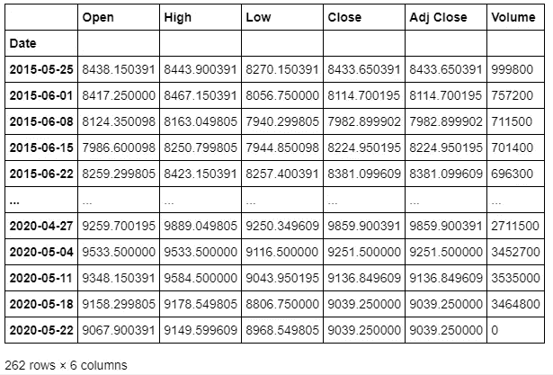

# 对 NIFTY 50 进行基准测试

> 原文：<https://medium.com/analytics-vidhya/benchmarking-the-nifty-50-1ac919795797?source=collection_archive---------29----------------------->

由 **NSE 指数有限公司**拥有和管理的 **Nifty 50** 是一个多元化的 50 股票指数，其成分涵盖了印度经济的近 13 个部门。
使用*自由浮动市值方法*计算，该指数非常多样化，可用于各种目的，如基准基金组合或推出指数基金、交易所交易基金和结构化产品。

在本文中，我们使用 Python 来分析 Nifty 50 的各种股票成分，通过使用该指数作为基准，分析它们在过去 5 年中的波动性和表现。

T he ***资本资产定价模型(CAPM)*** 是业内分析师使用的多功能工具，用于计算投资的预期回报，给出投资的无风险利率、贝塔系数和股权溢价。模型中使用的变量β是对投资的系统风险的度量。一只股票相对于整个市场的波动性可以从它的贝塔系数中推断出来。

**Beta** 通过寻找最佳拟合线的斜率，或投资与基准之间的回归线来确定。

随着回归的进行，归因于整个市场的运动比例，或**市场特定风险**可以通过找到回归的 r_squared 值来确定。

此外， **Jensen 的 Alpha，**理论上是投资的实际回报和预期回报之间的差异，可以通过找到最佳拟合线的*截距*和该项之间的差异来计算

*(无风险利率)*(1-Beta)*

这一指标本质上是一个投资绩效的指标，与投资的预期回报形成对比。

***获取数据***

我们首先导入相关的库，然后使用 Pandas 形成一个包含信息的数据框架，我们将使用它来提取单个股票表现的历史数据(来自 Yahoo Finance)。

```
**import** **numpy** **as** **np**
**import** **pandas** **as** **pd**
**from** **scipy** **import** stats
**import** **matplotlib.pyplot** **as** **plt**pull=pd.read_csv('https://raw.githubusercontent.com/SurjyaB/vigilant-robot/master/DB.csv')
pull.head()
```


创建的数据帧的前 5 行。

现在，我们创建两个列表——一个包含所有公司的名称，另一个包含获取数据的链接，并将它们配对在一起形成一个嵌套列表。完成后，我们创建一个名为 company_data 的空字典，然后运行一个 FOR 循环，使用嵌套列表中的链接获取数据，然后将获取的数据作为值保存在字典中，并使用相应的公司名称作为它们的键。

```
companies=list(pull.name)
links=list(pull.link)pair=list(zip(companies, links))company_data={}
**for** x,y **in** pair:
    company_data[x]=pd.read_csv(y, parse_dates=**True**, index_col=0)
```

提取 Nifty 的数据，我们得到-

```
company_data['nifty']
```



现在，我们为 Nifty 绘制提取的数据，以便直观地展示它在过去 5 年中的变化。

```
 plt.plot(company_data['nifty'].Close)
plt.xlabel('Year')
plt.ylabel('Nifty 50')
plt.title('Index Movement 2015-2020')
```


***分析位***

有了检索到的数据，下一个任务是确定个股的(每周)相对运动。

> 在这一点上，我们花一些时间来理解选择数据时间间隔背后的原因是至关重要的。有这么多可用的数据，为什么我们只坚持过去 5 年的每周数据？似乎我们越追溯历史，收集越多的数据，这些模式在宏观图景中就变得越明显。
> 然而，在企业界，公司治理和政策每时每刻都在发生如此多的变化，在一个大范围内比较其表现是没有意义的。此外，将频率从每周增加到每天只会在数据中引入更多噪声。因此，5 年的周数据似乎是一个合理的选择。

我们定义一个函数来确定股票的周收盘价的百分比变化。

```
**def** price_change(close):
    **return** (close-close.shift(1))/close.shift(1)
price_change(company_data['nifty'].Close)
```


产出百分比变化。

类似地，使用前面定义一个空字典和使用 FOR 循环的技术，我们得到所有股票的百分比变化。

```
**for** y **in** list(company_data.keys()):
    pc[y] = price_change(company_data[y].Close)movement_data=pd.DataFrame(pc)
movement_data.head()
```


数据框的第一行返回空值，因为没有先前的记录(在数据框中)来确定百分比变化。我们继续删除整行。

```
movement_data.dropna(axis='rows',inplace=**True**)movement_data.head()
```


所有股票在 Nifty 50 中的百分比(前 5 行)

现在，数据几乎符合我们的要求，我们可以开始通过拟合基准指数回报和个股回报之间的回归模型来分析股票。首先，让我们从一家公司开始，比如说 ***BHARTI AIRTEL。***

```
**import** **statsmodels.api** **as** **sm** 

X=movement_data.nifty
y=movement_data.bharti_airtel

X1=sm.add_constant(X)model=sm.OLS(y,X1)
reg=model.fit()print(reg.summary())
```


回归总结。

我们可以看到 Bharti Airtel 和 Nifty 50 指数之间的最佳拟合线的斜率为 0.7632，截距为 0.002。回归的 R 平方值为 0.188。
绘制回归线-

```
**import** **seaborn** **as** **sns**
sns.regplot(x=movement_data.nifty,y=movement_data.bharti_airtel)
plt.xlabel('NIFTY')
plt.ylabel('BHARTI AIRTEL')
```


巴蒂电信 vs Nifty 50 回归线。

或者，我们也可以使用 Scipy 来获得回归结果。

```
stats.linregress(movement_data.nifty,movement_data.bharti_airtel) LinregressResult(slope=0.7631723142521402, intercept=0.0020140086653414034, rvalue=0.43383082438038933, pvalue=2.106984979373908e-13, stderr=0.09848597430566054)
```

现在，我们运行 FOR 循环来获得所有公司-基准对的斜率、截距、R _ 平方值和标准误差，而不是找到单个公司和基准之间的结果。

```
slope=[]
intercept=[]
r_value=[]
r_squared=[]
std_error=[]

**for** x **in** list(movement_data.columns):
    s,i,rv,pv,se = stats.linregress(movement_data.nifty,movement_data[x])

    slope.append(s)
    intercept.append(i)
    r_value.append(rv)
    std_error.append(se)**for** x **in** r_value:
    rsq= x ** 2
    r_squared.append(rsq)metrics=list(zip(list(pull.name_yf),slope,intercept,r_squared,std_error))df=pd.DataFrame(metrics)df.head()
```


输出数据帧。

接下来，我们重命名这些列，并删除第一行，因为我们不想要基准和它本身之间的回归结果。

```
df.drop(index=0,axis='rows',inplace=**True**)df.columns=['Name','Slope(Beta)','Intercept','r_squared','Std. Error']df.head()
```


如果我们回想一下，我们回归的 r 平方值实际上是风险的比例，这可以用基准的变动来解释。更具体地说，这是一个公司特定市场的风险比例。相反,( 1-r_squared)值是公司特有的风险比例。

最后，我们计算股票的詹森阿尔法值(使用 6%作为无风险利率)

```
df.columns=['Name', 'Slope(Beta)', 'Intercept', 'Market Specific Risk', 'Std. Error']) df['Firm Specific Risk']=[1-x for x in df['Market Specific Risk']]r_f=0.06
u=r_f*(1-df['Slope(Beta)'])
v=df.Intercept
JA=v-u
df["Jensen\'s Alpha"] = JAdf=df[['Name','Slope(Beta)','Intercept','Market Specific Risk','Firm Specific Risk','Jensen\'s Alpha','Std. Error']]
df
```

最后，有了所有的数据，我们用詹森阿尔法对股票在回归期间的表现给出一个最终的外行判断。

```
df['Performance']=['Over Performed' **if** x >= 0 **else** 'Under Performed' **for** x **in** JA]
```


实际绩效与预期绩效的前 5 名


实际绩效与预期相比，表现最差的 5 名员工

***脚注***

随着金融领域的进一步发展，最近出现了多种定价模型，如套利定价模型、多因素模型等。然而，由于相对简单，CAPM 仍然占有一席之地。
需要注意的一点是，分析中使用的无风险利率可能不是真正意义上的“无风险”,因为为了保持分析简单，该利率没有针对主权违约利差进行调整。

链接-
[https://www1.nseindia.com/content/indices/ind_nifty50.pdf](https://www1.nseindia.com/content/indices/ind_nifty50.pdf)
[https://raw . githubusercontent . com/SurjyaB/vigilant-robot/master/db . CSV](https://raw.githubusercontent.com/SurjyaB/vigilant-robot/master/DB.csv)
[https://in.finance.yahoo.com/](https://in.finance.yahoo.com/)