# 三大优势:Power BI 中的模型视图

> 原文：<https://medium.com/analytics-vidhya/benefits-of-model-view-in-power-bi-619a7bc6181d?source=collection_archive---------19----------------------->

巴巴通德·奥拉基德在 [Unsplash](https://unsplash.com?utm_source=medium&utm_medium=referral) 上拍摄的照片

最初发布于

 [## 三大优势:Power BI 中的模型视图

### 我最喜欢 Power BI Desktop 的一个方面是它几乎每个月都会定期更新。有时候，它…

www.vivran.in](https://www.vivran.in/post/benefits-of-model-view-in-power-bi) 

我最喜欢 Power BI Desktop 的一个方面是它几乎每个月都会定期更新。有时，跟上变化会成为一种挑战。所以，我决定把它写下来。我可以预见两个好处:它肯定了我对产品的了解，我可以和更多的观众分享它。

本文概述了模型视图提供的特性。

众所周知，Power BI 中有三种视图:报告、数据和模型视图

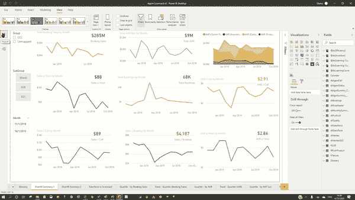

模型视图的主要目标是提供表之间关系(类型和方向)的可视化表示。

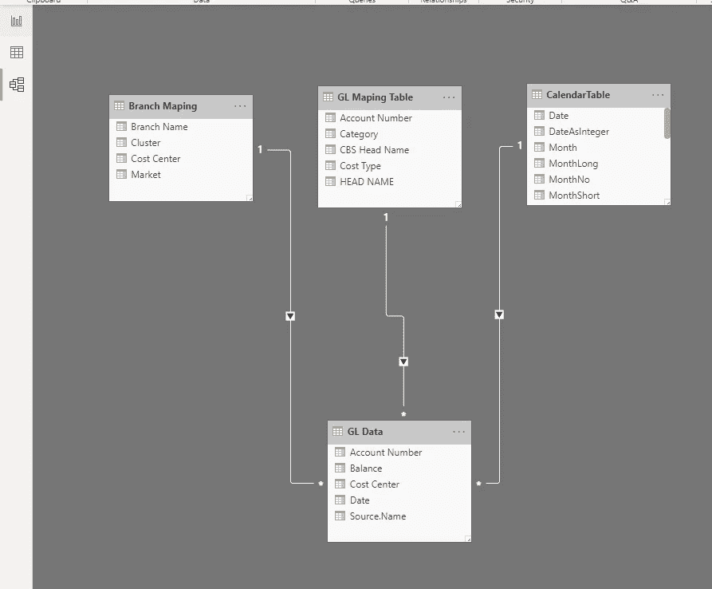

上图展示了三个筛选表与总账数据表的关系。

但是当模型的复杂性增加时，就很难弄清楚哪个是什么了？

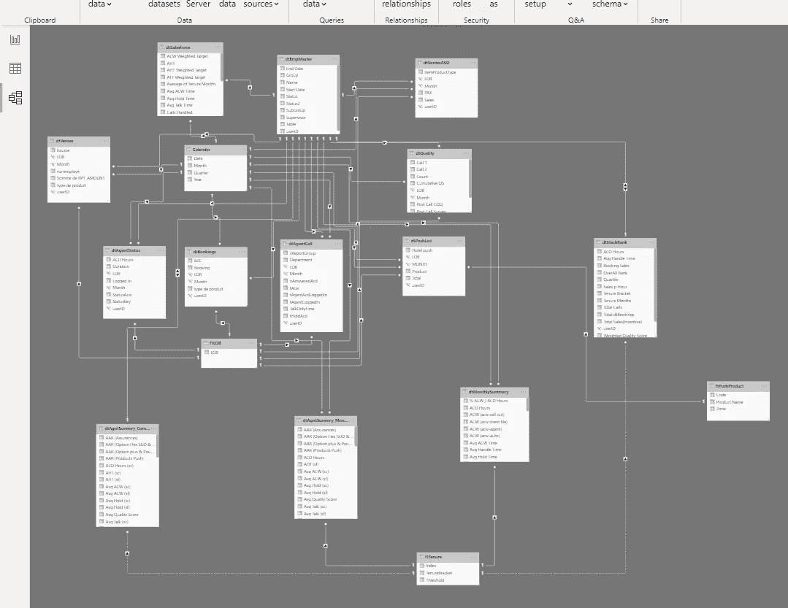

# 添加布局

布局提供了相关表格的简化且集中的视图。在本例中，我希望看到表 dtMonthlySummary 的相关表。我可以为此创建一个专用视图:

添加布局>在视图中添加表(dtMonthlySummary)>右键单击>添加相关表

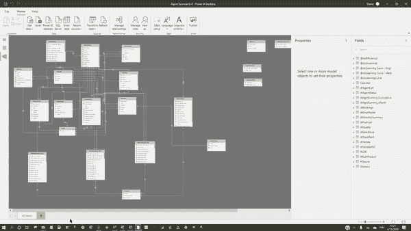

我们可以创建多个布局，这有助于我们有效地理解数据模型:

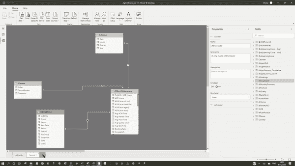

# 多选列或度量(&一次格式化！)

模型视图是唯一可以一次选择多个列或度量的视图。

我们能用这个做什么？

我们可以在模型视图中一次格式化多个列或度量。

使用 CTRL 或 SHIFT 键，我们可以多选度量和列，并使用视图中可用的格式化选项

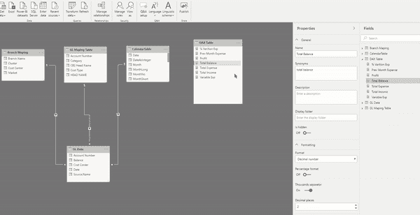

在报告和数据视图中，我们没有进行多选的选项。

# 从报表视图中隐藏表和列

当我们有太多的表和字段时，选择一个可视化的字段可能是一个挑战。

因此，专家建议:

隐藏所有不需要的表和字段

当我们有一个与事实表连接的维度表时，隐藏事实表中的所有公共列。例如，如果我们已经在日期上将日历表与事实表连接起来，那么就从事实表中隐藏日期列。

怎么躲？

右键单击表格或列>在报告视图中隐藏

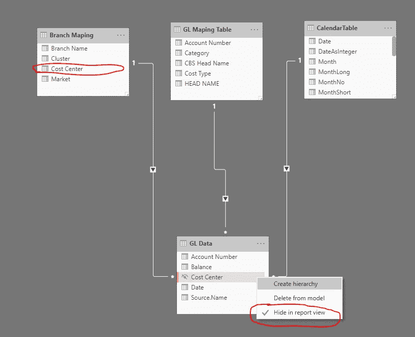

这样，我们可以限制出现在报告视图中的字段列表，并增强用户体验。

我们可以使用多选功能一次隐藏多个列。

# 刷新选定的表格

“主页”功能区中的“刷新”选项可刷新数据模型中的所有表(这可能是一个耗时的过程，尤其是当您只想刷新少数几个表时)。

模型视图允许用户仅刷新数据模型中的选定表。

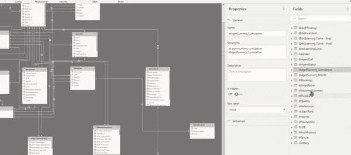

# 创建文件夹

文件夹有助于组织一组信息。对于 Power BI，我们可以在一个表中创建多个文件夹来对相似的字段进行分类。

选择列或度量>常规>显示文件夹>输入文件夹的名称

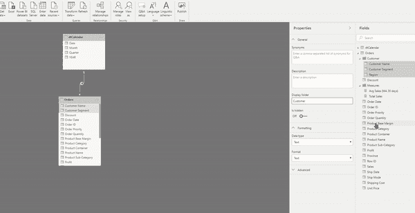

我们还可以在已经创建的文件夹中拖放列:

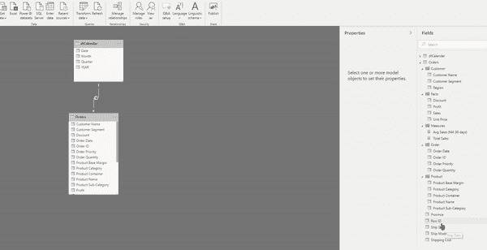

文件夹使我们的报告视图有条理:

之前:

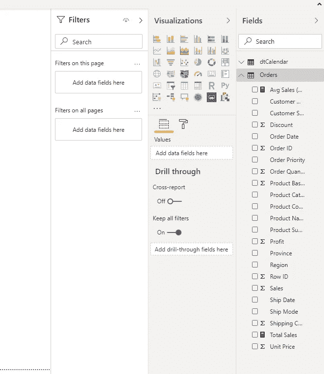

之后:

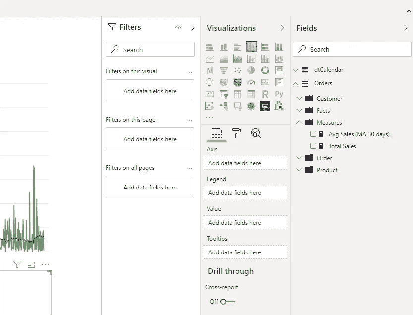

看起来好多了！不是吗？

我们可以使用模型视图为 Power BI 数据模型提供结构化的外观。

那么，你打算用哪一个呢？

*我写关于*[*MS Excel*](https://www.vivran.in/my-blog/categories/excel)*[*权力查询*](https://www.vivran.in/my-blog/categories/powerquery)*[*权力毕*](https://www.vivran.in/my-blog/categories/powerbi)*[*权力中枢*](https://www.vivran.in/my-blog/categories/power-pivot)*[*DAX*](https://www.vivran.in/my-blog/categories/dax)*[*数据分析【数据*](https://www.vivran.in/my-blog/categories/data-analytics)*****

**[@imVivRan](https://twitter.com/imvivran)**