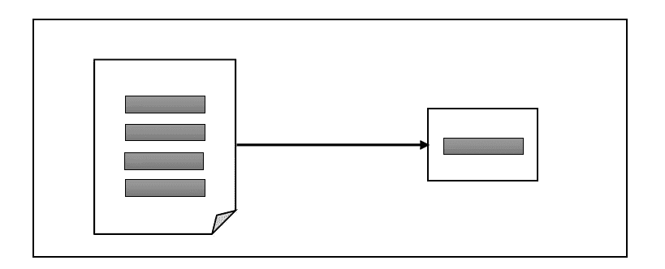
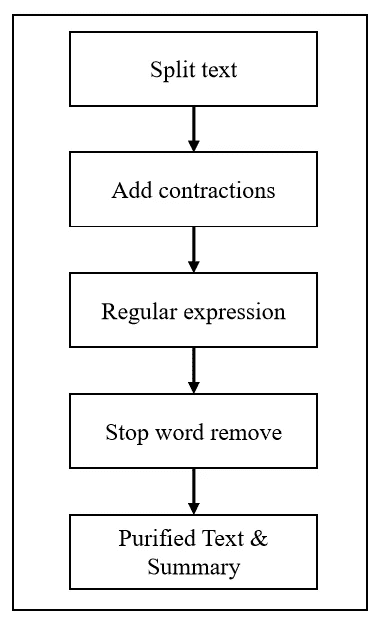
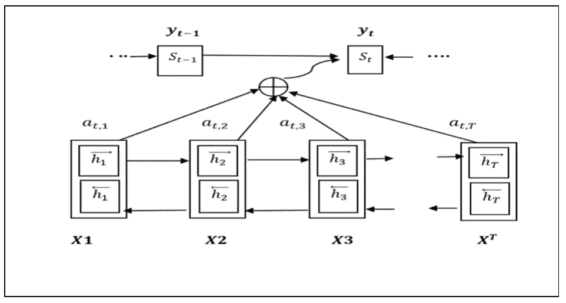
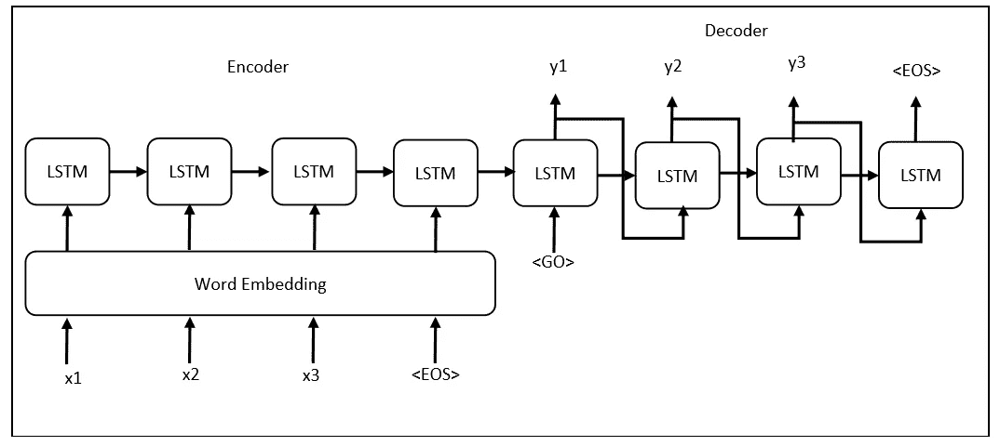
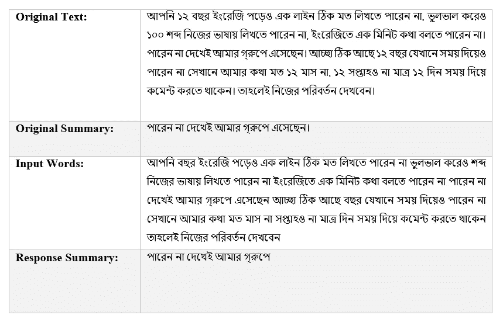
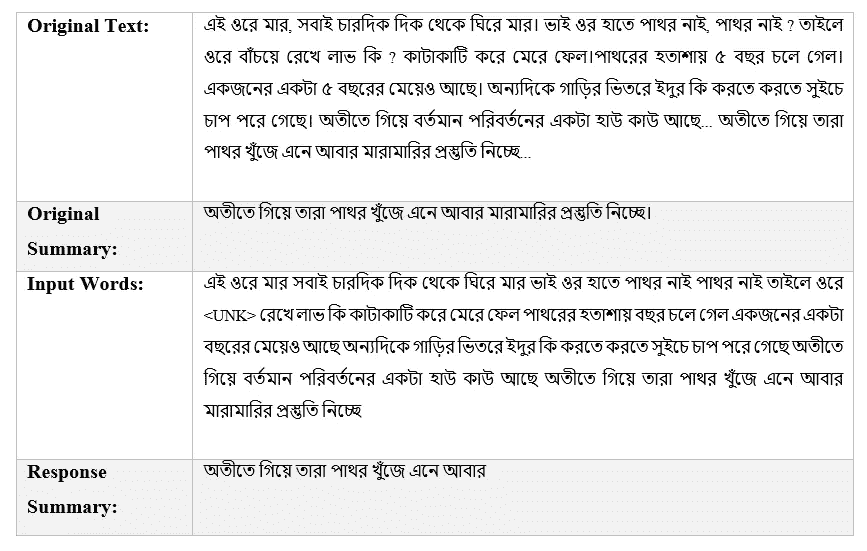

# 使用序列对序列 rnn 的孟加拉语抽象文本摘要

> 原文：<https://medium.com/analytics-vidhya/bengali-abstractive-text-summarization-using-sequence-to-sequence-rnns-a1004d423813?source=collection_archive---------19----------------------->

人类可以借助文字来描述自己的心情。因此理解课文的意思是非常重要的。有时，很难理解这些文本的意思，同时这也很费时间。机器是解决这个问题的最好方法。作为机器学习的一部分，文本摘要是自然语言处理中一个很大的研究领域。建立自动文本摘要器是所有研究的重点。文本摘要生成器可以在短时间内生成大文档的要点部分。

以前已经为其他语言制作了自动文本摘要生成器，但是没有为孟加拉语制作。增加孟加拉语的工具和技术是这项研究的主要目标。在这项研究工作中，我们试图为孟加拉语建立一个自动文本摘要器。不过，在这项研究中，使用孟加拉语是一个非常具有挑战性的部分。但是直到最后，我们已经为孟加拉语的自动文本摘要器打下了基础。

使用的数据集是从在线社交媒体收集的。深度学习模型用于制作摘要器。在模型中，训练时间减少的损失直接影响实验结果。我们减少了总结模型的训练损失。它能够生成孟加拉语的短文本摘要。

## **简介**

在文本摘要领域中，有两种类型。抽象的和摘录的文本摘要。摘要文本摘要包含文本文档的摘要。基本上提供摘要是文本的主要思想的代表，但在这里总结者不重复原来的句子。这是在自然语言处理中寻找文本要点的主要挑战。最大数量的研究工作是在摘要文本摘要上进行的。抽取关键词并从文本中找出最频繁出现的词是抽取式文本摘要的主要思想。但是基于文本生成一个新单词或句子是最具挑战性的事情。这并不强制该词在提供摘要时也存在于原始上下文中。以前在不同的语言中已经做了许多抽象的文本摘要研究工作。在这段时间里，我们试图建立一个抽象的孟加拉语文本摘要应用深度学习算法。孟加拉语是世界上使用最多的语言之一。增加这种语言的工具和技术非常重要。因此，孟加拉语的研究领域需要拓展。需要处理自动系统文本。NLP 工具和库非常有助于处理任何类型的文本。与其他语言相比，用孟加拉语来构建自动化系统是很困难的。因为一些 NLP 库不是为孟加拉语构建的，所以所有的技术和库都是通过原始编码来应用的。我们的研究工作可以为孟加拉语文本提供一个抽象的文本摘要。没有一台机器每次都能给出 100%准确的结果，但大多数情况下可以获得令人满意的结果。我们的自动抽象文本摘要器看起来也是这样。并非所有生成的摘要都是 100%准确的，但是机器摘要的最大响应对于孟加拉文本摘要来说是令人满意的。

## 研究综述

在我们的研究中，我们介绍了一种孟加拉抽象文本摘要的方法。我们使用深度学习建立一个模型。为了建立这个模型，我们使用了自己的数据集。数据集是从社交媒体上收集的。首先从脸书收集孟加拉状态、评论、页面和群组帖子。然后创建每个孟加拉语文本的摘要。因此，数据集包含两列，一列是孟加拉语文本，另一列是它们对应的摘要。数据集中两百个数据及其摘要的总数。在创建深度学习模型之前，我们已经预处理了孟加拉语文本。在预处理阶段，首先，分割文本，然后添加孟加拉语缩写，并从文本中删除停用词。预处理后，我们必须统计整个数据的词汇量。单词嵌入对于深度学习模型非常重要。Word vector 帮助将相关词汇保存在一个带有数值的文件中。我们使用了一个预先训练好的孟加拉文字矢量文件，可以在网上找到。我们在注意力模型的基础上建立了一个序列对序列模型。在该模型中，编码器和解码器与双向 LSTM 单元一起使用。单词向量是编码器的输入，而解码器中的相关单词向量是模型的输出。通过序列的编码器和解码器需要一个令牌，称为特殊令牌，如 PAD、UNK、EOS 等。在声明和定义了所有的函数和库之后，我们对模型进行了 3 个多小时的训练。然后我们发现机器反应良好。

## 文本预处理

## 模型视图

在机器翻译发明之后，深度学习算法在人工智能领域创造了一个伟大的里程碑。所有文本相关的问题在深度学习模型中都给出了准确的输出。RNN 是深度学习中最有用的算法。它在任何文本相关的问题上更有效。每一个 RNN 都是由 LSTM 细胞制成的。LSTM 细胞就像短期记忆。编码器和解码器用于 LSTM 单元。输入文本是编码器中的一个通道，其中每个输入都是单词向量序列。解码器获取输入序列，并从相关文本序列生成文本输出。

模型的图形视图

## 序列对序列学习

Seq2Seq 模型是由 LSTM 细胞创造的。首先，从向量文件形成单词的输入。在向量文件中，每个相关单词都有一个嵌入值。这些嵌入值的工作方式类似于编码器的输入。编码器将序列值保存在 LSTM 短存储器中。这里，每个序列使用一个标记来标识序列的结束和开始点。在程序中，我们定义了一些特殊的序列，如<pad>、<eos>、<go>、<unk>等。所有这些特殊的令牌都用于处理编码器和解码器中的序列。<eos>用于标识输入序列的结束。在编码器输入的序列结束时,<eos>令牌自动丢弃该序列。然后，该序列将进入解码器，通过提供相关输出来解码该序列。解码器结束，这意味着当输出序列结束时，<eos>令牌停止解码器。编码结束后，序列需要一个指令进入解码器。这里我们用<go>令牌给出编码序列进入解码器的指令。在文本序列中，一些文本或单词没有被替换。所有序列都需要识别。因此，我们使用了一个特殊的令牌<unk>，这意味着一个未知的令牌。当在序列中发现未知标记时，它将被添加到文本中的<unk>标记。在列车中，时间顺序分为批次。在一个批量中，相似长度的序列需要放在一起。因此，我们使用了一个名为<pad>的令牌。</pad></unk></unk></go></eos></eos></eos></unk></go></eos></pad>

序列对序列学习

## 抽样输出

样本输出 1

样本输出 2

## 结论和未来工作

该模型存在一定的局限性，如只能处理有限的序列，数据集不够。但是模型是为未来发展而建立的。因为任何研究工作都是一个连续的过程。因此，这种模式将日益发展为孟加拉语。为了找到合适的解决方案，任何作品都需要更多的研究。然后所有的研究为一个特定的问题找到一个合适的解决方案。因此，研究工作需要进一步落实或发展。未来的实现依赖于先前工作的限制。解决之前工作的局限性有助于做出一个高效的系统。在这项工作中，未来的工作将是增加孟加拉语文本的数据集。更新模型并准备任何文本长度的模型。这意味着模型不依赖于文本长度。模型复杂，在 TensorFlow 1.15 版本中工作。但是需要在更新版本中转换代码。完成研究后，模型需要部署。因此，基于人工智能的未来，开发像 web 和移动应用程序这样的应用程序是非常重要的。因此，我们开发了一个自动孟加拉抽象文本摘要的应用程序。

[1] A. K. Mohammad Masum，S. Abujar，M. A. Islam Talukder，A. S. Azad Rabby 和 S. A. Hossain，“序列对序列 RNNs 的文本摘要抽象方法”， *2019 年第十届国际计算、通信和网络技术会议(ICCCNT)* ，印度坎普尔，2019 年，第 1–5 页。

[2] M. A. I. Talukder，S. Abujar，A. K. M. Masum，F. Faisal 和 S. A. Hossain，“使用序列对序列 RNNs 的孟加拉语抽象文本摘要”，2019 年第十届国际计算、通信和网络技术会议(ICCCNT)，印度坎普尔，2019 年，第 1–5 页。

[3] S. Abujar，A. K. M. Masum，M. Mohibullah，Ohidujjaman 和 S. A. Hossain，“一种使用 Word2Vector 的孟加拉语文本摘要方法”， *2019 年第十届国际计算、通信和网络技术会议(ICCCNT)* ，印度坎普尔，2019 年，第 1–5 页。

[4] S. Abujar，A. K. M. Masum，S. M. M. H. Chowdhury，M. Hasan 和 S. A. Hossain，“使用双向 RNN 的孟加拉语文本生成”， *2019 年第十届国际计算、通信和网络技术会议(ICCCNT)* ，印度坎普尔，2019 年，第 1–5 页。

[5] A. K. M. Masum，S. Abujar，R. T. H. Tusher，F. Faisal 和 S. A. Hossain，“孟加拉语抽象文本摘要的句子相似性度量”， *2019 年第十届国际计算、通信和网络技术会议(ICCCNT)* ，印度坎普尔，2019 年，第 1–5 页。