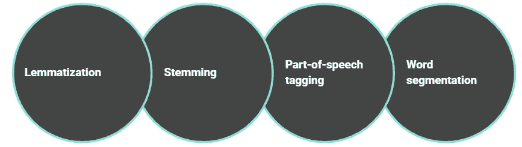
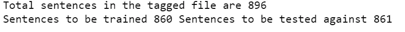
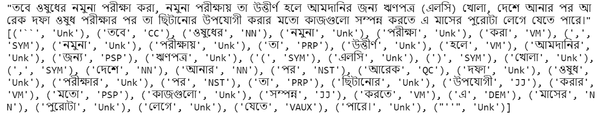

# 使用印度语料库的孟加拉语词性标注

> 原文：<https://medium.com/analytics-vidhya/bengali-pos-part-of-speech-tagging-using-indian-corpus-e85f47d3ad65?source=collection_archive---------5----------------------->


恩加利语是国际上第四大口语。在印度次大陆，几乎有两亿人使用孟加拉语。因此，除了为这一大批人扩大孟加拉语研究领域之外，还必须增强基于现代人工智能的技术。

# **孟加拉语处理**

自然语言处理是人工智能的重要组成部分。它为计算机和人之间的交流提供了自然语言的使用。任何类型的语言都由自然语言处理来处理。发现世界上所有重要语言的所有现代方法几乎已经结束，但相比之下，孟加拉语有点落后。

在孟加拉语处理领域已经做了一些研究工作，开发了一些工具。

**近期部分作品列表**

*   文本摘要。
*   句子生成。
*   句子相似度。
*   文本分析。
*   Word2Vector。

# 自然语言处理技术

有几种处理语言的方法



一些自然语言处理技术

***词汇化:*** 词汇化是将一个词的不同词形变化组合在一起，以便作为一个特殊项目进行分析的技术。

***词干化:*** 词干化是产生一个基本词的形态变化的技术。

***词性:*** 将单词按其词性分类的技术。

***分词:*** 分词是将书面文本内容分割成由短语、句子或主题组成的重要单元的过程。

# 孟加拉语词性标注

词类是具有相似语法住所的一类词。英语中的词类有名词、动词、形容词、副词、代词、介词、连词、感叹词等。类似于孟加拉语。在这里，我们将讨论如何使用孟加拉语的印度语料库轻松创建词性标注器。

一般来说，语料库是大量数据的集合。它给语法学家、文字专家和其他有兴趣的人提供了更好的语言描述。印度语料库包含孟加拉语、印地语、马拉地语和泰卢固语的数据集合。要使用任何语言，首先我们必须导入 NLTK(自然语言工具包)。然后，必须从 NLTK 中导入印度语料库。

从 **nltk.tag** 中定义 **tnt** ，用补充信息标注句子中的每个标记。 **TnT()** 是一个遵循二阶马尔可夫模型的统计标记。该模型用于时间序列和序列的概率预测。

```
**import** **nltk**
**from** **nltk.corpus** **import** indian
**from** **nltk.tag** **import** tnt
**import** **string**
```

如果没有下载印度语料库，则不下载该语料库。需要下载 **punkt** 。

```
nltk.download('indian')
nltk.download('punkt') 
```

然后，我们将一个变量( **tagged_set** )放在存储预先训练好的印度语料库的地方( **bangla.pos** )。从孟加拉语语料库中读取孟加拉语句子，并将它们放入变量 **word_set** 。使用 **for** 循环统计语料库中出现的所有句子。 **startswith()-** 函数用于检查字符串是否以字符串 **" ' "** "开始。由于数据集不足，此处设定的训练百分比为 **0.96** 。

```
tagged_set = 'bangla.pos'
word_set = indian.sents(tagged_set)
count = 0
**for** sen **in** word_set:
    count = count + 1
    sen = "".join([" "+i **if** **not** i.startswith("'") **and** i **not** **in** string.punctuation **else** i **for** i **in** sen]).strip()
    print (count, sen)
print ('Total sentences in the tagged file are',count)

train_perc = .96

train_rows = int(train_perc*count)
test_rows = train_rows + 1

print ('Sentences to be trained',train_rows, 'Sentences to be tested against',test_rows)
```



**train()**-方法用于显式使用 **TnT** 。在训练数据后使用 evaluate()方法检查训练数据集的性能。对于孟加拉语数据的使用方法，我们的评估得分为 **0.51** 。

```
data = indian.tagged_sents(tagged_set)
train_data = data[:train_rows] 
test_data = data[test_rows:]
pos_tagger = tnt.TnT()
pos_tagger.train(train_data)
pos_tagger.evaluate(test_data)
```

对于测试，结果用户需要在这里提供一个孟加拉语文本。存储在一个变量中。然后使用 **word_ tokenizer()** 拆分句子并检查单词的词性。

```
sentence = input()
tokenized = nltk.word_tokenize(sentence)
print(pos_tagger.tag(tokenized))
```

**输出**



Pos 标记器的输出

Github 链接:[https://github . com/abukaisar 24/Bengali-Pos-Tagger-Using-Indian-Corpus](https://github.com/AbuKaisar24/Bengali-Pos-Tagger-Using-Indian-Corpus.git)

# **近期作品参考**

[[1] Sheikh Abujar，Mahmudul Hasan，“使用 Unicode 对孟加拉语 TTS 进行全面的文本分析”](https://ieeexplore.ieee.org/document/7760063)。

[[2] Sheikh Abujar，Mahmudul Hasan，MSI Shahin，Sayed Akter Hossain“一种用于孟加拉语文档的启发式文本摘要方法”。](https://ieeexplore.ieee.org/document/8204166)

[【3】](https://link.springer.com/chapter/10.1007%2F978-981-13-1951-8_11)[Sanzidul Islam，Sadia Sultana Sharmin Mousumi，Sheikh Abujar 和 Syed Akhter Hossain，“用 LSTM 递归神经网络进行序列到序列的孟加拉语句子生成”](https://www.sciencedirect.com/science/article/pii/S1877050919306775?via%3Dihub)

[4] [Sheikh Abujar，Mahmudul Hasan，Sayed Akter Hossain“使用深度学习进行文本摘要的句子相似度估计”。](https://link.springer.com/chapter/10.1007%2F978-981-13-1610-4_16\)