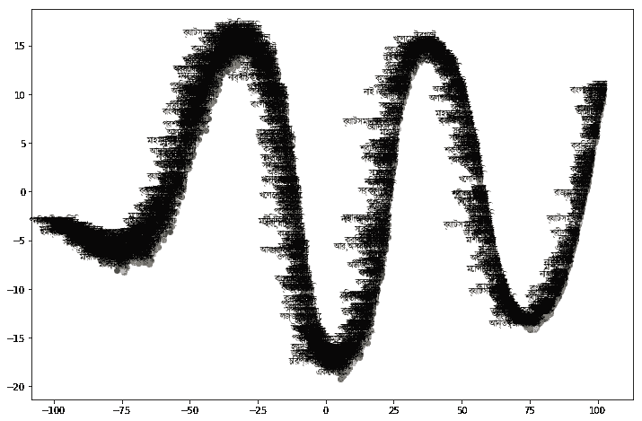
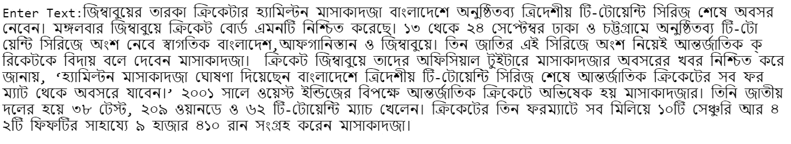
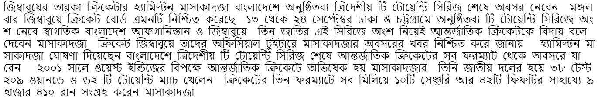
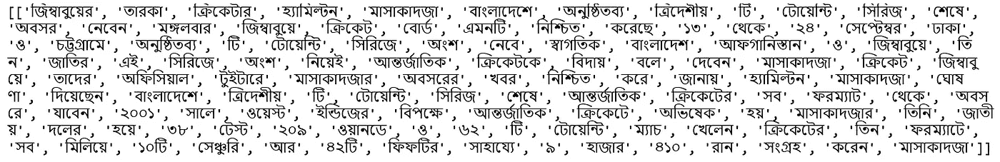
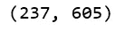
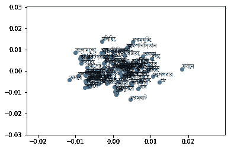

# 使用 Word2Vec 的孟加拉文本可视化

> 原文：<https://medium.com/analytics-vidhya/bengali-text-visualization-using-word2vec-211e2ed9fa30?source=collection_archive---------2----------------------->



文本可视化是文本分析和文本挖掘的重要组成部分。
某种技术之后是文本的可视化。其中之一就是秀技二字。用向量法显示单词是一个很常见的术语。它的主要任务是保存单词并将它们的向量值放在一起。这将有助于以后解决与课文有关的问题。

几天来我一直在研究孟加拉文。在一个情节中用孟加拉语文本制作一个节目有点挑战性。因为它不像其他语言。孟加拉语字符不支持直接出现在图中。所以需要特定的孟加拉字体来显示每个字符。从孟加拉文本中去除标点符号是另一个挑战，因为不使用 Unicode 就不能从孟加拉文本中去除最大数量的标点符号。

为此，我在下面解释了如何从孟加拉文本中删除标点符号，以及如何使用 Word2vec 在绘图上显示孟加拉文本。

## 所需的库

我们使用库来降低编码的复杂性。所以使用图书馆帮助我们做事情非常容易和快速。这里我们使用了流行的库。所有这些库以前都在其他语言中广泛使用过。

> gensim: 用于自然语言处理的开源库。它是由 python 和 cython 开发的。文本分析，Word2Vec，Doc2Vec 是 gensim 库的主要用途。
> 
> **sklearn:** 动态有效的机器学习库。数据预处理、模型选择、分类、回归、聚类是 sklearn 的主要用途。
> 
> **matplotlib:** 用于 2D 和 3D 绘图。NumPy 数组的数值扩展。直方图、散点图、条形图都是 matplotlib 的例子。

## 第一步:

在声明 **gensim** 库之后，我们导入 **word2vec** 。Word2vecis 是一个**两层**神经网络，用于**单词嵌入**。使用大型文本文档作为输入，返回其单词的向量值。这是多维的。然后从 **sklearn** 导入 **PCA** (主成分分析),因为它将数值转换为相关到不相关的集合。现在从 matplotlib 导入 pyplot，这将有助于在图形中显示输出。由于孟加拉文字不支持字体，所以**字体管理器**必须从 matplotlib 导入。

```
**import** **gensim**
**from** **gensim.models** **import** Word2Vec
**from** **sklearn.decomposition** **import** PCA
**from** **matplotlib** **import** pyplot
**import** **matplotlib.font_manager** **as** **fm**
```

## 第二步:

从用户处获取长文本，并将其放入变量(t1)中。

```
t1=input("Enter Text:")
```



输入孟加拉文字

## 第三步:

在 **word2vec** 之前需要对文本进行预处理。在预处理阶段，我们刚刚删除了正则表达式。**空格**去除、 **bangla_fullstop** 去除、**标点**。这需要首先导入一个正则表达式。这里不直接支持孟加拉语的符号。所以他们必须从文本中移除使用**的 Unicode** 。这里使用的正则表达式和 **sub()** 函数用于替换子字符串。

```
**import** **re**
whitespace = re.compile(u"[\s**\u0020\u00a0\u1680\u180e\u202f\u205f\u3000\u2000**-**\u200a**]+", re.UNICODE)
bangla_fullstop = u"**\u0964**"
punctSeq   = u"['**\"**“”‘’]+|[.?!,…]+|[:;]+"
punc = u"[(),$%^&*+=**{}**\[\]:**\"**|**\'**\~`<>/,€¦!?½£¶™¼©⅐⅑⅒⅓⅔⅕⅖⅗⅘⅙⅚⅛⅜⅝⅞⅟↉¤¿º;-]+"
t1= whitespace.sub(" ",t1).strip()
t1 = re.sub(punctSeq, " ", t1)
t1 = re.sub(bangla_fullstop, " ",t1)
t1 = re.sub(punc, " ", t1)print(t1)
```



干净的孟加拉文字

## 第四步:

处理完文本后，将其放入一个列表中，并使用 **split()** 函数将文本作为一个拆分分隔符。

```
doc=[t1.split()]
print(doc)
```



## 第五步:

输入文本需要在 **Word2vec 之前进行训练。**这里我们使用的是 **gensim** 模型。对于模型火车，我们已经将文本放置在参数计算的列表中，总文本的长度，以及模型的迭代次数。

```
model = Word2Vec(doc, min_count=1)model.train(doc, total_examples=len(doc), epochs=model.iter)
```



## 第六步:

模型的词汇表放在表单中的变量(x)中。主成分分析调用了 **PCA()** 函数。其中组件大小也是 2。然后对模型进行拟合和转换，以表示模型的词汇。

```
x= model[model.wv.vocab]
pca = PCA(n_components=2)
result = pca.fit_transform(x)
```

## 第七步:

为了将矢量文件呈现给绘图，在此阶段显示了**散点图**。模型的向量文件具有用于将单词分成单词变量的词汇表。必须通过字体属性使用不同的孟加拉字体来支持孟加拉文本。为此，我们使用了孟加拉字体 **kalpurush.ttf** 。使用 for 循环转换单词元组列表，然后在 x 轴和 y 轴上标注孟加拉语单词。最后， **show()** 函数用于显示地块。

```
pyplot.scatter(result[:, 0], result[:, 1])
words = list(model.wv.vocab)
prop = fm.FontProperties(fname='kalpurush.ttf')
**for** i, word **in** enumerate(words):
	pyplot.annotate(word, xy=(result[i, 0], result[i, 1]),fontproperties=prop)
pyplot.show()
```



孟加拉文本可视化

github:[https://github . com/abukaisar 24/Bengali-Text-Visualization-Using-word 2 vec](https://github.com/AbuKaisar24/Bengali-Text-Visualization-Using-Word2Vec)