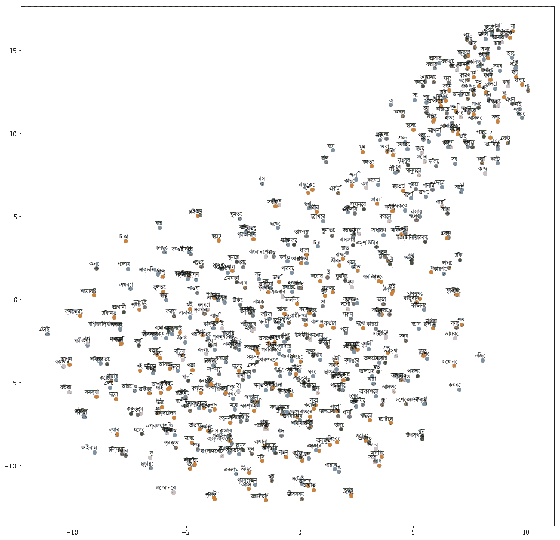
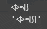
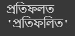
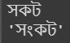

# 使用预先训练的 Word2Vec 进行孟加拉语单词拼写纠正

> 原文：<https://medium.com/analytics-vidhya/bengali-word-spelling-correction-using-pre-trained-word2vec-1f9938f48b09?source=collection_archive---------10----------------------->



正确的拼写对任何种类的文件都是非常重要的。许多自动拼写检查在不同语言的在线版本中可用。它帮助我们改正写错的单词或者自动替换正确的。还有，有助于找出语法错误和句法错误。如果我们看一个例子，如语法自动拼写检查是最好的例子。我们的孟加拉语没有自动拼写检查器。但是自动拼写检查看起来像是每个孟加拉语用户都非常需要的语法软件。

这里讨论了一种为构建自动拼写检查器而进行自动孟加拉语正确单词替换的方法。整个程序依赖于 word2vec。预训练的 word2vec 文件用于此，其具有小的词汇量。但对这项工作有效。在下面给出了一个简短的拼写检查的描述。

# 库函数

**gensim** 库函数用于从 pc 加载孟加拉语预训练 word2vec 文件。

> 导入 gensim

# Word2Vec

单词嵌入是通用语言处理中最重要的策略之一，其中单词被映射到实数的向量。单词嵌入适合于捕捉单词在报告中的重要性、语义和句法的紧密性、与不同单词的联系。此外，它还广泛用于推荐框架和内容安排。

**'bnword2vec'** 是预先训练好的 word2vec 文件，用于孟加拉语和**'。txt'** 是加载文件的扩展名。

```
model = gensim.models.KeyedVectors.load_word2vec_format('bnword2vec.txt')
```

# 单词等级

单词的排序存档意义取决于被浏览的单词在句子中的位置。这里它从 Word2Vec 文档中发现了中心单词。

> **words** =保存 Word2vec 文件中的单词索引号。
> 
> 这是一个字典，当循环工作的时候，它会把所有的单词放进去。
> 
> **enumerate()** = enumerate 是给 iterable 增加一个计数器，并以 Enumerate 对象的形式返回的方法。
> 
> **单词** =该变量携带 w_rank 字典的值。

```
words = model.index2wordw_rank = {}for i,word in enumerate(words):w_rank[word] = iWORDS = w_rank
```

该函数返回一个对象中的项目数。

```
len(words)
```


# 功能

功能是一个排序好的、可重用的代码方块，用于完成一个单独的、相关的活动。该函数为应用程序提供了更好的隔离，并提供了高级别的代码重用。

> **P()** =这个方法使用 **get()** 方法返回给定键的值，如果字典中有这个值的话。
> 
> **Dictionary.get(key，default=None)** 这是 get()方法的语法。

```
def P(word):
    return - WORDS.get(word, 0)
```

> **max()** =此函数用于计算其参数中传递的值的最大值，如果字符串作为参数传递，则计算字典中最大的值。
> 
> **correction() =** 返回带有由 **P** 定义的关键字的最大候选单词。

```
def correction(word):
    return max(candidates(word), key=P)
```

> **candidates()** =可以从 **known()** 方法中找到的错误单词的绝对候选就是这个函数的实际工作。

```
def candidates(word):
    return (known([word]) or known(edits1(word)) or known(edits2(word)) or [word])
```

> **known()**=此方法用于找出字典中存在的单词集。
> 
> set()= 集合是项目的无序集合。每个元素都是唯一的(没有重复)，必须是不可变的。

```
def known(words):
    return set(w for w in words if w in WORDS)
```

> **edits1()** =该方法使用了**删除**、**转置**、**替换**、**插入**等多个参数。这些参数返回句子中不正确单词的正确单词。一个 **set()** 函数用于找出无序的单词集合。
> 
> **edits2()** =该方法返回在 **edits1()** 函数中编辑的 word。

**字母** =孟加拉文字共有 9 个元音。其中每一个都叫做***’****。还有，有 35 个辅音被称为***【'ব্যঞ্জনবর্ণ】****。**

****拆分** =它作为一个列表工作，既有单词序列的正向顺序，也有反向顺序。**

****删除** =也是一个列表，检查拆分列表中单词的左边和右边，并删除不正确的语法。**

****换位** =用于使用拆分列表改变单词与其他单词的位置。**

****代替** =是一个列表，它把单词放回先前的地方或位置。**

****插入** =这有助于将正确的单词放入替换不正确的单词中，尤其要小心。**

```
**def edits1(word):letters    = 'ঁংঃঅআইঈউঊঋএঐওঔকখগঘঙচছজঝঞটঠডঢণতথদধনপফবভমযরলশষসহ়ঽািীুূৃৄেৈোৌ্ৎৗড়ঢ়য়'splits     = [(word[:i], word[i:])    for i in range(len(word) + 1)]deletes    = [L + R[1:]               for L, R in splits if R]transposes = [L + R[1] + R[0] + R[2:] for L, R in splits if len(R)>1]replaces   = [L + c + R[1:]           for L, R in splits if R for c in letters]inserts    = [L + c + R               for L, R in splits for c in letters]return set(deletes + transposes + replaces + inserts)def edits2(word):
    return (e2 for e1 in edits1(word) for e2 in edits1(e1))**
```

**现在代码已经准备好替换正确的单词了。如果用户可以在变量中输入一个不正确的单词，那么相应的正确单词将被输出。这段代码只用于单词拼写检查。但是需要一个拼写检查器来连续检查整个段落或文档的拼写。下面给出了一些输出演示。**

```
**a=input()correction(a)**
```

**********

输出演示** 

**Github 链接:[https://github . com/abukaisar 24/Bengali-Word-Spelling-Correction-Using-Pre-trained-Word 2 vec/blob/master/Spelling _ checker . ipynb](https://github.com/AbuKaisar24/Bengali-Word-Spelling-Correction-Using-Pre-trained-Word2Vec/blob/master/spelling_checker.ipynb)**