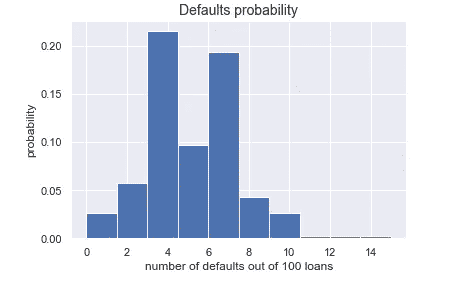
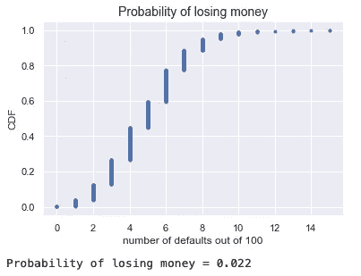

# python 中的伯努利试验

> 原文：<https://medium.com/analytics-vidhya/bernoulli-trials-in-python-60759b5e0702?source=collection_archive---------12----------------------->

D 违约风险是指公司、个人或国家无法履行其与支付合同利息或债务初始资本相关的义务的风险。

我在数据营课程中做了这个练习。假设我们查看一家银行提供的贷款数量，并为每笔违约写下数字 1，为每笔已付贷款写下数字 0。
尽管我们无法知道违约的价值，但违约的可能性是存在的——我们可以假设这种可能性是恒定的。
另外，有没有违约，不影响下一笔贷款还不还的可能性。

## **随机模块和伯努利试验**

random 模块函数返回一个介于 0 和 1 之间的随机数。

伯努利过程具有以下特征:

*   随机变量可以取值 0 或 1。值 1 称为成功，0 称为失败；
*   在整个实验过程中，成功的概率是不变的；
*   获得的各种结果是相互独立的。

概率函数可以写成如下形式:

*p(0) = P(X=0) = 1-p*

*p(1) = P(X = 1)=p*

x 称为*伯努利随机变量。*

```
def perform_bernoulli_trials(n, p):
    """Perform n Bernoulli trials with success probability p
    and return number of successes."""
    # Initialize number of successes: n_success
    n_success = 0# Perform trials
    for i in range(n):
        # Choose random number between zero and one: random_number
        random_number = np.random.random()# If less than p, it's a success  so add one to n_success
        if random_number < p:
            n_success += 1return n_success
```

现在我们可以考虑一家发放了 100 笔抵押贷款的银行。在这种情况下，有可能 0 到 100 的贷款会被拖欠。考虑到违约概率为 p = 0.05，下一个代码使用 perform_bernoulli_trials()函数执行 100 次 Bernoulli 试验。如前所述，成功是一种默认。

```
# Seed random number generator
np.random.seed(42)# Initialize the number of defaults: n_defaults
n_defaults = np.empty(1000)# Compute the number of defaults
for i in range(1000):
    n_defaults[i] = perform_bernoulli_trials(100, 0.05)# Plot the histogram with default number of bins; label your axes
_ = plt.hist(n_defaults, density=True)
_ = plt.xlabel('number of defaults out of 100 loans')
_ = plt.ylabel('probability')# Show the plot
plt.show()
```



图 1 —违约概率

图 1 显示了描述违约概率的直方图。

## 银行违约的可能性有多大？

接下来，我们可以看到从前面的代码中得到的违约数量的曲线图，它是一个经验累积分布。

如果利率如此之高，以至于 10%或更多的贷款被拖欠，那么该银行亏损的概率有多大？

```
# Compute ECDF(Empirical cumulative distribution function): x, ydef ecdf(data):
    """Compute ECDF for a one-dimensional array of measurements."""
    # Number of data points: n
    n = len(data)# x-data for the ECDF: x
    x= np.sort(data)# y-data for the ECDF: y
    y = np.arange(1, 1+n) / nreturn x, yx, y = ecdf(n_defaults)# Plot the CDF with labeled axes
_ = plt.plot(x, y, marker='.', linestyle='none')
_ = plt.xlabel('number of defaults out of 100')
_ = plt.ylabel('CDF')# Show the plot
plt.show()# Compute the number of 100-loan simulations with 10 or more defaults: n_lose_money
n_lose_money = np.sum(n_defaults >= 10)# Compute and print probability of losing money
print('Probability of losing money =', n_lose_money / len(n_defaults))
```



图 2 —赔钱的概率