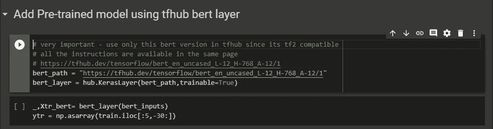

# keras 中的 BERT(tensor flow 2.0)使用 tfhub/huggingface

> 原文：<https://medium.com/analytics-vidhya/bert-in-keras-tensorflow-2-0-using-tfhub-huggingface-81c08c5f81d8?source=collection_archive---------2----------------------->

(承蒙:杰伊·阿拉玛)

最近，已经发布了相当多的深度信念网络或图形生成模型，如 elmo、gpt、ulmo、bert 等。这是自 glove、fasttext、word2vec 形式的预训练嵌入出现以来的一个重大突破。虽然单词嵌入有助于创建文本序列的密集表示，但这些信念网络使之成为可能

*   为了克服 nlp 任务缺乏训练数据的挑战
*   微调各种 nlp 任务，如实体识别模型、情感分析、问题回答。

# 为什么是伯特？

伯特是深度双向的，开放的 GPT 是单向的，埃尔莫是浅双向的。

BERT 是第一个*深度双向*、*无监督*语言表示，仅使用纯文本语料库进行预训练。为什么这很重要？两个原因:

*   具有多重表征的词的上下文表征，如多义词的情况。以鼹鼠为例——a .它是一种动物，b .它是一个间谍。其他模型是上下文无关的，也就是说，在两种上下文中，它们将返回相同的嵌入。
*   完全连接的双向模型——不可能通过简单地根据每个单词的前一个*和后一个*单词来训练双向模型，因为这将允许被预测的单词在多层模型中间接“看到自己”。为了解决这个问题，BERT 使用了一种简单的技术来屏蔽输入中的一些单词，然后双向调节每个单词来预测被屏蔽的单词。

关于 BERT 的详细了解，可以直接从 [google-ai](https://ai.googleblog.com/2018/11/open-sourcing-bert-state-of-art-pre.html) 和[这里](http://jalammar.github.io/a-visual-guide-to-using-bert-for-the-first-time/)阅读。

# BERT 的实现

如果你喜欢直接行动起来，不再痛苦，这里有一款 [colab 笔记本](https://colab.research.google.com/drive/1IubZ3T7gqD09ZIVmJapiB5MXUnVGlzwH#scrollTo=7LbVjtktg3Ln)可以开始使用。你最头疼的问题来自于将你的文本特征转换成上面的格式。这个 *_get_inputs* 函数将帮助您做到这一点。它可以在 colab 笔记本中找到。

实施通常需要两个步骤:

*   按照 bert 的要求获取输入，即输入 id、输入掩码和输入段。这是我通过创建一个名为 *_get_inputs* 的函数实现的
*   将预训练的 bert 模型作为一个层添加到您自己的模型中

第一次看这些输入可能会感到困惑。这可能是一个简单的解释。给出一个类似“我想嵌入。也许现在”。伯特·托肯泽会把它转换成

["[CLS]，"我"，"想要"，"要"，" em "，"床# "，"[SEP]，"可能"，"现在"，" SEP]"]。

这里‘CLS’和‘SEP’是保留字，用来标记句子或序列的分隔。在文本上使用 convert_to_ids，我们可以得到 *input_ids* 。假设我们固定 15 个单词作为标准形状。上面的序列只包含 10。剩下的 5 个单词已经被填充。 *input_masks* 就是这些填充的单元格。*输入 _ 段*代表分离。第一句将被标记为“0”，第二句将被标记为“1”。给定数据集和要使用的标记器，所有这些都在 get inputs 函数中执行。我使用过 Google Q &上的数据集，这是一个来自 Kaggle 在 colab 的竞赛(关于如何获得数据集。可以在这里勾选。

以下是实现 keras 模型的片段

## 使用 TFhub

对于 tf 2.0，hub.module()将不起作用。我们需要使用 hub.keraslayer。这是用于版本上的互联网。要关闭互联网，请使用 hub.load —查看 tfhub 中的[常见问题](https://www.tensorflow.org/hub/common_issues)

## 使用拥抱脸/变形金刚

HuggingFace 是一家初创公司，它创建了一个“变形金刚”包，通过这个包，我们可以在许多预先训练好的模型之间无缝切换，而且我们还可以在 pytorch 和 keras 之间移动。查看[这里](https://github.com/huggingface/transformers)了解更多关于这个令人敬畏的创业公司的信息

嵌入层也差不多。神奇的是' TFBertModel '模块从变形金刚包。事实上，在不同型号之间切换非常容易。例如，要获取“roberta”，只需访问“TFRoberataModel”。型号名称中的 TF 表示 TF 2.0 兼容性。

## 常见问题或错误

*   Bert 要求输入张量为“int32”。请注意输入图层的 dtype 是如何标记为“int32”的。
*   在序列输出的情况下，Bert 输出 3D 阵列，在混合输出的情况下，输出 1D 阵列。您将需要使用一个层来将其转换成您想要的输出。在这里，我使用了 GlobalAveragePooling1D 将其转换为 1D 输出数组。
*   如果您使用 tfhub 来实现 bert，其中一些将与 tf2 不兼容。只选择那些有清晰的文档说明如何使用的产品，如示例中所示的产品。
*   人们很难在 keras 中确定数据集的输入形状。简单的方法是排列[句子/批量 _ 大小，字数，嵌入 _ 尺寸]。这里，embed_dim 是每个单词通过不同嵌入的维度输出。伯特的例子是 768。

## 其他有用的链接:

[https://www . ka ggle . com/maroberti/fastai-with-transformers-Bert-Roberta](https://www.kaggle.com/maroberti/fastai-with-transformers-bert-roberta)
[https://www . ka ggle . com/mobas sir/jigsaw-Google-q-a-EDA/notebook](https://www.kaggle.com/mobassir/jigsaw-google-q-a-eda/notebook)
[https://analyticsindiamag . com/Bert-classifier-with-tensor flow-2-0/](https://analyticsindiamag.com/bert-classifier-with-tensorflow-2-0/)
[https://analyticsindiamag . com/step-by-step-guide-to](https://analyticsindiamag.com/step-by-step-guide-to-implement-multi-class-classification-with-bert-tensorflow/)

伯特解释

[http://jalammar.github.io/illustrated-transformer/](http://jalammar.github.io/illustrated-transformer/)
[https://towards data science . com/how-BERT-leverage-attention-mechanism-and-transformer-to-learn-word-contextual-relations-5b bee 1 b 6 dbdb](https://towardsdatascience.com/how-bert-leverage-attention-mechanism-and-transformer-to-learn-word-contextual-relations-5bbee1b6dbdb)
[https://mccormickml . com/2019/05/14/BERT-word-embeddings-tutorial/](https://mccormickml.com/2019/05/14/BERT-word-embeddings-tutorial/)