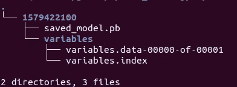

# 来自微调模型的 BERT-REST 推断

> 原文：<https://medium.com/analytics-vidhya/bert-rest-inference-from-the-fine-tuned-model-4b1f31151f97?source=collection_archive---------10----------------------->


由 [Aris Sfakianakis](https://unsplash.com/@katergaris?utm_source=medium&utm_medium=referral) 在 [Unsplash](https://unsplash.com?utm_source=medium&utm_medium=referral) 上拍摄

伯特已经一年多了。每个人都在使用 Bert 执行各种 NLP 任务。有些只是使用预训练的模型，重新训练预训练的模型进行句子嵌入，来执行句子相似性任务。其中一个句子嵌入的开源项目是由腾讯人工智能实验室的晓寒完成的，这个项目是 bert-as-service。自从 Bert-as-service 发布以来，我已经使用它将近一年了。我真的很欣赏那个项目，我现在还在用。

除了预先训练的模型之外，我们大多数人都希望使用微调的模型来解决 NLP 任务。NLP 研究人员正在尝试解决几个 NLP 任务，如 GLUE 和 SQuaD，GLUE 官方网站中的排行榜经常以更好的准确性弹出。可能我们大多数人都使用过 BERT 的开源代码来达到某种目的。但是，为了预训练和微调的目的，需要做一些修改来构建您自己的数据预处理器。

在这个例子中，为了简单起见，我将使用二元分类，但是这同样适用于多类分类。我们将使用来自谷歌研究的 BERT GitHub 回购协议。此外，我将添加一些功能，用于将经过训练的检查点模型和元图导出到 proto buffer (Pb)文件格式。

在本节中，我将跳过微调模型的培训，因为大部分内容已经在 BERT repo 中陈述过了。现在，让我们沿着“run _ cal class ier . py”文件添加一个将在服务期间使用的服务函数。

```
**def** serving_input_fn():
    label_ids = tf.placeholder(tf.int32, [**None**], name=**'label_ids'**)
    input_ids = tf.placeholder(tf.int32, [**None**, FLAGS.max_seq_length], name=**'input_ids'**)
    input_mask = tf.placeholder(tf.int32, [**None**, FLAGS.max_seq_length], name=**'input_mask'**)
    segment_ids = tf.placeholder(tf.int32, [**None**, FLAGS.max_seq_length], name=**'segment_ids'**)
    input_fn = tf.estimator.export.build_raw_serving_input_receiver_fn({
        **'label_ids'**: label_ids,
        **'input_ids'**: input_ids,
        **'input_mask'**: input_mask,
        **'segment_ids'**: segment_ids,
    })()
    **return** input_fn
```

在主函数中，我们会添加几行用于导出模型的代码，类似于`do_train`、`do_predict`和`do_eval`。

```
**if** FLAGS.do_export:
    estimator._export_to_tpu = **False** estimator.export_savedmodel(FLAGS.export_dir, serving_input_fn)
```

一旦我们有了这个，我们就可以将检查点模型导出到 pb 模型。类似于训练模型，我们将使用相同的 run_classifier.py 命令来启用`do_export=True`，并给出一个导出目录为`export_dir`的路径，这将产生 pb 模型。



图:导出的模型文件

我们想要确认导出模式的签名，以查看到我们先前定义的模型的输入和输出映射。我们将使用`saved_model_cli`来查看签名定义。

```
$ saved_model_cli show --dir /home/dsdev/gitrepo/bert_serving/exported/1579422100/ --all
......
MetaGraphDef with tag-set: 'serve' contains the following SignatureDefs:signature_def['serving_default']:
  The given SavedModel SignatureDef contains the following input(s):
    inputs['input_ids'] tensor_info:
        dtype: DT_INT32
        shape: (-1, 256)
        name: input_ids_1:0
    inputs['input_mask'] tensor_info:
        dtype: DT_INT32
        shape: (-1, 256)
        name: input_mask_1:0
    inputs['label_ids'] tensor_info:
        dtype: DT_INT32
        shape: (-1)
        name: label_ids_1:0
    inputs['segment_ids'] tensor_info:
        dtype: DT_INT32
        shape: (-1, 256)
        name: segment_ids_1:0
  The given SavedModel SignatureDef contains the following output(s):
    outputs['output'] tensor_info:
        dtype: DT_FLOAT
        shape: (-1, 2)
        name: loss/Softmax:0
  Method name is: tensorflow/serving/predict
```

到目前为止，一切看起来都很好，我们将使用 tensorflow-serving 来服务模型。

```
$ tensorflow_model_server --port=8500 --rest_api_port=8501 --model_name=myclassify --model_base_path=/home/path/to/bert/exported/
.................
2020-01-24 06:35:39.441288: I tensorflow_serving/model_servers/server.cc:82] Building single TensorFlow model file config:  model_name: myclassify model_base_path: /home/path/to/bert/exported/
2020-01-24 06:35:39.441484: I tensorflow_serving/model_servers/server_core.cc:461] Adding/updating models.
2020-01-24 06:35:39.441524: I tensorflow_serving/model_servers/server_core.cc:558]  (Re-)adding model: myclassify
2020-01-24 06:35:39.541891: I tensorflow_serving/core/basic_manager.cc:739] Successfully reserved resources to load servable {name: myclassify version: 1579422100}
2020-01-24 06:35:39.541938: I tensorflow_serving/core/loader_harness.cc:66] Approving load for servable version {name: myclassify version: 1579422100}
2020-01-24 06:35:39.541960: I tensorflow_serving/core/loader_harness.cc:74] Loading servable version {name: myclassify version: 1579422100}
2020-01-24 06:35:39.541988: I external/org_tensorflow/tensorflow/contrib/session_bundle/bundle_shim.cc:363] Attempting to load native SavedModelBundle in bundle-shim from: /home/path/to/bert/exported/1579422100
2020-01-24 06:35:39.542006: I external/org_tensorflow/tensorflow/cc/saved_model/reader.cc:31] Reading SavedModel from: /home/path/to/bert/exported/1579422100
2020-01-24 06:35:39.558353: I external/org_tensorflow/tensorflow/cc/saved_model/reader.cc:54] Reading meta graph with tags { serve }
2020-01-24 06:35:39.576158: I external/org_tensorflow/tensorflow/core/platform/cpu_feature_guard.cc:141] Your CPU supports instructions that this TensorFlow binary was not compiled to use: AVX2 FMA
2020-01-24 06:35:39.633978: I external/org_tensorflow/tensorflow/cc/saved_model/loader.cc:162] Restoring SavedModel bundle.
2020-01-24 06:35:40.033231: I external/org_tensorflow/tensorflow/cc/saved_model/loader.cc:138] Running MainOp with key saved_model_main_op on SavedModel bundle.
2020-01-24 06:35:40.062124: I external/org_tensorflow/tensorflow/cc/saved_model/loader.cc:259] SavedModel load for tags { serve }; Status: success. Took 520097 microseconds.
2020-01-24 06:35:40.062210: I tensorflow_serving/servables/tensorflow/saved_model_warmup.cc:83] No warmup data file found at /home/path/to/bert/exported/1579422100/assets.extra/tf_serving_warmup_requests
2020-01-24 06:35:40.062324: I tensorflow_serving/core/loader_harness.cc:86] Successfully loaded servable version {name: myclassify version: 1579422100}
2020-01-24 06:35:40.064403: I tensorflow_serving/model_servers/server.cc:286] Running gRPC ModelServer at 0.0.0.0:8500 ...
[evhttp_server.cc : 237] RAW: Entering the event loop ...
2020-01-24 06:35:40.065865: I tensorflow_serving/model_servers/server.cc:302] Exporting HTTP/REST API at:localhost:8501 ...
```

模型被提供了，现在我们需要编写一个客户端来从提供的模型进行推理，客户端应该接受字符串作为输入。

```
**import** json
**import** os
**import** requests
**import** tokenizationendpoints = **"http://localhost:8501/v1/models/myclassify:predict"** headers = {**"content-type"**:**"application-json"**}example = **"This is the input string"**tokenizer = tokenization.FullTokenizer(vocab_file=**"/home/path/to/bert/vocabfile/vocab.txt"**,do_lower_case=**True**)
token_a = tokenizer.tokenize(example)tokens = []
segments_ids = []
tokens.append(**"[CLS]"**)
segment_ids = []
segment_ids.append(0)
**for** token **in** token_a:
    tokens.append(token)
    segment_ids.append(0)tokens.append(**'[SEP]'**)
segment_ids.append(0)input_ids = tokenizer.convert_tokens_to_ids(tokens)
input_mask = [1] * len(input_ids)
max_seq_length = 256
**while** len(input_ids) < max_seq_length:
    input_ids.append(0)
    input_mask.append(0)
    segment_ids.append(0) label_id = 0instances = [{**"input_ids"**:input_ids, **"input_mask"**:input_mask, **"segment_ids"**:segment_ids, **"label_ids"**:label_id}]data = json.dumps({**"signature_name"**:**"serving_default"**, **"instances"**:instances})response = requests.post(endpoints, data=data, headers=headers)
prediction = json.loads(response.text)[**'predictions'**]
print(prediction)>> [[0.999996, 4.28649e-06]]  //Result
```